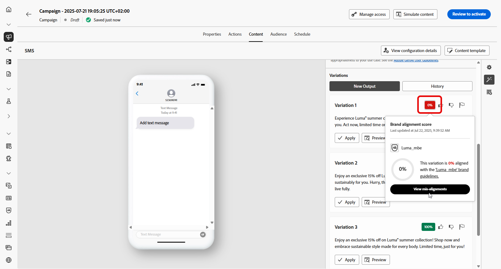

# Geração de SMS com o Assistente de IA no Journey Optimizer {#generative-sms}

>[!IMPORTANT]
>
>Antes de começar a usar esse recurso, consulte as [Medidas de proteção e limitações](gs-generative.md#generative-guardrails) relacionadas.
>> 
>
>Você deve concordar com um [contrato de usuário](https://www.adobe.com/legal/licenses-terms/adobe-dx-gen-ai-user-guidelines.html) antes de usar o Assistente de IA no Journey Optimizer. Para obter mais informações, entre em contato com o representante da Adobe.

Depois de criar e adaptar suas mensagens SMS para corresponder às preferências do público-alvo, eleve sua comunicação com o Assistente de IA no Journey Optimizer.

Esse recurso oferece recomendações relevantes para ajustar o conteúdo, ajudando suas mensagens a repercutir e a impulsionar o máximo de engajamento.

1. Depois de criar e configurar sua campanha de SMS, clique em **[!UICONTROL Editar conteúdo]**.

   Para obter mais informações sobre como configurar a campanha de SMS, consulte [esta página](../sms/create-sms.md).

1. Preencha os **[!UICONTROL detalhes Básicos]** da sua campanha. Depois de concluído, clique em **[!UICONTROL Editar conteúdo]**.

1. Personalize a mensagem SMS conforme necessário. [Saiba mais](../sms/create-sms.md)

1. Acesse o menu **[!UICONTROL Mostrar assistente de IA]**.

   {zoomable="yes"}

1. Selecione sua **[!UICONTROL Marca]** para garantir que o conteúdo gerado por IA esteja alinhado às especificações da sua marca. [Saiba mais](brands.md) sobre marcas.

   Observe que o recurso Marcas é lançado como um beta privado e estará progressivamente disponível para todos os clientes em versões futuras.

1. Ajuste o conteúdo descrevendo o que você deseja gerar no campo **[!UICONTROL Prompt]**.

   Se você estiver procurando ajuda para criar seu prompt, acesse a **[!UICONTROL Biblioteca de Prompts]**, que fornece diversas ideias de prompt para melhorar suas campanhas.

   {zoomable="yes"}

1. Personalize seu prompt com a opção **[!UICONTROL Configurações de texto]**:

   * **[!UICONTROL Estratégia de comunicação]**: selecione a abordagem de comunicação desejada para o texto gerado.
   * **[!UICONTROL Idiomas]**: as opções de idioma espanhol, italiano, sueco e norueguês são lançadas como um beta privado e estarão progressivamente disponíveis para todos os clientes em versões futuras.
   * **[!UICONTROL Tone]**: certifique-se de que o texto é apropriado para seu público-alvo e sua finalidade.
   * **[!UICONTROL Comprimento]**: selecione o comprimento do conteúdo usando o controle deslizante de intervalo.

   {zoomable="yes"}

1. No menu **[!UICONTROL Ativos de marca]**, clique em **[!UICONTROL Carregar ativo de marca]** para adicionar qualquer ativo de marca que contenha conteúdo que possa fornecer o Assistente de IA de contexto adicional ou selecione um ativo carregado anteriormente.

   Os arquivos carregados anteriormente estão disponíveis no menu suspenso **[!UICONTROL Ativos de marca carregados]**. Basta alternar os ativos que deseja incluir na geração.

1. Quando o prompt estiver pronto, clique em **[!UICONTROL Gerar]**.

1. Navegue pelas **[!UICONTROL Variações]** geradas.

   Clique em **[!UICONTROL Visualizar]** para exibir uma versão em tela inteira da variação selecionada ou clique em **[!UICONTROL Aplicar]** para substituir o conteúdo atual.

1. Clique no ícone de porcentagem para exibir sua **[!UICONTROL Pontuação de alinhamento da marca]** e identificar quaisquer desalinhamentos com sua marca.

   Saiba mais sobre [Pontuação de alinhamento da marca](brands-score.md).

   {zoomable="yes"}

1. Navegue até a opção **[!UICONTROL Refinar]** na janela **[!UICONTROL Visualizar]** para acessar recursos de personalização adicionais e ajustar a variação de acordo com suas preferências:

   * **[!UICONTROL Usar como conteúdo de referência]**: a variante escolhida servirá como conteúdo de referência para gerar outros resultados.

   * O Assistente de IA de **[!UICONTROL Refrase]**:The pode reformular sua mensagem de diferentes maneiras, mantendo sua escrita atualizada e envolvente para públicos diversos.

   * **[!UICONTROL Usar linguagem mais simples]**: use o AI Assistant para simplificar sua linguagem, garantindo clareza e acessibilidade para um público-alvo maior.

   Você também pode alterar o **[!UICONTROL Tom]** e a **[!UICONTROL estratégia de comunicação]** do seu texto.

   {zoomable="yes"}

1. Abra a guia **[!UICONTROL Alinhamento da marca]** para ver como o seu conteúdo se alinha às suas [diretrizes da marca](brands.md).

1. Clique em **[!UICONTROL Selecionar]** depois de encontrar o conteúdo apropriado.

   Você também pode ativar o experimento para o seu conteúdo. [Saiba mais](generative-experimentation.md)

1. Insira campos de personalização para personalizar o conteúdo de SMS com base nos dados de perfis. [Saiba mais sobre a personalização de conteúdo](../personalization/personalize.md)

1. Após definir o conteúdo da mensagem, clique no botão **[!UICONTROL Simular conteúdo]** para controlar a renderização e verificar as configurações de personalização com perfis de teste. [Saiba mais](../personalization/personalize.md)

Depois de definir seu conteúdo, público-alvo e programação, você estará pronto para preparar sua campanha de SMS. [Saiba mais](../campaigns/review-activate-campaign.md)
