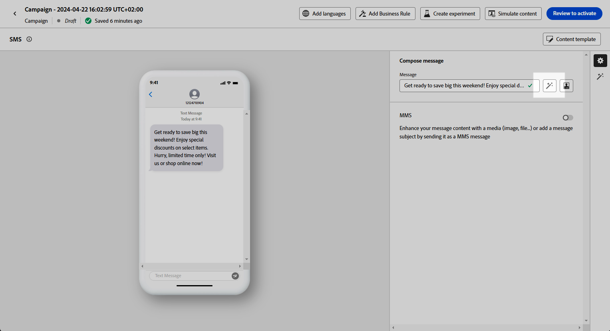

# Geração de SMS com o Assistente de IA {#generative-sms}

>[!BEGINSHADEBOX]

**Índice**

* [Introdução ao Assistente de IA](gs-generative.md)
* [Geração de email com o Assistente de IA](generative-email.md)
* Geração de SMS com o Assistente de IA
* [Geração de push com o Assistente de IA](generative-push.md)
* [Experimento de conteúdo com o Assistente de IA](generative-experimentation.md)

>[!ENDSHADEBOX]

Depois de criar e adaptar suas mensagens SMS para corresponder às preferências do público-alvo, eleve sua comunicação com o Assistente de IA no Journey Optimizer.

Esse recurso oferece recomendações relevantes para ajustar o conteúdo, ajudando suas mensagens a repercutir e a impulsionar o máximo de engajamento.

Explore as guias abaixo para saber como usar o Assistente de IA no Journey Optimizer.

>[!NOTE]
>
>Antes de começar a usar esse recurso, leia as informações relacionadas [Medidas de proteção e limitações](gs-generative.md#generative-guardrails).

>[!BEGINTABS]

>[!TAB Geração de SMS completo]

1. Depois de criar e configurar sua campanha de SMS, clique em **[!UICONTROL Editar conteúdo]**.

   Para obter mais informações sobre como configurar a campanha de SMS, consulte [esta página](../sms/create-sms.md).

1. Preencha o **[!UICONTROL Detalhes básicos]** para a sua campanha. Depois de concluído, clique em **[!UICONTROL Editar conteúdo]**.

1. Personalize a mensagem SMS conforme necessário. [Saiba mais](../sms/create-sms.md)

1. Acesse o **[!UICONTROL Mostrar assistente de IA]** menu.

   {zoomable="yes"}

1. Ativar o **[!UICONTROL Usar conteúdo original]** opção do Assistente de IA para personalizar novo conteúdo com base no conteúdo da campanha, nome e público selecionado.

   Seu prompt deve estar sempre vinculado a um contexto específico.

1. Ajuste o conteúdo descrevendo o que você deseja gerar na variável **[!UICONTROL Aviso]** campo.

   Se você estiver procurando ajuda para elaborar seu prompt, acesse o **[!UICONTROL Biblioteca de Prompts]** que fornece uma variedade diversa de ideias rápidas para melhorar suas campanhas.

   {zoomable="yes"}

1. Selecionar **[!UICONTROL Fazer upload do ativo da marca]** para adicionar qualquer ativo de marca com conteúdo que possa fornecer contexto adicional ao Assistente de IA.

1. Personalize seu prompt com as diferentes opções:

   * **[!UICONTROL Estratégia de comunicação]**: selecione a abordagem de comunicação desejada para o texto gerado.
   * **[!UICONTROL Idioma]**: escolha o idioma para o conteúdo da variante.
   * **[!UICONTROL Tom]**: verifique se o texto é apropriado para seu público-alvo e sua finalidade.
   * **[!UICONTROL Length]**: selecione o comprimento do conteúdo usando o controle deslizante de intervalo.

   {zoomable="yes"}

1. Quando o prompt estiver pronto, clique em **[!UICONTROL Gerar]**.

1. Navegue pelo arquivo gerado **[!UICONTROL Variações]** e clique em **[!UICONTROL Visualizar]** para exibir uma versão em tela cheia da variação selecionada.

1. Navegue até a **[!UICONTROL Refinar]** opção no campo **[!UICONTROL Visualizar]** para acessar recursos de personalização adicionais e ajustar a variação às suas preferências:

   * **[!UICONTROL Usar como conteúdo de referência]**: a variante escolhida servirá como conteúdo de referência para gerar outros resultados.

   * **[!UICONTROL Refrase]**: O Assistente de IA pode reformular sua mensagem de maneiras diferentes, mantendo sua escrita atualizada e atraente para públicos-alvo diversos.

   * **[!UICONTROL Usar linguagem mais simples]**: use o Assistente de IA para simplificar o seu idioma, garantindo clareza e acessibilidade para um público-alvo maior.

   {zoomable="yes"}

1. Clique em **[!UICONTROL Selecionar]** depois de encontrar o conteúdo apropriado.

   Você também pode ativar o experimento para o seu conteúdo. [Saiba mais](generative-experimentation.md)

1. Insira campos de personalização para personalizar o conteúdo de SMS com base nos dados de perfis. [Saiba mais sobre a personalização de conteúdo](../personalization/personalize.md)

1. Depois de definir o conteúdo da mensagem, clique no link **[!UICONTROL Simular conteúdo]** botão para controlar a renderização e verificar as configurações de personalização com perfis de teste. [Saiba mais](../personalization/personalize.md)

Depois de definir seu conteúdo, público-alvo e programação, você estará pronto para preparar sua campanha de SMS. [Saiba mais](../campaigns/review-activate-campaign.md)

>[!TAB Geração de texto]

1. Depois de criar e configurar sua campanha de SMS, clique em **[!UICONTROL Editar conteúdo]**.

   Para obter mais informações sobre como configurar a campanha de SMS, consulte [esta página](../sms/create-sms.md).

1. Preencha o **[!UICONTROL Detalhes básicos]** para a sua campanha. Depois de concluído, clique em **[!UICONTROL Editar conteúdo]**.

1. Personalize a mensagem SMS conforme necessário. [Saiba mais](../sms/create-sms.md)

1. Acesse o **[!UICONTROL Editar texto com o Assistente de IA]** menu ao lado do seu **[!UICONTROL Mensagem]** campo.

   {zoomable="yes"}

1. Ativar o **[!UICONTROL Usar conteúdo de referência]** opção do Assistente de IA para personalizar novo conteúdo com base no conteúdo da campanha, nome e público selecionado.

   Seu prompt deve estar sempre vinculado a um contexto específico.

1. Ajuste o conteúdo descrevendo o que você deseja gerar na variável **[!UICONTROL Aviso]** campo.

   Se você estiver procurando ajuda para elaborar seu prompt, acesse o **[!UICONTROL Biblioteca de Prompts]** que fornece uma variedade diversa de ideias rápidas para melhorar suas campanhas.

   {zoomable="yes"}

1. Selecionar **[!UICONTROL Fazer upload do ativo da marca]** para adicionar qualquer ativo de marca com conteúdo que possa fornecer contexto adicional ao Assistente de IA.

1. Personalize seu prompt com as diferentes opções:

   * **[!UICONTROL Estratégia de comunicação]**: selecione a abordagem de comunicação desejada para o texto gerado.
   * **[!UICONTROL Idioma]**: escolha o idioma para o conteúdo da variante.
   * **[!UICONTROL Tom]**: verifique se o texto é apropriado para seu público-alvo e sua finalidade.
   * **[!UICONTROL Length]**: selecione o comprimento do conteúdo usando o controle deslizante de intervalo.

   {zoomable="yes"}

1. Quando o prompt estiver pronto, clique em **[!UICONTROL Gerar]**.

1. Navegue pelo arquivo gerado **[!UICONTROL Variações]** e clique em **[!UICONTROL Visualizar]** para exibir uma versão em tela cheia da variação selecionada.

1. Navegue até a **[!UICONTROL Refinar]** opção no campo **[!UICONTROL Visualizar]** para acessar recursos de personalização adicionais e ajustar a variação às suas preferências:

   * **[!UICONTROL Usar como conteúdo de referência]**: a variante escolhida servirá como conteúdo de referência para gerar outros resultados.

   * **[!UICONTROL Refrase]**: O Assistente de IA pode reformular sua mensagem de maneiras diferentes, mantendo sua escrita atualizada e atraente para públicos-alvo diversos.

   * **[!UICONTROL Usar linguagem mais simples]**: use o Assistente de IA para simplificar o seu idioma, garantindo clareza e acessibilidade para um público-alvo maior.

   {zoomable="yes"}

1. Clique em **[!UICONTROL Selecionar]** depois de encontrar o conteúdo apropriado.

   Você também pode ativar o experimento para o seu conteúdo. [Saiba mais](generative-experimentation.md)

1. Insira campos de personalização para personalizar o conteúdo de SMS com base nos dados de perfis. [Saiba mais sobre a personalização de conteúdo](../personalization/personalize.md)

1. Depois de definir o conteúdo da mensagem, clique no link **[!UICONTROL Simular conteúdo]** botão para controlar a renderização e verificar as configurações de personalização com perfis de teste.

Depois de definir seu conteúdo, público-alvo e programação, você estará pronto para preparar sua campanha de SMS. [Saiba mais](../campaigns/review-activate-campaign.md)

>[!ENDTABS]
