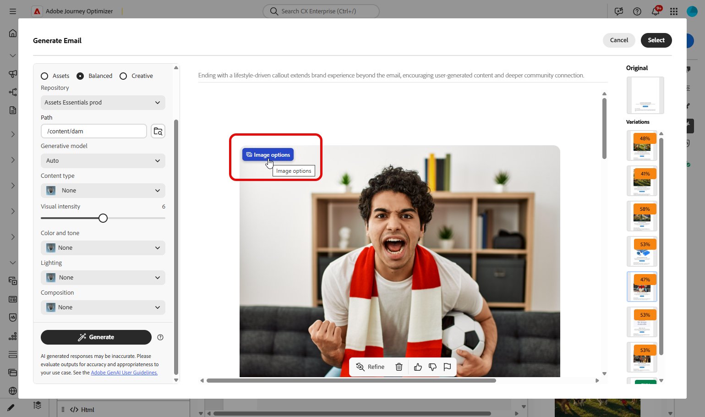
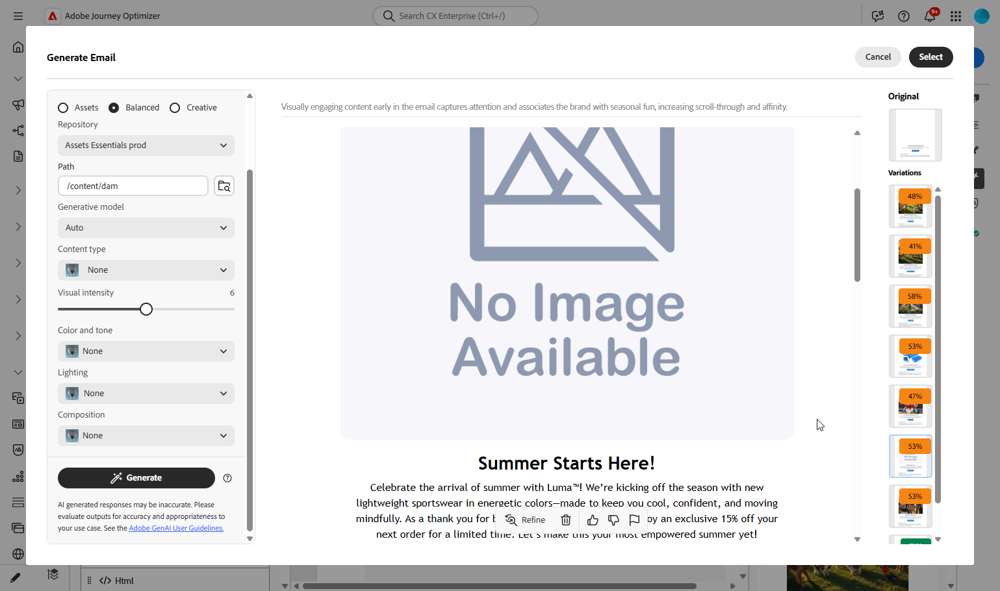

# Gerar casos de uso de conteúdo {#generative-uc}

>[!BEGINSHADEBOX]

**Nesta página:** conheça casos de uso práticos para Gerar Conteúdo no Adobe Journey Optimizer, desde a reutilização de conteúdo existente e o refinamento de variações de texto até a geração de imagens, a aplicação de referências de estilo e o trabalho em idiomas com suporte.

>[!ENDSHADEBOX]

>[!NOTE]
>
>Antes de começar a usar esse recurso, consulte as [Medidas de proteção e limitações](gs-generative.md#generative-guardrails) relacionadas.

## Usar conteúdo existente

Gere variações a partir do conteúdo e do contexto que já estão em sua campanha para que permaneçam consistentes com sua mensagem e público.

1. Depois de configurar sua campanha, selecione **[!UICONTROL Editar conteúdo]**.

1. Abra a seção **[!UICONTROL Gerar Conteúdo]**.

1. Ative o recurso **[!UICONTROL Usar conteúdo original]** em Gerar conteúdo para adaptar o novo conteúdo de acordo com os detalhes da sua campanha, incluindo o nome da campanha e o público-alvo direcionado.

1. Ajuste o conteúdo especificando sua solicitação na caixa **[!UICONTROL Prompt]** e personalize as configurações conforme necessário.

1. Quando estiver satisfeito com o prompt, clique em **[!UICONTROL Gerar]**.

1. Explore as **[!UICONTROL Variações]** disponíveis e clique em **[!UICONTROL Visualizar]** para ver a variação selecionada em tela inteira.

Depois de definir seu conteúdo, público-alvo e programação, você estará pronto para preparar sua campanha de email. [Saiba mais](../campaigns/review-activate-campaign.md)

## Refinar variação {#refine}

Ajuste uma variação gerada por IA no local, tom, comprimento, texto e estratégia, antes de selecionar o texto final.

1. Depois de configurar sua campanha, clique em **[!UICONTROL Editar conteúdo]**.

1. Abra o menu **[!UICONTROL Gerar Conteúdo]**.

1. Ajuste o conteúdo inserindo sua solicitação desejada na caixa **[!UICONTROL Prompt]** e modifique as configurações conforme necessário.

1. Quando estiver pronto, clique em **[!UICONTROL Gerar]**.

1. Revise as **[!UICONTROL Variações]** geradas e selecione **[!UICONTROL Visualizar]** para ver uma exibição em tela inteira da opção escolhida.

1. Na janela **[!UICONTROL Visualizar]**, vá para a opção **[!UICONTROL Refinar]** para personalização adicional, incluindo:

   * **[!UICONTROL Usar como conteúdo de referência]**: a variação selecionada atuará como uma referência para gerar mais conteúdo.

   * **[!UICONTROL Elaborar]**: deixe a IA expandir em determinados pontos, oferecendo mais profundidade e detalhes para um melhor engajamento.

   * **[!UICONTROL Resumir]**: para obter informações mais longas, use a IA para criar resumos concisos que sejam mais fáceis de serem resumidos pelos destinatários de email.

   * **[!UICONTROL Refrase]**: a opção Gerar conteúdo pode apresentar sua mensagem de diferentes maneiras, ajudando a manter o conteúdo atualizado para uma variedade de públicos.

   * **[!UICONTROL Usar linguagem mais simples]**: use a IA para simplificar a linguagem e garantir que a mensagem seja clara e acessível a todos os leitores.

   Além disso, você pode ajustar a **[!UICONTROL Estratégia de Tom]** e a **[!UICONTROL Estratégia de comunicação]** do seu conteúdo.

1. Depois de encontrar o conteúdo correto, clique em **[!UICONTROL Selecionar]**.

## Gerar imagem semelhante

Quando uma imagem for quase adequada, gere opções adicionais que preservem a mesma aparência geral e tema.

1. Depois de configurar sua campanha, selecione **[!UICONTROL Editar conteúdo]**.

1. Abra a seção **[!UICONTROL Gerar Conteúdo]**.

1. Ajuste o conteúdo especificando sua solicitação na caixa **[!UICONTROL Prompt]** e personalize as configurações conforme necessário.

1. Quando estiver satisfeito com o prompt, clique em **[!UICONTROL Gerar]**.

1. Navegue pelas **[!UICONTROL sugestões de variação]** para encontrar o ativo desejado.

   Clique em **[!UICONTROL Visualizar]** para exibir uma versão em tela inteira da variação selecionada.

1. Escolha **[!UICONTROL Gerar Semelhante]** para explorar variações de imagem que se assemelham muito à opção atual, oferecendo designs alternativos com um tema semelhante.

1. Clique em **[!UICONTROL Selecionar]** depois de encontrar o conteúdo apropriado.

## Carregar uma referência de estilo

Faça upload de uma imagem de referência para que novos visuais sigam o estilo, a paleta ou a composição desejados.

1. Depois de instalar e configurar sua campanha de email, clique em **[!UICONTROL Editar conteúdo]**.

1. Escolha o ativo que deseja modificar usando Gerar conteúdo.

1. No menu do painel direito, escolha **[!UICONTROL Gerar conteúdo]**.

1. Ative a opção **[!UICONTROL Estilo de referência]** para que Gerar conteúdo possa gerar novo conteúdo usando o material de referência.

1. Clique em **[!UICONTROL Carregar imagem]** para incluir uma imagem que adicione contexto à sua variação.

1. Refine o conteúdo especificando o que deseja gerar na caixa **[!UICONTROL Prompt]** e ajuste as configurações conforme necessário.

1. Quando estiver satisfeito com seu prompt, clique em **[!UICONTROL Gerar]**.

1. Revise as **[!UICONTROL sugestões de variação]** para localizar o ativo que você prefere.

1. Selecione **[!UICONTROL Visualizar]** para ver a variação escolhida em tela inteira.

1. Depois de encontrar o conteúdo adequado, clique em **[!UICONTROL Selecionar]**.

## Gerar conteúdo em todos os idiomas compatíveis{#languages}

Produza texto nos idiomas suportados por Gerar conteúdo combinando seu prompt com configurações de idioma explícitas.

1. Depois de configurar sua campanha, clique em **[!UICONTROL Editar conteúdo]**.

1. Abra o menu **[!UICONTROL Gerar Conteúdo]**.

1. Ajuste o conteúdo inserindo sua solicitação desejada na caixa **[!UICONTROL Prompt]** em francês, espanhol, alemão, italiano, japonês, sueco, holandês ou norueguês.

1. Personalize seu prompt com a opção **[!UICONTROL Configurações de texto]** e selecione os **[!UICONTROL Idiomas]** desejados para o conteúdo gerado.

1. Personalize ainda mais seu prompt conforme necessário e clique em **[!UICONTROL Gerar]**.

1. Revise as **[!UICONTROL Sugestões de variação]** no idioma selecionado.

1. Depois de encontrar o conteúdo adequado, clique em **[!UICONTROL Selecionar]**.

## Usar conteúdo de referência para geração

Você pode contextualizar mais a opção Gerar conteúdo adicionando **conteúdo de referência**, uma página da Web ou arquivos carregados, de modo que a cópia gerada e as sugestões fiquem mais próximas do material de origem.

1. Quando a campanha estiver pronta, clique em **[!UICONTROL Editar conteúdo]**.

1. Abra **[!UICONTROL Gerar Conteúdo]**.

1. Descreva o que você deseja no campo **[!UICONTROL Prompt]**.

1. Em **[!UICONTROL Conteúdo de referência]**, insira a URL da página e um nome que a identifique.

1. Clique em  para buscar a página e adicioná-la como conteúdo de referência para geração.

1. Para usar um arquivo no lugar dele, escolha **[!UICONTROL Opção Carregar arquivo]** e selecione seu documento. Os formatos suportados incluem .pdf, .png, .jpg, .jpeg, .zip, .md, .doc, .txt e .docx.

1. Em **[!UICONTROL Conteúdo de referência carregado]**, habilite ou desabilite referências individuais ou exclua as que não forem mais necessárias.

1. Ajuste o prompt se necessário e clique em **[!UICONTROL Gerar]**.

1. Revise **[!UICONTROL sugestões de variação]** e clique em **[!UICONTROL Selecionar]** na variação que deseja usar.

## Use seu modelo generativo {#generative-model}

Registre um modelo gerativo personalizado e direcione a geração de imagem por meio dele a partir de Gerar conteúdo.

1. No menu **[!UICONTROL Marcas]**, abra a guia **[!UICONTROL Modelos Gerativos]** e clique em **[!UICONTROL Adicionar modelo]**.

1. Insira um **[!UICONTROL Nome]** para o modelo e a **[!UICONTROL ID do Modelo]**.

1. Opcionalmente, insira uma **[!UICONTROL Descrição]** para distinguir este modelo na lista.

1. Clique em **[!UICONTROL Testar conexão]** para verificar a configuração do modelo e em **[!UICONTROL Salvar]**. O modelo é adicionado à lista de modelos.

1. Na campanha, clique em **[!UICONTROL Editar conteúdo]**.

1. Selecione o ativo a ser modificado com a opção Gerar conteúdo e abra a **[!UICONTROL Gerar conteúdo]**.

1. Especifique sua solicitação no campo **[!UICONTROL Prompt]** e ajuste as configurações restantes conforme apropriado.

1. Abra **[!UICONTROL Configurações de imagem]** e selecione o **[!UICONTROL Modelo gerativo]** que você configurou anteriormente.

1. Ajuste o prompt conforme necessário e clique em **[!UICONTROL Gerar]**.

1. Revise as **[!UICONTROL sugestões de variação]** no idioma selecionado e clique em **[!UICONTROL Selecionar]** depois que uma variação adequada for identificada.

## Usar o Gemini como modelo generativo para sobrepor imagens de texto

Com o **Gemini 2.5** selecionado como modelo gerativo, você pode produzir variantes de imagem em Gerar conteúdo, adicionar sobreposições de texto de uma URL, um arquivo ou um prompt gerado por IA e, em seguida, sobreposições de posição antes de aplicar uma variação final.

1. Quando a campanha estiver pronta, clique em **[!UICONTROL Editar conteúdo]**.

1. Selecione o ativo a ser usado como a imagem base e abra **[!UICONTROL Gerar conteúdo]**.

1. Clique em **[!UICONTROL Abrir configurações]** para ajustar as opções de geração de imagem.

1. Em **[!UICONTROL Generative model]**, selecione **Gemini 2.5 (nano-banana)**.

1. Insira sua solicitação no campo **[!UICONTROL Prompt]**.

1. Escolha quantas variantes você deseja e clique em **[!UICONTROL Gerar]**.

1. Após a geração, visualize as variantes ou refine as configurações para gerar novamente. No menu avançado, também é possível:

   * **[!UICONTROL Criar uma sobreposição de imagem]**
   * **[!UICONTROL Gerar semelhante]**
   * **[!UICONTROL Cortar imagem]**
   * **[!UICONTROL Salvar em ativos do AEM]**
   * **[!UICONTROL Excluir]**

1. Selecione **[!UICONTROL Criar uma sobreposição de imagem]**. Adicione uma sobreposição de uma URL, carregue um arquivo ou use **[!UICONTROL Gerar sobreposição de texto com IA]** e descreva a sobreposição no **[!UICONTROL Prompt]**.

1. Clique em **[!UICONTROL Gerar]**.

1. Revise **[!UICONTROL Variações de sobreposição]** e clique em **[!UICONTROL Aplicar]**.

1. Posicione a sobreposição na imagem, conforme necessário. No menu avançado, é possível:

   * **[!UICONTROL Excluir sobreposição]**
   * **[!UICONTROL Avançar]**
   * **[!UICONTROL Retroceder]**
   * **[!UICONTROL Duplicar]**

1. Quando a sobreposição de texto parecer correta, clique em **[!UICONTROL Salvar]** e em **[!UICONTROL Aplicar]** na variação que deseja usar.

## Usar modo de configurações de imagem {#image-mode}

>[!CONTEXTUALHELP]
>id="ajo_assets_selection_mode"
>title="Modo de seleção Assets"
>abstract="A configuração do [!UICONTROL Modo Assets] controla a origem dos ativos visuais. Ele permite definir se as imagens são recuperadas diretamente da biblioteca do Gerenciamento de ativos digitais (DAM) ou produzidas dinamicamente usando conteúdo gerado por IA."

A opção **[!UICONTROL Modo]** em **[!UICONTROL Configurações de imagem]** controla como as imagens são originadas de sua biblioteca de Gerenciamento de Ativos Digitais e de seu conteúdo gerado.

1. Depois de configurar sua campanha, selecione **[!UICONTROL Editar conteúdo]**.

1. Abra a seção **[!UICONTROL Gerar conteúdo]**.

1. Ajuste o conteúdo especificando sua solicitação na caixa **[!UICONTROL Prompt]** e personalize as configurações conforme necessário.

1. Escolha o **[!UICONTROL Modo]** no menu **[!UICONTROL Configurações de imagem]**:

   * **[!UICONTROL Balanceado]** (padrão): primeiro a IA usa a imagem correspondente da sua biblioteca de Gerenciamento de ativos digitais. Quando isso não é suficiente para cobrir os visuais que você precisa, ele gera imagens com IA.
     Para usar isso, habilite a opção Usar imagens do DAM e escolha uma pasta na biblioteca de Gerenciamento de ativos digitais para definir o caminho do DAM.
   * **[!UICONTROL DAM]** (Gerenciamento de ativos digitais): a IA procura uma imagem correspondente na sua biblioteca de Gerenciamento de ativos digitais e a usa como parte do conteúdo gerado. Se nenhuma correspondência for encontrada, adicione conteúdo de referência ou imagens manualmente antes de gerar.
     Escolha uma pasta da biblioteca de Gerenciamento de ativos digitais para definir o caminho do DAM.
   * **[!UICONTROL Creative]**: a IA cria imagens com IA gerativa e não extrai imagens diretamente da sua biblioteca de Gerenciamento de ativos digitais.

   

1. Clique em **[!UICONTROL Gerar]** e navegue pelas **[!UICONTROL sugestões de variação]** para encontrar o ativo desejado.

1. Clique em **[!UICONTROL Visualizar]** para exibir uma versão em tela inteira da variação selecionada.

1. Se a imagem vier da sua biblioteca, clique nas **[!UICONTROL Opções de imagem]** para navegar pelos outros ativos relevantes.

   

1. Clique em **[!UICONTROL Aplicar]** para alterar o ativo.

1. Se a IA não encontrar uma imagem correspondente na biblioteca do Gerenciamento de ativos digitais, a variação mostrará uma imagem de espaço reservado. Adicione conteúdo de referência ou faça upload de uma imagem manualmente e gere novamente.

   
