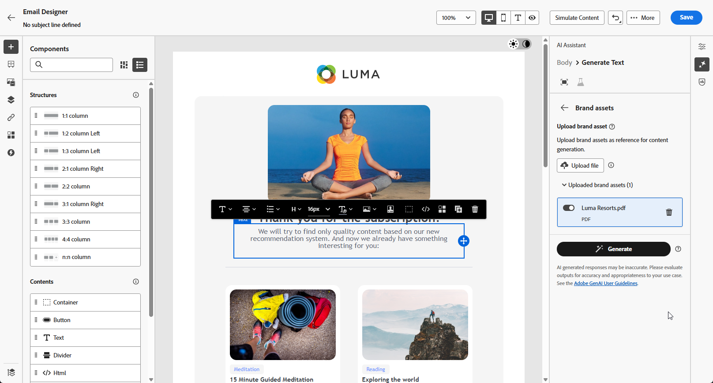

# Geração de página da Web com o Assistente de IA {#generative-web}

>[!BEGINSHADEBOX]

**Índice**

* [Introdução ao Assistente de IA](gs-generative.md)
* [Geração de email com o Assistente de IA](generative-email.md)
* [Geração de SMS com o Assistente de IA](generative-SMS.md)
* [Geração de push com o Assistente de IA](generative-push.md)
* Geração de página da Web com o Assistente de IA
* [Experimento de conteúdo com o Assistente de IA](generative-experimentation.md)

>[!ENDSHADEBOX]

Depois de criar e personalizar seus emails, use o Assistente de IA no Adobe Journey Optimizer viabilizado pela IA generativa para elevar o conteúdo ao próximo nível.

O Assistente de IA pode ajudá-lo a otimizar o impacto de suas entregas, sugerindo conteúdo diferente que tenha mais probabilidade de repercutir com seu público-alvo.

>[!NOTE]
>
>Antes de começar a usar esse recurso, leia as [Medidas de Proteção e Limitações](generative-gs.md#guardrails-and-limitations) relacionadas.

>[!BEGINTABS]

>[!TAB Geração completa da página da Web]

No exemplo a seguir, aproveitaremos o assistente de IA para refinar um email existente, personalizando-o para um evento especial.

1. Depois de criar e configurar o delivery de email, clique em **[!UICONTROL Editar conteúdo]**.

   Para obter mais informações sobre como configurar a entrega de emails, consulte [esta página](../email/create-email-content.md).

1. Personalize seu email conforme necessário e acesse o menu do **[!UICONTROL Assistente de IA]**.

   {zoomable="yes"}

1. Habilite a opção **[!UICONTROL Usar conteúdo original]** para que o Assistente de IA personalize novo conteúdo com base na sua entrega, nome de entrega e público selecionado.

   Seu prompt deve estar sempre vinculado a um contexto específico.

1. Ajuste o conteúdo descrevendo o que você deseja gerar no campo **[!UICONTROL Prompt]**.

   Se você estiver procurando ajuda para criar seu prompt, acesse a **[!UICONTROL Biblioteca de Prompts]**, que fornece diversas ideias de prompt para melhorar suas entregas.

   {zoomable="yes"}

1. Você pode alternar a **[!UICONTROL Linha de assunto]** ou o **[!UICONTROL Pré-cabeçalho]** para incluí-los na geração da variante.

1. Clique em **[!UICONTROL Carregar ativo de marca]** para adicionar qualquer ativo de marca que contenha conteúdo que possa fornecer contexto adicional ao Assistente de IA ou selecione um carregado anteriormente.

   {zoomable="yes"}

1. Personalize seu prompt com as diferentes opções:

   * **[!UICONTROL Estratégia de comunicação]**: escolha o estilo de comunicação mais adequado para o texto gerado.
   * **[!UICONTROL Idioma]**: selecione o idioma em que deseja que o conteúdo seja gerado.
   * **[!UICONTROL Tom]**: o tom do seu email deve repercutir na sua audiência. Se você quiser soar informativo, divertido ou persuasivo, o Assistente de IA poderá adaptar a mensagem de acordo.
   * **[!UICONTROL Comprimento]**: escolha o comprimento desejado do conteúdo usando o controle deslizante de intervalo.

   {zoomable="yes"}

1. Quando o prompt estiver pronto, clique em **[!UICONTROL Gerar]**.

1. Navegue pelas **[!UICONTROL Variações]** geradas e clique em **[!UICONTROL Visualizar]** para exibir uma versão em tela inteira da variação selecionada.

1. Navegue até a opção **[!UICONTROL Refinar]** na janela **[!UICONTROL Visualizar]** para acessar recursos de personalização adicionais:

   * **[!UICONTROL Refrase]**: o Assistente de IA pode reformular sua mensagem de diferentes maneiras, mantendo sua escrita atualizada e engajando públicos diversos.

   * **[!UICONTROL Usar idioma simples]**: use o Assistente de IA para simplificar seu idioma, garantindo clareza e acessibilidade para um público-alvo maior.

   {zoomable="yes"}

1. Clique em **[!UICONTROL Selecionar]** depois de encontrar o conteúdo apropriado.

1. Insira campos de personalização para personalizar seu conteúdo de email com base nos dados de perfis. Em seguida, clique no botão **[!UICONTROL Simular conteúdo]** para controlar a renderização e verificar as configurações de personalização com perfis de teste. [Saiba mais](../preview-test/preview-content.md)

   {zoomable="yes"}

Depois de definir seu conteúdo, público-alvo e agendamento, você estará pronto para preparar seu delivery de email. [Saiba mais](../monitor/prepare-send.md)

>[!TAB Geração de texto da página da Web]

No exemplo a seguir, aproveitaremos o assistente de IA para aprimorar o conteúdo de nosso convite por email para o evento futuro.

1. Depois de criar e configurar o delivery de email, clique em **[!UICONTROL Editar conteúdo]**.

   Para obter mais informações sobre como configurar a entrega de emails, consulte [esta página](../email/create-email-content.md).

1. Selecione um **[!UICONTROL Componente de texto]** para direcionar somente a um conteúdo específico. e acesse o menu do **[!UICONTROL Assistente de IA]**.

   {zoomable="yes"}

1. Habilite a opção **[!UICONTROL Usar conteúdo original]** para que o Assistente de IA personalize novo conteúdo com base na sua entrega, nome de entrega e público selecionado.

   Seu prompt deve estar sempre vinculado a um contexto específico.

1. Ajuste o conteúdo descrevendo o que você deseja gerar no campo **[!UICONTROL Prompt]**.

   Se você estiver procurando ajuda para criar seu prompt, acesse a **[!UICONTROL Biblioteca de Prompts]**, que fornece diversas ideias de prompt para melhorar suas entregas.

   {zoomable="yes"}

1. Clique em **[!UICONTROL Carregar ativo de marca]** para adicionar qualquer ativo de marca que contenha conteúdo que possa fornecer contexto adicional ao Assistente de IA.

   {zoomable="yes"}

1. Personalize seu prompt com as diferentes opções:

   * **[!UICONTROL Estratégia de comunicação]**: selecione a abordagem de comunicação desejada para o texto gerado.
   * **[!UICONTROL Idioma]**: escolha o idioma para o conteúdo da variante.
   * **[!UICONTROL Tone]**: certifique-se de que o texto é apropriado para seu público-alvo e sua finalidade.
   * **[!UICONTROL Comprimento]**: selecione o comprimento do conteúdo usando o controle deslizante de intervalo.

   {zoomable="yes"}

1. Quando o prompt estiver pronto, clique em **[!UICONTROL Gerar]**.

1. Navegue pelas **[!UICONTROL Variações]** geradas e clique em **[!UICONTROL Visualizar]** para exibir uma versão em tela inteira da variação selecionada.

1. Navegue até a opção **[!UICONTROL Refinar]** na janela **[!UICONTROL Visualizar]** para acessar recursos de personalização adicionais:

   * **Usar como conteúdo de referência**: a variante escolhida servirá como conteúdo de referência para gerar outros resultados.

   * **Elaborar**: o Assistente de IA pode ajudá-lo a expandir tópicos específicos, fornecendo detalhes adicionais para melhor compreensão e engajamento.

   * **Resumir**: informações extensas podem sobrecarregar destinatários de email. Use o Assistente de IA para condensar os pontos principais em resumos claros e concisos que chamem a atenção e os incentivem a ler mais.

   * **Refrase**:O Assistente de IA pode reformular sua mensagem de diferentes maneiras, mantendo sua escrita atualizada e engajando públicos diversos.

   * **Usar idioma simples**: use o Assistente de IA para simplificar seu idioma, garantindo clareza e acessibilidade para um público-alvo maior.

   {zoomable="yes"}

1. Clique em **[!UICONTROL Selecionar]** depois de encontrar o conteúdo apropriado.

1. Insira campos de personalização para personalizar seu conteúdo de email com base nos dados de perfis. Em seguida, clique no botão **[!UICONTROL Simular conteúdo]** para controlar a renderização e verificar as configurações de personalização com perfis de teste. [Saiba mais](../preview-test/preview-content.md)

   {zoomable="yes"}

Depois de definir seu conteúdo, público-alvo e agendamento, você estará pronto para preparar seu delivery de email. [Saiba mais](../monitor/prepare-send.md)

>[!TAB Geração de imagem da página da Web]

No exemplo abaixo, aprenda a usar o Assistente de IA para otimizar e melhorar seus ativos, garantindo uma experiência mais amigável.

1. Depois de criar e configurar o delivery de email, clique em **[!UICONTROL Editar conteúdo]**.

   Para obter mais informações sobre como configurar a entrega de emails, consulte [esta página](../email/create-email-content.md).

1. Preencha os **[!UICONTROL detalhes Básicos]** da sua entrega. Depois de concluído, clique em **[!UICONTROL Editar conteúdo de email]**.

1. Selecione o ativo que deseja alterar com o Assistente de IA.

1. No menu à direita, selecione **[!UICONTROL Assistente do AI]**.

   {zoomable="yes"}

1. Ajuste o conteúdo descrevendo o que você deseja gerar no campo **[!UICONTROL Prompt]**.

   Se você estiver procurando ajuda para criar seu prompt, acesse a **[!UICONTROL Biblioteca de Prompts]**, que fornece diversas ideias de prompt para melhorar suas entregas.

   {zoomable="yes"}

1. Clique em **[!UICONTROL Carregar ativo de marca]** para adicionar qualquer ativo de marca que contenha conteúdo que possa fornecer contexto adicional ao Assistente de IA.

   Seu prompt deve estar sempre vinculado a um contexto específico.

1. Personalize seu prompt com as diferentes opções:

   * **[!UICONTROL Taxa de proporção]**: determina a largura e a altura do ativo. Você tem a opção de escolher entre taxas comuns, como 16:9, 4:3, 3:2 ou 1:1, ou pode inserir um tamanho personalizado.
   * **[!UICONTROL Cor e tom]**: a aparência geral das cores em uma imagem e o humor ou atmosfera que ela transmite.
   * **[!UICONTROL Tipo de conteúdo]**: categoriza a natureza do elemento visual, distinguindo entre diferentes formas de representação visual, como fotos, gráficos ou arte.
   * **[!UICONTROL Iluminação]**: refere-se ao relâmpago presente em uma imagem, que molda sua atmosfera e realça elementos específicos.
   * **[!UICONTROL Composição]**: refere-se à disposição dos elementos dentro do quadro de uma imagem

   {zoomable="yes"}

1. Quando estiver satisfeito com a configuração do prompt, clique em **[!UICONTROL Gerar]**.

1. Navegue pelas **[!UICONTROL sugestões de variação]** para encontrar o ativo desejado.

   Clique em **[!UICONTROL Visualizar]** para exibir uma versão em tela inteira da variação selecionada.

   {zoomable="yes"}

1. Escolha **[!UICONTROL Mostrar Semelhante]** se desejar exibir imagens relacionadas a esta variante.

1. Clique em **[!UICONTROL Selecionar]** depois de encontrar o conteúdo apropriado.

   {zoomable="yes"}

1. Após definir o conteúdo da mensagem, clique no botão **[!UICONTROL Simular conteúdo]** para controlar a renderização e verificar as configurações de personalização com perfis de teste.  [Saiba mais](../preview-test/preview-content.md)

   {zoomable="yes"}

1. Depois de definir seu conteúdo, público-alvo e agendamento, você estará pronto para preparar seu delivery de email. [Saiba mais](../monitor/prepare-send.md)

>[!ENDTABS]

