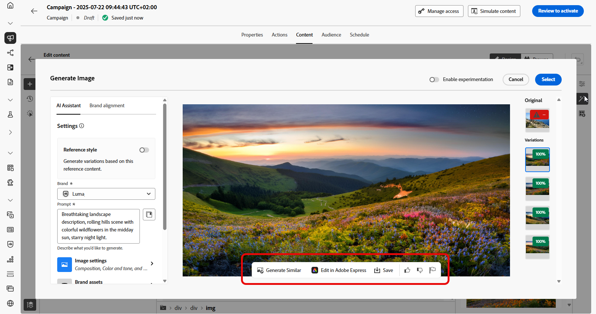

# Geração de página da Web com o Assistente de IA {#generative-web}

>[!IMPORTANT]
>
>Antes de começar a usar esse recurso, consulte as [Medidas de proteção e limitações](gs-generative.md#generative-guardrails) relacionadas.
>&#x200B;> 
>
>Você deve concordar com um [contrato de usuário](https://www.adobe.com/legal/licenses-terms/adobe-dx-gen-ai-user-guidelines.html) antes de usar o Assistente de IA no Journey Optimizer. Para obter mais informações, entre em contato com o representante da Adobe.

Depois de criar e personalizar suas páginas da Web, use o Assistente de IA no Journey Optimizer viabilizado pela IA gerativa para elevar o conteúdo ao próximo nível.

O Assistente de IA do Journey Optimizer pode ajudar você a otimizar o impacto de suas entregas, sugerindo conteúdo diferente que tenha mais probabilidade de repercutir com seu público-alvo.

>[!BEGINTABS]

>[!TAB Geração de texto da página da Web]

1. Depois de criar e configurar sua página da Web, clique em **[!UICONTROL Editar página da Web]**.

   Para obter mais informações sobre como configurar sua página da Web, consulte [esta página](../web/create-web.md).

1. Selecione um **[!UICONTROL Componente de texto]** para direcionar somente a um conteúdo específico. e acesse o menu **[!UICONTROL Mostrar assistente de IA]**.

   {zoomable="yes"}

1. Habilite a opção **[!UICONTROL Usar conteúdo original]** para que o Assistente de IA personalize o novo conteúdo com base no conteúdo selecionado.

1. Selecione sua **[!UICONTROL Marca]** para garantir que o conteúdo gerado por IA esteja alinhado às especificações da sua marca. [Saiba mais](brands.md) sobre marcas.

   Observe que o recurso Marcas é lançado como um beta privado e estará progressivamente disponível para todos os clientes em versões futuras.

1. Ajuste o conteúdo descrevendo o que você deseja gerar no campo **[!UICONTROL Prompt]**.

   Se você estiver procurando ajuda para criar seu prompt, acesse a **[!UICONTROL Biblioteca de Prompts]**, que fornece diversas ideias de prompt para melhorar suas campanhas.

   {zoomable="yes"}

1. Personalize seu prompt com a opção **[!UICONTROL Configurações de texto]**:

   * **[!UICONTROL Estratégia de comunicação]**: escolha o estilo de comunicação mais adequado para o texto gerado.
   * **[!UICONTROL Idiomas]**: as opções de idioma espanhol, italiano, sueco e norueguês são lançadas como um beta privado e estarão progressivamente disponíveis para todos os clientes em versões futuras.
   * **[!UICONTROL Tom]**: o tom da sua página da Web deve repercutir no seu público. Se você deseja parecer informativo, divertido ou persuasivo, o Assistente de IA pode adaptar a mensagem de acordo.
   * **Comprimento do texto**: use o controle deslizante para selecionar o comprimento desejado do texto.

   {zoomable="yes"}

1. No menu **[!UICONTROL Ativos de marca]**, clique em **[!UICONTROL Carregar ativo de marca]** para adicionar qualquer ativo de marca que contenha conteúdo que possa fornecer o Assistente de IA de contexto adicional ou selecione um ativo carregado anteriormente.

   Os arquivos carregados anteriormente estão disponíveis no menu suspenso **[!UICONTROL Ativos de marca carregados]**. Basta alternar os ativos que deseja incluir na geração.

1. Quando o prompt estiver pronto, clique em **[!UICONTROL Gerar]**.

1. Navegue pelas **[!UICONTROL Variações]** geradas.

   Clique em **[!UICONTROL Visualizar]** para exibir uma versão em tela inteira da variação selecionada ou clique em **[!UICONTROL Aplicar]** para substituir o conteúdo atual.

1. Clique no ícone de porcentagem para exibir sua **[!UICONTROL Pontuação de alinhamento da marca]** e identificar quaisquer desalinhamentos com sua marca.

   Saiba mais sobre [Pontuação de alinhamento da marca](brands-score.md).

   {zoomable="yes"}

1. Navegue até a opção **[!UICONTROL Refinar]** na janela **[!UICONTROL Visualizar]** para acessar recursos de personalização adicionais:

   * **[!UICONTROL Usar como conteúdo de referência]**: a variante escolhida servirá como conteúdo de referência para gerar outros resultados.

   * **[!UICONTROL Elaborar]**: o Assistente de IA pode ajudá-lo a expandir tópicos específicos, fornecendo detalhes adicionais para melhor compreensão e engajamento.

   * **[!UICONTROL Resumir]**: informações extensas podem sobrecarregar os destinatários. Use o Assistente de IA para condensar os pontos principais em resumos claros e concisos que chamem a atenção e os incentivem a ler mais.

   * O Assistente de IA de **[!UICONTROL Refrase]**:The pode reformular sua mensagem de diferentes maneiras, mantendo sua escrita atualizada e envolvente para públicos diversos.

   * **[!UICONTROL Usar linguagem mais simples]**: use o AI Assistant para simplificar sua linguagem, garantindo clareza e acessibilidade para um público-alvo maior.

   Você também pode alterar o **[!UICONTROL Tom]** e a **[!UICONTROL estratégia de comunicação]** do seu texto.

   {zoomable="yes"}

1. Abra a guia **[!UICONTROL Alinhamento da marca]** para ver como o seu conteúdo se alinha às suas [diretrizes da marca](brands.md).

1. Clique em **[!UICONTROL Selecionar]** depois de encontrar o conteúdo apropriado.

   Você também pode ativar o experimento para o seu conteúdo. [Saiba mais](generative-experimentation.md)

Depois de definir as configurações da campanha da Web e editar o conteúdo conforme desejado usando o web designer, você pode revisar e ativar a campanha da Web. [Saiba mais](../web/create-web.md#activate-web-campaign)

>[!TAB Geração de imagem da página da Web]

No exemplo abaixo, saiba como usar o Assistente de IA no Journey Optimizer para otimizar e melhorar seus ativos, garantindo uma experiência mais amigável.

1. Depois de criar e configurar sua página da Web, clique em **[!UICONTROL Editar página da Web]**.

   Para obter mais informações sobre como configurar sua página da Web, consulte [esta página](../web/create-web.md).

1. Selecione o ativo que deseja alterar com o Assistente de IA.

1. No menu à direita, selecione **[!UICONTROL Mostrar assistente de IA]**.

   {zoomable="yes"}

1. Habilite a opção **[!UICONTROL Estilo de referência]** para que o Assistente de IA personalize o novo conteúdo com base no conteúdo de referência. Você também pode carregar uma imagem para adicionar contexto à sua variação.

1. Selecione sua **[!UICONTROL Marca]** para garantir que o conteúdo gerado por IA esteja alinhado às especificações da sua marca. [Saiba mais](brands.md) sobre marcas.

   Observe que o recurso Marcas é lançado como um beta privado e estará progressivamente disponível para todos os clientes em versões futuras.

1. Ajuste o conteúdo descrevendo o que você deseja gerar no campo **[!UICONTROL Prompt]**.

   Se você estiver procurando ajuda para criar seu prompt, acesse a **[!UICONTROL Biblioteca de Prompts]**, que fornece diversas ideias de prompt para melhorar suas campanhas.

   {zoomable="yes"}

1. Personalize seu prompt com a opção **[!UICONTROL Configurações de imagem]**:

   * **[!UICONTROL Taxa de proporção]**: determina a largura e a altura do ativo. Você tem a opção de escolher entre taxas comuns, como 16:9, 4:3, 3:2 ou 1:1, ou pode inserir um tamanho personalizado.
   * **[!UICONTROL Tipo de conteúdo]**: categoriza a natureza do elemento visual, distinguindo entre diferentes formas de representação visual, como fotos, gráficos ou arte.
   * **[!UICONTROL Intensidade visual]**: você pode controlar o impacto da imagem ajustando sua intensidade. Uma configuração mais baixa (2) criará uma aparência mais suave e mais restrita, enquanto uma configuração mais alta (10) tornará a imagem mais vibrante e visualmente poderosa.
   * **[!UICONTROL Cor e tom]**: a aparência geral das cores em uma imagem e o humor ou atmosfera que ela transmite.
   * **[!UICONTROL Iluminação]**: refere-se ao relâmpago presente em uma imagem, que molda sua atmosfera e realça elementos específicos.
   * **[!UICONTROL Composição]**: refere-se à disposição dos elementos dentro do quadro de uma imagem

   {zoomable="yes"}

1. No menu **[!UICONTROL Ativos de marca]**, clique em **[!UICONTROL Carregar ativo de marca]** para adicionar qualquer ativo de marca que contenha conteúdo que possa fornecer o Assistente de IA de contexto adicional ou selecione um ativo carregado anteriormente.

   Os arquivos carregados anteriormente estão disponíveis no menu suspenso **[!UICONTROL Ativos de marca carregados]**. Basta alternar os ativos que deseja incluir na geração.

1. Quando estiver satisfeito com a configuração do prompt, clique em **[!UICONTROL Gerar]**.

1. Navegue pelas **[!UICONTROL Variações]** geradas.

   Clique em **[!UICONTROL Visualizar]** para exibir uma versão em tela inteira da variação selecionada ou clique em **[!UICONTROL Aplicar]** para substituir o conteúdo atual.

1. Clique no ícone de porcentagem para exibir sua **[!UICONTROL Pontuação de alinhamento da marca]** e identificar quaisquer desalinhamentos com sua marca.

   Saiba mais sobre [Pontuação de alinhamento da marca](brands-score.md).

   {zoomable="yes"}

1. Navegue até a opção **[!UICONTROL Refinar]** na janela **[!UICONTROL Visualizar]** para acessar recursos de personalização adicionais:

   * **[!UICONTROL Gerar Semelhante]** para exibir imagens relacionadas a esta variante.
   * **[!UICONTROL Edite no Adobe Express]** para personalizar ainda mais seu ativo.

[Saiba mais sobre a integração do Adobe Express](../integrations/express.md)

   * **[!UICONTROL Salve]** para armazenar os ativos para acesso posterior.

   {zoomable="yes"}

1. Abra a guia **[!UICONTROL Alinhamento da marca]** para ver como o seu conteúdo se alinha às suas [diretrizes da marca](brands.md).

1. Clique em **[!UICONTROL Selecionar]** depois de encontrar o conteúdo apropriado.

   Você também pode ativar o experimento para o seu conteúdo. [Saiba mais](generative-experimentation.md)

Depois de definir as configurações da campanha da Web e editar o conteúdo conforme desejado usando o web designer, você pode revisar e ativar a campanha da Web. [Saiba mais](../web/create-web.md#activate-web-campaign)

>[!ENDTABS]
