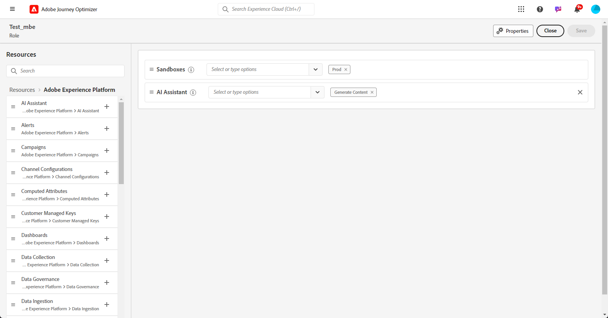

# Introdução à geração de conteúdo {#gs-content-assistant}

>[!BEGINSHADEBOX]

**Nesta página:** Saiba como acessar Gerar Conteúdo no Adobe Journey Optimizer, configurar as permissões necessárias e entender as medidas de proteção para gerar conteúdo de texto e imagem.

>[!ENDSHADEBOX]

>[!CONTEXTUALHELP]
>id="ajo_ai_generation_settings"
>title="Gerar conteúdo no Journey Optimizer"
>abstract="Depois de criar e personalizar o delivery, você pode usar a IA para editar e refinar o conteúdo. Esse recurso simplifica o processo de personalização e melhoria de conteúdo, permitindo ajustar o conteúdo com uma descrição do que deseja gerar."

>[!CONTEXTUALHELP]
>id="ajo_ai_generation_context"
>title="Fazer upload do ativo da marca"
>abstract="O menu Upload do ativo da marca permite adicionar qualquer ativo da marca com conteúdo que pode fornecer contexto adicional para Gerar conteúdo no Journey Optimizer ou selecionar um ativo carregado anteriormente. Essa opção garante que a Geração de conteúdo tenha acesso a todos os materiais necessários para aprimorar sua funcionalidade e relevância."

>[!CONTEXTUALHELP]
>id="ajo_ai_generation_start"
>title="Termos da IA generativa da Adobe"
>abstract="O acesso a esse recurso está sujeito à aceitação das Diretrizes de usuário da IA generativa da Adobe Experience Cloud. Você deve verificar os resultados desse recurso quanto à precisão para garantir que sejam apropriados para seu caso de uso"
>additional-url="https://www.adobe.com/legal/licenses-terms/adobe-dx-gen-ai-user-guidelines.html?lang=pt-BR" text="Diretrizes do usuário da IA generativa da Adobe"

>[!INFO]
>
>Mergulhe em uma experiência prática com a [nossa prévia ao vivo do recurso](https://experienceleague.adobe.com/pt-br/apps/journey-optimizer/ai-assistant-content-accelerator){target="_blank"}, projetada para ajudar você a explorar esses recursos em primeira mão e entendê-los totalmente.

Gerar conteúdo no Adobe Journey Optimizer, viabilizado pelo Microsoft Azure OpenAI e Adobe Firefly, oferece sugestões proativas de variação de conteúdo para texto e imagens. Esse novo recurso fornece **geração de texto e imagens baseada em prompts**. A geração de imagens é gerenciada pelo Adobe Firefly.

Gerar conteúdo dá suporte à geração **em vários idiomas**, permitindo que você alcance e envolva diversos públicos globais. Gerar conteúdo está disponível nos seguintes idiomas:

<table style="table-layout:fixed; margin-top: 0px; margin-bottom: 0px;">
  <tbody>
    <tr style="border: 0;background-color: #FFFFFF;">
      <td>
        <ul>
          <li>Chinês (Hong Kong)</li>
          <li>Chinês (simplificado)</li>
          <li>Chinês (Taiwan)</li>
          <li>Holandês</li>
        </ul>
      </td>
      <td>
        <ul>
          <li>Francês</li>
          <li>Alemão</li>
          <li>Italiano</li>
          <li>Japonês</li>
        </ul>
      </td>
      <td>
        <ul>
          <li>Norueguês</li>
          <li>Português</li>
          <li>espanhol</li>
          <li>Sueco</li>
        </ul>
      </td>
    </tr>
  </tbody>
</table>

Use a IA para otimizar o impacto da sua mensagem, experimentando com diferentes títulos e imagens principais. Gere múltiplas variantes e crie um experimento para compará-las. Com o **experimento de conteúdo do Journey Optimizer**, é possível definir vários tratamentos de mensagens para medir qual tem o melhor desempenho para o público-alvo direcionado. É possível optar por variar o conteúdo da entrega ou o assunto. O público-alvo da mensagem é alocado aleatoriamente em cada tratamento para determinar qual funciona melhor de acordo com a métrica especificada. Saiba mais sobre o Experimento de conteúdo [nesta seção](../content-management/content-experiment.md).

>[!IMPORTANT]
>
>* Antes de começar a usar este recurso, leia as [Medidas de proteção e limitações](#generative-guardrails) relacionadas.
>
>
>* Você deve concordar com um [contrato de usuário](https://www.adobe.com/legal/licenses-terms/adobe-dx-gen-ai-user-guidelines.html?lang=pt-BR){target="_blank"} antes de poder usar Gerar conteúdo no Adobe Journey Optimizer. Para obter mais informações, entre em contato com o(a) representante da Adobe.

## Acessar Gerar Conteúdo {#generative-access}

Para acessar Gerar Conteúdo no Adobe Journey Optimizer, os usuários precisam ter a permissão **Gerar Conteúdo**. [Saiba mais](../administration/permissions.md)

+++  Saiba como atribuir permissões relacionadas à geração de conteúdo

1. No produto **Permissões**, abra a guia **Funções** e selecione a **função** desejada.

1. Clique em **Editar** para modificar as permissões.

1. Adicione o recurso **Assistente de IA** e selecione **Gerar conteúdo** no menu suspenso.

   {zoomable="yes"}

1. Clique em **Salvar** para aplicar as alterações.

   As permissões de todos os usuários já atribuídos a essa função serão atualizadas automaticamente.

1. Para atribuir essa função a novos usuários, navegue até a guia **Usuários** no painel **Funções** e clique em **Adicionar usuário**.

1. Insira o nome do usuário, seu endereço de email ou escolha na lista e clique em **Salvar**.

1. Se o usuário não tiver sido criado anteriormente, consulte [esta documentação](https://experienceleague.adobe.com/pt-br/docs/experience-platform/access-control/abac/permissions-ui/users).

O usuário receberá um email com instruções para acessar a sua instância.

+++

## Medidas de proteção e limitações {#generative-guardrails}

As diretrizes gerais para usar a opção Gerar conteúdo no Adobe Journey Optimizer para geração de email estão listadas abaixo:

### Canais compatíveis

* Disponível somente para os canais de email, push, web e SMS.

### Qualidade do conteúdo, prompts e feedback

* A qualidade do conteúdo gerado é fortemente influenciada pelo objetivo ou prompt de marketing definido. Use um prompt bem definido para que o modelo GenAI interprete com precisão. 
* O conteúdo de GenAI nem sempre é preciso: compartilhe seu feedback para que a equipe de engenheiros(as) possa refinar os modelos.
* Relate resultados problemáticos usando os ícones de “polegar para cima”, “polegar para baixo” ou o sinalizador ao selecionar variantes.

### Ativos da marca

* Faça upload do ativo de marca para ter conteúdo preciso e apropriado à marca. Caso contrário, o conteúdo será baseado em informações disponíveis publicamente. O conteúdo carregado pode estar nos seguintes formatos: arquivos PDF, JPEG, PNG ou ZIP (com formatos de arquivo compatíveis).
* O tamanho máximo para o ativo de marca carregado é de 50 MB. É possível carregar arquivos maiores ou um número maior de imagens, mas o tempo de processamento aumentará.
* É possível fazer upload de vários ativos de marca, mas aproveitando apenas um para uma geração específica.

### Modelos e imagens de email

* Use um modelo específico da marca ou personalizado para criar seu conteúdo de email usando Gerar conteúdo no Adobe Journey Optimizer. Recomenda-se um modelo de email com 8-10 imagens, no máximo.

### Uso legal e transparência

* O uso de Gerar conteúdo está sujeito às Diretrizes de usuário da IA gerada da Adobe Experience Cloud. [Saiba mais](https://www.adobe.com/legal/licenses-terms/adobe-dx-gen-ai-user-guidelines.html?lang=pt-BR)
* Como parte de nosso compromisso de promover a transparência no uso de ferramentas de IA generativa para a criação de mídias, a Adobe aplicará Content Credentials quando um conteúdo ou projeto que inclua um ativo gerado pelo Firefly for baixado ou exportado. [Saiba mais](https://helpx.adobe.com/br/firefly/using/content-credentials.html)
  <!--* See [Content Credentials in AI Assistant](generative-content-credentials.md) for details on which actions attach Content Credentials and what happens as your content moves.-->

### Gerar conteúdo para expressões de personalização {#ai-assistant-personalization-editor-guardrails}

As seguintes medidas de proteção se aplicam a [Gerar conteúdo para expressões de personalização](generative-personalization-expressions.md) no [!UICONTROL Editor do Personalization] e no Designer de email.

* **Escolha de Ofertas e Experiências**: não compatível.
* **Favoritos**: não compatível.
* **Condições salvas**: não compatível.
* **Fragmentos de conteúdo do Adobe Experience Manager**: não compatível.

## Gerar recursos de conteúdo {#generative-features}

<table style="table-layout:fixed"><tr style="border: 0;">
<td>

<a href="generative-full-content.md"><strong>Gerar conteúdo integral</strong></a>

</td>
<td>

<a href="generative-text.md"><strong>Gerar texto</strong>

</td>
<td>

<a href="generative-image.md"><strong>Gerar imagens</strong></a>

</td>
</tr></table>

## Recursos adicionais

* **[Gerar casos de uso de conteúdo](generative-uc.md)** - Saiba mais sobre como usar a opção Gerar conteúdo por meio de casos de uso
* **[Gerar tutoriais de conteúdo](https://experienceleague.adobe.com/pt-br/docs/journey-optimizer-learn/tutorials/introduction-to-journey-optimizer/ai-assistant){target="_blank"}** - Explore tutoriais em vídeo passo a passo sobre os recursos Gerar conteúdo e as práticas recomendadas.
