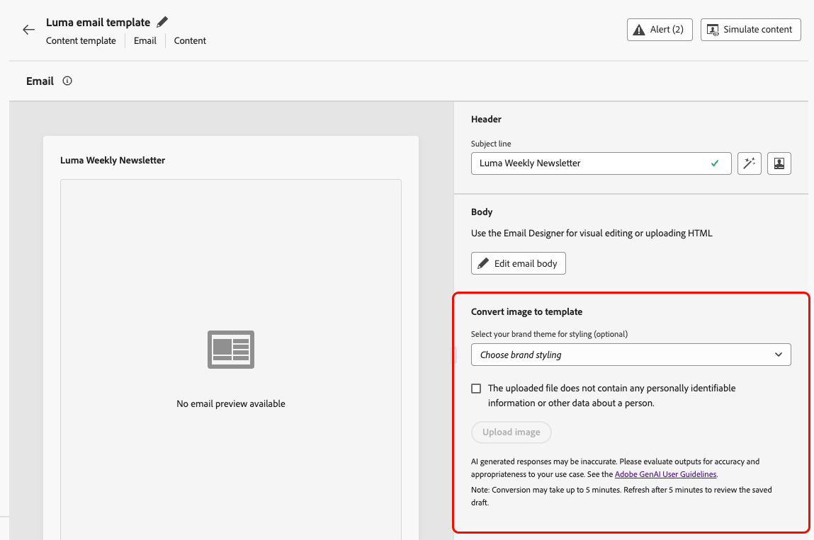

# Converter imagens em modelos de conteúdo de email {#image-to-html}

O [!DNL Journey Optimizer] ajuda você a acelerar bastante a criação de emails, convertendo designs de imagens estáticas em modelos de conteúdo de email modulares e totalmente personalizáveis.

>[!AVAILABILITY]
>
>Para usar esse recurso, sua organização deve ter assinado o adendo [!DNL Generative AI] com a Adobe. Se não tiver certeza, entre em contato com o representante da Adobe.
>
>Esse recurso está disponível somente para o canal de email.

Utilizando a tecnologia de IA gerativa, uma ferramenta integrada analisa o layout, a tipografia, as cores e os elementos visuais da imagem e gera conteúdo HTML limpo e modular que mantém a fidelidade do design enquanto garante total capacidade de edição com o [Designer de email](../email/get-started-email-design.md).

Esse recurso sem código permite que os profissionais de marketing transformem ativos visuais de designers gráficos ou ferramentas de design em modelos de email responsivos e editáveis que podem ser salvos e reutilizados em várias jornadas e campanhas, sem a necessidade de conhecimento técnico.

>[!IMPORTANT]
>
>Antes de começar a usar este recurso, leia as [Medidas de proteção e recomendações](#limitations) relacionadas.

Os principais benefícios são os seguintes:

* **Mais rápido que a codificação manual** - O conversor transforma imagens em conteúdo editável em minutos, para que você possa pular o fluxo de trabalho manual demorado de modelo para HTML.
* **Nenhuma habilidade técnica necessária** - Os profissionais de marketing podem produzir e ajustar modelos sem suporte a design ou desenvolvimento.
* **Reutilizável em campanhas** - Salve modelos na biblioteca e use-os em qualquer jornada ou campanha.
* **Permanece fiel ao design** - A saída corresponde ao seu layout e estilo, sendo totalmente compatível com o Designer de email.

<!--
* **Design fidelity**: Maintain visual consistency with your original design while creating fully editable content
* **Email compatibility**: Generate HTML that works seamlessly with the Email Designer and across email clients
-->

+++ Casos de uso comuns

O conversor de imagem para HTML é ideal para:

* **Migração de plataforma**: migrando de outra plataforma de marketing por email? Converta seus designs de email existentes em modelos do HTML prontos para [!DNL Journey Optimizer] sem recriar do zero.
* **Conversão do modelo de design**: transforme modelos de design de ferramentas como o Photoshop, o Figma ou outro software de design em modelos de email funcionais.
* **Criação rápida de modelo**: gere modelos de email rapidamente para campanhas sensíveis ao tempo sem esperar pelos recursos do desenvolvedor.
* **Criando bibliotecas de modelos**: crie uma biblioteca abrangente de modelos consistentes com a marca que os membros da equipe não técnica possam personalizar e implantar.
* **Redução das dependências técnicas**: permitir que os profissionais de marketing criem e repitam modelos de email de maneira independente, acelerando a execução da campanha.

+++

## Acessar a imagem ao conversor do HTML {#access-image-to-html}

**Adendo com o Adobe**

Para acessar esse recurso, sua organização deve ter assinado o adendo [!DNL Generative AI] com a Adobe. Se não tiver certeza, entre em contato com o representante da Adobe.

**Permissões**

* Para acessar e criar modelos, sua função deve incluir a permissão **[!UICONTROL Gerenciar modelos de conteúdo]** (no recurso **Gerenciamento de conteúdo**). [Saiba mais sobre permissões](../administration/permissions.md)

* Para usar o conversor de imagem para HTML, você precisa ter a permissão **Gerar conteúdo**. Saiba como atribuir permissões relacionadas à geração de conteúdo em [esta seção](../content-management/gs-generative.md#generative-access).

**Contrato**

Antes de usar esse recurso, você deve concordar com um contrato de usuário que será exibido na primeira vez que usar a IA gerativa no [!DNL Journey Optimizer]. Para obter mais informações, leia as [Diretrizes de usuário da IA gerativa da Adobe Experience Cloud](https://www.adobe.com/br/legal/licenses-terms/adobe-gen-ai-user-guidelines.html){target="_blank"}.

## Medidas de proteção e recomendações {#limitations}

Esteja ciente das seguintes limitações e recomendações ao converter imagens em modelos de conteúdo de email.

**Adequação**

* **Interpretação de IA**: a IA gera conteúdo estático do HTML com base na interpretação visual da sua imagem. Ele fornece um forte ponto de partida para a criação de emails, mas deve ser revisado e refinado usando o Designer de email para garantir que atenda aos seus requisitos exatos. Você deve adicionar personalização, conteúdo dinâmico e rastreamento manualmente após a conversão, se necessário.

* **Precisão do texto**: enquanto a IA tenta reconhecer e reproduzir o texto com precisão, sempre verifique o conteúdo do texto e faça as correções necessárias. Verifique as [Diretrizes de usuário da IA gerativa da Adobe](https://www.adobe.com/br/legal/licenses-terms/adobe-gen-ai-user-guidelines.html){target="_blank"}.

**Seleção da imagem**

* **PII e dados confidenciais**: certifique-se de selecionar uma imagem que não contenha nenhuma informação pessoal identificável (PII) ou outros dados confidenciais.

* **Tamanho da imagem**: não é possível carregar imagens com mais de 10 MB.

* **Imagens de alta qualidade**: para obter melhores resultados, use imagens claras e de alta qualidade: visuais nítidos, texto legível e elementos de layout bem definidos. Imagens indefinidas, escuras ou desordenadas reduzem a qualidade da conversão. Idealmente, as imagens devem ter entre 600 e 800 pixels de largura para corresponder às dimensões de email padrão.

* **Layouts simples**: designs altamente complexos com camadas complexas, formas incomuns ou elementos não padrão podem não ser perfeitamente convertidos. Designs mais simples geralmente produzem melhores resultados.

**Processando**

* **Atualizar a página**: o resultado não é exibido automaticamente até que você atualize.

* **Tempo de processamento**: a conversão geralmente termina em **cerca de 5 minutos**, dependendo da complexidade e do tamanho da imagem. Imagens muito grandes ou complexas podem, às vezes, levar até 10 minutos; aguarde adequadamente e atualize para visualizar o resultado.

<!--
* **Background processing**: The AI processing happens in the background, so you can work on other tasks without keeping the screen open. The template is automatically saved as a draft once the conversion is complete.

**Feedback is welcome!** Use the dedicated section to share your thoughts and suggestions with Adobe to help us improve the feature.
-->

## Conversão de uma imagem em um modelo do HTML {#convert-image}

Para converter um design de imagem em um modelo de conteúdo de email totalmente personalizável, siga as etapas abaixo.

1. Verifique se você tem um arquivo de imagem no formato JPEG ou PNG contendo seu design de email.

   >[!IMPORTANT]
   >
   >O tamanho da imagem não pode exceder **10MB**. Para obter melhores resultados, use uma **imagem clara e de alta qualidade** com visuais nítidos, texto legível e elementos de layout bem definidos.

1. Acesse a lista de modelos de conteúdo selecionando **[!UICONTROL Gerenciamento de conteúdo]** > **[!UICONTROL Modelos de conteúdo]** no menu esquerdo.

1. Clique em **[!UICONTROL Criar modelo]**.

1. Preencha os detalhes do modelo, selecione **[!UICONTROL Email]** como canal e clique em **[!UICONTROL Criar]**.

1. Na seção **[!UICONTROL Converter imagem em modelo]**, execute as seguintes etapas:

   * (Opcional) Se sua organização tiver temas de marca definidos no Journey Optimizer, você poderá selecionar um tema como entrada para que o HTML gerado seja estilizado de acordo com os parâmetros do tema da marca. [Saiba mais sobre temas](../email/apply-email-themes.md)

     Estilos como cor de fundo, cor do botão, fontes, espaçamento entre linhas, margens e preenchimento serão aplicados ao modelo gerado, reduzindo o trabalho adicional de design e produzindo um modelo pronto para uso com edições mínimas.

   * Para carregar uma imagem, verifique se ela não contém informações de identificação pessoal (PII) ou outros dados confidenciais. Marque a opção correspondente para confirmar que você revisou o arquivo.

   * Clique no botão **[!UICONTROL Carregar imagem]** para selecionar seu arquivo de imagem.

     {width=80%}

     >[!CAUTION]
     >
     >Ao fazer upload de uma imagem para conversão, todo o conteúdo adicionado no momento no email será excluído e substituído pelo modelo gerado.

1. Se esta for a primeira vez que você está usando a IA Gerativa em [!DNL Journey Optimizer], você será solicitado a concordar com o contrato de usuário. Para saber mais, confira as [Diretrizes de usuário da IA gerativa da Adobe](https://www.adobe.com/br/legal/licenses-terms/adobe-gen-ai-user-guidelines.html){target="_blank"}.

   {width=50%}

   Clique em **[!UICONTROL Concordar]** para continuar.

1. Depois de selecionar a imagem, clique em **[!UICONTROL Abrir]** para iniciar o processo de conversão alimentado por IA, que geralmente é concluído em **cerca de 5 minutos**, dependendo da complexidade e do tamanho do design da imagem.

   >[!NOTE]
   >
   >Imagens muito grandes podem levar até 10 minutos em alguns casos. Você pode sair desta tela e trabalhar em outras tarefas enquanto a conversão está em andamento.

1. **Atualize a página** para ver a saída. Quando a conversão for concluída, o conteúdo gerado será exibido e salvo automaticamente como rascunho.

   >[!IMPORTANT]
   >
   >O resultado não é exibido automaticamente até que você atualize o.

   {width=90%}

1. Use a seção **[!UICONTROL Feedback do conversor de imagem para modelo]** para compartilhar suas ideias e sugestões com a Adobe e nos ajudar a melhorar o recurso.
   {width=70%}

1. Clique em **[!UICONTROL Editar corpo do email]**. O modelo convertido abre na [Designer de email](../email/get-started-email-design.md) com recursos de edição completos. Agora você pode:

   * Revisar, editar conteúdo de texto e aplicar personalização
   * Modificar imagens e adicionar links
   * Ajustar cores, fontes e estilo
   * Adicionar, remover ou reorganizar componentes de conteúdo
   * Aproveite todos os recursos do Email Designer como com qualquer outro modelo

   

   Faça os ajustes necessários para refinar o modelo e corresponder às diretrizes da marca.

1. Depois de satisfeito com seu modelo, clique em **[!UICONTROL Salvar]**.

Seu template agora está disponível na biblioteca de template de conteúdo e pode ser usado ao criar emails em jornadas ou campanhas. [Saiba como usar modelos de conteúdo](../email/use-email-templates.md)

## Práticas recomendadas {#best-practices}

Para obter os melhores resultados ao converter imagens em modelos de conteúdo de email, siga estas recomendações.

+++Antes de começar

* **Salvar conteúdo existente**: a conversão de uma imagem substitui todo o conteúdo existente no seu modelo de email. Sempre salve o trabalho atual antes de usar este recurso.
* **Planeje seu fluxo de trabalho**: use este recurso no início do processo de criação de email ou verifique se você está pronto para substituir todo o conteúdo atual.

+++

+++Preparação da imagem

* **Solução**: use imagens de alta resolução para obter um melhor reconhecimento de texto e detecção de elementos.
* **Clareza**: use uma imagem clara—o texto deve ser fácil de ler e os elementos visuais devem ser bem definidos; evite arquivos de origem borrados, de baixo contraste ou barulhentos.
* **Largura**: crie imagens nas larguras de email padrão (600-800px) para corresponder aos requisitos típicos do cliente de email.
* **Formato de arquivo**: use o formato JPEG ou PNG; evite imagens compactadas ou de baixa qualidade.
* **Design completo**: incluir o design de email completo em uma única imagem, do cabeçalho ao rodapé.

+++

+++Considerações de design

* **Layouts simples**: layouts mais simples e bem estruturados são convertidos com maior precisão do que designs altamente complexos.
* **Elementos padrão**: use padrões comuns de design de email (cabeçalho, seções de corpo, CTAs, rodapé).
* **Legibilidade do texto**: garanta contraste suficiente entre o texto e os planos de fundo.
* **Fontes seguras para a Web**: os designs que usam fontes comuns seguras para a Web terão melhor fidelidade.
* **Evitar elementos sobrepostos**: mantenha os elementos de design claramente separados para obter um melhor reconhecimento de estrutura.

+++

+++Após a conversão

* **Atualize para ver os resultados**: após cerca de 5 minutos (ou até 10 minutos para imagens muito grandes), atualize a página para que a conversão concluída apareça.
* **Analisar rascunho**: depois que a conversão for concluída, o modelo será salvo automaticamente como rascunho. Reserve tempo para analisar cuidadosamente a precisão do conteúdo gerado.
* **Testar completamente**: teste o email em diferentes clientes e dispositivos de email. [Saiba como visualizar e testar o conteúdo](preview-test.md).
* **Refinar manualmente**: faça os ajustes necessários usando os recursos de edição completos do [Designer de email](../email/get-started-email-design.md).
* **Alinhamento da marca**: verifique se as cores, as fontes e o estilo correspondem às diretrizes da sua marca, usando temas, se disponíveis. [Saiba mais sobre temas de email](../email/apply-email-themes.md).
* **Personalization**: adicione conteúdo dinâmico e tokens de personalização conforme necessário. [Saiba mais sobre a personalização](../personalization/personalize.md).
* **Acessibilidade**: revise e aprimore os recursos de acessibilidade, se necessário. [Saiba mais sobre conteúdo de email acessível](../email/accessible-content.md).

+++

+++Comentários são bem-vindos!

Use a seção dedicada para compartilhar suas ideias e sugestões com a Adobe e nos ajudar a melhorar o recurso.

+++

## Perguntas frequentes {#faq}

+++O que acontece com meu conteúdo de email existente quando converto uma imagem em um modelo de conteúdo?

Todo o conteúdo existente no seu email será excluído e substituído pelo modelo recém-gerado ao fazer upload de uma imagem para conversão. Salve qualquer conteúdo importante antes de usar este recurso. É melhor usar esse recurso no início do processo de criação de email.

+++

+++Quais formatos de arquivo são compatíveis?

O conversor é compatível com formatos de imagem JPEG (.jpg, .jpeg) e PNG (.png).

+++

+++Quanto tempo leva o processo de conversão?

A conversão geralmente termina em cerca de 5 minutos, dependendo da complexidade e do tamanho do design da imagem. Imagens muito grandes podem, às vezes, levar até 10 minutos; aguarde mais tempo e atualize. O processamento de IA ocorre em segundo plano, para que você possa sair e trabalhar em outras tarefas; não é necessário manter a tela aberta. Quando a conversão estiver concluída, o arquivo será salvo automaticamente como rascunho para que você o revise e edite.

+++

+++Posso editar o modelo gerado?

Sim! O modelo de conteúdo gerado é aberto no Designer de email com recursos de edição completos. É possível modificar todos os aspectos do modelo, incluindo texto, imagens, estilo, layout e estrutura.

+++

+++O que acontece se a conversão não corresponder exatamente ao meu design?

A IA faz o melhor para interpretar com precisão o design, mas pode ser necessário refinar manualmente. Use o Designer de email para ajustar todos os elementos que precisam de ajuste.

+++

+++Posso usar esse recurso para páginas de aterrissagem ou outros tipos de conteúdo?

Atualmente, o conversor de imagem para HTML é projetado especificamente para modelos de conteúdo de email. Para outros tipos de conteúdo, use as opções padrão de design e importação disponíveis no Designer de email.

+++

+++Preciso de permissões especiais para usar este recurso?

Esse recurso está disponível para todos os clientes que assinaram o adendo do [!DNL Gen AI] com a Adobe. Se você não tiver certeza se sua organização assinou o adendo, entre em contato com o representante da Adobe.

+++

+++Posso reutilizar modelos convertidos em várias campanhas?

Sim! Os modelos criados com o conversor de imagem para HTML são salvos automaticamente na biblioteca de Modelos de conteúdo. Você pode acessá-los e reutilizá-los em qualquer email nas suas jornadas e campanhas. [Saiba mais](content-templates.md)

+++

+++Posso usar isso para migração de plataforma?

Sim! O conversor de imagem para HTML é ideal para migrar de outras plataformas de marketing por email. Basta exportar ou capturar a tela de seus designs de email existentes da plataforma anterior e convertê-los em modelos do HTML prontos para AJO sem precisar recriá-los do zero.

+++

## Tópicos relacionados {#related-topics}

* [Introdução aos modelos de conteúdo](content-templates.md)
* [Criar modelos de conteúdo](create-content-templates.md)
* [Usar modelos de email](../email/use-email-templates.md)
* [Utilizar temas de email](../email/apply-email-themes.md)
* [Introdução ao design de email](../email/get-started-email-design.md)
