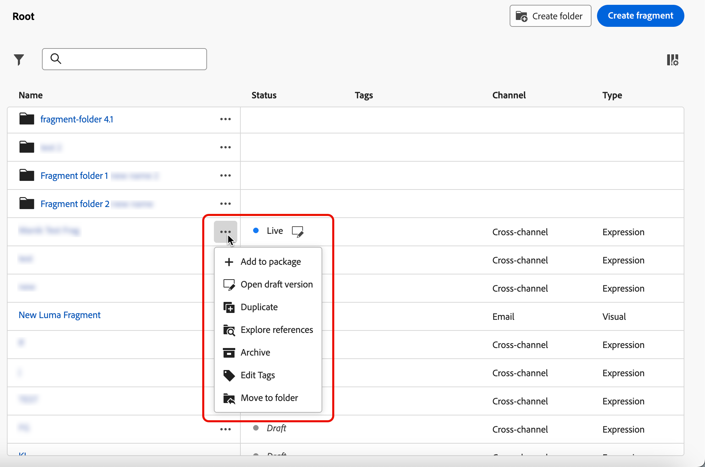

# Gerenciar fragmentos {#manage-fragments}

## Acessar fragmentos {#access-fragments}

Para gerenciar os fragmentos, acesse a lista de fragmentos do menu esquerdo **[!UICONTROL Gerenciamento de conteúdo]** > **[!UICONTROL Fragmentos]**.

Todos os fragmentos criados na sandbox atual - [no menu **[!UICONTROL Fragmentos]**](#create-fragments), usando a opção [Salvar como fragmento](#save-as-fragment) - são exibidos.

O painel à esquerda permite organizar fragmentos em pastas. Por padrão, todos os fragmentos são exibidos. Ao selecionar uma pasta, somente os fragmentos e as pastas incluídos na pasta selecionada são exibidos. [Saiba mais](#folders)

Para localizar um item específico, comece digitando um nome no campo de pesquisa. Quando uma [pasta](#folders) é selecionada, a pesquisa se aplica a todos os fragmentos ou pastas no primeiro nível de hierarquia dessa pasta<!--(not nested items)-->.

Você pode filtrar fragmentos em:

* Status (Rascunho ou Ativo)
* Tipo (visual ou expressão)
* Data de criação ou modificação
* Estado (arquivado ou não)
* Tags

{width="90%" align="left"}

Você também pode optar por mostrar todos os fragmentos ou somente os itens que o usuário atual criou ou modificou.

No botão **[!UICONTROL Mais ações]** ao lado de cada fragmento, é possível:

* Adicione-o a um pacote para exportação. [Saiba mais](#export)
* Se um fragmento em tempo real estiver sendo editado, abra a versão de rascunho desse fragmento. [Saiba mais](#edit-fragments)
* Duplique o fragmento.
* Use a opção **[!UICONTROL Explorar referências]** para ver as jornadas, campanhas ou modelos em que é usado. [Saiba mais](#explore-references)
* Arquive o fragmento. [Saiba mais](#archive-fragments)
* Edite as tags do fragmento. [Saiba como trabalhar com marcas unificadas](../start/search-filter-categorize.md#tags)
* Mover o fragmento para uma pasta. [Saiba mais](#folders)

## Usar pastas para gerenciar fragmentos {#folders}

>[!CONTEXTUALHELP]
>id="ajo_fragments_folders"
>title="Organizar os fragmentos em pastas"
>abstract="Use pastas para categorizar e gerenciar os fragmentos de acordo com as necessidades da organização."

Para navegar facilmente pelos fragmentos, é possível usar pastas para organizá-los com mais eficiência em uma hierarquia estruturada. Isso permite categorizar e gerenciar os itens de acordo com as necessidades da organização.

1. Clique no botão **[!UICONTROL Todos os fragmentos]** para exibir todos os itens criados anteriormente sem o agrupamento de pastas.

1. Clique na pasta **[!UICONTROL Raiz]** para exibir todas as pastas criadas.

   >[!NOTE]
   >
   >Se ainda não tiver criado pastas, todos os fragmentos serão exibidos.

1. Clique em qualquer pasta dentro da pasta **[!UICONTROL Raiz]** para exibir seu conteúdo.

1. Ao clicar na pasta **[!UICONTROL Raiz]** ou em qualquer outra pasta, o botão **[!DNL Create folder]** é exibido. Selecione-o.

   

1. Digite um nome para a nova pasta e clique em **[!UICONTROL Salvar]**. A nova pasta é exibida na parte superior da lista de fragmentos dentro da pasta **[!UICONTROL Raiz]** ou dentro da pasta selecionada no momento.

1. Clique no botão **[!UICONTROL Mais ações]** para renomear ou excluir a pasta.

   

1. Usando o botão **[!UICONTROL Mais ações]**, você também pode mover o fragmento para outra pasta existente.

   <!---->

1. Agora é possível navegar até a pasta que acabou de criar. Cada novo fragmento que você [criar](create-fragments.md) daqui será salvo na pasta atual.

   

## Status dos fragmentos {#fragments-statuses}

>[!CONTEXTUALHELP]
>id="ajo_fragment_statuses"
>title="Novos status de fragmentos"
>abstract="Como os status **Rascunho** e **Ativo** foram introduzidos com a versão de junho do Journey Optimizer, todos os fragmentos criados antes desta versão têm o status **Rascunho**, mesmo se forem usados em uma jornada ou campanha. Ao fazer qualquer alteração nesses fragmentos, será necessário publicá-los para torná-los **Ativos** e propagar as alterações para as campanhas e jornadas associadas. Também é necessário criar uma nova versão da jornada/campanha e publicá-la.  A publicação requer a permissão de usuário <a href="https://experienceleague.adobe.com/pt-br/docs/journey-optimizer/using/access-control/privacy/ootb-product-profiles#content-library-manage">Fragmento de publicação</a>."
>additional-url="https://experienceleague.adobe.com/pt-br/docs/journey-optimizer/using/access-control/privacy/ootb-product-profiles#content-library-manager" text="Saiba mais sobre permissões de fragmentos de conteúdo"

Os fragmentos podem ter vários status:

* **[!UICONTROL Rascunho]**: O fragmento está sendo editado e não foi aprovado.

* **[!UICONTROL Live]**: o fragmento foi aprovado e está ativo. [Saiba como publicar um fragmento](../content-management/create-fragments.md#publish)

  Quando um fragmento em tempo real está sendo editado, um ícone específico ao lado do status é exibido. Clique nesse ícone para abrir a versão de rascunho do fragmento.

* **[!UICONTROL Publicação]**: o fragmento foi aprovado e está sendo publicado.
* **[!UICONTROL Arquivado]**: o fragmento foi arquivado. [Saiba como arquivar fragmentos](#archive-fragments)

>[!CAUTION]
>
>Como os status **Rascunho** e **Ativo** foram introduzidos com a versão de junho do Journey Optimizer, todos os fragmentos criados antes desta versão têm o status **Rascunho**, mesmo se forem usados em uma jornada ou campanha. Ao fazer qualquer alteração nesses fragmentos, será necessário publicá-los para torná-los **Ativos** e propagar as alterações para as campanhas e jornadas associadas. Também é necessário criar uma nova versão da jornada/campanha e publicá-la. A publicação requer a permissão de usuário [Publicar fragmento](../administration/ootb-product-profiles.md#content-library-manager).

## Editar um fragmento {#edit-fragments}

>[!CONTEXTUALHELP]
>id="ajo_fragments_update_campaigns"
>title="Atualização de fragmentos em campanhas"
>abstract="Esta campanha não será atualizada se você publicar alterações no fragmento. Ela requer que uma nova versão seja publicada para que a funcionalidade de atualização do fragmento seja compatível."

>[!CONTEXTUALHELP]
>id="ajo_fragments_update_journeys"
>title="Atualização de fragmentos em jornadas"
>abstract="Essa jornada não será atualizada se você publicar as alterações no fragmento. Ela requer que uma nova versão seja publicada para que a funcionalidade de atualização do fragmento seja compatível."

Para editar um fragmento, siga as etapas abaixo.

1. Clique no fragmento desejado na lista **[!UICONTROL Fragmentos]**. A tela de propriedades do fragmento é aberta com uma pré-visualização do conteúdo.

1. Você pode verificar a lista de jornadas, campanhas e modelos de conteúdo em que o fragmento está sendo usado no momento. Para fazer isso, selecione a opção **[!UICONTROL Explorar referências]** no botão de ação Mais. [Saiba mais](#explore-references)

1. Se o fragmento que está sendo editado tiver o status **[!UICONTROL Ativo]**, clique no botão **[!UICONTROL Modificar]** para criar uma versão de rascunho do fragmento. Clique em **[!UICONTROL Confirmar]**.

   {width="70%" align="left"}

   >[!NOTE]
   >
   >A versão atual do fragmento continuará ativa, até que você publique a nova versão atualizada.

1. Faça as alterações desejadas nos detalhes do fragmento, se necessário.

1. Para modificar o conteúdo do fragmento, clique no botão **[!UICONTROL Editar]** e atualize seu conteúdo da mesma maneira que faria ao criar um fragmento do zero. [Saiba como criar um fragmento](create-fragments.md#content)

   {width="70%" align="left"}

   >[!NOTE]
   >
   >Ao editar um fragmento publicado, você pode remover qualquer campo de personalização, mas não pode adicionar novos ao conteúdo do fragmento. Se quiser adicionar atributos personalizados, duplique o fragmento. [Saiba mais](#adding-new-attributes)

1. Quando as alterações estiverem prontas, salve-as e clique no botão **[!UICONTROL Publicar]** para ativar as modificações. [Saiba mais](create-fragments.md#publish)

Ao editar um fragmento, as alterações são propagadas automaticamente para todo o conteúdo usando esse fragmento, incluindo jornadas e campanhas ativas, exceto para conteúdo em que você interrompeu a herança do fragmento original.

>[!NOTE]
>
>Saiba como interromper a herança nas seções [Adicionar fragmentos visuais aos seus emails](../email/use-visual-fragments.md#break-inheritance) e [Aproveitar fragmentos de expressão](../personalization/use-expression-fragments.md#break-inheritance).

### Adicionar novos atributos a um fragmento ativo {#adding-new-attributes}

>[!WARNING]
>
>Não há suporte para a adição de novos [atributos personalizados](../personalization/personalization-build-expressions.md) a um fragmento ativo.

Depois que um fragmento é publicado, o conjunto de atributos personalizados ou contextuais é bloqueado para todas as campanhas e jornadas que fazem referência a ele.

Para incorporar atributos adicionais a um fragmento ativo, siga as etapas abaixo.

1. Duplique o fragmento existente usando o botão **[!UICONTROL Mais ações]**.

   {width="70%" align="left"}

1. Selecione o fragmento duplicado para abri-lo e clique no botão **[!UICONTROL Editar]**.

1. [Adicione os novos atributos desejados](../personalization/personalization-build-expressions.md#add) ao fragmento duplicado, como campos de personalização.

   {width="70%" align="left"}

1. Salve as alterações e publique o novo fragmento. [Saiba como](create-fragments.md#publish)

1. Atualize quaisquer campanhas ou jornadas para fazer referência ao fragmento atualizado em que os novos atributos foram adicionados.

   * [Saiba como usar fragmentos visuais](../email/use-visual-fragments.md)
   * [Saiba como usar fragmentos de expressão](../personalization/use-expression-fragments.md)

## Explorar referências {#explore-references}

Você pode exibir a lista de jornadas, campanhas e modelos de conteúdo que estão usando um fragmento no momento. Para fazer isso, selecione **[!UICONTROL Explorar referências]** no menu **[!UICONTROL Mais ações]**, na lista de fragmentos ou na tela de propriedades do fragmento.

{width="70%" align="left"}

Selecione uma guia para alternar entre jornadas, campanhas, modelos e fragmentos. Você pode ver o status e clicar em um nome a ser redirecionado para o item correspondente onde o fragmento é referenciado.

{width="70%" align="left"}

>[!NOTE]
>
>Se o fragmento for usado em uma jornada, campanha ou modelo que tenha um rótulo que o impeça de acessá-lo, você verá uma mensagem de alerta na parte superior da guia selecionada. [Saiba mais sobre o OLAC (Controle de Acesso em Nível de Objeto)](../administration/object-based-access.md)

## Arquivar fragmentos {#archive-fragments}

Você pode limpar a lista de fragmentos dos itens que não são mais relevantes para sua marca.

Para fazer isso, clique no botão **[!UICONTROL Mais ações]** ao lado do fragmento desejado e selecione **[!UICONTROL Arquivar]**. Ele desaparecerá da lista de fragmentos, o que impede que os usuários o usem em emails ou modelos futuros.

{width="70%" align="left"}

>[!NOTE]
>
>Se você arquivar um fragmento usado em um conteúdo, <!--it will remain in the email or template, but you won't be able to select it from the fragment list to edit it-->esse conteúdo não será afetado.

Para desarquivar um fragmento, filtre os itens **[!UICONTROL Arquivados]** e selecione **[!UICONTROL Desarquivar]** no menu **[!UICONTROL Mais ações]**. Agora ele pode ser acessado novamente na lista de fragmentos e pode ser usado em qualquer email ou modelo.

{width="70%" align="left"}

## Exportar fragmentos para outra sandbox {#export}

O Journey Optimizer permite copiar um fragmento de uma sandbox para outra. Por exemplo, você pode copiar um fragmento do ambiente de sandbox do Stage para a sandbox de produção.

O processo de cópia é realizado por meio de uma **exportação e importação de pacotes** entre as sandboxes de origem e destino. Informações detalhadas sobre como exportar objetos e importá-los para uma sandbox de destino estão disponíveis nesta seção: [Copiar objetos para outra sandbox](../configuration/copy-objects-to-sandbox.md).
