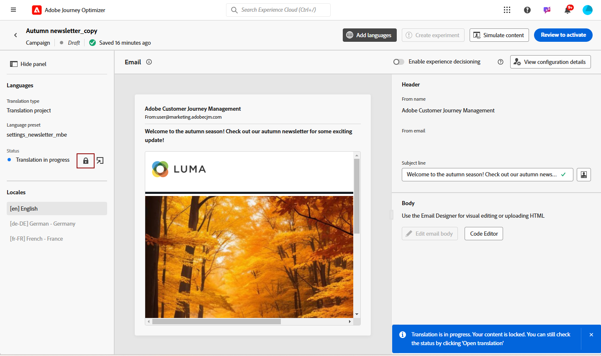
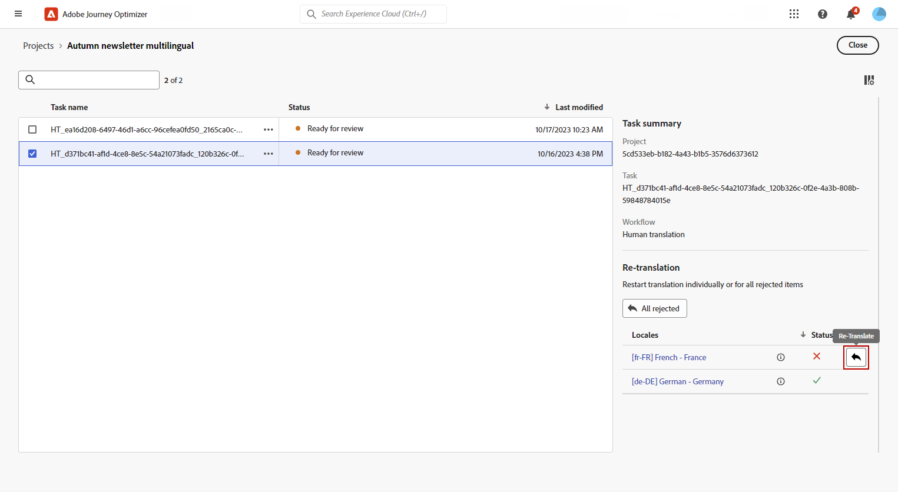

# Criação do conteúdo multilíngue com tradução automática {#multilingual-automated}

>[!CONTEXTUALHELP]
>id="ajo_multi_add_provider"
>title="Adicionar provedor"
>abstract="Adicione provedores de tradução e códigos de idiomas, conforme necessário. Isso permite gerenciar quais provedores e localidades estão ativos para o seu projeto, proporcionando a flexibilidade para ajustar recursos e direcionar públicos com base nos requisitos e no escopo do projeto atuais."

>[!CONTEXTUALHELP]
>id="ajo_multi_edit_provider"
>title="Editar provedor"
>abstract="Modifique os provedores de tradução existentes e adicione códigos de idiomas conforme necessário. Essa funcionalidade permite controlar quais provedores e localidades estão ativos para o seu projeto, oferecendo a flexibilidade de ajustar recursos e direcionar públicos-alvo específicos de acordo com suas necessidades e metas atuais do projeto."

>[!AVAILABILITY]
>
>No momento, o conteúdo multilíngue está disponível apenas para algumas organizações (disponibilidade limitada). Para obter acesso, entre em contato com o(a) representante da Adobe.

Usando o fluxo automatizado, você pode simplesmente selecionar o idioma de destino e o provedor de idioma. Seu conteúdo é então enviado diretamente para tradução, pronto para uma revisão final após a conclusão.

Siga estas etapas para criar conteúdo multilíngue usando a tradução automática:

1. [Crie sua localidade](#create-locale).

1. [Criar um projeto de idioma](#create-translation-project).

1. [Criar configurações de idioma](#create-language-settings).

1. [Criar um conteúdo multilíngue](#create-a-multilingual-campaign).

1. [Revise sua tarefa de tradução (opcional)](#review-translation-project).

## Criar localidade {#create-locale}

>[!CONTEXTUALHELP]
>id="ajo_multi_add_locale"
>title="Adicionar localidade"
>abstract="Ao configurar suas preferências de idioma, você tem a opção de criar locais adicionais se o desejado não estiver disponível para o seu conteúdo multilíngue."

Ao definir as configurações de idioma, conforme descrito na seção [Criar configurações de idioma](#language-settings), se uma localidade específica não estiver disponível para o seu conteúdo multilíngue, você terá a flexibilidade de criar quantas novas localidades forem necessárias usando o menu **[!UICONTROL Tradução]**.

1. No menu **[!UICONTROL Gestão de conteúdo]**, acesse **[!UICONTROL Tradução]**.

1. Na guia **[!UICONTROL Dicionário de localidade]**, clique em **[!UICONTROL Adicionar localidade]**.

   

1. Selecione o código de localidade na lista **[!UICONTROL Idioma]** e a **[!UICONTROL Região]** associada.

1. Clique em **[!UICONTROL Salvar]** para criar sua localidade.

   

## Criar projeto de tradução {#translation-project}

>[!CONTEXTUALHELP]
>id="ajo_multi_create_project"
>title="Criar projeto"
>abstract="Para começar a criar conteúdo multilíngue, inicie o projeto de tradução identificando o local de destino, selecionando o idioma ou dialeto regional apropriado para o público-alvo. Depois disso, escolha um provedor de tradução que se alinhe às necessidades do seu projeto."

>[!CONTEXTUALHELP]
>id="ajo_multi_edit_project"
>title="Editar Projeto"
>abstract="Atualize seu projeto de tradução para incorporar locais adicionais, permitindo expandir seu conteúdo para alcançar um público maior."

Inicie o projeto de tradução especificando o Local de destino, indicando o idioma ou a região específica para o conteúdo. Em seguida, você pode escolher seu Provedor de tradução.

1. No menu **[!UICONTROL Tradução]** em **[!UICONTROL Gerenciamento de conteúdo]**, clique em **[!UICONTROL Criar projeto]** na guia **[!UICONTROL Projetos]**.

   

1. Digite um **[!UICONTROL Nome]** e uma **[!UICONTROL Descrição]**.

1. Selecione a **[!UICONTROL localidade do Source]**.

   

1. Escolha se deseja ativar as seguintes opções:

   * **[!UICONTROL Publicar automaticamente traduções aprovadas]**: depois que as traduções são aprovadas, elas são integradas automaticamente à campanha sem a necessidade de intervenção manual.
   * **[!UICONTROL Habilitar Fluxo de trabalho de revisão]**: aplicável somente a localidades traduzidas por humanos. Isso permite que um revisor interno avalie e aprove ou rejeite com eficiência o conteúdo traduzido. [Saiba mais](#review-translation-project)

1. Clique em **[!UICONTROL Adicionar localidade]** para acessar o menu e definir os idiomas do projeto de tradução.

   Se uma **[!UICONTROL Localidade]** estiver ausente, você poderá criá-la manualmente com antecedência a partir do menu **[!UICONTROL Tradução]** ou por API. Consulte [Criar uma nova Localidade](#create-locale).

   

1. Selecione na lista sua(s) **[!UICONTROL localidade(s) de Destino]** e escolha qual **[!UICONTROL provedor de Tradução]** você deseja usar para cada localidade.

   As configurações do **[!UICONTROL Provedor de tradução]** podem ser acessadas no menu **[!UICONTROL Tradução]** da seção de menu **[!UICONTROL Administração]**.

   >[!NOTE]
   >
   >O gerenciamento de contratos com o Provedor de tradução está fora do escopo desse recurso. Verifique se você tem um contrato válido e ativo em vigor com o Parceiro de tradução designado.
   >
   > O Provedor de Tradução detém a propriedade da qualidade do conteúdo traduzido.

1. Clique em **[!UICONTROL Adicionar uma localidade]** quando terminar de vincular a localidade do Target ao provedor de Tradução correto. Em seguida, clique em **[!UICONTROL Salvar]**.

   Observe que se um provedor estiver esmaecido para um local de destino, isso indica que o provedor não oferece suporte a esse local específico.

   

1. Clique em **[!UICONTROL Salvar]** quando o projeto de tradução estiver configurado.

Seu projeto de tradução agora foi criado e pode ser usado em uma campanha multilíngue.

## Criar configurações de idioma {#language-settings}

Nesta seção, você pode definir o idioma principal e os locais associados para gerenciar o conteúdo multilíngue. Você também pode escolher o atributo que deseja usar para pesquisar informações relacionadas ao idioma do perfil.

1. No menu **[!UICONTROL Administração]**, acesse **[!UICONTROL Canal]** > **[!UICONTROL Configurações gerais]**.

1. No menu **[!UICONTROL Configurações de idioma]**, clique em **[!UICONTROL Criar configurações de idioma]**.

   

1. Digite o nome das **[!UICONTROL Configurações de idioma]**.

1. Escolha a opção **[!UICONTROL Projeto de tradução]**.

1. No campo **[!UICONTROL Projeto de tradução]**, clique em **[!UICONTROL Editar]** e escolha o **[!UICONTROL Projeto de tradução]** criado anteriormente.

   As Localidades configuradas anteriormente são importadas automaticamente.

   

1. No menu **[!UICONTROL Preferência de envio]**, selecione o atributo que você deseja pesquisar para encontrar informações sobre idiomas de perfil.

1. Clique em **[!UICONTROL Editar]** ao lado da **[!UICONTROL Localidade]** para personalizá-la ainda mais e adicionar **[!UICONTROL Preferências de perfil]**.

   

1. Se o seu **[!UICONTROL projeto de tradução]** for atualizado, clique em **[!UICONTROL Atualizar]** para refletir essas alterações nas suas **[!UICONTROL configurações de idioma]**.

   

1. Clique em **[!UICONTROL Enviar]** para criar suas **[!UICONTROL configurações de idioma]**.

<!--
1. Access the **[!UICONTROL channel configurations]** menu and create a new channel configuration or select an existing one.

1. In the **[!UICONTROL Header parameters]** section, select the **[!UICONTROL Enable multilingual]** option.

1. Select your **[!UICONTROL Locales dictionary]** and add as many as needed.
-->

## Criar um conteúdo multilíngue {#create-multilingual-campaign}

Depois de definir o projeto de Tradução e as configurações de Idioma, você estará pronto para criar a campanha ou jornada e personalizar o conteúdo para as diferentes localidades.

1. Comece criando e configurando sua [campanha](../campaigns/create-campaign.md) ou [jornada](../building-journeys/journeys-message.md) de email, SMS ou notificação por push de acordo com suas necessidades.

1. Depois que o conteúdo principal for criado, clique em **[!UICONTROL Salvar]** e volte para a tela de configuração da campanha.

1. Clique em **[!UICONTROL Adicionar idiomas]**.  [Saiba mais](#create-language-settings)

   

1. Selecione as **[!UICONTROL configurações de idioma]** criadas anteriormente.

   

1. Agora que suas Localidades foram importadas, clique em **[!UICONTROL Enviar para tradução]** para encaminhar seu conteúdo para o provedor de Tradução selecionado anteriormente.

   

1. Depois que o conteúdo é enviado para tradução, ele não pode mais ser editado. Para fazer alterações no conteúdo original, clique no ícone de bloqueio.

   Observe que, se quiser fazer alterações nesse conteúdo, será necessário criar um novo projeto de tradução e reenviá-lo para tradução.

   

1. Clique em **[!UICONTROL Abrir tradução]** para acessar seu projeto de tradução e revisá-lo.

   

1. Nesta página, siga o status do projeto de tradução:

   * **[!UICONTROL Tradução em andamento]**: seu provedor de serviços está trabalhando ativamente na tradução.

     Se você selecionou **Insourcing** ao definir suas **configurações de idioma**, será possível traduzir o conteúdo diretamente no projeto de Tradução. [Saiba mais](#manage-ht-project)

   * **[!UICONTROL Pronto para revisão]**: o processo de revisão está pronto para começar, fornecendo a capacidade de acessar a tradução e rejeitá-la ou aprová-la.

     Se você selecionou **[!UICONTROL Habilitar fluxo de trabalho de revisão]** em seu **[!UICONTROL projeto de Tradução]**, será possível revisar a tradução diretamente no Journey Optimizer após a conclusão pelo provedor de Tradução selecionado. [Saiba mais](#review-translation-project)

   * **[!UICONTROL Revisado]**: a tradução foi aprovada e está pronta para ser enviada à campanha.

   * **[!UICONTROL Pronto para publicar]**: a tradução automática foi concluída e agora pode ser enviada para a sua campanha.

   * **[!UICONTROL Concluído]**: a tradução agora está disponível em sua campanha.

   

1. Depois que a tradução for concluída, o conteúdo multilíngue estará pronto para ser enviado.

   

1. Clique em **[!UICONTROL Revisar para ativar]** para exibir um resumo da campanha.

   O resumo permite modificar a campanha, se necessário, e verificar se algum parâmetro está incorreto ou ausente.

1. Navegue pelo conteúdo multilíngue para ver a renderização em cada idioma.

   

1. Verifique se a campanha está configurada corretamente e clique em **[!UICONTROL Ativar]**.

Agora você pode ativar sua campanha ou jornada. Depois de enviado, você pode medir o impacto da sua jornada ou campanha multilíngue nos relatórios.

## Gerenciar projeto de tradução de Insourcing {#manage-ht-project}

>[!CONTEXTUALHELP]
>id="ajo_multi_insourcing_project"
>title="Insourcing de projeto de tradução"
>abstract="O projeto de tradução de terceirização permite gerenciar e executar traduções diretamente no seu projeto de tradução, simplificando o processo e mantendo maior controle sobre a qualidade e a consistência da tradução."

Se você selecionou Insourcing ao definir as configurações de idioma, é possível traduzir o conteúdo diretamente no projeto de tradução.

1. No seu **[!UICONTROL projeto de Tradução]**, acesse o menu **[!UICONTROL Mais ações]** e selecione **[!UICONTROL Insourcing]**.

   

1. Você pode exportar seu arquivo CSV para tradução usando um software de tradução externo. Como alternativa, você pode importar o arquivo CSV de volta para o projeto de tradução clicando no botão **[!UICONTROL Importar CSV]**.

   

1. Clique em **[!UICONTROL Editar]** para adicionar o conteúdo da tradução.

   

1. Se você estiver pronto para publicar o texto traduzido, clique em **[!UICONTROL Finalizar]**.

## Revisar o projeto de tradução {#review-translation-project}

>[!CONTEXTUALHELP]
>id="ajo_multi_review_project"
>title="Revisar o projeto de tradução"
>abstract="Depois que o provedor de tradução escolhido concluir a tradução, você poderá revisar os resultados diretamente no Journey Optimizer. Isso permite avaliar a precisão e a qualidade da tradução, garantindo que ela se alinhe às suas expectativas e aos requisitos do projeto antes de finalizá-la."

>[!CONTEXTUALHELP]
>id="ajo_multi_preview_project"
>title="Visualizar seu projeto de tradução"
>abstract="A janela Visualizar permite visualizar como o conteúdo traduzido aparece em cada idioma. Esse recurso ajuda a examinar a renderização e garantir que o conteúdo seja exibido corretamente e efetivamente em todos os idiomas selecionados."

Se você selecionou **[!UICONTROL Habilitar fluxo de trabalho de revisão]** em seu **[!UICONTROL projeto de Tradução]**, será possível revisar a tradução diretamente no Journey Optimizer após a conclusão pelo provedor de Tradução selecionado.

Observe que se essa opção estiver desabilitada, quando a tradução for concluída pelo seu provedor, o status da tarefa de tradução será automaticamente definido como **[!UICONTROL Revisado]**, permitindo que você continue rapidamente clicando em **[!UICONTROL Publish]**.

1. Assim que a tradução for concluída pelo seu provedor de serviços, você poderá acessar a tradução para revisão a partir do seu **[!UICONTROL Projeto de tradução]** ou diretamente da sua **[!UICONTROL Campanha]**.

   No menu **[!UICONTROL Mais ações]**, clique em **[!UICONTROL Revisão]**.

   

1. Na janela Revisar, navegue pelo conteúdo traduzido e aceite ou rejeite cada cadeia de caracteres de tradução.

   

1. Clique em **[!UICONTROL Editar]** para alterar o conteúdo da sua cadeia de caracteres de tradução.

   

1. Insira sua tradução atualizada e clique em **[!UICONTROL Confirmar]** quando terminar.

   

1. Você também pode optar por **[!UICONTROL Rejeitar tudo]** ou **[!UICONTROL Aprovar tudo]** diretamente.

   Ao selecionar **[!UICONTROL Rejeitar tudo]**, adicione um comentário e clique em **[!UICONTROL Rejeitar]**.

1. Clique em **[!UICONTROL Visualizar]** para verificar a renderização do conteúdo traduzido em cada idioma.

1. Se você estiver pronto para publicar o texto traduzido, clique em **[!UICONTROL Finalizar]**.

   

1. Em seu **[!UICONTROL projeto de tradução]**, selecione um dos projetos para acessar mais detalhes. Se você rejeitou a tradução, pode optar por enviá-la de volta para a tradução.

   

1. Depois que o status do **[!UICONTROL Projeto de tradução]** for definido como Revisado, você poderá enviá-lo para a sua Campanha.

   No menu **[!UICONTROL Mais ações]**, clique em **[!UICONTROL Publish]**.

   

1. Em sua Campanha, verifique se o status da tradução foi alterado para **[!UICONTROL Conclusão da tradução]**. Agora você pode enviar seu conteúdo multilíngue. Consulte a etapa 10 em [esta seção](#create-multilingual-campaign).

   

<!--
# Create a multilingual journey {#create-multilingual-journey}

1. Create your journey with a Delivery and personalize your content as needed.
1. From your delivery action, click Edit content.
1. Click Add languages.

-->
