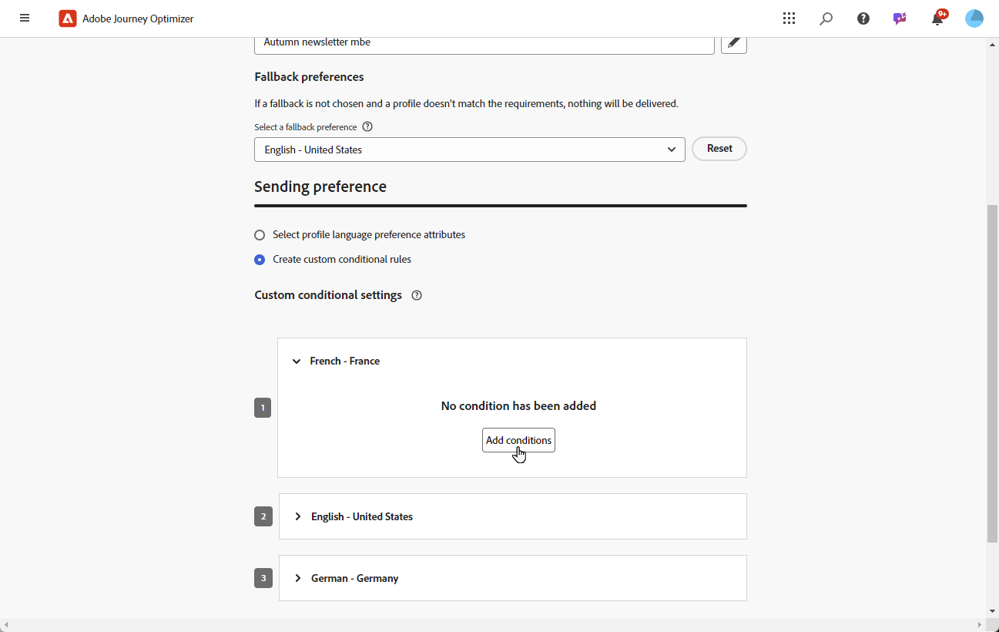

# Criação do conteúdo multilíngue com tradução automática {#multilingual-automated}

>[!AVAILABILITY]
>
>No momento, o conteúdo multilíngue está disponível apenas para algumas organizações (disponibilidade limitada). Para obter acesso, entre em contato com seu representante da Adobe.

Usando o fluxo automatizado, você pode simplesmente selecionar o idioma de destino e o provedor de idioma. Seu conteúdo é então enviado diretamente para tradução, pronto para uma revisão final após a conclusão.

Siga estas etapas para criar conteúdo multilíngue usando a tradução automática:

1. [Crie sua localidade](#create-locale).

1. [Criar um projeto de idioma](#create-translation-project).

1. [Criar configurações de idioma](#create-language-settings).

1. [Criar um conteúdo multilíngue](#create-a-multilingual-campaign).

1. [Revisar sua tarefa de tradução (opcional)](#review-translation-project).

## Criar localidade {#create-locale}

Ao definir as configurações de idioma, conforme descrito na seção [Criar suas configurações de idioma](#language-settings) seção, se um local específico não estiver disponível para seu conteúdo multilíngue, você terá a flexibilidade de criar quantos locais novos forem necessários usando o **[!UICONTROL Tradução]** menu.

1. No **[!UICONTROL Gestão de conteúdo]** menu, acesso **[!UICONTROL Tradução]**.

1. No **[!UICONTROL Dicionário de local]** clique em **[!UICONTROL Adicionar localidade]**.

   

1. Selecione o código de localidade na **[!UICONTROL Idioma]** e a lista associada **[!UICONTROL Região]**.

1. Clique em **[!UICONTROL Salvar]** para criar a sua localidade.

   

## Criar projeto de tradução {#translation-project}

Inicie o projeto de tradução especificando o Local de destino, indicando o idioma ou a região específica para o conteúdo. Em seguida, você pode escolher seu Provedor de tradução.

1. No **[!UICONTROL Tradução]** menu em **[!UICONTROL Gestão de conteúdo]**, clique em **[!UICONTROL Criar projeto]** no **[!UICONTROL Projetos]** guia.

   

1. Digitar um **[!UICONTROL Nome]** e **[!UICONTROL Descrição]**.

1. Selecione o **[!UICONTROL Localidade de origem]**.

   

1. Escolha se deseja ativar as seguintes opções:

   * **[!UICONTROL Publicar automaticamente traduções aprovadas]**: uma vez aprovadas, as traduções são integradas automaticamente à campanha, sem a necessidade de intervenção manual.
   * **[!UICONTROL Habilitar fluxo de trabalho de revisão]**: aplicável somente a locais traduzidos por humanos. Isso permite que um revisor interno avalie e aprove ou rejeite com eficiência o conteúdo traduzido. [Saiba mais](#review-translation-project)

1. Clique em **[!UICONTROL Adicionar localidade]** para acessar o menu e definir os idiomas do projeto de tradução.

   Se um **[!UICONTROL Localidade]** estiver ausente, você poderá criá-lo manualmente antes **[!UICONTROL Tradução]** ou por API. Consulte [Criar uma nova localidade](#create-locale).

   

1. Selecione na lista o seu **[!UICONTROL Localidade(s) de destino]** e escolher qual **[!UICONTROL Provedor de tradução]** que você deseja usar para cada local.

   **[!UICONTROL Provedor de tradução]** as configurações podem ser acessadas no **[!UICONTROL Tradução]** no menu **[!UICONTROL Administração]** seção de menu.

   >[!NOTE]
   >
   >O gerenciamento de contratos com o Provedor de tradução está fora do escopo desse recurso. Verifique se você tem um contrato válido e ativo em vigor com o Parceiro de tradução designado.
   >
   > O Provedor de tradução detém a propriedade da qualidade do conteúdo traduzido.

1. Clique em **[!UICONTROL Adicionar uma localidade]** quando você terminar de vincular o local do Target ao provedor de tradução correto. Em seguida, clique em **[!UICONTROL Salvar]**.

   Observe que se um provedor estiver esmaecido para um local de destino, isso indica que o provedor não oferece suporte a esse local específico.

   

1. Clique em **[!UICONTROL Salvar]** quando o projeto de tradução é configurado.

Seu projeto de tradução agora foi criado e pode ser usado em uma campanha multilíngue.

## Criar configurações de idioma {#language-settings}

Nesta seção, você pode definir o idioma principal e os locais associados para gerenciar o conteúdo multilíngue. Você também pode escolher o atributo que deseja usar para pesquisar informações relacionadas ao idioma do perfil.

1. No **[!UICONTROL Administração]** menu, acesso **[!UICONTROL Canal]**.

1. No **[!UICONTROL Configurações de idioma]** clique em **[!UICONTROL Criar configurações de idioma]**.

   

1. Digite o nome do seu **[!UICONTROL Configurações de idioma]**.

1. Escolha o **[!UICONTROL Projeto de tradução]** opção.

1. No **[!UICONTROL Projeto de tradução]** clique em **[!UICONTROL Editar]** e escolha o criado anteriormente **[!UICONTROL Projeto de tradução]**.

   As Localidades configuradas anteriormente são importadas automaticamente.

   

1. No **[!UICONTROL Preferência de envio]** selecione o atributo que deseja pesquisar para localizar informações sobre idiomas do perfil.

1. Clique em **[!UICONTROL Editar]** ao lado do seu **[!UICONTROL Localidade]** para personalizar ainda mais e adicionar **[!UICONTROL Preferências de perfil]**.

   

1. Se o seu **[!UICONTROL Projeto de tradução]** for atualizado, clique em **[!UICONTROL Atualizar]** para refletir essas alterações em seu **[!UICONTROL Configurações de idioma]**.

   

1. Clique em **[!UICONTROL Enviar]** para criar o **[!UICONTROL Configurações de idioma]**.

<!--
1. Access the **[!UICONTROL Channel surfaces]** menu and create a new channel surface or select an existing one.

1. In the **[!UICONTROL Header parameters]** section, select the **[!UICONTROL Enable multilingual]** option.

1. Select your **[!UICONTROL Locales dictionary]** and add as many as needed.
-->

## Criar um conteúdo multilíngue {#create-multilingual-campaign}

Depois de definir o projeto de Tradução e as configurações de Idioma, você estará pronto para criar a campanha ou jornada e personalizar o conteúdo para as diferentes localidades.

1. Comece criando e configurando seu email, SMS ou notificação por push [campaign](../campaigns/create-campaign.md) ou [jornada](../building-journeys/journeys-message.md) de acordo com suas necessidades.

1. Após criar o conteúdo principal, clique em **[!UICONTROL Salvar]** e volte para a tela de configuração do campaign.

1. Clique em **[!UICONTROL Adicionar idiomas]**.  [Saiba mais](#create-language-settings)

   

1. Selecione o criado anteriormente **[!UICONTROL Configurações de idioma]**.

   

1. Agora que suas Localidades foram importadas, clique em **[!UICONTROL Enviar para tradução]** para encaminhar seu conteúdo ao provedor de tradução selecionado anteriormente.

   

1. Depois que o conteúdo é enviado para tradução, ele não pode mais ser editado. Para fazer alterações no conteúdo original, clique no ícone de bloqueio.

   Observe que, se quiser fazer alterações nesse conteúdo, será necessário criar um novo projeto de tradução e reenviá-lo para tradução.

   

1. Clique em **[!UICONTROL Abrir tradução]** para acessar seu projeto de tradução e revisá-lo.

   

1. Nesta página, siga o status do projeto de tradução:

   * **[!UICONTROL Tradução em andamento]**: seu provedor de serviços está trabalhando ativamente na tradução.

     Se você selecionou a variável **Tradução interna** ao configurar seu **Configurações de idioma**, você pode traduzir o conteúdo diretamente no seu projeto de tradução. [Saiba mais](#manage-ht-project)

   * **[!UICONTROL Pronto para revisão]**: o processo de revisão está pronto para começar, fornecendo a capacidade de acessar a tradução e rejeitá-la ou aprová-la.

     Se você selecionou a variável **[!UICONTROL Habilitar fluxo de trabalho de revisão]** no seu **[!UICONTROL Projeto de tradução]**, você pode revisar a tradução diretamente no Journey Optimizer após a conclusão pelo provedor de tradução selecionado. [Saiba mais](#review-translation-project)

   * **[!UICONTROL Revisado]**: a tradução foi aprovada e pronta para ser publicada e enviada para a campanha.

   * **[!UICONTROL Pronto para publicar]**: a tradução automática foi concluída e agora pode ser enviada para a sua campanha.

   * **[!UICONTROL Concluído]**: a tradução agora está disponível em sua campanha.

   

1. Depois que a tradução for concluída, o conteúdo multilíngue estará pronto para ser enviado.

   

1. Clique em **[!UICONTROL Revisar para ativar]** para exibir um resumo da campanha.

   O resumo permite modificar a campanha, se necessário, e verificar se algum parâmetro está incorreto ou ausente.

1. Navegue pelo conteúdo multilíngue para ver a renderização em cada idioma.

   

1. Verifique se a campanha está configurada corretamente e clique em **[!UICONTROL Ativar]**.

Agora você pode ativar sua campanha ou jornada. Depois de enviado, você pode medir o impacto da sua jornada ou campanha multilíngue nos relatórios.

## Gerenciar projeto de tradução interno {#manage-ht-project}

Se você selecionou a tradução interna ao definir as configurações de idioma, é possível traduzir o conteúdo diretamente no projeto de tradução.

1. Do seu **[!UICONTROL Projeto de tradução]**, acesse o **[!UICONTROL Mais ações]** e selecione **[!UICONTROL Tradução interna]**.

   

1. Você pode exportar seu arquivo CSV para tradução usando um software de tradução externo. Como alternativa, você pode importar o arquivo CSV de volta para o projeto de tradução clicando no **[!UICONTROL Importar CSV]** botão.

   

1. Clique em **[!UICONTROL Editar]** para adicionar o conteúdo da tradução.

   

1. Se estiver pronto para publicar o texto traduzido, clique em **[!UICONTROL Finalizar]**.

## Revisar o projeto de tradução {#review-translation-project}

Se você selecionou a variável **[!UICONTROL Habilitar fluxo de trabalho de revisão]** no seu **[!UICONTROL Projeto de tradução]**, você pode revisar a tradução diretamente no Journey Optimizer após a conclusão pelo provedor de tradução selecionado.

Observe que se essa opção estiver desativada, depois que a tradução for concluída pelo provedor, o status da tarefa de tradução será automaticamente definido como **[!UICONTROL Revisado]**, permitindo que você continue rapidamente clicando em **[!UICONTROL Publish]**.

1. Depois que a tradução for concluída com o provedor de serviços, você poderá acessar a tradução para análise na **[!UICONTROL Projeto de tradução]** ou diretamente do seu **[!UICONTROL Campaign]**.

   No **[!UICONTROL Mais ações]** clique em **[!UICONTROL Revisão]**.

   

1. Na janela Revisar, navegue pelo conteúdo traduzido e aceite ou rejeite cada cadeia de caracteres de tradução.

   

1. Clique em **[!UICONTROL Editar]** para alterar o conteúdo da sua cadeia de caracteres de tradução.

   

1. Insira a tradução atualizada e clique em **[!UICONTROL Confirmar o]** quando terminar.

   

1. Você também pode optar por **[!UICONTROL Rejeitar tudo]** ou **[!UICONTROL Aprovar tudo]** diretamente.

   Ao selecionar **[!UICONTROL Rejeitar tudo]**, adicione um comentário e clique em **[!UICONTROL Rejeitar]**.

1. Clique em **[!UICONTROL Visualizar]** para verificar a renderização do conteúdo traduzido em cada idioma.

1. Se estiver pronto para publicar o texto traduzido, clique em **[!UICONTROL Finalizar]**.

   

1. Do seu **[!UICONTROL Projeto de tradução]**, selecione um dos projetos para acessar mais detalhes. Se você rejeitou a tradução, pode optar por enviá-la de volta para a tradução.

   

1. Uma vez que o **[!UICONTROL Projeto de tradução]** for definido como Reviewed, você poderá enviá-lo para o Campaign.

   No **[!UICONTROL Mais ações]** clique em **[!UICONTROL Publish]**.

   

1. Na Campanha, verifique se o status da tradução foi alterado para **[!UICONTROL Tradução concluída]**. Agora você pode enviar seu conteúdo multilíngue, consulte a etapa 10 em [nesta seção](#create-multilingual-campaign).

   

<!--
# Create a multilingual journey {#create-multilingual-journey}

1. Create your journey with a Delivery and personalize your content as needed.
1. From your delivery action, click Edit content.
1. Click Add languages.

-->
