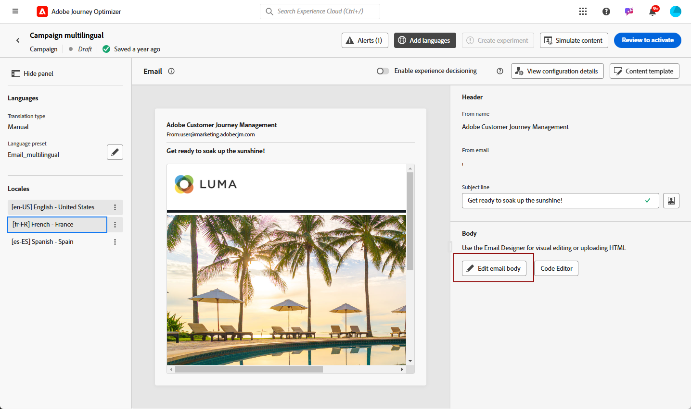

# Criar conteúdo multilíngue {#multilingual}

O recurso multilíngue permite criar conteúdo em vários idiomas facilmente em uma única campanha. Com esse recurso, você pode alternar entre idiomas ao editar sua campanha, simplificando todo o processo de edição e melhorando sua capacidade de gerenciar com eficiência o conteúdo multilíngue.

## Criar localidade {#create-locale}

Ao definir as configurações de idioma, conforme descrito na seção [Criar suas configurações de idioma](#language-settings) seção, se um local específico não estiver disponível para seu conteúdo multilíngue, você terá a flexibilidade de criar quantos locais novos forem necessários usando o **[!UICONTROL Tradução]** menu.

1. No **[!UICONTROL Administração]** menu, acesso **[!UICONTROL Canal]**.

   O menu traduções fornece acesso à lista de localidades ativadas.

1. No **[!UICONTROL Dicionário de local]** clique em **[!UICONTROL Adicionar localidade]**.

   

1. Selecione o código de localidade na **[!UICONTROL Idioma]** e a lista associada **[!UICONTROL Região]**.

1. Clique em **[!UICONTROL Salvar]** para criar a sua localidade.

   

## Criar configurações de idioma {#language-settings}

Nesta seção, você pode definir o idioma principal e os locais associados para gerenciar o conteúdo multilíngue. Você também pode escolher o atributo que deseja usar para pesquisar informações relacionadas ao idioma do perfil

1. No **[!UICONTROL Administração]** menu, acesso **[!UICONTROL Canal]**.

1. No **[!UICONTROL Configurações de idioma]** clique em **[!UICONTROL Criar configurações de idioma]**.

   

1. Digite o nome do seu **[!UICONTROL Configurações de idioma]**.

1. Selecione o **[!UICONTROL Localidades]** associado a essas configurações. É possível adicionar no máximo 50 localidades.

   Se um **[!UICONTROL Localidade]** estiver ausente, você poderá criá-lo manualmente antes **[!UICONTROL Tradução]** ou por API. Consulte [Criar uma nova localidade](#create-locale).

   

1. No **[!UICONTROL Preferência de envio]** selecione o atributo que deseja pesquisar para localizar informações sobre idiomas do perfil.

   

1. Clique em **[!UICONTROL Editar]** ao lado do seu **[!UICONTROL Localidade]** para personalizar ainda mais e adicionar **[!UICONTROL Preferências de perfil]**.

   

1. Selecionar outro **[!UICONTROL Localidades]** no menu suspenso Preferências de perfil e clique em **[!UICONTROL Adicionar perfis]**.

1. Acesse o menu avançado do **[!UICONTROL Localidade]** para definir o **[!UICONTROL Localidade principal]**, ou seja, o idioma padrão se o atributo de perfil não for especificado.

   Você também pode excluir seu local nesse menu avançado.

   

1. Clique em **[!UICONTROL Enviar]** para criar o **[!UICONTROL Configurações de idioma]**.

<!--
1. Access the **[!UICONTROL Channel surfaces]** menu and create a new channel surface or select an existing one.

1. In the **[!UICONTROL Header parameters]** section, select the **[!UICONTROL Enable multilingual]** option.

1. Select your **[!UICONTROL Locales dictionary]** and add as many as needed.
-->

## Criar uma campanha multilíngue {#create-multilingual-campaign}

1. Comece criando e configurando sua campanha de acordo com suas necessidades. [Saiba mais](../campaigns/create-campaign.md)

1. Navegue até a **[!UICONTROL Ações]** e selecione **[!UICONTROL Editar conteúdo]**.

   

1. Crie ou importe seu conteúdo original e personalize-o conforme necessário.

1. Após criar o conteúdo principal, clique em **[!UICONTROL Salvar]** e volte para a tela de configuração do campaign.

   

1. Clique em **[!UICONTROL Adicionar idiomas]** e selecione o criado anteriormente **[!UICONTROL Configurações de idioma]**. [Saiba mais](#create-language-settings)

   

1. Acesse as configurações avançadas do **[!UICONTROL Localidades]** e selecione **[!UICONTROL Copiar principal para todos os locais]**.

   

1. Agora que o conteúdo principal foi duplicado em todo o conteúdo selecionado  **[!UICONTROL Localidades]**, acesse cada local e clique em **[!UICONTROL Editar corpo do email]** para traduzir o conteúdo.

   

1. Você pode optar por desativar ou ativar códigos de idiomas com o **[!UICONTROL Mais ações]** do local selecionado.

   

1. Para desativar a configuração multilíngue, clique em **[!UICONTROL Adicionar idiomas]** e selecione o idioma que deseja manter como idioma local.

   

1. Clique em **[!UICONTROL Revisar para ativar]** para exibir um resumo da campanha.

   O resumo permite modificar a campanha, se necessário, e verificar se algum parâmetro está incorreto ou ausente.

1. Navegue pelo conteúdo multilíngue para ver a renderização em cada idioma.

   

1. Verifique se a campanha está configurada corretamente e clique em **[!UICONTROL Ativar]**.

Sua campanha agora está ativada. A mensagem configurada na campanha é enviada imediatamente ou na data especificada. Observe que assim que a Campanha estiver ativa, ela não poderá ser modificada. Para reutilizar o conteúdo, você pode duplicar sua Campanha.

Depois de enviado, você pode medir o impacto das campanhas nos relatórios de Campanha.

## Relatório de campanha multilíngue {#multilingual-campaign-report}

Relatórios globais, acessíveis pelo **O tempo todo** , exiba eventos que ocorreram há pelo menos duas horas e cubra eventos durante um período selecionado. O relatório global da campanha pode ser acessado diretamente do seu Campaign com o **[!UICONTROL Exibir relatório]** botão.

Para obter mais informações sobre dados disponíveis no relatório Campanha, consulte [esta página](../reports/campaign-global-report.md).

+++Saiba mais sobre as diferentes métricas e widgets disponíveis para seu conteúdo multilíngue.

A variável **[!UICONTROL Estatísticas de envio de email por idiomas]** detalhes do widget e o sucesso do seu delivery dependendo do seu **[!UICONTROL Localidades]**:

* **[!UICONTROL Entregue]**: Número de mensagens enviadas com êxito em relação ao número total de mensagens enviadas.

* **[!UICONTROL Rejeições]**: Total de erros acumulados durante o processamento de delivery e retorno automático em relação ao número total de mensagens enviadas.

* **[!UICONTROL Erros]**: Número total de erros que ocorreram durante um delivery impedindo que ele fosse enviado a perfis.

A variável **[!UICONTROL Estatísticas de rastreamento de email por idiomas]** O widget contém os dados disponíveis para a atividade do recipient para o seu delivery dependendo do **[!UICONTROL Localidades]**:

* **[!UICONTROL Cancelamentos de assinatura]**: Número de cliques no link unsubscription.

* **[!UICONTROL Aberturas]**: Número de vezes que a mensagem foi aberta.

* **[!UICONTROL Cliques]**: Número de vezes que um conteúdo foi clicado.
+++

<!--
# Create a multilingual journey {#create-multilingual-journey}

1. Create your journey with a Delivery and personalize your content as needed.
1. From your delivery action, click Edit content.
1. Click Add languages.

# Translation project/ Create translation project:

1. From the Translation projects menu, click Create project.
1. Type-in a Name and Description.
1. Select the Source locale.
1. Click Add language to access the menu and define the languages for your translation project.
1. Select from the list your Target locale(s) and choose which Translation provider you want to use.
1. Click Add language when you finished linking your Target locale with the correct Translation provider.
1. Click Save.
1. From the Advanced menu of your Translation project, you can choose to Edit, deactive or delete it.
-->
