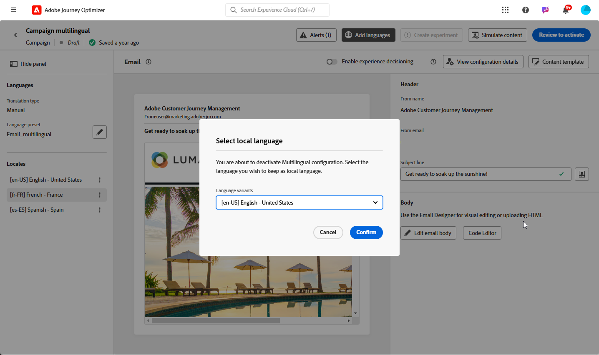

# Criação do conteúdo multilíngue com tradução manual {#multilingual-manual}

>[!IMPORTANT]
>
>Para o fluxo manual, os usuários precisam ter a permissão **[!UICONTROL Gerenciar configurações de idioma]**.

Usando o fluxo manual, você pode traduzir facilmente seu conteúdo diretamente em suas campanhas e jornadas, fornecendo opções precisas de controle e personalização para suas mensagens multilíngues. Além disso, você pode importar facilmente conteúdo multilíngue pré-existente com a opção Import HTML.

Siga estas etapas para criar conteúdo multilíngue usando tradução manual:

1. [Adicionar seu provedor (opcional)](multilingual-provider.md)

1. [Adicionar códigos de idiomas (opcional)](multilingual-locale.md)

1. [Criar configurações de idioma](#language-settings)

1. [Criar um conteúdo multilíngue](#create-multilingual-campaign)

## Criar configurações de idioma {#language-settings}

Nesta seção, você pode definir suas diferentes localidades para gerenciar o conteúdo multilíngue. Você também pode escolher o atributo que deseja usar para pesquisar informações relacionadas ao idioma do perfil

1. No menu **[!UICONTROL Administração]**, acesse **[!UICONTROL Canal]** > **[!UICONTROL Configurações gerais]**.

1. No menu **[!UICONTROL Configurações de idioma]**, clique em **[!UICONTROL Criar configurações de idioma]**.

   

1. Digite o nome das **[!UICONTROL Configurações de idioma]** e escolha **[!UICONTROL Tradução manual]**.

1. Selecione as **[!UICONTROL Localidades]** associadas a estas configurações. É possível adicionar no máximo 50 localidades.

   Se uma **[!UICONTROL Localidade]** estiver ausente, você poderá criá-la manualmente com antecedência a partir do menu **[!UICONTROL Tradução]** ou por API. Consulte [Criar uma nova Localidade](multilingual-locale.md).

   

1. Selecione uma **[!UICONTROL Preferências de fallback]** para definir uma opção de backup para quando um perfil não atender aos critérios necessários para a entrega de conteúdo.

   Observe que, se nenhuma opção de fallback for selecionada, a campanha ou a jornada não será enviada.

1. Escolha sua preferência de envio entre as seguintes opções:

   * **[!UICONTROL Selecionar atributos de preferência de idioma de perfil]**
   * **[!UICONTROL Criar regras condicionais personalizadas]**

1. Se você selecionar **[!UICONTROL Selecionar atributos de preferência de idioma de perfil]**, escolha o atributo relevante no menu **[!UICONTROL Atributos de preferência de idioma de perfil]** para pesquisar informações de idioma de perfil.

   

1. Se você selecionar **[!UICONTROL Criar regras condicionais personalizadas]**, selecione a localidade para a qual deseja criar condições. Em seguida, crie regras com base em fatores como localização do usuário, preferências de idioma ou outros elementos contextuais.

   

1. Comece a criar condições adicionando um atributo, evento ou público-alvo para definir seu grupo-alvo.

   >[!IMPORTANT]
   >
   >Os dados contextuais estão disponíveis exclusivamente para canais de cartões de Experiência e Conteúdo na Web, no aplicativo e com base em código. Se usada para canais de email, SMS, notificação por push ou correspondência direta, sem atributos adicionais, a campanha ou jornada será enviada no idioma da primeira opção na lista.

   

   +++Pré-requisitos para usar eventos contextuais em suas condições

   Quando os usuários exibem seu conteúdo, uma solicitação de personalização é enviada juntamente com o evento de experiência. Para aproveitar dados contextuais em suas condições, você deve anexar dados adicionais à carga da solicitação de personalização. Para fazer isso, é necessário criar uma regra na Coleção de dados do Adobe Experience Platform para especificar: SE uma solicitação de personalização for enviada, ANEXE dados extras à solicitação e defina o atributo para corresponder ao campo de idioma no esquema.

   >[!NOTE]
   >
   >Esses pré-requisitos são necessários apenas para os canais de cartões no aplicativo e de Conteúdo.

   1. Na Coleção de dados da Adobe Experience Platform, acesse o menu **[!UICONTROL Regras]** e crie uma nova regra. Informações detalhadas sobre como criar regras estão disponíveis na [!DNL Adobe Experience Platform] [Documentação da Coleção de Dados](https://experienceleague.adobe.com/en/docs/experience-platform/collection/e2e#create-a-rule){target="_blank"}

   2. Na seção **[!UICONTROL IF]** da regra, adicione um evento configurado conforme abaixo:

      

      * Escolha a **[!UICONTROL Extensão]** com a qual você está trabalhando.
      * No campo **[!UICONTROL Tipo de evento]**, selecione &quot;Evento de solicitação do AEP&quot;.
      * No painel direito, selecione &quot;Tipo de evento XDM é igual a personalization.request&quot;
      * Clique no botão **[!UICONTROL Manter alterações]** para confirmar.

   3. Na seção **[!UICONTROL THEN]** da regra, adicione uma ação configurada conforme abaixo:

      

      * Escolha a **[!UICONTROL Extensão]** com a qual você está trabalhando.
      * No campo **[!UICONTROL Tipo de ação]**, selecione &quot;Anexar dados&quot;.
      * Na seção de carga JSON, verifique se o atributo usado para recuperar o idioma a ser usado (no exemplo abaixo &quot;idioma&quot;) corresponde ao nome do atributo especificado no esquema para o qual a sequência de dados da coleção de dados está fluindo.

        ```JSON
        {
            "xdm":{
                "application":{
                    "_dc":{
                        "language":"{%%Language%%}"
                    }
                }
            }
        }
        ```

      * Clique no botão **[!UICONTROL Manter alterações]** para confirmar e salvar sua regra.

   +++

1. Arraste e solte as localidades para reordená-las e gerenciar sua prioridade na lista.

1. Para excluir um local, clique no ícone de compartimento.

   

1. Clique em **[!UICONTROL Enviar]** para criar suas **[!UICONTROL configurações de idioma]**.

Observe que, após configurar suas preferências de idioma, você não terá mais a opção de editá-las.

<!--
1. Access the **[!UICONTROL channel configurations]** menu and create a new channel configuration or select an existing one.


1. In the **[!UICONTROL Header parameters]** section, select the **[!UICONTROL Enable multilingual]** option.

1. Select your **[!UICONTROL Locales dictionary]** and add as many as needed.
-->

## Criar um conteúdo multilíngue {#create-multilingual-campaign}

Depois de configurar seu conteúdo multilíngue, você está pronto para criar a campanha ou jornada e personalizar o conteúdo para cada uma das localidades selecionadas.

1. Comece criando e configurando sua [campanha](../campaigns/create-campaign.md) ou [jornada](../building-journeys/journeys-message.md) de email, SMS ou notificação por push de acordo com suas necessidades.

   >[!IMPORTANT]
   >
   >Recomendamos incluir apenas um projeto de tradução por jornada.

1. Crie ou importe seu conteúdo original e personalize-o conforme necessário.

1. Depois que o conteúdo for criado, clique em **[!UICONTROL Salvar]** e volte para a tela de configuração da campanha.

   

1. Clique em **[!UICONTROL Adicionar idiomas]** e selecione as **[!UICONTROL configurações de idioma]** criadas anteriormente. [Saiba mais](#language-settings)

   

1. Escolha o local desejado no menu suspenso para aplicar ao conteúdo criado existente.

1. Acesse as configurações avançadas do menu **[!UICONTROL Localidades]** e selecione **[!UICONTROL Copiar para todas as localidades]**.

   

1. Agora que o conteúdo está duplicado em todas as **[!UICONTROL Localidades]** selecionadas, acesse cada localidade e clique em **[!UICONTROL Editar corpo de email]** para traduzir o conteúdo.

   

1. Você pode optar por desabilitar ou habilitar localidades com o menu **[!UICONTROL Mais ação]** da Localidade selecionada.

   

1. Para desativar sua configuração Multilíngue, clique em **[!UICONTROL Adicionar idiomas]** e selecione o idioma que deseja manter como idioma local.

   

1. Clique em **[!UICONTROL Revisar para ativar]** para exibir um resumo da campanha.

   O resumo permite modificar a campanha, se necessário, e verificar se algum parâmetro está incorreto ou ausente.

1. Navegue pelo conteúdo multilíngue para ver a renderização em cada idioma.

   

Agora você pode ativar sua campanha ou jornada. Depois de enviado, você pode medir o impacto da sua jornada ou campanha multilíngue nos relatórios.

>[!IMPORTANT]
>
> Se a campanha estiver sujeita a uma política de aprovação, será necessário solicitar aprovação para enviar a campanha ou jornada multilíngue. [Saiba mais](../test-approve/gs-approval.md)

<!--
# Create a multilingual journey {#create-multilingual-journey}

1. Create your journey with a Delivery and personalize your content as needed.
1. From your delivery action, click Edit content.
1. Click Add languages.

-->
