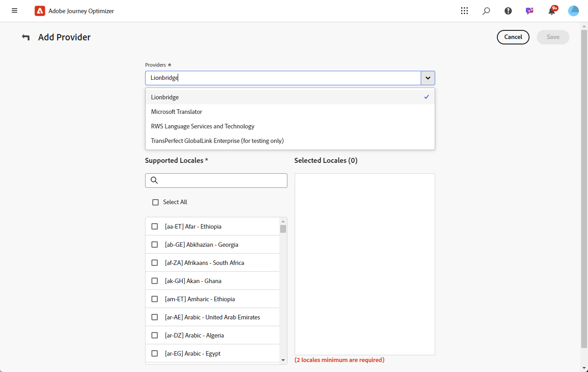
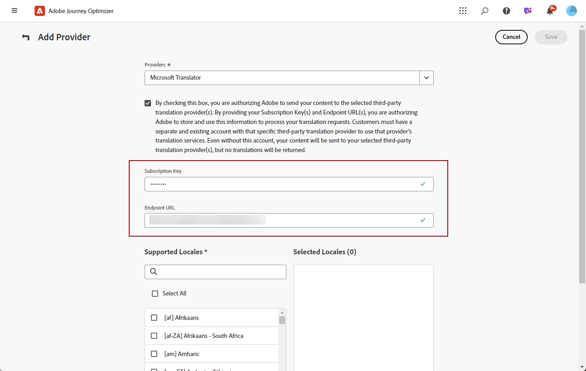
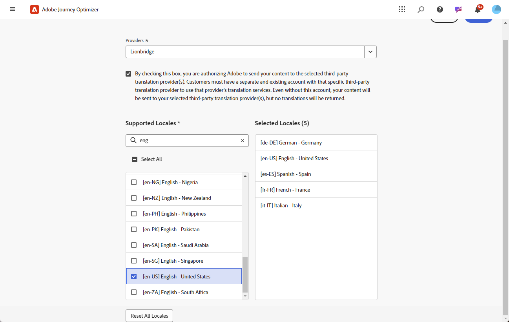

# Adicionar provedores de idioma {#multilingual-provider}

>[!BEGINSHADEBOX]

**Nesta página:** saiba como adicionar e configurar provedores de tradução de terceiros e suas localidades com suporte para que eles possam ser usados no seu conteúdo multilíngue.

>[!ENDSHADEBOX]

>[!IMPORTANT]
>
> O uso dos serviços de tradução de um Provedor de tradução está sujeito a termos e condições adicionais desse provedor aplicável. Como soluções de terceiros, os serviços de tradução estão disponíveis para usuários do Adobe Journey Optimizer por meio de uma integração. A Adobe não controla e não se responsabiliza por produtos de terceiros.

O Adobe Journey Optimizer integra-se a provedores de tradução de terceiros que oferecem serviços de tradução automática e humana, independentemente do Adobe Journey Optimizer.

Antes de adicionar o Provedor de tradução escolhido, verifique se você criou uma conta com o respectivo provedor.

1. No menu **[!UICONTROL Gerenciamento de conteúdo]**, navegue até **[!UICONTROL Tradução]**.

1. Acesse a guia **[!UICONTROL Provedores]** e clique em **[!UICONTROL Adicionar Provedor]**.

   

1. Na lista suspensa **[!UICONTROL Provedores]**, escolha o provedor desejado.

   >[!NOTE]
   >
   >Para adicionar um novo **Provedor** à lista, você pode pedir ao seu **Provedor** para seguir as instruções detalhadas em [este documento](https://developer.adobe.com/gcs/partner) para concluir o processo de integração.

   

1. Se estiver usando o Microsoft Translator como provedor, insira sua **[!UICONTROL Chave de Assinatura]** e a **[!UICONTROL URL do Ponto de Extremidade]**.

   Clique em **[!UICONTROL Validar credenciais]** para testar a conexão.

   

1. Selecione as **Localidades com Suporte** aplicáveis.

   

1. Após concluir a configuração, clique em **[!UICONTROL Salvar]** para finalizar a instalação.
