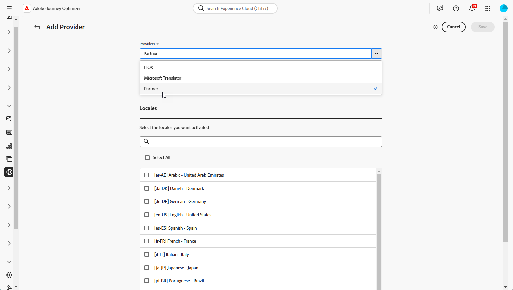

# Adicionar provedores de idioma {#multilingual-provider}

>[!IMPORTANT]
>
> O uso dos serviços de tradução de um Provedor de tradução está sujeito a termos e condições adicionais desse provedor aplicável. Como soluções de terceiros, os serviços de tradução estão disponíveis para usuários do Adobe Journey Optimizer por meio de uma integração. A Adobe não controla e não é responsável por produtos de terceiros.

O Adobe Journey Optimizer integra-se a provedores de tradução de terceiros que oferecem serviços de tradução automática e humana, independentemente do Adobe Journey Optimizer.

Antes de adicionar o Provedor de tradução escolhido, verifique se você criou uma conta com o respectivo provedor.

1. No menu **[!UICONTROL Gerenciamento de conteúdo]**, navegue até **[!UICONTROL Tradução]**.

1. Acesse a guia **[!UICONTROL Provedores]** e clique em **[!UICONTROL Adicionar Provedor]**.

   

1. Na lista suspensa **[!UICONTROL Provedores]**, escolha o provedor desejado.

   

1. Se estiver usando o Microsoft Translator como provedor, insira sua **[!UICONTROL Chave de Assinatura]** e a **[!UICONTROL URL do Ponto de Extremidade]**.

   

1. Selecione as **Localidades com Suporte** aplicáveis.

   

1. Após concluir a configuração, clique em **[!UICONTROL Salvar]** para finalizar a instalação.

