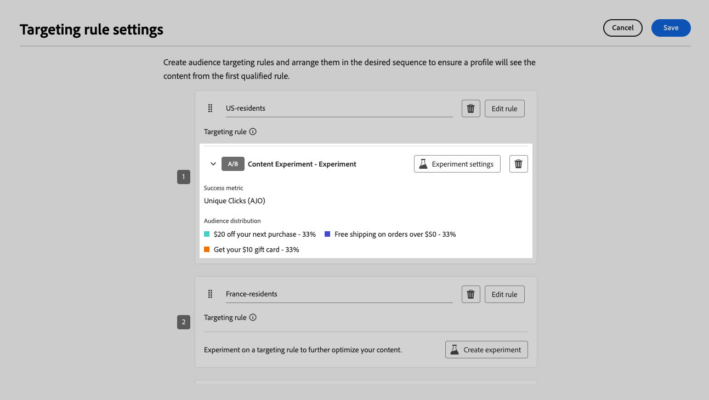

# Combinar direcionamento e experimentação {#combination}

O Journey Optimizer também permite combinar direcionamento e experimentos em uma única jornada ou campanha para criar estratégias mais sofisticadas.

Na verdade, você pode usar o direcionamento para criar várias variantes e, para cada variante, usar a experimentação para otimizar ainda mais cada conteúdo. Isso garante que os experimentos sejam específicos para cada regra de direcionamento e não se estendam entre variantes.

Por exemplo, você pode testar uma &quot;promoção com 50% de desconto&quot; em comparação com um &quot;cartão-presente de 50 dólares&quot; para clientes nos EUA e executar um teste diferente para clientes na Europa, como &quot;frete gratuito em pedidos acima de 50 euros&quot; em comparação com &quot;20% de desconto em sua próxima compra&quot;.

Para combinar o direcionamento e os experimentos em uma jornada ou campanha, siga as etapas abaixo.

1. Crie uma jornada ou campanha onde você define várias regras de direcionamento. [Saiba como](optimization-targeting.md)

   {width=85%}

1. Crie um experimento para a primeira regra de direcionamento.

1. Projete e configure seu experimento de conteúdo conforme desejado. [Saiba como](../content-management/content-experiment.md)

   {width=85%}

   Depois que a experimentação é definida, ela se aplica somente à primeira regra de direcionamento.

1. De volta à guia **[!UICONTROL Ações]**, selecione **[!UICONTROL Editar conteúdo]**.

1. Para o grupo definido pela primeira regra de direcionamento, é possível definir um conteúdo específico para cada variante do experimento.

   Se você adicionou mais de uma ação de entrada à jornada ou campanha, a mesma combinação de direcionamento e experimento se aplica a cada ação. No entanto, é necessário definir um conteúdo específico para cada variante de cada ação.

   {width=85%}

1. Continue de forma semelhante nas outras regras de direcionamento e projete o conteúdo correspondente para cada variante.

1. Salve as alterações e [ative](../campaigns/review-activate-campaign.md) sua jornada ou campanha.

Quando a jornada/campanha estiver ativa, os usuários de cada grupo direcionado receberão aleatoriamente as diferentes variações de conteúdo definidas para o grupo ao qual pertencem.

<!--
## Reporting on Message optimization

E.g. explaining how a marketer can look at the report to determine which treatment (e.g. which message content) is performing the best for the targeting audience
-->
