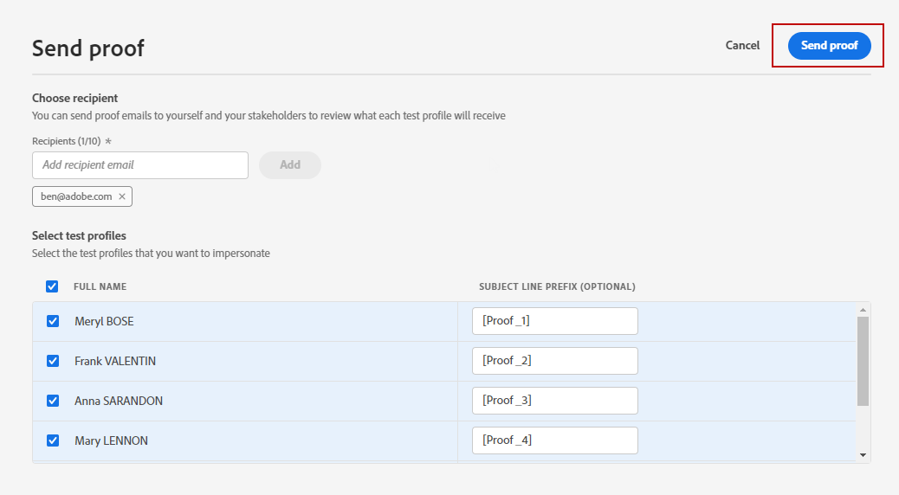

# Enviar provas usando dados de perfis de teste {#send-proofs}

>[!BEGINSHADEBOX]

**Nesta página:** saiba como enviar provas de email usando dados de perfil de teste para que os destinatários possam revisar a renderização, o conteúdo e a personalização antes que a mensagem vá para o público principal.

>[!ENDSHADEBOX]

Uma prova é uma mensagem específica que permite testar uma mensagem antes de enviá-la ao público-alvo principal. Os destinatários da prova são responsáveis pela aprovação da mensagem: renderização, conteúdo, configurações de personalização, configuração.

É possível enviar provas usando qualquer um dos métodos de simulação:

* Clique em **[!UICONTROL Simular conteúdo]** e selecione **[!UICONTROL Simular conteúdo (perfis do AEP)]** na lista suspensa para enviar provas com perfis de teste.
* Clique em **[!UICONTROL Simular conteúdo]** para enviar provas das variações de conteúdo criadas com dados de entrada de exemplo ou geração automática de IA. [Saiba como simular variações de conteúdo](../test-approve/simulate-sample-input.md#proofs)

## Leitura obrigatória {#must-read}

**Regras de limite de frequência** - Todas as regras de limite de frequência existentes se aplicam a provas. Se você definiu [regras de limite de frequência](../conflict-prioritization/channel-capping.md) (por exemplo, máximo de envios por perfil), esses limites também se aplicam ao envio de provas. Se um perfil de teste já tiver atingido o limite de frequência, as provas serão exibidas como concluídas, mas nenhum email será entregue. Para testes repetidos, considere usar perfis de teste exclusivos ou ajustar limites de frequência para cenários de prova, conforme necessário.

**Mirror page** - Na prova enviada, o link para a mirror page não está ativo. Ele só é ativado nas mensagens finais.

**Assets** - Assets e imagens têm regras de acessibilidade específicas:

* O Assets/Images pode ser acessado em conteúdo entregue ou conteúdo de prova por até 2 anos (730 dias) desde sua primeira publicação em qualquer fragmento/mensagem em linha.
* A republicação é necessária após esse período de expiração (a qualquer momento após 730 dias) para mantê-las acessíveis por mais 2 anos.
* Qualquer republicação feita dentro de 730 dias da primeira publicação não estenderá a expiração de ativos/imagens para os próximos 730 dias.

## Enviar provas {#send-proofs-steps}

Para enviar provas por email usando dados de perfis de teste, primeiro selecione [perfis de teste](test-profiles.md). Em seguida, siga estas etapas:

1. Na tela **[!UICONTROL Simular]**, clique no botão **[!UICONTROL Enviar prova]**.

   

1. Na janela **[!UICONTROL Enviar prova]**, digite o email do destinatário e clique em **[!UICONTROL Adicionar]** para enviar a prova para você mesmo ou para os membros de sua organização.

   Observe que você pode adicionar até dez recipients para o delivery de prova.

   

1. Selecione os **Perfis de teste** a serem usados para personalizar o conteúdo da mensagem.

   Cada recipient da prova recebe tantas mensagens quanto o número de perfis de teste selecionados. Por exemplo, se você adicionou cinco emails de recipients e selecionou dez perfis de teste, enviará cinquenta mensagens de prova. Cada recipient receberá dez deles.

1. Você pode adicionar um prefixo à linha de assunto da prova, se necessário. Somente caracteres alfanuméricos e caracteres especiais como . - _ ( ) [ ] são permitidos como prefixo da linha de assunto.

1. Clique em **[!UICONTROL Enviar prova]**.

   

1. De volta à tela **[!UICONTROL Simular]**, clique no botão **[!UICONTROL Exibir provas]** para verificar o status.

   

É recomendável enviar provas após cada modificação no conteúdo da mensagem.
