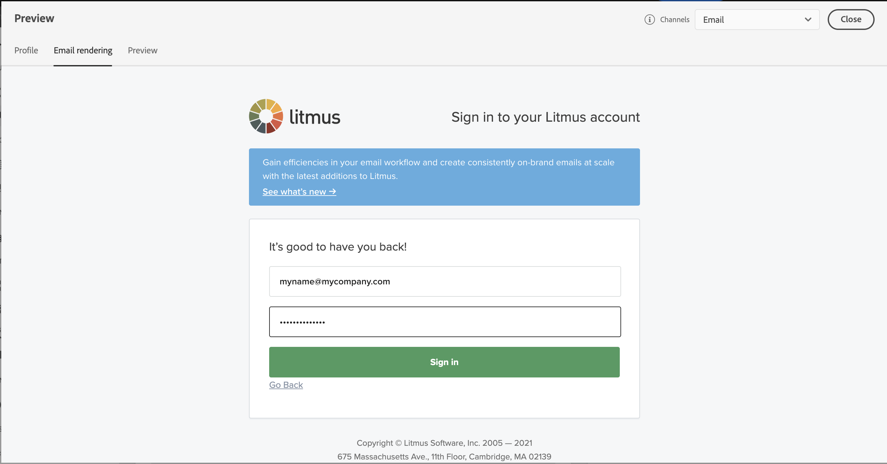
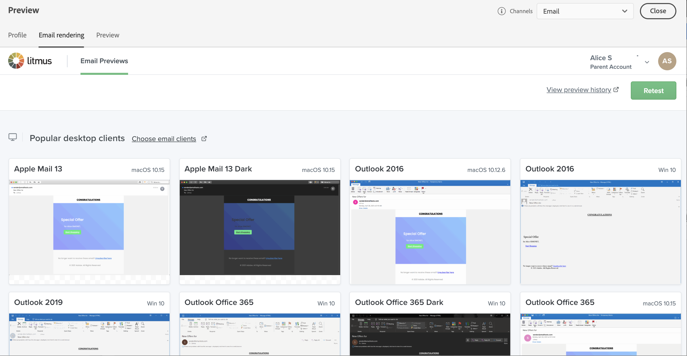

# Testar o e-mail rendering {#email-rendering}

Você pode aproveitar sua conta do **Litmus** no [!DNL Journey Optimizer] para visualizar instantaneamente sua **renderização de email** em clientes de email populares. Em seguida, você pode garantir que seu conteúdo de email tenha uma ótima aparência e funcione corretamente em cada caixa de entrada.

Para verificar a renderização de email, siga estas etapas:

1. Na tela de edição de conteúdo da sua mensagem ou no Designer de Email, clique no botão **[!UICONTROL Simular conteúdo]**.

1. Selecione o botão **[!UICONTROL Renderizar email]**.

   

1. Clique em **Conectar sua conta Litmus** na seção superior direita.

   

1. Insira suas credenciais e faça logon.

   

1. Clique no botão **Executar teste** para gerar visualizações de email.

1. Verifique seu conteúdo de email em clientes populares de desktop, móveis e baseados na Web.

   

>[!CAUTION]
>
>Ao conectar sua conta do **Litmus** com o [!DNL Journey Optimizer], você concorda que as mensagens de teste são enviadas para Litmus: uma vez enviadas, esses emails não serão mais gerenciados pelo Adobe. Como consequência, a política de retenção de dados do Litmus se aplica a esses emails, incluindo dados de personalização que podem ser incluídos nessas mensagens de teste.
