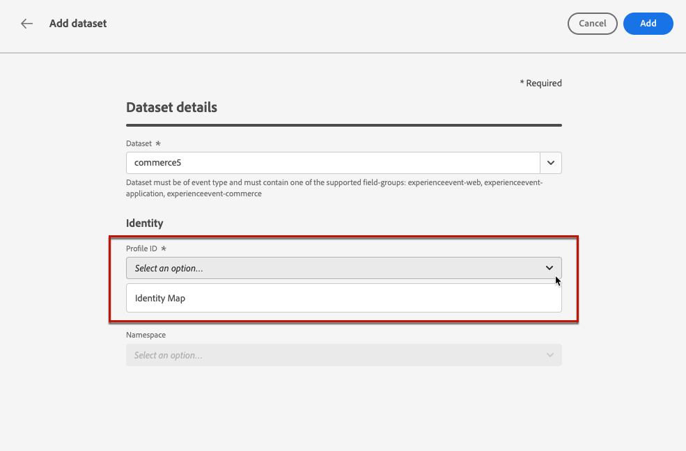
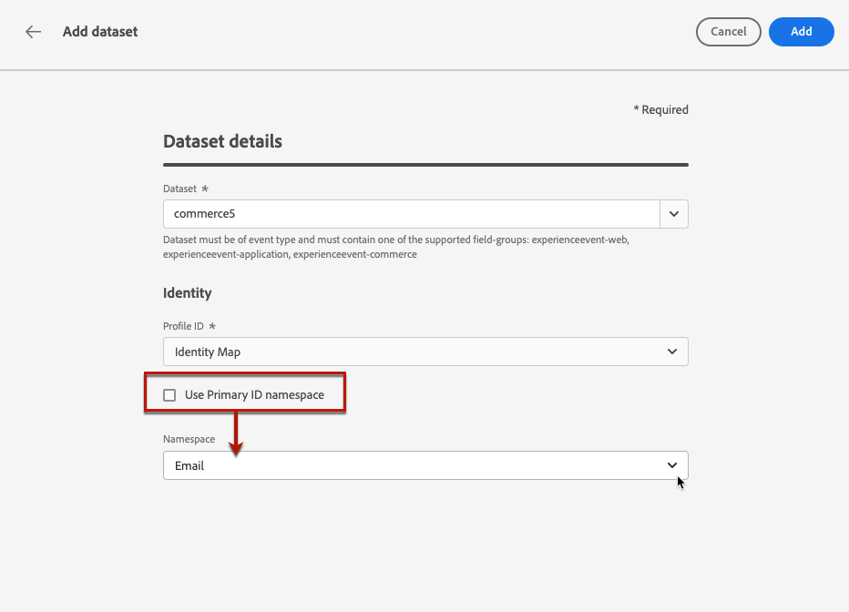

# Configurar relatórios para experimentos {#reporting-configuration}

>[!CONTEXTUALHELP]
>id="ajo_admin_reporting_config"
>title="Configurar conjuntos de dados para relatórios"
>abstract="A configuração de relatórios permite recuperar métricas adicionais que serão usadas nos relatórios de campanha. Ela deve ser feita por um usuário técnico."

>[!CONTEXTUALHELP]
>id="ajo_admin_reporting_dataset"
>title="Selecionar um conjunto de dados"
>abstract="Você só pode selecionar um conjunto de dados do tipo evento, que deve conter pelo menos um dos grupos de campos compatíveis: Detalhes do aplicativo, Detalhes do comércio, Detalhes da Web."

A configuração da fonte de dados de relatórios permite definir uma conexão com um sistema para recuperar informações adicionais que serão usadas em seus relatórios.

<!--The reporting data source configuration allows you to retrieve additional metrics that will be used in the **[!UICONTROL Objectives]** tab of your campaign reports.-->

>[!NOTE]
>
>A configuração de relatórios deve ser executada por um usuário técnico. <!--Rights?-->

Para essa configuração, é necessário adicionar um ou mais conjuntos de dados que contenham os elementos adicionais que você deseja usar em seus relatórios. Para fazer isso, siga as etapas [abaixo](#add-datasets).

<!--
➡️ [Discover this feature in video](#video)
-->

## Pré-requisitos

Antes de poder adicionar um conjunto de dados à configuração de relatórios, você deve criar esse conjunto de dados. Saiba como na [Documentação do Adobe Experience Platform](https://experienceleague.adobe.com/docs/experience-platform/catalog/datasets/user-guide.html#create){target="_blank"}.

* Você só pode adicionar conjuntos de dados do tipo evento.

* Esses conjuntos de dados devem incluir a `Experience Event - Proposition Interactions` [grupo de campos](https://experienceleague.adobe.com/docs/experience-platform/xdm/tutorials/create-schema-ui.html?lang=pt-BR#field-group){target="_blank"}.

* Esses conjuntos de dados também podem conter um dos seguintes [grupos de campos](https://experienceleague.adobe.com/docs/experience-platform/xdm/tutorials/create-schema-ui.html?lang=pt-BR#field-group){target="_blank"}: `Application Details`, `Commerce Details`, `Web Details`.

  >[!NOTE]
  >
  >Outros grupos de campos também podem ser incluídos, mas somente os grupos de campos acima são compatíveis com os relatórios do Journey Optimizer no momento.

  Por exemplo, se você quiser saber o impacto de uma campanha de email nos dados de comércio, como compras ou pedidos, será necessário criar um conjunto de dados de evento de experiência com o `Commerce Details` grupo de campos.

  Da mesma forma, se quiser criar relatórios sobre interações móveis, será necessário criar um conjunto de dados de evento de experiência com o `Application Details` grupo de campos.

  <!--The metrics corresponding to each field group are listed [here](#objective-list).-->

* É possível adicionar esses grupos de campos a um ou vários esquemas que serão usados em um ou vários conjuntos de dados.

>[!NOTE]
>
>Saiba mais sobre esquemas XDM e grupos de campos no [Documentação de visão geral do sistema XDM](https://experienceleague.adobe.com/docs/experience-platform/xdm/home.html?lang=pt-BR){target="_blank"}.

<!--
## Objectives corresponding to each field group {#objective-list}

The table below shows which metrics will be added to the **[!UICONTROL Objectives]** tab of your campaign reports for each field group.

| Field group | Objectives |
|--- |--- |
| Commerce Details | Price Total Payment Amount (Unique) Checkouts (Unique) Product List Adds (Unique) Product List Opens (Unique) Product List Removal (Unique) Product List Views (Unique) Product Views (Unique) Purchases (Unique) Save For Laters Product Price Total Product Quantity |
| Application Details | (Unique) App Launches First App Launches (Unique) App Installs (Unique) App Upgrades |
| Web Details | (Unique) Page Views |
-->

## Adicionar conjuntos de dados {#add-datasets}

1. No **[!UICONTROL ADMINISTRAÇÃO]** selecione **[!UICONTROL Configurações]**. No  **[!UICONTROL Relatórios]** clique em **[!UICONTROL Gerenciar]**.

   

   A lista de conjuntos de dados que já foram adicionados é exibida.

1. No **[!UICONTROL Conjunto de dados]** clique em **[!UICONTROL Adicionar conjunto de dados]**.

   

   >[!NOTE]
   >
   >Se você selecionar a variável **[!UICONTROL Conjunto de dados do sistema]** , somente os conjuntos de dados criados pelo sistema serão exibidos. Não será possível adicionar outros conjuntos de dados.

1. No **[!UICONTROL Conjunto de dados]** selecione o conjunto de dados que deseja usar para seus relatórios.

   >[!CAUTION]
   >
   >Você só pode selecionar um conjunto de dados do tipo evento, o qual deve conter pelo menos um dos [grupos de campos](https://experienceleague.adobe.com/docs/experience-platform/xdm/tutorials/create-schema-ui.html?lang=pt-BR#field-group){target="_blank"}: **Detalhes do aplicativo**, **Detalhes do Commerce**, **Detalhes da Web**. Se você selecionar um conjunto de dados que não corresponda a esses critérios, não será possível salvar suas alterações.

   

   Saiba mais sobre conjuntos de dados na [Documentação do Adobe Experience Platform](https://experienceleague.adobe.com/docs/experience-platform/catalog/datasets/overview.html?lang=pt-BR){target="_blank"}.

1. No **[!UICONTROL ID do perfil]** , selecione o atributo de campo do conjunto de dados que será usado para identificar cada perfil em seus relatórios.

   

   >[!NOTE]
   >
   >Somente as IDs disponíveis para relatórios são exibidas.

1. A variável **[!UICONTROL Usar namespace da ID primária]** está ativada por padrão. Se a variável **[!UICONTROL ID do perfil]** é **[!UICONTROL Mapa de identidade]**, você pode desativar essa opção e escolher outro namespace na lista suspensa que será exibida.

   

   Saiba mais sobre namespaces na [Documentação do Adobe Experience Platform](https://experienceleague.adobe.com/docs/experience-platform/identity/namespaces.html?lang=pt-BR){target="_blank"}.

1. Salve as alterações para adicionar o conjunto de dados selecionado à lista de configuração de relatórios.

   >[!CAUTION]
   >
   >Se você selecionou um conjunto de dados que não é do tipo evento, não será possível continuar.

Observe que, para canais na Web e no aplicativo, é necessário verificar se [conjunto de dados](../data/get-started-datasets.md) configurado para coleta de dados também é adicionado a essa configuração de relatório. Caso contrário, os dados na Web e no aplicativo não serão exibidos nos relatórios de experimento de conteúdo.

* Saiba mais sobre os pré-requisitos do experimento de conteúdo para o canal da Web no [nesta seção](../web/web-prerequisites.md#experiment-prerequisites).

* Saiba mais sobre Configuração do canal no aplicativo em [nesta seção](../in-app/inapp-configuration.md).

<!--
When building your campaign reports, you can now see the metrics corresponding to the field groups used in the datasets you added. Go to the **[!UICONTROL Objectives]** tab and select the metrics of your choice to better fine-tune your reports. [Learn more](content-experiment.md#objectives-global)

>[!NOTE]
>
>If you add several datasets, all data from all datasets will be available for reporting.

## How-to video {#video}

Understand how to configure Experience Platform reporting data sources.

>[!VIDEO]()
-->
