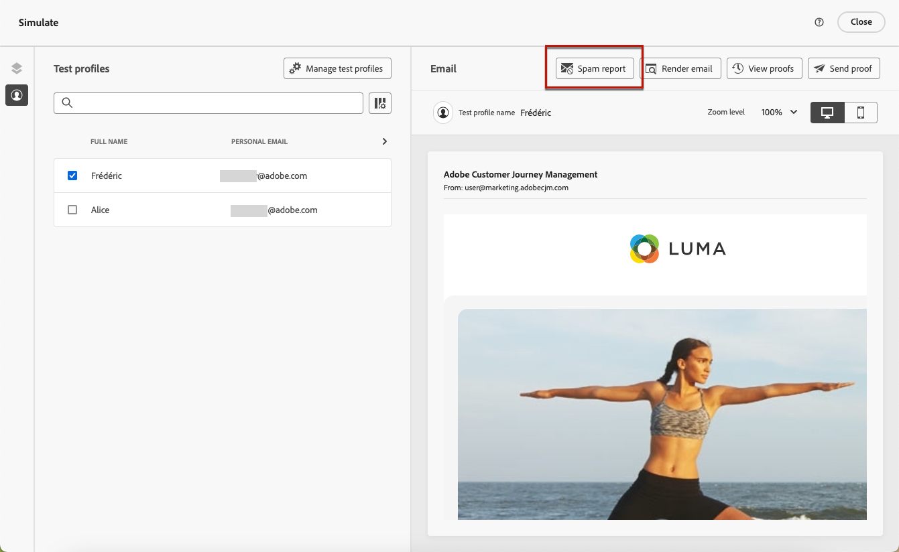

# Relatório de spam por email {#spam-report}

>[!CONTEXTUALHELP]
>id="ajo_simulate_spam_report"
>title="Relatório de spam por email"
>abstract="O relatório Spam permite verificar sua pontuação de spam no conteúdo de email. Essa pontuação indica se os ISPs ou provedores de caixa de correio considerarão sua mensagem como spam ou não. Quanto menor a pontuação, melhor. Se a pontuação do seu conteúdo de email for superior a 2, você deve considerar a correção de problemas que estão causando a falha dos testes."

Você pode verificar sua pontuação de spam no conteúdo de e-mail em um relatório dedicado de spam. Usar [SpamAssassin](https://spamassassin.apache.org/){target="_blank"}, o Adobe Journey Optimizer pode testar seu conteúdo de email e atribuir uma pontuação para indicar se os ISPs ou provedores de caixa de correio o considerarão como spam ou não.

>[!AVAILABILITY]
>
>No momento, esse recurso está na versão beta e só está disponível para clientes beta. Para participar do programa beta, entre em contato com o atendimento ao cliente da Adobe.

Ao editar ou visualizar seu conteúdo de email, a variável **[!UICONTROL Relatório de spam]** O botão fornece uma pontuação e conselhos para melhorar as pontuações de cada item individual listado.

Esse recurso permite determinar se uma mensagem pode ser considerada spam pelas ferramentas antisspam usadas no recebimento e tomar medidas, se for o caso. Muitos provedores de caixa de entrada de email usam ferramentas como parte de seu processo de filtragem de spam. O envio de emails com uma pontuação inválida pode afetar seriamente sua capacidade de entrega.

Para acessar o **[!UICONTROL Relatório de spam]**, siga as etapas abaixo.

1. No **[!UICONTROL Simular]** clique na guia **[!UICONTROL Relatório de spam]** botão.

   

<!--
    You can also open the [Email Designer](../email/content-from-scratch.md), click the **[!UICONTROL More]** button and select **[!UICONTROL Check spam score]** from the menu.

    
-->

1. Uma verificação antisspam é executada automaticamente e o **[!UICONTROL Relatório de spam]** exibe os resultados. Ele mostra como o conteúdo está se saindo em termos de layout de corpo, estrutura, tamanho da imagem, palavras de acionamento de spam, se houver, etc.

   

1. Verifique as pontuações e descrições de cada item.

   Quanto menor a pontuação, melhor. Se a pontuação for superior a 5, um aviso será exibido: indica que algumas mensagens podem ser bloqueadas ou marcadas como spam quando recebidas. A prática recomendada é ter uma pontuação inferior a 2.

1. Com base nessa pontuação, se você considerar que alguns elementos podem ser melhorados, edite o conteúdo na [Email Designer](../email/content-from-scratch.md) e faça as atualizações necessárias.

1. Quando as alterações forem concluídas, volte para a **[!UICONTROL Relatório de spam]** para garantir que sua pontuação tenha melhorado.

   

<!--You can also check the message's alerts for warnings on potential risk of spam detection. Follow the steps below.

1. Click the **[!UICONTROL Alerts]** button on top right of the screen. [Learn more on email alerts](../email/create-email.md#check-email-alerts)

1. If **[!UICONTROL Spam checker alert]** is displayed, you should check your content for a potential risk of spam using the **[!UICONTROL Spam report]** feature as detailed above.

    
-->
