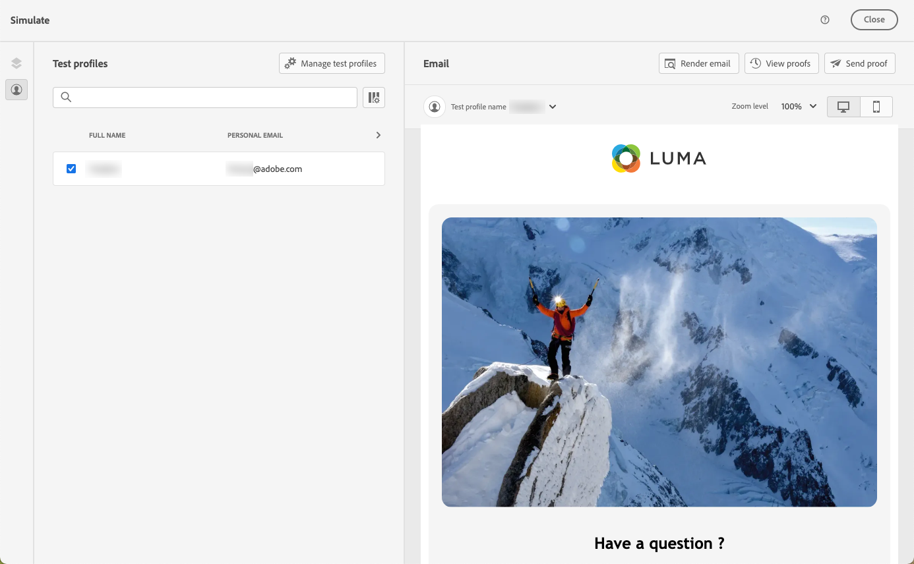
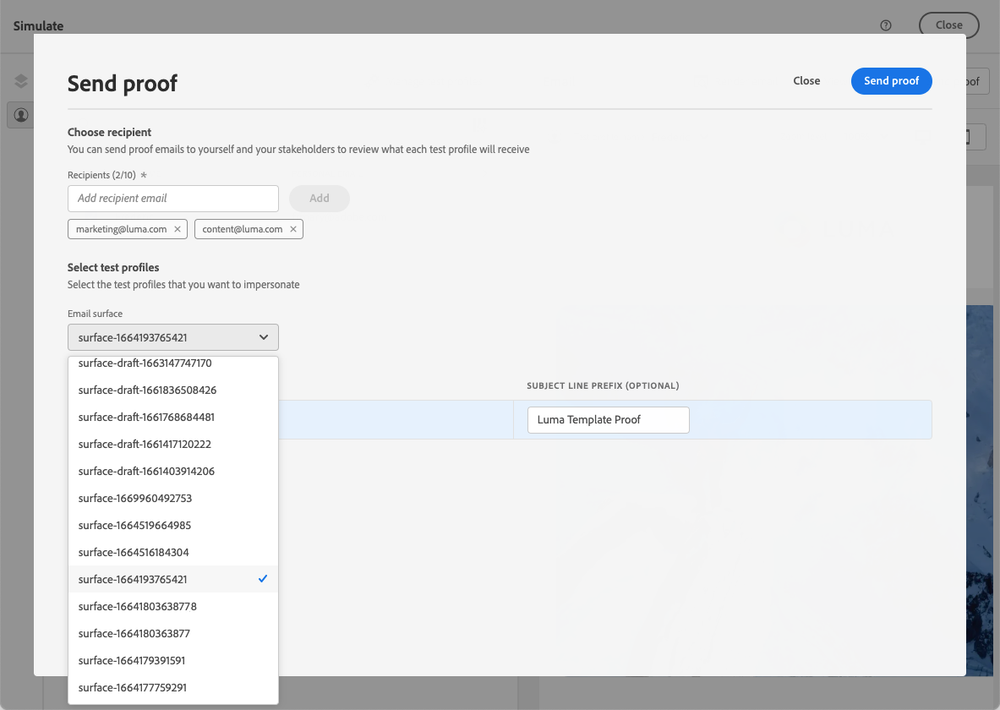

# Testar modelos de conteúdo de email {#test-template}

Você pode testar a renderização de alguns de seus modelos de email, sejam eles criados do zero ou de um conteúdo existente. Para isso, siga as etapas abaixo.

1. Acesse a lista de modelos de conteúdo por meio do menu **[!UICONTROL Gerenciamento de Conteúdo]** > **[!UICONTROL Modelos de Conteúdo]** e selecione qualquer modelo de email.

1. Clique em **[!UICONTROL Editar conteúdo]** das **[!UICONTROL Propriedades do modelo]**.

1. Clique em **[!UICONTROL Simular Conteúdo]** e selecione um perfil de teste para verificar sua renderização. [Saiba mais](../content-management/preview-test.md)

   

   >[!NOTE]
   >
   >O [!DNL Journey optimizer] também permite que você teste diferentes variantes de seus modelos de conteúdo visualizando-as e enviando provas usando dados de entrada de exemplo carregados de um arquivo CSV/JSON ou adicionados manualmente. [Saiba como simular variações de conteúdo](../test-approve/simulate-sample-input.md)

1. Você pode enviar uma prova para testar seu conteúdo e aprová-lo por alguns usuários internos antes de usá-lo em uma jornada ou campanha.

   * Para fazer isso, clique no botão **[!UICONTROL Enviar prova]** e siga as etapas descritas em [esta seção](../content-management/proofs.md).

   * Antes de enviar a prova, você deve selecionar a [configuração de email](../configuration/channel-surfaces.md) que será usada para testar seu conteúdo.

     

>[!CAUTION]
>
>Atualmente, o rastreamento não é compatível ao testar modelos de conteúdo de email, o que significa que o rastreamento de eventos, parâmetros UTM e links de página de aterrissagem não será eficaz nas provas que estão sendo enviadas de um modelo. Para testar o rastreamento, [use o modelo de conteúdo](../email/use-email-templates.md) em um email e envie uma prova usando perfis de teste, ou dados de entrada de amostra carregados de um arquivo CSV/JSON, ou adicionados manualmente. [Saiba como visualizar e testar seu conteúdo](../content-management/preview-test.md)
