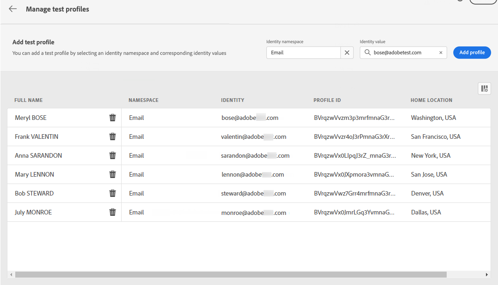

# Selecionar perfis de teste {#select-test-profiles}

>[!BEGINSHADEBOX]

**Nesta página:** Saiba como selecionar perfis de teste por namespace de identidade no Adobe Journey Optimizer para que você possa visualizar e testar seu conteúdo em relação a diferentes variantes de dados de perfil.

>[!ENDSHADEBOX]

>[!CONTEXTUALHELP]
>id="ajo_preview_test_profiles"
>title="Use perfis de teste para verificar o conteúdo"
>abstract="Use perfis de teste para visualizar e testar o conteúdo. Se você tiver adicionado campos personalizados, será possível verificar como eles são exibidos por meio de dados do perfil de teste."

Os perfis de teste são recipients adicionais que não correspondem aos critérios de direcionamento definidos. [Saiba como criar perfis de teste](../audience/creating-test-profiles.md)

Antes de selecionar perfis de teste, verifique se o namespace de identidade que você planeja usar corresponde ao namespace em que seus perfis de teste estão armazenados no Adobe Experience Platform (por exemplo, **Email** ou **Telefone**). Uma incompatibilidade impede que os perfis de teste sejam resolvidos corretamente no campo de pesquisa.

Antes de usar perfis de teste para testar seu conteúdo, primeiro é necessário selecioná-los. Para fazer isso, siga estes passos:

1. Na tela de edição de conteúdo da sua mensagem ou no Designer de email, clique em **[!UICONTROL Simular conteúdo]** e selecione **[!UICONTROL Simular conteúdo (perfis do AEP)]** na lista suspensa.

1. Clique no botão **[!UICONTROL Gerenciar perfis de teste]** e selecione o namespace a ser usado para identificar perfis de teste clicando no ícone de seleção **[!UICONTROL Namespace de identidade]**. [Saiba mais sobre os namespaces de identidade da Adobe Experience Platform](../audience/get-started-identity.md).

   No exemplo abaixo, usamos o namespace **Email**.

   

1. Use o campo de pesquisa para localizar o namespace, selecione-o e clique em **[!UICONTROL Selecionar]**

   

1. No campo **[!UICONTROL Valor de identidade]**, insira o valor (aqui o endereço de email) para identificar o perfil de teste e clique em **[!UICONTROL Adicionar perfil]**.

   <!---->

1. Se você adicionou personalização à mensagem, adicione outros perfis para testar diferentes variantes da mensagem, dependendo dos dados do perfil. Depois de adicionados, os perfis são listados nos campos selecionados.

   

   Com base nos elementos de personalização da mensagem, essa lista exibe dados para cada perfil de teste nas colunas relacionadas.

>[!NOTE]
>
>Além dos perfis de teste, o [!DNL Journey optimizer] também permite que você teste diferentes variantes do seu conteúdo visualizando-o e enviando provas usando dados de entrada de exemplo carregados de um arquivo CSV/JSON ou adicionados manualmente. [Saiba como simular variações de conteúdo](../test-approve/simulate-sample-input.md)
