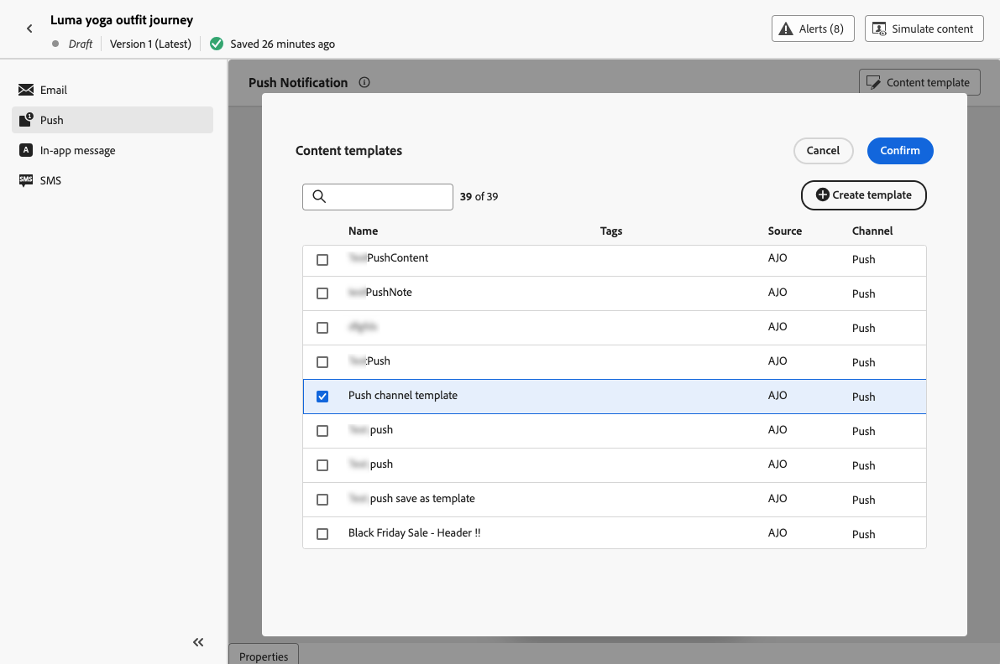

# Usar modelos de conteúdo {#use-content-templates}

Ao criar conteúdo para qualquer canal (exceto Web) no [!DNL Journey Optimizer], você pode usar um modelo personalizado para:

* Criado do zero usando o menu **[!UICONTROL Modelos de conteúdo]**. [Saiba mais](#create-template-from-scratch)

* Salvo de um conteúdo existente em uma jornada ou campanha usando a opção **[!UICONTROL Salvar como modelo de conteúdo]**. [Saiba mais](#save-as-template)

Para começar a criar o conteúdo com um desses modelos, siga as etapas abaixo.

1. Seja em uma campanha ou jornada, após selecionar **[!UICONTROL Editar conteúdo]**, clique no botão **[!UICONTROL Modelo de conteúdo]**.

1. Selecione **[!UICONTROL Aplicar modelo de conteúdo]**.

   

1. Selecione o template de sua escolha na lista. Somente os modelos compatíveis com o canal e/ou tipo selecionado são exibidos.

   

   >[!NOTE]
   >
   >Nessa tela, também é possível criar um novo template usando o botão dedicado, que abre uma nova guia.

1. Clique em **[!UICONTROL Confirmar]**. O template é aplicado ao seu conteúdo.

1. Continue editando seu conteúdo conforme desejado.

>[!NOTE]
>
>Para começar a criar um email a partir de um modelo de conteúdo usando o [Designer de Email](../email/get-started-email-design.md), siga as etapas descritas em [esta seção](../email/use-email-templates.md).
