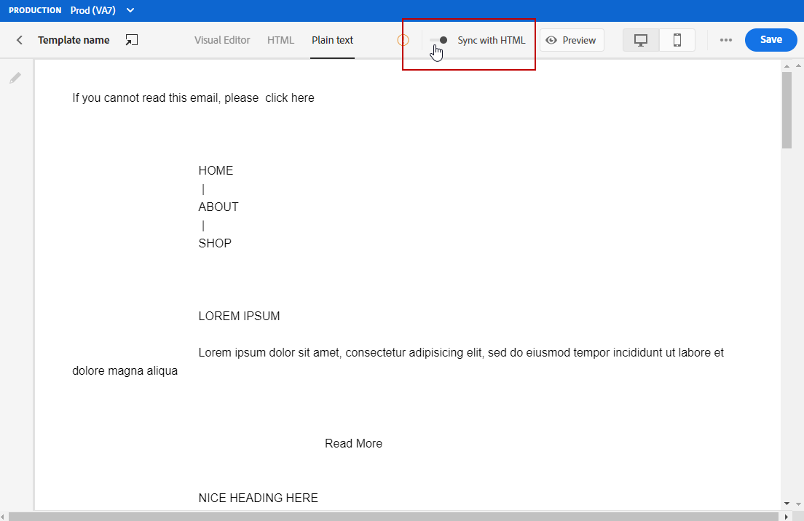

# Projete seu conteúdo de email na interface do usuário {#create-email-content}

Depois que [criar sua mensagem](create-message.md), você pode começar a criar seu conteúdo de email.

1. Na mensagem recém-criada, selecione **[!UICONTROL Email designer]** na seção **[!UICONTROL Edit content]**.

   

1. Na página inicial do Designer de email, escolha como deseja criar o email com as seguintes opções:

   * Selecione **[!UICONTROL Design from scratch]** para usar os recursos do designer de email para criar seu conteúdo de email.

   * Selecione **[!UICONTROL Start from template]** para criar seu email a partir de uma lista incorporada de modelos. Observe que não é possível criar outros templates.

   * Selecione **[!UICONTROL Code your own]** para inserir ou colar o código bruto HTML. [Saiba mais](existing-content.md#import-raw-html-code).

   * Selecione **[!UICONTROL Import HTML]** para importar um arquivo HTML ou uma pasta .zip. [Saiba mais](existing-content.md#import-html-content-from-file).

   

## Design do zero

Para começar a criar seu conteúdo de email com o designer de email, siga as etapas abaixo:

1. Depois de selecionar a opção **[!UICONTROL Design from scratch]** , comece a projetar o conteúdo do email arrastando e soltando **[!UICONTROL Structure components]** para definir o layout do email.

   

1. No menu suspenso **[!UICONTROL Content components]**, é possível adicionar quantos **[!UICONTROL Content components]** forem necessários no componente de estrutura. [Saiba mais sobre os componentes](content-components.md) de Conteúdo.

   

1. Cada componente pode ser personalizado ainda mais com a seção **[!UICONTROL Component settings]** . Por exemplo, você pode alterar o estilo do texto, o preenchimento ou a margem do componente. [Saiba mais sobre estilos no Editor](https://experienceleague.adobe.com/docs/campaign-standard/using/designing-content/styles.html) de email.

   

1. No **[!UICONTROL Assets picker]**, é possível adicionar diretamente ativos armazenados no **[!UICONTROL Assets library]** ao seu email. [Saiba mais sobre o gerenciamento](assets-essentials.md) de ativos.

   Clique duas vezes na pasta que continha seus ativos e arraste e solte o ativo que deseja adicionar ao seu email.

   

1. Adicione campos de personalização para personalizar o conteúdo dos dados de perfis. [Saiba mais sobre a personalização](personalization/personalize.md) de conteúdo.

   

1. Na guia **[!UICONTROL Links]** no painel esquerdo, verifique a lista de todos os URLs do seu conteúdo que serão rastreados. Você pode modificar seus **[!UICONTROL Tracking Type]**, **[!UICONTROL Label]** e **[!UICONTROL Tags]**, se necessário.

   

1. Se necessário, você pode alternar para o editor de código para personalizar ainda mais seu email clicando em **[!UICONTROL Switch to code editor]** no menu avançado. Para obter mais informações sobre o editor de códigos, consulte esta [página](existing-content.md#import-raw-html-code).

   >[!NOTE]
   >
   >Não será possível usar o designer visual para esse email após alternar para o editor de código.

   

1. Clique em **[!UICONTROL Preview]** para verificar a renderização do email. Você pode escolher a área de trabalho ou exibição móvel.

   

1. Quando o email estiver pronto, clique em **[!UICONTROL Save & Close]**.

Seu conteúdo de email agora pode ser usado em uma mensagem. [Saiba como enviar uma mensagem](publish-manage-message.md).

## Defina a estrutura de email {#defining-the-email-structure}

>[!CONTEXTUALHELP]
>id="ac_structure_components"
>title="Sobre componentes da estrutura"
>abstract="Os componentes da estrutura definem o layout do email."

>[!CONTEXTUALHELP]
>id="ac_edition_columns"
>title="Definição de colunas de email"
>abstract="O Designer de email permite definir facilmente o layout do email definindo a estrutura da coluna."

O Designer de email permite que você defina facilmente a estrutura do seu email. Ao adicionar e mover elementos estruturais com ações simples de arrastar e soltar, você pode projetar a forma do seu email em segundos.

Para editar a estrutura de um email:

1. Abra um conteúdo existente ou crie um novo conteúdo de email.
1. Acesse o **[!UICONTROL Structure components]** selecionando o ícone **+** à esquerda.
1. Arraste e solte os componentes de estrutura que você precisa para moldar seu email.
Uma linha azul materializa o local exato dos componentes da estrutura antes de soltá-la. Você pode soltá-lo acima, entre ou abaixo de qualquer outro componente, mas não dentro.

   >[!NOTE]
   >
   >Observe que a pilha de colunas não é compatível com todos os programas de email. Quando não houver suporte, as colunas não serão empilhadas.
   >
   >Depois de colocado no email, não é possível mover nem remover seus componentes, a menos que já exista um componente de conteúdo ou um fragmento inserido dentro dele.

1. Vários componentes de estrutura compostos de uma ou mais colunas estão disponíveis.

   Selecione o componente **[!UICONTROL n:n column]** para definir o número de colunas de sua escolha (entre 3 e 10). Você também pode definir a largura de cada coluna, movendo as setas na parte inferior de cada coluna.

   >[!NOTE]
   >
   >Cada tamanho de coluna não pode estar abaixo de 10% da largura total do componente de estrutura. Não é possível remover uma coluna que não esteja vazia.

Após definir a estrutura, é possível adicionar fragmentos de conteúdo e componentes ao email.

## Usar um precabeçalho {#preheader}

>[!CONTEXTUALHELP]
>id="ac_edition_preheader"
>title="Uso de um pré-cabeçalho"
>abstract="O precabeçalho permite configurar um texto resumido curto que pode ajudá-lo a controlar e personalizar melhor seus emails."

Um precabeçalho é um texto resumido curto que segue a linha de assunto ao visualizar um email do seu cliente de email. O pré-cabeçalho pode ajudá-lo a controlar e personalizar melhor seus emails.

Selecione a caixa de edição **[!UICONTROL Preheader]** e adicione conteúdo.

Você pode adicionar um **[!UICONTROL Content block]**, um **[!UICONTROL Dynamic content]** ou um **[!UICONTROL Personalization fields]** no conteúdo do pré-cabeçalho.

>[!NOTE]
>
>Observe que os pré-cabeçalhos não são compatíveis com todos os clientes de email. Quando não é suportado, o precabeçalho não é exibido.

## Configurações de plano de fundo {#about-backgrounds}

>[!CONTEXTUALHELP]
>id="ac_edition_backgroundimage"
>title="Configurações de plano de fundo"
>abstract="O Designer de email permite que você personalize a cor do fundo ou a imagem do fundo para o seu conteúdo.Observe que a imagem do fundo não é suportada por todos os clientes de email."
>additional-url="https://docs.google.com/spreadsheets/d/1TLo62YKm3tThUWDOIliCQFWs3dpNjpDfw6DdTr1oGOw/edit#gid=0" text="Informações adicionais"

Quando se trata de definir planos de fundo com o Email Designer, o Adobe recomenda o seguinte:

1. Aplique uma cor de fundo ao corpo do email, se exigido pelo design.
1. Na maioria dos casos, defina as cores do plano de fundo no nível da coluna.
1. Tente não usar as cores de fundo em componentes de imagem ou texto, pois elas são difíceis de gerenciar.

Abaixo estão as configurações de fundo disponíveis que você pode usar.

* Defina um **[!UICONTROL Background color]** para o email inteiro. Selecione as configurações de corpo na árvore de navegação acessível na paleta esquerda.

* Defina a mesma cor de plano de fundo para todos os componentes da estrutura selecionando **[!UICONTROL Viewport background color]**. Essa opção permite selecionar uma configuração diferente da cor do plano de fundo.

* Defina uma cor de plano de fundo diferente para cada componente de estrutura. Selecione uma estrutura na árvore de navegação acessível na paleta esquerda para aplicar uma cor de plano de fundo específica somente a essa estrutura.

   Certifique-se de não definir uma cor de plano de fundo da janela de visualização, pois ela pode ocultar as cores de plano de fundo da estrutura.

* Defina um **[!UICONTROL Background image]** para o conteúdo de um componente de estrutura.

   >[!NOTE]
   >
   >Alguns programas de email não suportam imagens de fundo. Quando não houver suporte, a cor de plano de fundo da linha será usada. Certifique-se de selecionar uma cor de plano de fundo de fallback apropriada caso a imagem não possa ser exibida.

* Defina uma cor de plano de fundo no nível da coluna.

   >[!NOTE]
   >
   >Esse é o caso de uso mais comum. O Adobe recomenda configurar as cores de fundo no nível da coluna, pois isso permite mais flexibilidade ao editar todo o conteúdo de email.

   Você também pode definir uma imagem de plano de fundo no nível da coluna, mas isso raramente é usado.

### Exemplo: ajuste o alinhamento vertical e o preenchimento {#example--adjusting-vertical-alignment-and-padding}

Você deseja ajustar o preenchimento e o alinhamento vertical dentro de um componente de estrutura composto de três colunas. Para fazer isso, siga as etapas abaixo:

1. Selecione o componente de estrutura diretamente no email ou usando a árvore de estrutura disponível à esquerda **Paleta**.
1. Na **barra de ferramentas contextual**, clique em **[!UICONTROL Select a column]** e escolha aquela que deseja editar. Também é possível selecioná-lo na árvore de estrutura.

   Os parâmetros editáveis para essa coluna são exibidos no painel **[!UICONTROL Settings]** à direita.

1. Em **[!UICONTROL Vertical alignment]**, selecione **[!UICONTROL Up]**.

   O componente de conteúdo é exibido na parte superior da coluna.

1. Em **[!UICONTROL Padding]**, defina o preenchimento superior dentro da coluna. Clique no ícone de bloqueio para interromper a sincronização com o preenchimento inferior.

   Defina o preenchimento à esquerda e à direita para essa coluna.

1. Continue de forma semelhante para ajustar o alinhamento e o preenchimento das outras colunas.

1. Salve as alterações.

## Definir um estilo para os links {#about-styling-links}

É possível sublinhar um link e selecionar sua cor e seu destino no Designer de email.

1. Em um componente onde um link é inserido, selecione o texto do rótulo do link.

1. Nas configurações do componente, marque **[!UICONTROL Underline link]** para sublinhar o texto do rótulo do link.

1. Para selecionar em qual contexto de navegação seu link será aberto, selecione um **[!UICONTROL Target]**.

1. Para alterar a cor do link, clique em **[!UICONTROL Link color]**.

1. Escolha a cor que você precisa.

1. Salve as alterações.

## Adicionar atributos de estilo em linha {#adding-inline-styling-attributes}

Na interface do Designer de email, ao selecionar um elemento e exibir suas configurações no painel lateral, é possível personalizar os atributos em linha e o valor desse elemento específico.

1. Selecione um elemento no seu conteúdo.
1. No painel lateral, procure pelas configurações **[!UICONTROL Styles Inline]**.

1. Modifique os valores dos atributos existentes ou adicione novos usando o botão **+**. Você pode adicionar qualquer atributo e valor compatível com CSS.

O estilo é aplicado ao elemento selecionado. Se os elementos filho não tiverem atributos de estilo específicos definidos, o estilo do elemento pai será herdado.

## Criar a versão de texto de um email {#generate-text-version}

É recomendável criar uma versão de texto do corpo do email, que é usada quando o conteúdo HTML não pode ser exibido.

Por padrão, o Designer de email cria uma versão **[!UICONTROL Plain text]** do email, incluindo campos de personalização. Esta versão é gerada e sincronizada automaticamente com a versão HTML do seu conteúdo.

Se preferir usar um conteúdo diferente para a versão de texto sem formatação, siga as etapas abaixo:

1. No email, selecione a guia **[!UICONTROL Plain text]** .

1. Use a opção **[!UICONTROL Sync with HTML]** para desativar a sincronização.

   

1. Clique na marca de seleção para confirmar sua escolha.

   

1. Em seguida, você pode editar a versão de texto simples, conforme desejado.

>[!CAUTION]
>
>* As alterações feitas na exibição **[!UICONTROL Plain text]** não são refletidas na exibição HTML.
   >
   >
* Se você reativar a opção **[!UICONTROL Sync with HTML]** após atualizar o conteúdo de texto simples, suas alterações serão perdidas e substituídas pelo conteúdo de texto gerado da versão HTML.

>

