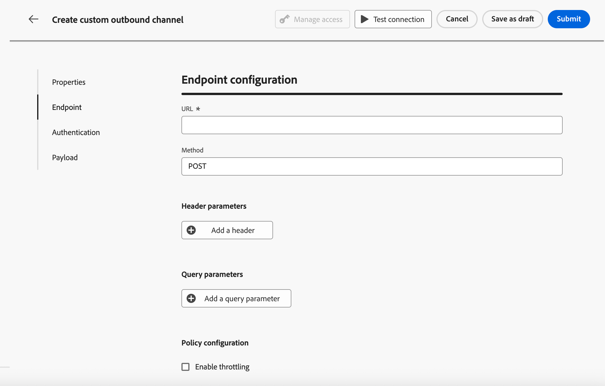
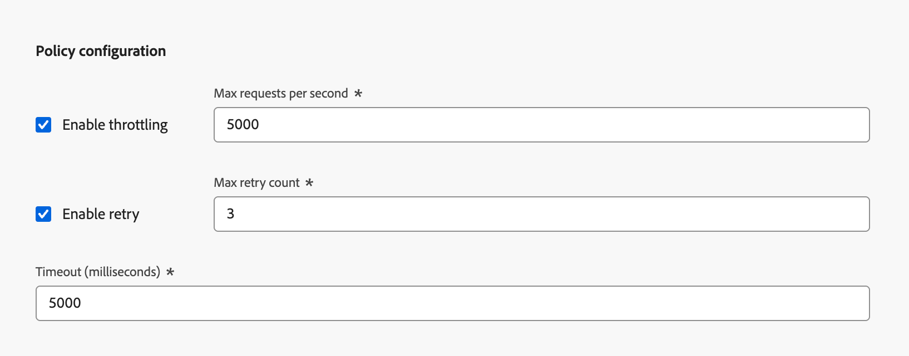
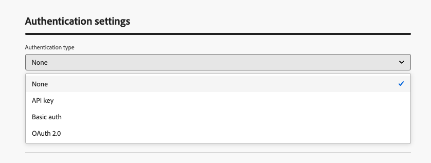

# Configurar um canal personalizado {#create-custom-channel}

>[!CONTEXTUALHELP]
>id="ajo_custom_channel_settings"
>title="Sobre canais personalizados"
>abstract="Um canal personalizado permite que o Adobe Journey Optimizer envie mensagens personalizadas para um sistema externo por meio de seu próprio endpoint de API. Defina as propriedades gerais, o endpoint, a autenticação e a carga, depois teste e ative o novo canal personalizado. Depois de concluído, você pode usá-lo ao criar uma configuração de canal para que os profissionais de marketing possam usá-lo em jornadas e campanhas."
>additional-url="" text="Introdução a canais personalizados"

<!--Contextual help final location TBC (here or in Settings subsection-->

Para poder usar um canal personalizado em campanhas e jornadas, um administrador deve primeiro criar o canal. Isso envolve a definição do endpoint, a autenticação, a política de limitação e a estrutura de payload da mensagem.

A seção **Channel Builder** é a interface central para a definição de novos canais personalizados. <!--It is accessible to users with the **[!UICONTROL Administrator]** role. -->Ele permite criar e configurar canais personalizados, mas também gerenciar credenciais de API e delegar subdomínios.

>[!IMPORTANT]
>
>Para acessar o Construtor de Canais e criar e gerenciar canais personalizados, você deve ter as permissões **Exibir canais personalizados** e **Gerenciar canais personalizados** concedidas. <!--[Learn more](../administration/high-low-permissions.md)--> Saiba como gerenciar permissões em [esta seção](../administration/permissions.md).

## Acessar e gerenciar canais personalizados {#access-channel-builder}

Para acessar o **Channel Builder** e gerenciar seus canais personalizados, siga as etapas abaixo.

1. Vá para **[!UICONTROL Administração]** > **[!UICONTROL Canais]** no painel de navegação esquerdo.

1. Selecione **[!UICONTROL Canais personalizados]** na seção **[!UICONTROL Construtor de canais]**.

   {width="70%"}

1. O inventário lista todos os canais personalizados em sua sandbox, incluindo o status atual e o tipo de autenticação usado para se conectar ao endpoint externo.

1. Você pode filtrar os canais personalizados por status (**Rascunho**, **Ativo** ou **Arquivado**), que os criou e pesquisar por nome.

1. Para editar um canal, clique no nome dele no inventário, faça as alterações e salve. Para canais ativos, você só pode editar determinados campos - [saiba mais](#test-activate).

   >[!CAUTION]
   >
   >A modificação das configurações de limitação ou repetição em um canal ativo entra em vigor imediatamente para todas as execuções em andamento e futuras.

1. Para arquivar um canal, abra-o no inventário e clique em **[!UICONTROL Arquivar]**.

   O arquivamento de um canal ativo o remove de todos os menus suspensos de seleção — seletor de ação de campanha, paleta de ações de jornada, lista de canais de campanhas orquestradas, configurações de canal e modelos de conteúdo. As jornadas e campanhas existentes que já usam o canal continuam a funcionar normalmente.

## Criar um canal personalizado {#create-channel}

Para criar um novo canal personalizado, siga as etapas abaixo.

1. Clique no botão **[!UICONTROL Criar canal personalizado]** para abrir o formulário de criação de canal. Comece definindo as configurações gerais do seu canal personalizado.

   {width="70%"}

1. Na seção **[!UICONTROL Propriedades]**, digite um **[!UICONTROL Nome]** para o canal personalizado. Esse nome aparecerá na tela do jornada, no seletor de ações de campanha e na lista de canais de campanhas orquestradas.

   >[!NOTE]
   >
   >O nome deve ser exclusivo, começar com uma letra (A-Z), incluir apenas caracteres alfanuméricos ou caracteres especiais ( _, ., -) e deve ter mais de 1 caractere.

1. Você pode selecionar um ícone na biblioteca de ícones padrão ou selecionar um arquivo do SVG no computador.

   >[!NOTE]
   >
   >O arquivo não deve ter mais de 150 KB.

   Esse ícone será exibido ao lado do nome do canal na tela de jornada. Se nenhum ícone for carregado, o ícone padrão será usado.

1. Insira uma **[!UICONTROL Descrição]** opcional.

<!--
1. Optionally, assign **[!UICONTROL Access labels]** to restrict access to this channel based on data usage policies. Learn more
-->

## Definir a configuração do ponto de extremidade {#endpoint-configuration}

Você deve configurar o endpoint, que é o URL HTTP do seu sistema de mensagens externo. [!DNL Journey Optimizer] envia uma solicitação POST para este ponto de extremidade com a carga personalizada quando um perfil é qualificado em uma campanha ou jornada.

{width="70%"}

1. Na seção **[!UICONTROL Configuração de ponto de extremidade]**, insira o host **[!UICONTROL URL]** do sistema de mensagens externo.

   <!--The HTTP method to is currently set to **POST**.-->

   >[!IMPORTANT]
   >Seu sistema de mensagens externo deve expor um ponto de extremidade HTTPS que [!DNL Journey Optimizer] pode chamar via HTTP POST. O endpoint deve:
   >
   >* Aceite o formato de conteúdo definido pelo seu canal (JSON).
   >* Suporte a um dos métodos de autenticação disponíveis no Channel Builder. [Saiba mais](#authentication-settings)
   >* Retorne uma resposta HTTP 2xx para confirmar o recebimento da solicitação.

1. Adicione **[!UICONTROL Cabeçalhos]** conforme necessário. Cabeçalhos são pares de valores chave transmitidos no nível de solicitação HTTP. Eles são enviados junto com cada solicitação para o endpoint e normalmente são usados para tokens de autenticação, especificação de tipo de conteúdo ou quaisquer outros metadados exigidos pelo sistema externo.

   <!--At minimum, `Content-Type` and `Charset` are available as default headers.-->

   

   Para cada cabeçalho, é possível definir se o valor é:

   * **[!UICONTROL Constante]** - Um valor estático definido uma vez e incluído em cada solicitação. Por exemplo, você pode definir o parâmetro `Content-Type` com o valor `application/json` ou o parâmetro `Charset` com o valor `UTF-8`.
   * **[!UICONTROL Variável]** - Se um valor padrão for inserido aqui, ele será usado, a menos que seja substituído na configuração do canal. Por exemplo, é possível definir uma variável para a ID do usuário que é resolvida no tempo de execução. [Saiba mais](custom-channel-configuration.md) <!--From Custom actions section: For these parameters, you can define where to get this information (example: events, data sources), pass values manually or use the advanced expression editor for advanced use cases. Advanced uses cases can be data manipulation and other function usage. Refer to this [page](expression/expressionadvanced.md).-->

1. Opcionalmente, adicione **[!UICONTROL Parâmetros de consulta]** usando o mesmo padrão de constante/variável. Os parâmetros de consulta são anexados ao URL do endpoint no momento da entrega. Parâmetros constantes são sempre adicionados com o mesmo valor; parâmetros variáveis são resolvidos no momento do envio, por exemplo, para passar um identificador do usuário do perfil.

   {width="70%"}

1. Na seção **[!UICONTROL Configuração de política]**, defina como [!DNL Journey Optimizer] lida com a taxa de transferência de solicitação e falhas. Isso é importante para garantir que seu sistema externo possa lidar com o volume de solicitações e evitar sobrecarregá-lo.

   

   * **[!UICONTROL Habilitar limitação]** - Desabilitado por padrão. Defina o número máximo de solicitações por segundo (padrão: **5.000c**). Quando o limite é atingido, as solicitações são enfileiradas e enviadas o mais rápido possível.
   * **[!UICONTROL Habilitar nova tentativa]** - Habilitado por padrão. Defina a contagem máxima de novas tentativas (padrão: **3**, intervalo configurável: 0-10) para solicitações com falha. Isso ajuda a evitar sobrecarregar o endpoint durante falhas transitórias.
   * **[!UICONTROL Tempo limite]** - Padrão: **5.000 milissegundos**. Defina o tempo máximo de espera por uma resposta do ponto de extremidade antes de considerar que a solicitação falhou.     <!--* **[!UICONTROL Enable cache]** – Disabled by default. Set the caching duration (default TTL: **600 seconds**). After the TTL (Time To Live) expires, the next request is sent to the endpoint. Caching is useful for endpoints that return the same response for identical requests, reducing load and improving performance.-->

## Configurações de autenticação {#authentication-settings}

>[!CONTEXTUALHELP]
>id="ajo_custom_channel_authentication"
>title="Definir o tipo de autenticação"
>abstract="A autenticação garante que somente solicitações autorizadas sejam enviadas para o sistema de mensagens externo. Você pode escolher entre vários métodos de autenticação, incluindo Chave da API, Autenticação básica e OAuth 2.0. Após a ativação, o Adobe Journey Optimizer gera automaticamente um conjunto inicial de credenciais de API para o canal, que pode ser gerenciado no inventário de credenciais de API. No entanto, mesmo que você possa alterar as credenciais posteriormente, forneça os detalhes de autenticação aqui para testar a conexão com o endpoint antes de ativar o canal."
>additional-url="" text="Saiba mais sobre credenciais de API"

Selecione o **[!UICONTROL Tipo de autenticação]** que você precisa usar para este canal. As opções disponíveis dependem dos métodos de autenticação compatíveis com seu sistema de mensagens externo.

{width="70%"}

Forneça os detalhes de autenticação, conforme exigido pelo seu endpoint.

* **[!UICONTROL Nenhum]** - A solicitação foi enviada sem credenciais.
* **[!UICONTROL Chave de API]** - Forneça o nome da chave, o valor e o local (parâmetro de consulta ou cabeçalho).
* **[!UICONTROL Autenticação básica]** - Forneça um nome de usuário e senha.
* **[!UICONTROL OAuth 2.0]** - Configure a carga para a autenticação OAuth 2.0.
  <!--* **[!UICONTROL Custom]** – Define the authentication configuration using a JSON payload.-->

Quando o tipo de autenticação é qualquer coisa diferente de **Nenhum**, o [!DNL Journey Optimizer] gera automaticamente um conjunto inicial de credenciais de API para este canal quando ele é ativado. Você pode alterar essas credenciais e criar novas no inventário de credenciais da API. [Saiba mais](custom-channel-api-credentials.md) <!--TBC-->

No entanto, os detalhes de autenticação são necessários aqui para testar a conexão com seu endpoint antes de ativar o canal. Um botão **[!UICONTROL Testar conexão]** está disponível para validar a configuração de autenticação. [Saiba mais](#test-activate)

## Configuração de carga útil {#payload-configuration}

>[!CONTEXTUALHELP]
>id="ajo_custom_channel_payload_config"
>title="Habilitar campo para configuração de canal"
>abstract="Se ativados, os campos desta coluna aparecem na configuração do canal, permitindo que os administradores definam valores diferentes por configuração (por exemplo, uma ID de remetente diferente por marca ou região). Isso é útil para campos que podem variar com base no contexto da campanha ou jornada, como informações do remetente ou modelos de mensagem."
>additional-url="" text="Definir parâmetros dinâmicos na configuração de canal personalizado"

<!--Create a page on Custom channel config to explain how to use the payload in a channel configuration.-->

A carga é enviada para o endpoint quando um perfil é qualificado em uma campanha ou jornada.

Na configuração de carga, defina a estrutura da carga da mensagem e quais campos os profissionais de marketing podem criar e personalizar.

1. Clique em **[!UICONTROL Definir carga]** e escolha como definir a carga:

   * **[!UICONTROL Colar carga JSON de amostra]** - Cole um objeto JSON representativo e [!DNL Journey Optimizer] infere automaticamente um esquema dele.
   * **[!UICONTROL Importar esquema JSON]** (em breve) - Carregue um arquivo de esquema JSON completo.

     >[!AVAILABILITY]
     >
     >Esse recurso ainda não está disponível. Ele será adicionado em uma versão futura.

1. Depois que o esquema é gerado, [!DNL Journey Optimizer] exibe todos os campos detectados em um modo de exibição de formulário.

   

1. Para cada campo, defina as seguintes configurações:

   | Configuração | Descrição |
   | --- | --- |
   | **[!UICONTROL Valor padrão]** | Opcional. Usado se nenhum valor personalizado for fornecido no momento da criação. |
   | **[!UICONTROL Tipo]** | Somente leitura, derivado da carga. Tipos com suporte: `string`, `integer`, `decimal`, `boolean`, `dateTime`, `dateTimeOnly`, `dateOnly`, `listObject`, `listString`, `listInteger`, `listDecimal`, `listBoolean`, `listDateTime`, `listDateTimeOnly`, `listDateOnly`. |
   | **[!UICONTROL Obrigatório]** | Se ativado, o campo deve ter um valor quando o canal é usado em uma campanha ou jornada. Campos obrigatórios ausentes acionam um erro de validação que impede a ativação. |
   | **[!UICONTROL Configuração de canal]** | Se estiver ativado, o campo aparece na configuração do canal, permitindo que os administradores definam valores diferentes por configuração (por exemplo, uma ID de remetente diferente por marca ou região). [Saiba como](custom-channel-configuration.md) |

   Campos aninhados são representados com a notação de pontos (por exemplo, `image.id`).<!--TBC-->

## Testar e ativar {#test-activate}

Enquanto o canal está com o status **[!UICONTROL Rascunho]**, use o botão **[!UICONTROL Testar conexão]** na parte superior da tela para enviar uma solicitação de teste para o seu ponto de extremidade e validar a conexão ponta a ponta.

{width="70%"}

Verifique os logs do sistema externo para confirmar se a solicitação foi recebida com a autenticação e a carga esperadas.

Depois que o teste for bem-sucedido, você poderá salvar ou ativar o canal.

* Clique em **[!UICONTROL Salvar como rascunho]** para salvar seu progresso sem disponibilizar o canal.
* Clique em **[!UICONTROL Ativar]** para disponibilizar o canal para uso em configurações de canal, campanhas e jornadas.

>[!IMPORTANT]
>
>Depois que um canal é ativado, apenas os seguintes campos permanecem editáveis: nome, descrição, ícone, limitação e configuração de repetição. A URL do ponto de extremidade, os cabeçalhos, os parâmetros de consulta, a autenticação e a estrutura de carga estão bloqueados.<!--TBC-->

<!--TBC: An activated channel can be **archived** (hidden from all selection drop-downs while existing journeys and campaigns continue to function), but it cannot be **deleted**. Deletion is only possible while the channel is in **[!UICONTROL Draft]** status.TBC-->

## Próximas etapas {#next-steps}

Seu canal personalizado foi criado. Conclua a configuração seguindo as etapas restantes:

* [Configurar credenciais de API](custom-channel-api-credentials.md) (se o canal usar autenticação)
* [Delegar um subdomínio](custom-channel-subdomains.md) (opcional — obrigatório para rastreamento de link)
* [Criar uma configuração de canais](custom-channel-configuration.md)
