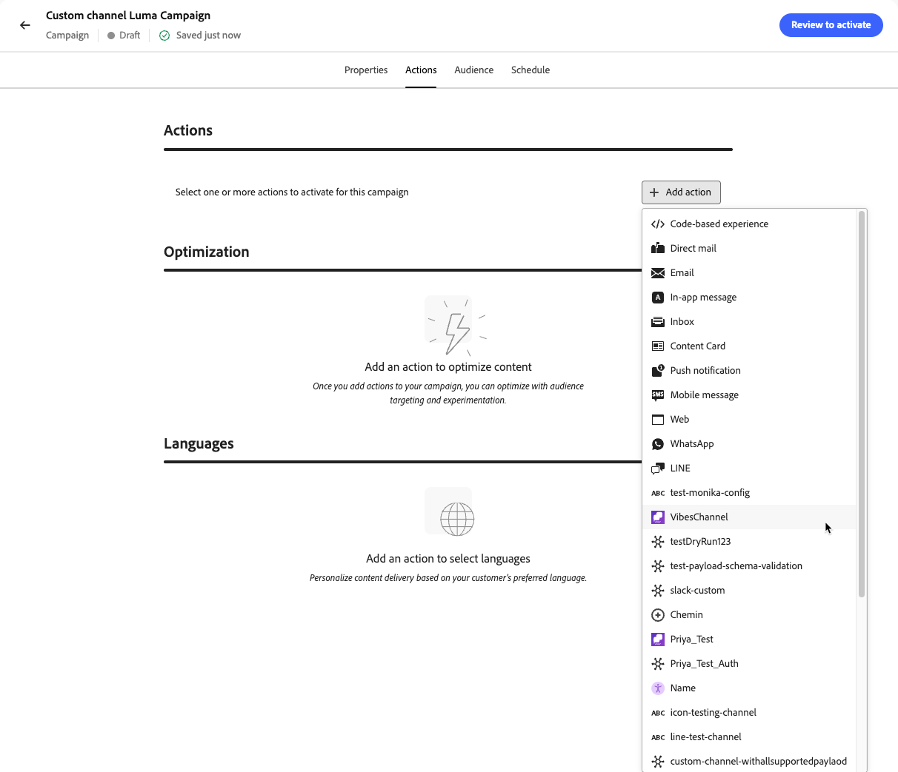
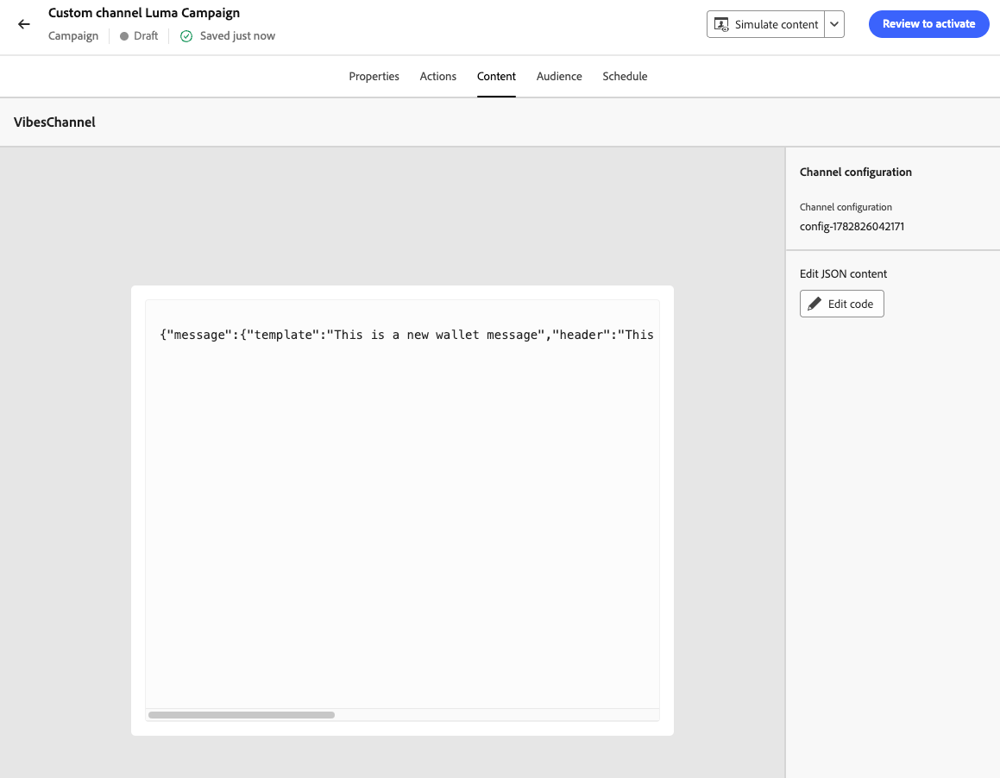

# Criar experiências de canal personalizadas {#create-custom-channel}

>[!AVAILABILITY]
>
>Este recurso é oferecido com disponibilidade limitada. Entre em contato com o representante da Adobe para obter acesso.

No [!DNL Journey Optimizer], você pode entregar mensagens usando canais personalizados em campanhas, jornadas e campanhas orquestradas. Siga as etapas abaixo para configurar sua experiência de canal personalizada.

>[!NOTE]
>
>Antes de criar uma experiência de canal personalizada, verifique se um canal personalizado foi configurado pelo administrador. [Saiba mais](configure-custom-channel.md)

## Adicionar uma ação personalizada por meio de uma jornada ou campanha {#create-custom-channel-experience}

>[!CONTEXTUALHELP]
>id="ajo_journey_action_custom_channel"
>title="Ação de canal personalizada"
>abstract="Uma ação de canal personalizado entrega uma mensagem aos perfis quando eles atingem esta etapa da jornada. O rótulo identifica a atividade na tela de jornada e a ação faz referência a uma configuração de canal personalizada que define o endpoint, a carga e as credenciais usadas para entregar a mensagem. A seção **Otimização** pode incluir experimentos de conteúdo ou regras de direcionamento, e a seção **Tempo limite ou erro** pode definir um caminho alternativo se a ação falhar."
>additional-url="https://experienceleague.adobe.com/pt-br/docs/journey-optimizer/using/orchestrate-journeys/about-journey-building/journey-action#add-action" text="Introdução a canais personalizados"


>[!BEGINTABS]

>[!TAB Adicionar um canal personalizado a uma jornada]

Os canais personalizados aparecem na seção **[!UICONTROL Ações]** da paleta da tela de jornada, listados por seu nome de exibição e ícone personalizado, conforme definido no Channel Builder.

Para adicionar uma ação de canal personalizado a uma jornada:

1. [Criar uma jornada](../building-journeys/journey-gs.md).

1. Inicie sua jornada com uma atividade [Evento](../building-journeys/general-events.md) ou [Ler público](../building-journeys/read-audience.md).

1. Arraste e solte uma atividade **[!UICONTROL Ação]** da seção **[!UICONTROL Ações]** da paleta. Saiba mais sobre a [Atividade de ação](../building-journeys/journey-action.md).

1. No menu suspenso **[!UICONTROL Ação]**, selecione o canal personalizado que deseja usar. Os canais personalizados são listados pelo nome e ícone atribuídos no Construtor de canais.

   {width="80%"}

1. Adicione um rótulo à sua ação, clique em **[!DNL Configure action]** no painel direito e selecione a **[!UICONTROL Configuração de canal]** a ser usada. [Saiba como criar uma configuração de canal personalizada](custom-channel-configuration.md#create-channel-config)

1. Na seção **[!UICONTROL Mensagem]**, clique em **[!UICONTROL Editar conteúdo]** para abrir o editor de carga e criar sua mensagem. [Saiba como criar conteúdo](#author-content)

1. Conclua o fluxo de jornada adicionando etapas adicionais, conforme necessário, e publique a jornada. [Saiba mais](../building-journeys/journey-gs.md)

>[!TAB Criar uma campanha de canal personalizada]

Para usar um canal personalizado em uma campanha:

1. [Criar uma campanha](../campaigns/create-campaign.md).

1. Selecione o tipo de campanha:

   * **[!UICONTROL Agendado - Marketing]** - Executado imediatamente ou em uma data especificada. Projetado para mensagens de marketing, configurado na interface do usuário do.
   * **[!UICONTROL Acionado por API - Marketing/Transacional]** - Executado por uma chamada de API. Projetado para mensagens acionadas por eventos (por exemplo, confirmações de pedidos ou redefinições de senha). [Saiba mais](../campaigns/api-triggered-campaigns.md)

1. Conclua a configuração da campanha: propriedades da campanha, [público-alvo](../audience/about-audiences.md) e [agendamento](../campaigns/create-campaign.md#schedule).

1. Na seção **[!UICONTROL Actions]**, selecione o canal personalizado no seletor de canais. Todos os canais personalizados configurados na sandbox aparecem junto com canais nativos.

   {width="80%"}

1. Selecione ou crie a **[!UICONTROL Configuração de canal]** a ser usada. [Saiba como criar uma configuração de canal](custom-channel-configuration.md#create-channel-config)

1. Como opção, habilite o **[!UICONTROL Rastreamento de ação]** para rastrear automaticamente os links incluídos na carga da sua mensagem (requer um subdomínio configurado para canais personalizados). [Saiba como delegar um subdomínio para canais personalizados](custom-channel-subdomains.md#subdomain-delegation)

1. Na seção **[!UICONTROL Otimização]**, você pode:

   * **[!UICONTROL Crie regras de direcionamento]** para enviar mensagens diferentes para segmentos diferentes do seu público-alvo. [Saiba mais](../campaigns/create-campaign.md#targeting)
   * Clique em **[!UICONTROL Criar experimento]** para executar testes A/B nas mensagens do canal personalizado. [Saiba mais](../campaigns/create-campaign.md#content-experiment)

1. Clique em **[!UICONTROL Editar conteúdo]** para abrir o editor de carga e criar sua mensagem. [Saiba como criar conteúdo](#author-content)

1. Revise e ative a campanha. [Saiba mais](../campaigns/create-campaign.md)

<!--
>[!TAB Add a custom channel to an orchestrated campaign]

Custom channels appear in the channel selection list in the orchestrated Campaigns canvas, below the native channels, with their custom icon and display name.

To add a custom channel in an orchestrated campaign:

1. Open or create an orchestrated campaign.

1. In the canvas, add a channel action node and select your custom channel from the list.

1. Select the **[!UICONTROL Channel configuration]** to use. Ensure the configuration includes the **[!UICONTROL Execution details]** section required for orchestrated campaigns.

1. Click **[!UICONTROL Edit content]** to open the payload editor and author your message. [Learn how to author content](#author-content)
-->

>[!ENDTABS]

## Crie seu conteúdo de canal personalizado {#author-content}

O editor de conteúdo reflete a estrutura de carga útil que você definiu ao configurar o canal personalizado. Clique em **[!UICONTROL Editar código]** para abrir o editor de carga e inserir o conteúdo da mensagem.

{width="80%"}

Os campos que você pode criar e personalizar são exibidos. Você pode aproveitar o editor de personalização do [!DNL Journey Optimizer] com todos os seus recursos de personalização e criação. [Saiba mais](../personalization/personalization-build-expressions.md)

>[!NOTE]
>
>Somente cargas JSON são suportadas. Se a carga do canal personalizado não for JSON, você poderá usar um invólucro JSON para encapsular o conteúdo. Por exemplo, se sua carga for XML, você poderá envolvê-la em um objeto JSON da seguinte maneira:
>
>```json
>{
>   "payload": "<xml>...</xml>"
>}
>```

### Personalizar o conteúdo {#personalize}

Os recursos de personalização completa de [!DNL Journey Optimizer] estão disponíveis no editor de carga:

* **Atributos do perfil** - Insira qualquer atributo de perfil XDM, como `{{profile.person.name.firstName}}`, ou uma identidade personalizada, como uma ID de usuário da plataforma de mensagens armazenada em um namespace personalizado.
* **Atributos contextuais** - Use atributos de evento de jornada ou dados contextuais de campanha resolvidos no momento do envio.
* **Funções auxiliares** - Formatar valores usando funções de cadeia de caracteres, data ou aritmética internas. [Saiba mais](../personalization/functions/helpers.md)
* **Fragmentos de expressão** - Reutilize a lógica de personalização compartilhada em vários canais e campanhas. [Saiba mais](../content-management/customizable-fragments.md)

>[!CAUTION]
>
>Atualmente não há validação da carga no momento da criação. Você pode usar o recurso **[!UICONTROL Simular conteúdo]** para validar se sua carga é JSON bem formada e se todas as expressões de personalização são resolvidas corretamente para seus perfis de teste. [Saiba mais](test-custom-channel.md#simulate-content)

### Exemplo de carga útil {#example-payload}

O exemplo a seguir mostra uma carga JSON com personalização de perfil para um canal de mensagens personalizado <!--(to be replaced with a meaningful realistic example)-->:

```json
{
  "recipient_id": "{{profile.mobilePhone.number}}",
  "message_text": "Hello {{profile.person.name.firstName}}, your order {{context.journey.events.0.commerce.order.purchaseID}} has been confirmed.",
  "channel": "my-custom-channel",
  "image": {
    "id": "{{profile.preferences.imageId | default('default-image-001')}}"
  }
}
```

### Rastrear links na carga útil {#track-links}

Para incluir um link rastreado na carga do canal personalizado, de modo que os cliques sejam rastreados automaticamente e visíveis nos painéis de relatório do canal, vincule o URL usando a seguinte sintaxe de barra:

```
{{url trackedUrl='' originalUrl='https://example.com/' type='TRACKED'}}
```

* `originalUrl` - A URL de destino para a qual você deseja redirecionar o destinatário.
* `trackedUrl` - Deixe isso em branco; [!DNL Journey Optimizer] preenche-o automaticamente com a URL de redirecionamento habilitada para rastreamento no momento do envio.
* `type` - Deve ser definido como `TRACKED`.

>[!NOTE]
>
>O rastreamento de link requer um subdomínio configurado para canais personalizados. [Saiba como delegar um subdomínio para canais personalizados](custom-channel-subdomains.md#subdomain-delegation)

**Exemplo - link rastreado em uma carga do LINE:**

```json
{
  "to": "{{profile.mobilePhone.number}}",
  "messages": [
    {
      "type": "text",
      "text": "Hello! Check out our latest offer: {{url trackedUrl='' originalUrl='https://example.com/' type='TRACKED'}}"
    }
  ]
}
```

<!--
### Strict JSON mode {#strict-json}

The editor supports a **[!UICONTROL Strict JSON]** toggle:

* **Strict JSON: Off (default)** – The editor accepts any payload content, including personalization helpers and functions that may temporarily produce non-JSON syntax. A warning is displayed at the **Review to Activate** step if the payload is not well-formed JSON, prompting you to simulate and proof before publishing.
* **Strict JSON: On** – The editor validates that the payload is well-formed JSON as you type. At the **Review to Activate** step, [!DNL Journey Optimizer] validates the payload against the channel schema and flags missing required fields or type mismatches as errors that must be resolved before activation.
-->

## Ativar sua experiência de canal personalizada {#activate}

>[!IMPORTANT]
>
>Visualize e teste sua carga útil do canal personalizado antes da ativação. [Saiba como](test-custom-channel.md)
>
>Se sua campanha ou jornada estiver sujeita a uma política de aprovação, será necessário solicitar aprovação antes da ativação. [Saiba mais](../test-approve/gs-approval.md)

* **De uma jornada** - Clique em **[!UICONTROL Publicar]** na área superior direita. A jornada entra em vigor e começa a chamar seu endpoint externo para perfis qualificados.
* **De uma campanha** - Clique em **[!UICONTROL Revisar para ativar]**, revise suas configurações e clique em **[!UICONTROL Ativar]**. A campanha assume o status **[!UICONTROL Online]** (ou **[!UICONTROL Agendada]** se uma data de início futura tiver sido definida).
