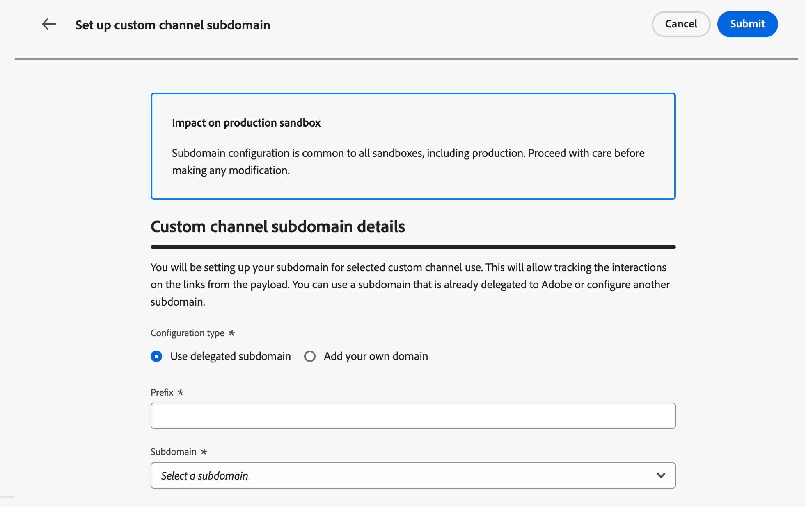

# Configurar subdomínios de canal personalizados {#custom-channel-subdomains}

>[!BEGINSHADEBOX]

**Nesta página:** Saiba como configurar subdomínios de canal personalizados no Adobe Journey Optimizer para habilitar o rastreamento de links em suas mensagens, usando um subdomínio delegado existente ou configurando um novo com um registro DNS.

>[!ENDSHADEBOX]

>[!CONTEXTUALHELP]
>id="ajo_admin_subdomain_custom_channel"
>title="Delegar um subdomínio de canal personalizado"
>abstract="Você deve configurar um subdomínio para usar nas mensagens de canal personalizadas, pois esse subdomínio é necessário para criar uma configuração de canal personalizada. Você pode usar um subdomínio já delegado à Adobe ou configurar um novo subdomínio."
>additional-url="https://experienceleague.adobe.com/en/docs/journey-optimizer/using/custom-channel/custom-channel-configuration" text="Configurar um canal personalizado"

>[!CONTEXTUALHELP]
>id="ajo_admin_config_custom_channel_subdomain"
>title="Selecionar um subdomínio de canal personalizado"
>abstract="Para criar uma configuração de canal personalizada, verifique se você configurou anteriormente pelo menos um subdomínio de canal personalizado para escolher na lista Nome de subdomínio."
>additional-url="https://experienceleague.adobe.com/en/docs/journey-optimizer/using/custom-channel/custom-channel-configuration" text="Configurar um canal personalizado"

## Introdução a subdomínios de canal personalizados {#gs-custom-channel-subdomains}

Para habilitar o rastreamento de links em suas mensagens de canal personalizadas, é necessário configurar o subdomínio que você selecionará ao [criar uma configuração de canal personalizada](custom-channel-configuration.md#subdomain-delegation).

Você pode usar um subdomínio que já foi delegado à Adobe ou configurar outro subdomínio. Saiba mais sobre como delegar subdomínios à Adobe em [esta seção](../configuration/delegate-subdomain.md).

A configuração de subdomínio do canal personalizado é compartilhada entre todos os ambientes. Portanto, qualquer modificação em um subdomínio de canal personalizado também afeta outras sandboxes de produção.

<!--
TBC
>[!NOTE]
>
>To access and edit custom channel subdomains, you must have the **[!UICONTROL Manage Custom Channel Subdomains]** permission on the production sandbox. Learn more about permissions in [this section](../administration/high-low-permissions.md).
-->
## Usar um subdomínio existente {#custom-channel-use-existing-subdomain}

Para usar um subdomínio que já está delegado à Adobe, siga as etapas abaixo.

1. Navegue até o menu **[!UICONTROL Administração]** > **[!UICONTROL Canais]** e selecione **[!UICONTROL Construtor de Canais]** > **[!UICONTROL Subdomínios]**.

   {width="100%"}

1. Clique em **[!UICONTROL Criar subdomínio de canal personalizado]**.

1. Selecione **[!UICONTROL Usar subdomínio delegado]** na seção **[!UICONTROL Tipo de configuração]**.

   {width="100%"}

1. Insira o prefixo que será exibido no URL do canal personalizado. Somente caracteres alfanuméricos e hifens são permitidos.

   O prefixo é usado para criar um subdomínio exclusivo para esse canal personalizado. Por exemplo, se você inserir `promo` e selecionar o subdomínio `luma.com`, o subdomínio resultante será `promo.luma.com`.

   >[!CAUTION]
   >
   >Não use os prefixos `cdn` ou `data`, pois eles são reservados para uso interno. Outros prefixos restritos ou reservados, como `dmarc` ou `spf`, também devem ser evitados.

1. Selecione um subdomínio delegado na lista.

   Não é possível selecionar um subdomínio que já esteja sendo usado como um subdomínio de canal personalizado.

   >[!CAUTION]
   >
   >Se você selecionar um domínio que foi delegado à Adobe usando o [método CNAME](../configuration/delegate-subdomain.md#cname-subdomain-setup), deverá criar o registro DNS na sua plataforma de hospedagem. Para gerar o registro DNS, o processo é o mesmo de quando você configura um novo subdomínio de canal personalizado. Saiba mais em [esta seção](#custom-channel-configure-new-subdomain).

1. Clique em **[!UICONTROL Enviar]**.

1. Depois de enviado, o subdomínio é exibido na lista com o status **[!UICONTROL Processando]**. Para obter mais informações sobre os status dos subdomínios, consulte [esta seção](../configuration/delegate-subdomain.md#access-delegated-subdomains).

   Antes de poder usar esse subdomínio para enviar mensagens, você deve aguardar até que o Adobe execute as verificações necessárias, que podem levar **até 4 horas**.

1. Depois que as verificações forem bem-sucedidas, o subdomínio obterá o status **[!UICONTROL Success]**. Ele está pronto para ser usado para criar configurações de canal personalizadas.

## Configurar um novo subdomínio {#custom-channel-configure-new-subdomain}

>[!CONTEXTUALHELP]
>id="ajo_admin_custom_channel_subdomain_dns"
>title="Gerar o registro DNS correspondente"
>abstract="Para configurar um novo subdomínio de canal personalizado, é necessário copiar as informações do servidor de nomes do Adobe exibidas na interface do Journey Optimizer e colá-las na solução de hospedagem de domínio para gerar o registro DNS correspondente. Depois que as verificações forem bem-sucedidas, o subdomínio estará pronto para ser usado para criar configurações de canal personalizadas."

Para configurar um novo subdomínio, siga as etapas abaixo.

1. Navegue até o menu **[!UICONTROL Administração]** > **[!UICONTROL Canais]** e selecione **[!UICONTROL Construtor de Canais]** > **[!UICONTROL Subdomínios]**.

1. Clique em **[!UICONTROL Criar subdomínio de canal personalizado]**.

1. Selecione **[!UICONTROL Adicionar seu próprio domínio]** na seção **[!UICONTROL Tipo de configuração]**.

   {width="70%"}

1. Especifique o subdomínio que será delegado.

   >[!CAUTION]
   >
   >* Não é possível usar um subdomínio de canal personalizado existente.
   >
   >* Letras maiúsculas não são permitidas em subdomínios.

   Não é permitido delegar um subdomínio inválido à Adobe. Insira um subdomínio válido de propriedade de sua organização, como marketing.yourcompany.com.

   Subdomínios de vários níveis (do mesmo domínio pai) são suportados. Por exemplo, você pode usar &#39;custom.marketing.yourcompany.com&#39;.

1. O registro a ser colocado em seus servidores DNS é exibido. Copie esse registro ou baixe um arquivo CSV e navegue até a solução de hospedagem de domínio para gerar o registro DNS correspondente.

1. Verifique se o registro DNS foi gerado na solução de hospedagem de domínio. Se tudo estiver configurado corretamente, marque a caixa &quot;Eu confirmo...&quot; e clique em **[!UICONTROL Enviar]**.

   

   Ao configurar um novo subdomínio de canal personalizado, ele sempre aponta para um registro CNAME.

1. Depois que a delegação de subdomínio for enviada, o subdomínio será exibido na lista com o status **[!UICONTROL Processando]**. Para obter mais informações sobre os status dos subdomínios, consulte [esta seção](../configuration/delegate-subdomain.md#access-delegated-subdomains).

Antes de usar um subdomínio para enviar mensagens de canal personalizadas, aguarde até que o Adobe execute as verificações necessárias, que podem levar até 4 horas. Depois que as verificações forem bem-sucedidas, o subdomínio obterá o status **[!UICONTROL Success]**. Ele está pronto para ser usado para criar configurações de canal personalizadas.

Observe que o subdomínio será marcado como **[!UICONTROL Falha]** se você não criar o registro de validação na solução de hospedagem.

<!--

Any specific guardrails to add? If so, can we link to email subdomain guardrails? journey-optimizer.en/help/using/configuration/delegate-subdomain.md#guardrails

Otherwise use the following from SMS subdomains?

## Guardrails {#guardrails}

Currently, the [!DNL Journey Optimizer] user interface does not support the deletion or undelegation of custom channel subdomains once they have been set up.

However, when testing features within [!DNL Journey Optimizer], it may be necessary to create a custom channel subdomain. Once the testing is complete, this can lead to cluttered environments with unnecessary configurations as the UI does not allow for removing or undelegating custom channel subdomains.

Here are some recommended steps and considerations:

* As a best practice, maintain a tidy environment by only creating necessary components and configurations.
* In situations where there is a business impact, contact your Adobe representative who may be able to assist with the removal/undelegation of the custom channel subdomain. [Learn more](#undelegate-subdomain)
* If further assistance is required, reach out to Adobe for guidance on managing your instance effectively.

## Undelegate a subdomain {#undelegate-subdomain}

If you wish to undelegate a custom channel subdomain, reach out to your Adobe representative with the subdomain you want to undelegate.

If the custom channel subdomain points to a CNAME record, you can delete the CNAME DNS record that you created for the custom channel subdomain from your hosting solution (but do not delete the original email subdomain if any).

>[!NOTE]
>
>A custom channel subdomain can point to a CNAME record because it was either an [existing subdomain](#custom-channel-use-existing-subdomain) delegated to Adobe using the [CNAME method](../configuration/delegate-subdomain.md#cname-subdomain-setup), or a [new custom channel subdomain](#custom-channel-configure-new-subdomain) that you configured.

After your request is handled by Adobe, the undelegated domain is no longer displayed on the subdomain inventory page.
-->

## Próximas etapas {#next-steps}

* [Crie uma configuração de canal](custom-channel-configuration.md) para vincular seu canal personalizado a um subdomínio, credenciais e padrões de carga que os profissionais de marketing selecionarão em campanhas e jornadas.
