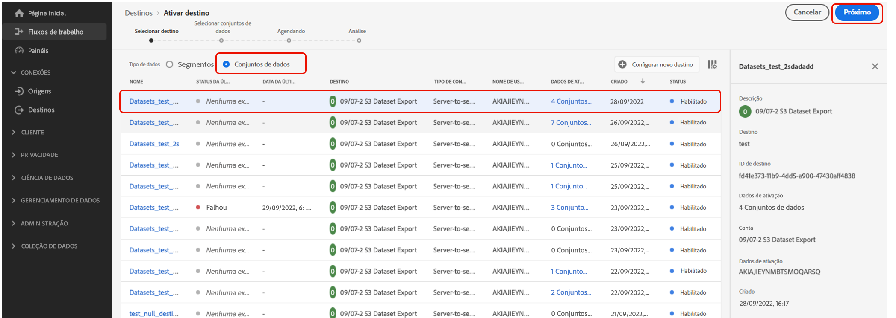
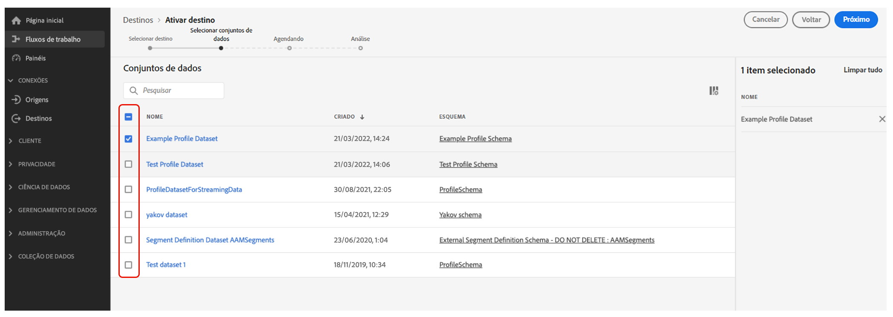

# Exportar conjuntos de dados para locais de armazenamento na nuvem {#export-datasets}

O Journey Optimizer permite estabelecer uma conexão ativa com locais de armazenamento na nuvem para exportar o conteúdo de seus conjuntos de dados.

Ao exportar seus dados periodicamente, você pode garantir um registro completo e atualizado das interações com o cliente, disponibilizando-o prontamente para fins de emissão de relatórios, arquivamento ou análise de dados.

## Destinos de armazenamento na nuvem disponíveis {#destinations}

Você pode exportar conjuntos de dados para seis destinos de armazenamento na nuvem acessíveis pelo **[!UICONTROL Destinos]** no menu, no **[!UICONTROL Catálogo]** guia.

Informações detalhadas sobre cada destino estão disponíveis na documentação do Adobe Experience Platform:

* [Amazon S3](https://experienceleague.adobe.com/docs/experience-platform/destinations/catalog/cloud-storage/amazon-s3.html)
* [Azure Blob](https://experienceleague.adobe.com/docs/experience-platform/destinations/catalog/cloud-storage/azure-blob.html)
* [Azure Data Lake Gen 2](https://experienceleague.adobe.com/docs/experience-platform/destinations/catalog/cloud-storage/adls-gen2.html)
* [Data Landing Zone](https://experienceleague.adobe.com/docs/experience-platform/destinations/catalog/cloud-storage/data-landing-zone.html)
* [Armazenamento em nuvem Google](https://experienceleague.adobe.com/docs/experience-platform/destinations/catalog/cloud-storage/google-cloud-storage.html)
* [SFTP](https://experienceleague.adobe.com/docs/experience-platform/destinations/catalog/cloud-storage/sftp.html)

## Conjuntos de dados disponíveis para exportação {#datasets}

Entenda na tabela abaixo quais conjuntos de dados do Journey Optimizer você pode exportar.

| Conjunto de dados | Descrição |
| ------- | ------- | 
| Conjunto de dados do evento de feedback CCO do AJO | Conjunto de dados do evento de feedback CCO do AJO |
| Conjunto de dados de classificação do AJO | Conjunto de dados para assimilar eventos de feedback de aplicativos de email e por push do Journey Optimizer. Criado pelo SDK. |
| Conjunto de dados do serviço de consentimento do AJO | Armazena informações de consentimento de um perfil. |
| Conjunto de dados do evento de experiência de rastreamento de email do AJO | Logs de interação para o canal de email, que é usado para fins de criação de relatórios e público-alvo.  |
| Conjunto de dados de entidade do AJO | Conjunto de dados para armazenar metadados de entidade para mensagens enviadas ao usuário final.  |
| Conjunto de dados do evento de atividade de entrada do AJO | Conjunto de dados para canais na Web e no aplicativo do Journey Optimizer para eventos de entrega e interação. |
| Conjunto de dados do perfil de mensagens interativas do AJO | Armazena perfis criados para oferecer suporte a campanhas acionadas por API |
| Conjunto de dados do evento de feedback de mensagem do AJO | Logs de entrega de mensagens. Informações sobre todas as entregas de mensagens do Journey Optimizer para fins de criação de relatórios e de público-alvo. O feedback dos ISPs de email sobre rejeições também é registrado neste conjunto de dados. |
| Extensão de contadores de perfil do AJO | Contém um mapa de objetos contendo counter_value e expiryDate, digitado por counter_id |
| Conjunto de dados do perfil de push do AJO | Armazena tokens de push de um perfil. |
| Conjunto de dados do evento de experiência de rastreamento de push do AJO | Logs de interação para canal de push usados para relatórios e criação de público-alvo.  |
| Conjunto de dados do AJO Surfaces | Conjunto de dados vazio relacionado ao esquema de Superfícies de entrada do Journey Optimizer |
| OutputForUPSDataset | Contém todas as associações de público-alvo do AO a serem gravadas no UPS |
| Conjunto de dados do perfil do Audience Orchestration | Gerado por composição de público-alvo para públicos-alvo de Composição de público-alvo. Contém todos os públicos-alvo de composição de público-alvo, seus atributos e dados de enriquecimento |
| Repositório de objetos de decisão - Atividades | também conhecido como Decisões na interface do usuário do. Mas esses são os objetos que um usuário cria que reúne todos os elementos, incluindo a lógica de decisão. Por exemplo, para uma disposição específica (localização), quais ofertas devem ser consideradas (coleção de ofertas) e qual método de classificação usar nessas ofertas. |
| Repositório de objetos de decisão - Ofertas substitutas | este é o repositório para o outro tipo de oferta que um usuário cria. Especificamente, se não estiverem qualificados para ver uma oferta personalizada e precisarem ver algo, pelo menos verão a oferta substituta. Esse conjunto de dados contém os atributos desse tipo de oferta |
| Repositório de objetos de decisão - Ofertas personalizadas | este é o repositório para um tipo de oferta que um usuário cria. Portanto, esse conjunto de dados contém os atributos sobre esse tipo de oferta | Ultimate |
| Repositório de objetos de decisão - Posicionamentos | este é o repositório de objetos que definem o local onde uma oferta precisa ser exibida. |
| Eventos de etapa da jornada | Captura todos os eventos de experiência de etapa de Jornada gerados no Journey Optimizer para serem consumidos por serviços como relatórios. |
| Jornadas | Informações sobre o conjunto de dados de metadados que contém cada etapa de uma jornada |
| ODE DecisionEvents - decisão de produção | Sempre que tomamos uma decisão com base em uma solicitação, contamos isso como um evento de decisão |

## Pré-requisitos {#prerequisites}

Para exportar conjuntos de dados, é necessário [permissões de controle de acesso](https://experienceleague.adobe.com/docs/experience-platform/access-control/home.html#permissions) listado abaixo. Leia o [visão geral do controle de acesso](https://experienceleague.adobe.com/docs/experience-platform/access-control/ui/overview.html) ou entre em contato com o administrador do produto para obter as permissões necessárias.

| Categoria | Permissão |
|--|--|
| Destinos | Gerenciar e ativar destinos do conjunto de dados |
| Gerenciamento de dados | Visualizar conjuntos de dados |
| Destinos | Exibir destinos |

## Etapas principais para exportar conjuntos de dados {#main-steps}

As principais etapas para exportar um conjunto de dados para um local de armazenamento na nuvem são as seguintes:

Informações detalhadas sobre cada etapa estão disponíveis na documentação do Adobe Experience Platform: [Exportar conjuntos de dados para destinos de armazenamento na nuvem](https://experienceleague.adobe.com/docs/experience-platform/destinations/ui/activate/export-datasets.html).

1. **Configurar o destino do armazenamento na nuvem**. Se ainda não tiver feito isso, conecte-se a um destino de armazenamento na nuvem no catálogo de destinos. [Saiba como criar uma nova conexão de destino](https://experienceleague.adobe.com/docs/experience-platform/destinations/ui/connect-destination.html#setup)

   <!---->

1. **Selecionar o destino do armazenamento na nuvem** para onde deseja exportar seus conjuntos de dados. No catálogo de destinos, clique no link **[!UICONTROL Exportar conjuntos de dados]** no cartão desejado e selecione a conexão a ser usada.

   <!---->

   >[!NOTE]
   >
   >Se você estiver usando o Adobe Journey Optimizer juntamente com perfis de clientes em tempo real, os cartões de destino exibirão um botão &quot;Ativar&quot;, permitindo exportar conjuntos de dados e ativar públicos-alvo para esse destino, dependendo das permissões ativadas.

1. **Selecionar os conjuntos de dados** que deseja exportar para o destino selecionado. [Saiba mais sobre os conjuntos de dados do Journey Optimizer disponíveis para exportação](#datasets)

   <!---->

1. **Agendar a exportação** do seu conjunto de dados. Especifique quando a exportação deve começar e em que frequência ela deve ocorrer.

   <!---->

1. **Revisar e confirmar a exportação** verificando o resumo exibido no final da configuração.

   <!---->

Quando a exportação for concluída, o conteúdo do conjunto de dados será depositado no local de armazenamento na nuvem de acordo com o agendamento configurado. [Saiba como verificar se a exportação do conjunto de dados foi bem-sucedida](https://experienceleague.adobe.com/docs/experience-platform/destinations/ui/activate/export-datasets.html#verify)
