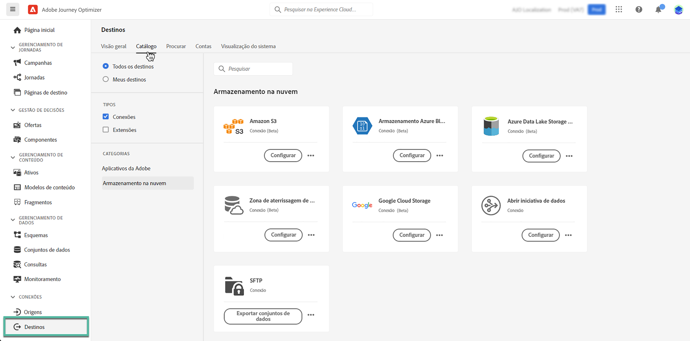

# Exportar conjuntos de dados para locais de armazenamento na nuvem {#export-datasets}

>[!AVAILABILITY]
>
>O recurso de exportação de conjuntos de dados está atualmente na versão beta e disponível para todos os usuários do Adobe Journey Optimizer. Entre em contato com seu representante da Adobe para obter acesso aos destinos, caso ainda não o tenha.

O Journey Optimizer permite estabelecer uma conexão ativa com locais de armazenamento na nuvem para exportar o conteúdo de seus conjuntos de dados.

Ao exportar seus dados periodicamente, você pode garantir um registro completo e atualizado das interações com o cliente, usar essas informações para fins de relatório ou análise e manter a conformidade com os requisitos legais.

## Destinos de armazenamento na nuvem disponíveis {#destinations}

Você pode exportar conjuntos de dados para seis destinos de armazenamento na nuvem acessíveis pelo **[!UICONTROL Destinos]** no menu, no **[!UICONTROL Catálogo]** guia.

>[!AVAILABILITY]
>
>Todos esses destinos estão disponíveis na versão beta e estão sujeitos a alterações.

Informações detalhadas sobre cada destino estão disponíveis na documentação do Adobe Experience Platform:

* [Amazon S3](https://experienceleague.adobe.com/docs/experience-platform/destinations/catalog/cloud-storage/amazon-s3.html)
* [Azure Blob](https://experienceleague.adobe.com/docs/experience-platform/destinations/catalog/cloud-storage/azure-blob.html)
* [Azure Data Lake Gen 2](https://experienceleague.adobe.com/docs/experience-platform/destinations/catalog/cloud-storage/adls-gen2.html)
* [Zona de aterrissagem de dados](https://experienceleague.adobe.com/docs/experience-platform/destinations/catalog/cloud-storage/data-landing-zone.html)
* [Armazenamento em nuvem Google](https://experienceleague.adobe.com/docs/experience-platform/destinations/catalog/cloud-storage/google-cloud-storage.html)
* [SFTP](https://experienceleague.adobe.com/docs/experience-platform/destinations/catalog/cloud-storage/sftp.html)

## Pré-requisitos {#prerequisites}

Verifique os seguintes pré-requisitos antes de começar a exportar seus conjuntos de dados:

* Para exportar conjuntos de dados, é necessário **Gerenciar destinos**, **Exibir destinos**, **Ativar destinos**, e **Gerenciar e ativar destinos do conjunto de dados** [permissões de controle de acesso](https://experienceleague.adobe.com/docs/experience-platform/access-control/home.html#permissions). Leia o [visão geral do controle de acesso](https://experienceleague.adobe.com/docs/experience-platform/access-control/ui/overview.html) ou entre em contato com o administrador do produto para obter as permissões necessárias.

* Esse recurso suporta a exportação de dados somente da primeira geração, ou seja, dados brutos conforme definidos na variável [Descrição do produto Real-time Customer Data Platform](https://helpx.adobe.com/legal/product-descriptions/real-time-customer-data-platform-b2c-edition-prime-and-ultimate-packages.html). Verifique se o conjunto de dados que você deseja exportar não contém dados de segunda geração.

## Etapas principais para exportar conjuntos de dados {#main-steps}

As principais etapas para exportar um conjunto de dados para um local de armazenamento na nuvem são as seguintes:

Informações detalhadas sobre cada etapa estão disponíveis na documentação do Adobe Experience Platform: [Exportar conjuntos de dados para destinos de armazenamento na nuvem](https://experienceleague.adobe.com/docs/experience-platform/destinations/ui/activate/export-datasets.html).

1. **Configurar o destino do armazenamento na nuvem**. Se ainda não tiver feito isso, conecte-se a um destino de armazenamento na nuvem do catálogo de destinos. [Saiba como criar uma nova conexão de destino](https://experienceleague.adobe.com/docs/experience-platform/destinations/ui/connect-destination.html#setup)

   <!---->

1. **Selecionar o destino do armazenamento na nuvem** para onde deseja exportar seus conjuntos de dados. No catálogo de destinos, clique no link **[!UICONTROL Exportar conjuntos de dados]** no cartão desejado e selecione a conexão a ser usada.

   <!---->

   >[!NOTE]
   >
   >Se você estiver usando o Adobe Journey Optimizer juntamente com perfis de clientes em tempo real, os cartões de destino exibirão um botão &quot;Ativar&quot;, permitindo exportar conjuntos de dados e ativar segmentos para esse destino, dependendo das permissões ativadas.

1. **Selecionar os conjuntos de dados** que deseja exportar para o destino selecionado.

   <!---->

1. **Agendar a exportação** do seu conjunto de dados. Especifique quando a exportação deve começar e em que frequência ela deve ocorrer.

   <!---->

1. **Revisar e confirmar a exportação** verificando o resumo exibido no final da configuração.

   <!---->

Quando a exportação for concluída, o conteúdo do conjunto de dados será depositado no local de armazenamento na nuvem de acordo com o agendamento configurado. [Saiba como verificar se a exportação do conjunto de dados foi bem-sucedida](https://experienceleague.adobe.com/docs/experience-platform/destinations/ui/activate/export-datasets.html#verify)
