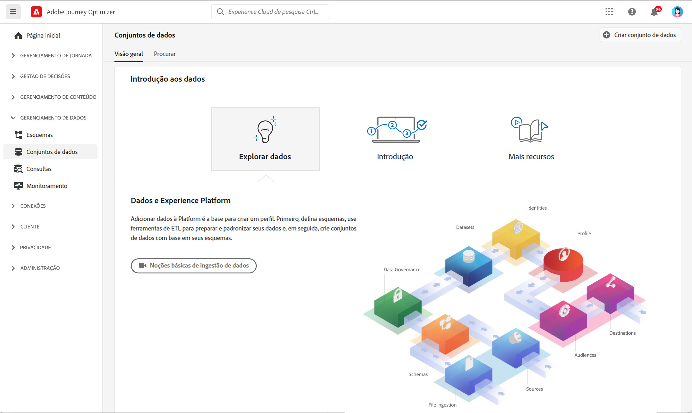
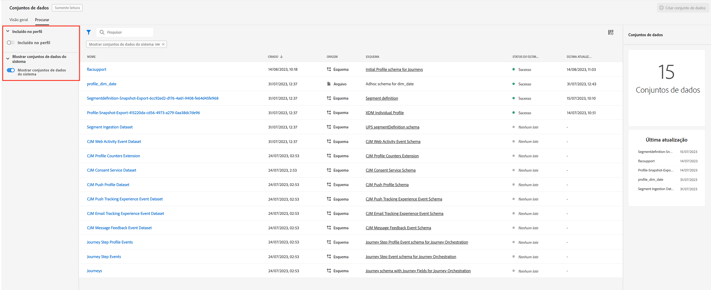
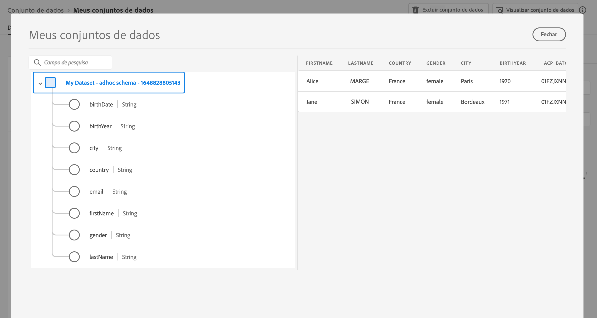

# Introdução aos Conjuntos de dados {#datasets-gs}

Todos os dados assimilados na Adobe Experience Platform são mantidos no Data Lake como conjuntos de dados. Um conjunto de dados é uma construção de armazenamento e gerenciamento para uma coleção de dados, normalmente uma tabela, que contém um esquema (colunas) e campos (linhas).

## Acessar conjuntos de dados{#access-datasets}

O espaço de trabalho dos **Conjuntos de dados** na interface [!DNL Adobe Journey Optimizer] permite explorar dados e criar conjuntos de dados.

Selecionar **Conjuntos de dados** na navegação à esquerda para abrir o painel Conjuntos de dados.

Adicionar dados à [!DNL Adobe Experience Platform] é a base para criar um Perfil. Você poderá aproveitar os perfis no [!DNL Adobe Journey Optimizer]. Primeiro, defina esquemas, use ferramentas de ETL para preparar e padronizar seus dados e, em seguida, crie conjuntos de dados com base em seus esquemas.

Selecione a guia **Procurar** para exibir a lista de todos os conjuntos de dados disponíveis para sua organização. Os detalhes são exibidos para cada conjunto de dados listado, incluindo seu nome, o esquema ao qual o conjunto de dados adere e o status da execução de ingestão mais recente.

Por padrão, somente os conjuntos de dados assimilados são exibidos. Se quiser ver os conjuntos de dados gerados pelo sistema, alterne **Mostrar conjuntos de dados do sistema** no filtro.

Selecione o nome de um conjunto de dados para acessar a tela de atividade do Conjunto de dados e ver os detalhes do conjunto de dados selecionado. A guia Atividade inclui um gráfico que visualiza a taxa de mensagens que estão sendo consumidas, bem como uma lista de lotes bem-sucedidos e com falha.

Estes são os diferentes conjuntos de dados disponíveis:

**Relatórios**

* _Relatório - Conjunto de dados do evento de feedback de mensagem_: Logs de entrega de mensagens. Informações sobre todas as entregas de mensagens do Journey Optimizer para fins de criação de relatórios e segmentos. O feedback dos ISPs de email sobre rejeições também são registrados neste conjunto de dados.
* _Relatórios - Conjunto de dados do evento de experiência de rastreamento de email_: Logs de interação para o canal de email usado para fins de criação de relatórios e segmentos. As informações armazenadas informam as ações executadas pelo usuário final no email (aberturas, cliques etc.).
* _Relatórios - Conjunto de dados do evento de experiência de rastreamento de push_: Logs de interação para o canal de push usado para fins de criação de relatórios e segmentos. As informações armazenadas informam as ações executadas pelo usuário final nas notificações por push.
* _Relatórios - Evento de etapa da jornada_: Captura todos os eventos de experiência em etapas da jornada gerados no Journey Optimizer para serem consumidos por serviços como Relatórios. Também é essencial para criar relatórios no Customer Journey Analytics para análise YoY. Vinculado a um Metadado de jornada.
* _Relatórios - Jornadas_: Informações de hospedagem do conjunto de dados de metadados de cada etapa em uma jornada.
* _Relatórios - Cco_: Conjunto de dados de evento de feedback que armazena os logs de entrega para emails CCO. A ser usado para fins de relatório.

**Consentimento**

* _Conjunto de dados do serviço de consentimento_: armazena informações de consentimento de um perfil.

**Serviços inteligentes**

* _Pontuações de otimização de tempo de envio/Pontuações de engajamento_: Pontuações de saída da IA de jornada.

Para exibir a lista completa de campos e atributos para cada esquema, consulte o [Dicionário de esquema do Journey Optimizer](https://experienceleague.adobe.com/tools/ajo-schemas/schema-dictionary.html?lang=pt-BR){target="_blank"}.

## Visualizar conjuntos de dados{#preview-datasets}

Na tela de atividade do Conjunto de dados, selecione **Visualizar conjunto de dados** próximo ao canto superior direito da tela para visualizar o lote bem-sucedido mais recente nesse conjunto de dados. Quando um conjunto de dados está vazio, o link de visualização é desativado.

## Criar conjuntos de dados{#create-datasets}

Para criar um novo conjunto de dados, comece selecionando **Criar conjunto de dados** no painel Conjuntos de dados .

É possível:

* Criar conjunto de dados a partir do esquema. [Saiba mais nesta documentação](https://experienceleague.adobe.com/docs/experience-platform/catalog/datasets/user-guide.html?lang=pt-BR#schema){target="_blank"}
* Criar um conjunto de dados a partir de um arquivo CSV. [Saiba mais nesta documentação](https://experienceleague.adobe.com/docs/experience-platform/ingestion/tutorials/map-a-csv-file.html?lang=pt-BR){target="_blank"}

Veja este vídeo para saber como criar um conjunto de dados, mapeá-lo para um esquema, adicionar dados a ele e confirmar se os dados foram assimilados.

>[!VIDEO](https://video.tv.adobe.com/v/334293?quality=12)

## Governança de dados

Em um conjunto de dados, navegue pela guia **Governança de dados** para verificar rótulos no conjunto de dados e no nível do campo. A Governança de dados categoriza os dados de acordo com o tipo de políticas aplicáveis.

Um dos recursos principais da [!DNL Adobe Experience Platform] é reunir dados de vários sistemas corporativos para melhor permitir que os profissionais de marketing identifiquem, entendam e envolvam clientes. Esses dados podem estar sujeitos a restrições de uso definidas por sua organização ou por regulamentos legais. Portanto, é importante garantir que suas operações de dados estejam em conformidade com as políticas de uso de dados.

A [!DNL Adobe Experience Platform Data Governance] permite gerenciar os dados do cliente e garantir a conformidade com as regulamentações, restrições e políticas aplicáveis ao uso dos dados. Ela desempenha uma função essencial na Experience Platform em vários níveis, incluindo catalogação, linhagem de dados, rotulagem de uso de dados, políticas de uso de dados e controle do uso de dados para ações de marketing.

Saiba mais sobre Governança de dados e rótulos de uso de dados na [Documentação de Governança de dados](https://experienceleague.adobe.com/docs/experience-platform/data-governance/labels/user-guide.html?lang=pt-BR){target="_blank"}

## Exemplos e casos de uso{#uc-datasets}

Saiba como criar um esquema, um conjunto de dados e assimilar dados para adicionar perfis de teste no Adobe Journey Optimizer [nesta amostra completa](../segment/creating-test-profiles.md)

Saiba mais sobre a criação de conjuntos de dados na [documentação da Adobe Experience Platform](https://experienceleague.adobe.com/docs/experience-platform/catalog/datasets/overview.html?lang=pt-BR){target="_blank"}.

Saiba como usar a interface de conjuntos de dados na [Documentação de visão geral da ingestão de dados](https://experienceleague.adobe.com/docs/experience-platform/ingestion/home.html?lang=pt-BR){target="_blank"}.

Uma lista de casos de uso com exemplos de consultas está disponível [aqui](../data/datasets-query-examples.md).

**Consulte também**

* [Visão geral da ingestão de streaming](https://experienceleague.adobe.com/docs/experience-platform/ingestion/streaming/overview.html?lang=pt-BR){target="_blank"}
* [Assimilar dados na Adobe Experience Platform](https://experienceleague.adobe.com/docs/experience-platform/ingestion/tutorials/ingest-batch-data.html?lang=pt-BR){target="_blank"}
