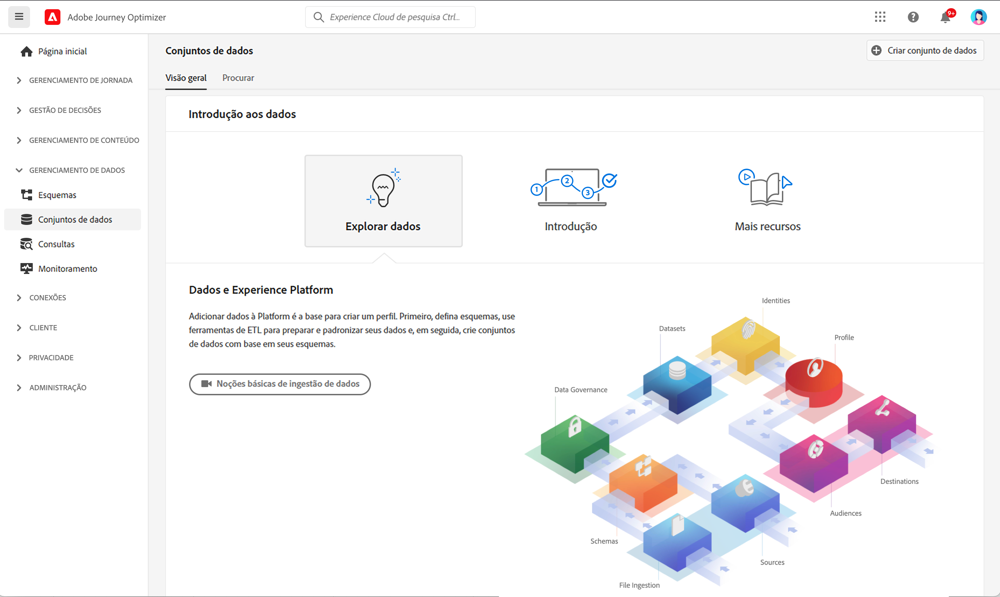
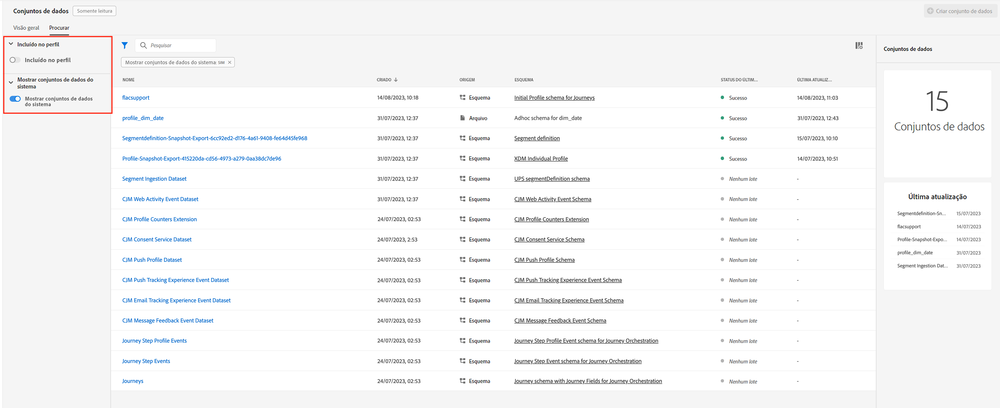
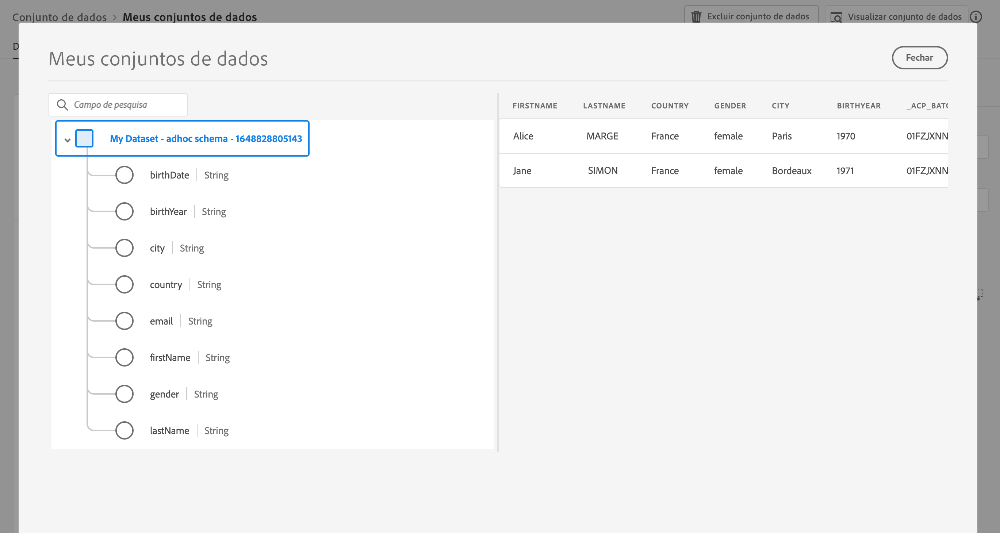

# Introdução a conjuntos de dados {#datasets-gs}

>[!BEGINSHADEBOX]

**Nesta página:** saiba como acessar, criar e controlar conjuntos de dados do Adobe Experience Platform para poder armazenar e explorar os dados que alimentam o jornada, as campanhas e os relatórios no Adobe Journey Optimizer.

>[!ENDSHADEBOX]

Todos os dados assimilados na Adobe Experience Platform são mantidos no Data Lake como conjuntos de dados. Um conjunto de dados é uma construção de armazenamento e gerenciamento para uma coleção de dados, normalmente uma tabela, que contém um esquema (colunas) e campos (linhas).

## Medidas de proteção e limitações

* A partir de 1º de novembro de 2024, a segmentação por transmissão se tornou incompatível com eventos de envio e abertura dos conjuntos de dados de rastreamento e feedback do [!DNL Journey Optimizer]. Para implementar o Limite de frequência ou o Gerenciamento de fadiga, use as Regras de negócio. É possível encontrar mais detalhes [nesta seção](../conflict-prioritization/rule-sets.md), incluindo uma explicação de caso de uso para o limite diário [aqui](https://experienceleaguecommunities.adobe.com/t5/journey-optimizer-blogs/elevate-customer-experience-with-daily-frequency-capping-in-ajo/ba-p/761510){target="_blank"}.

* Com início em fevereiro de 2025, uma medida de proteção de tempo de vida (TTL) está sendo implantada nos conjuntos de dados gerados pelo sistema do Journey Optimizer. [Saiba mais](datasets-ttl.md)

* A ativação de um conjunto de dados para o Perfil tem implicações permanentes no nível do esquema. Planeje cuidadosamente o esquema e o design de identidade antes de ativar. [Saiba mais](#profile-datasets)

## Acessar conjuntos de dados {#access}

O espaço de trabalho **Conjuntos de dados** na interface do [!DNL Adobe Journey Optimizer] permite explorar dados e criar conjuntos de dados. Para abrir o painel Conjuntos de dados, selecione **Conjuntos de dados** na navegação à esquerda.

Selecione a guia **Procurar** para exibir a lista de todos os conjuntos de dados disponíveis para sua organização. Os detalhes são exibidos para cada conjunto de dados listado, incluindo o seu nome, o esquema ao qual o conjunto de dados adere e o status da execução de ingestão mais recente. Por padrão, somente os conjuntos de dados assimilados são exibidos. Se quiser ver os conjuntos de dados gerados pelo sistema, habilite o botão de alternância **Mostrar conjuntos de dados do sistema** no filtro.

Selecione o nome de um conjunto de dados para acessar a tela de atividade do Conjunto de dados e ver os detalhes do conjunto de dados selecionado. A guia Atividade inclui um gráfico que visualiza a taxa de mensagens que estão sendo consumidas, bem como uma lista de lotes bem-sucedidos e com falha.

Para visualizar um conjunto de dados, selecione **Visualizar conjunto de dados** próximo ao canto superior direito da tela para visualizar o lote bem-sucedido mais recente nesse conjunto de dados. Quando um conjunto de dados está vazio, o link de visualização é desativado.

## Conjuntos de dados do sistema do [!DNL Journey Optimizer] {#system-datasets}

Estas seções listam os conjuntos de dados do sistema usados pelo [!DNL Journey Optimizer]. Para exibir a lista completa de campos e atributos de cada esquema, consulte o [Dicionário de esquema do Journey Optimizer](https://experienceleague.adobe.com/tools/ajo-schemas/schema-dictionary.html?lang=pt-BR){target="_blank"}.

>[!CAUTION]
>
> Os conjuntos de dados do sistema **não devem ser modificados**. Qualquer alteração será revertida automaticamente com cada atualização do produto.

* Relatório

   * _Relatório - Conjunto de dados do evento de feedback de mensagem_: logs de entrega de mensagens. Informações sobre todas as entregas de mensagens do Journey Optimizer para fins de criação de relatórios e de público-alvo. O feedback dos ISPs de email sobre rejeições também é registrado neste conjunto de dados. **Este conjunto de dados usa assimilação em lote — espere uma latência de dados de até 2 horas.**
   * _Relatórios – Conjunto de dados de evento de experiência de rastreamento de email_: logs de interação do canal de email e dados de contexto do canal do WhatsApp no grupo de campos `whatsAppChannelContext`. Usado para relatórios e criação de público-alvo. As informações armazenadas incluem ações realizadas pelo usuário final no email (aberturas, cliques etc.) e interações do WhatsApp.
   * _Relatórios - Conjunto de dados do evento de experiência de rastreamento de push_: logs de interação para o canal de push usado para fins de criação de relatórios e de público-alvo. As informações armazenadas informam as ações executadas pelo usuário final nas notificações por push.
   * _Relatórios - Evento de etapa da jornada_: Captura todos os eventos de experiência em etapas da jornada gerados no Journey Optimizer para serem consumidos por serviços como Relatórios. Também é essencial para criar relatórios no Customer Journey Analytics para análise YoY. Vinculado a um Metadado de jornada.
   * _Relatórios - Jornadas_: Informações de hospedagem do conjunto de dados de metadados de cada etapa em uma jornada.
   * _Relatórios - Cco_: Conjunto de dados de evento de feedback que armazena os logs de entrega para emails CCO. A ser usado para fins de relatório.

* Consentimento

  _Conjunto de dados do serviço de consentimento_: armazena informações de consentimento de um perfil.

* Exportação de mensagem

  _Conjunto de dados de exportação de mensagens do AJO_: armazena o conteúdo de emails e mensagens SMS enviados para fins de exportação. Os registros são mantidos por 7 dias corridos a partir da data de ingestão. Disponível somente para organizações que compraram o complemento Exportação de mensagem. [Saiba mais](../configuration/message-export.md)

* Serviços inteligentes

  _Pontuações de otimização de tempo de envio/Pontuações de engajamento_: pontuações de saída da IA de jornada.

* Entrada

  _Conjunto de dados de eventos de atividade de entrada do AJO_: armazena eventos de atividade de entrada para mensagens de entrada recebidas no [!DNL Journey Optimizer].

>[!NOTE]
>
>Um perfil deve ter pelo menos uma mensagem enviada de [!DNL Journey Optimizer] antes que as mensagens de entrada sejam capturadas neste conjunto de dados.

## Criar conjuntos de dados{#create-datasets}

Adicionar dados à [!DNL Adobe Experience Platform] é a base para criar um Perfil. Você poderá aproveitar os perfis no [!DNL Adobe Journey Optimizer]. Primeiro, defina esquemas, use ferramentas de ETL para preparar e padronizar seus dados e, em seguida, crie conjuntos de dados com base em seus esquemas.

É possível criar um conjunto de dados a partir de um esquema ou um arquivo CSV. Informações detalhadas sobre a criação de conjuntos de dados estão disponíveis na documentação da [!DNL Adobe Experience Platform]:

* [Criar um conjunto de dados com um esquema existente](https://experienceleague.adobe.com/pt-br/docs/experience-platform/catalog/datasets/user-guide#schema){target="_blank"}
* [Mapear um arquivo CSV para um esquema XDM existente](https://experienceleague.adobe.com/pt-br/docs/experience-platform/ingestion/tutorials/map-csv/existing-schema){target="_blank"}

Veja este vídeo para saber como criar um conjunto de dados, mapeá-lo para um esquema, adicionar dados a ele e confirmar se os dados foram ingeridos.

>[!VIDEO](https://video.tv.adobe.com/v/334293?quality=12)

## Ativar conjuntos de dados para o Perfil {#profile-datasets}

Ao criar um conjunto de dados, você pode habilitá-lo para contribuir com o [Perfil de cliente em tempo real](../audience/get-started-profiles.md). Isso permite que os dados que ele contém sejam usados para segmentação, personalização e condições de jornada no [!DNL Journey Optimizer].

Antes de ativar, lembre-se do seguinte:

* **A habilitação do esquema é permanente.** Depois que o esquema subjacente a um conjunto de dados é ativado para o Perfil, isso não pode ser revertido — o esquema não pode ser desativado ou excluído. Somente o conjunto de dados em si pode ser desativado ou excluído separadamente.
* **Desabilitar um conjunto de dados tem consequências.** Você pode desativar ou excluir um conjunto de dados para o Perfil independentemente do esquema, mas isso remove os registros do perfil associado e pode interromper a segmentação e os fluxos de trabalho de ativação.
* **Planeje sua configuração antes de habilitar.** Os campos de identidade e as seleções de grupos de campos tornam-se mais difíceis de alterar após a ativação do Perfil. Finalize o design do esquema primeiro.

Para obter orientação detalhada, consulte a documentação do Adobe Experience Platform:

* [Planejamento de habilitação do perfil](https://experienceleague.adobe.com/en/docs/experience-platform/xdm/schema/profile-enablement-planning){target="_blank"} — lista de verificação de pré-habilitação que abrange configuração de identidade, seleção de grupo de campos e validação de finalidade de conjunto de dados.
* [Gerenciamento de esquemas habilitados para perfil](https://experienceleague.adobe.com/en/docs/experience-platform/xdm/schema/best-practices#managing-profile-enabled-schemas){target="_blank"} — orientação sobre como descontinuar esquemas habilitados para perfil, incluindo estratégias de renomeação.

## Governança de dados

Em um conjunto de dados, navegue pela guia **Governança de dados** para verificar rótulos no conjunto de dados e no nível do campo. A Governança de dados categoriza os dados de acordo com o tipo de políticas aplicáveis.

Um dos recursos principais da [!DNL Adobe Experience Platform] é reunir dados de vários sistemas corporativos para melhor permitir que os profissionais de marketing identifiquem, entendam e envolvam clientes. Esses dados podem estar sujeitos a restrições de uso definidas por sua organização ou por regulamentos legais. Portanto, é importante garantir que suas operações de dados estejam em conformidade com as políticas de uso de dados.

A [!DNL Adobe Experience Platform Data Governance] permite gerenciar os dados do cliente e garantir a conformidade com as regulamentações, restrições e políticas aplicáveis ao uso dos dados. Ela desempenha uma função essencial na Experience Platform em vários níveis, incluindo catalogação, linhagem de dados, rotulagem de uso de dados, políticas de uso de dados e controle do uso de dados para ações de marketing.

Saiba mais sobre Governança de dados e rótulos de uso de dados na [Documentação de governança de dados](https://experienceleague.adobe.com/docs/experience-platform/data-governance/labels/user-guide.html?lang=pt-BR){target="_blank"}

## Exemplo e casos de uso {#samples}

* [Tutorial: assimilar dados na Adobe Experience Platform](https://experienceleague.adobe.com/docs/experience-platform/ingestion/tutorials/ingest-batch-data.html?lang=pt-BR){target="_blank"}
* [Caso de uso de ponta a ponta](../audience/creating-test-profiles.md) - Criar um esquema, um conjunto de dados e assimilar dados para adicionar perfis de teste no [!DNL Adobe Journey Optimizer]
* [Exemplos de consulta](../data/datasets-query-examples.md) - Conjuntos de dados do [!DNL Adobe Journey Optimizer] e casos de uso relacionados.

>[!MORELIKETHIS]
>
>* [Introdução à gestão de dados no Journey Optimizer](gs-data.md)
>* [Documentação de conjuntos de dados](https://experienceleague.adobe.com/docs/experience-platform/catalog/datasets/overview.html?lang=pt-BR){target="_blank"}
>* [Documentação de ingestão de dados](https://experienceleague.adobe.com/docs/experience-platform/ingestion/home.html?lang=pt-BR){target="_blank"}.
>* [Práticas recomendadas dos direitos da licença de gerenciamento de dados](https://experienceleague.adobe.com/pt-br/docs/experience-platform/landing/license/data-management-best-practices#data-management-best-practices){target="_blank"}
>* [Gerenciamento de esquemas habilitados para perfil](https://experienceleague.adobe.com/en/docs/experience-platform/xdm/schema/best-practices#managing-profile-enabled-schemas){target="_blank"}
