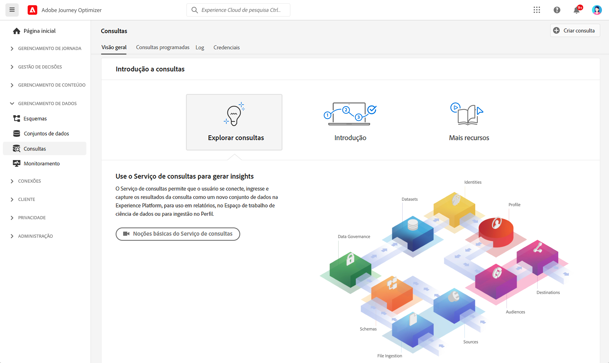

# Introdução a consultas {#queries-gs}

>[!BEGINSHADEBOX]

**Nesta página:** use o Editor de consultas fornecido pelo Serviço de consulta da Adobe Experience Platform para que você possa gravar, validar e executar consultas nos dados de experiência do cliente para análise e exploração de dados no Adobe Journey Optimizer.

>[!ENDSHADEBOX]

O Editor de consultas é uma ferramenta interativa fornecida pelo Serviço de consultas da Adobe Experience Platform que permite gravar, validar e executar consultas para dados de experiência do cliente na interface [!DNL Adobe Journey Optimizer].

O Editor de consultas oferece suporte ao desenvolvimento de consultas para análise e exploração de dados e permite que você execute consultas interativas para fins de desenvolvimento, bem como consultas não interativas para preencher [conjuntos de dados](get-started-datasets.md).

Saiba como usar o Editor de consultas [nesta documentação](https://experienceleague.adobe.com/docs/experience-platform/query/ui/user-guide.html?lang=pt-BR){target="_blank"}.

>[!MORELIKETHIS]
>
>* [Documentação do serviço de consulta](https://experienceleague.adobe.com/docs/experience-platform/query/home.html?lang=pt-BR){target="_blank"}
>* [Vídeo de visão geral do serviço de consulta](https://experienceleague.adobe.com/docs/platform-learn/tutorials/queries/understanding-query-service.html?lang=pt-BR){target="_blank"}
