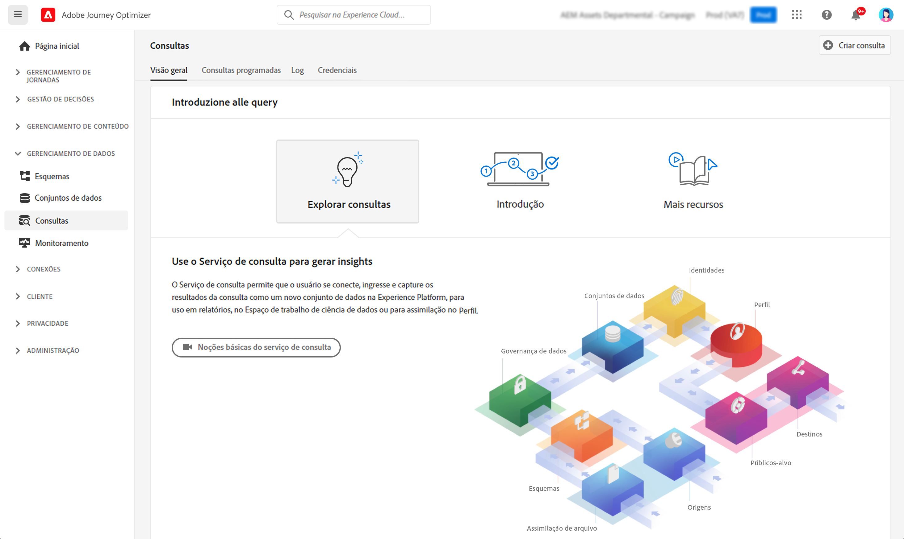

# Introdução a consultas {#queries-gs}

O Editor de consulta é uma ferramenta interativa fornecida pelo Serviço de consulta da Adobe Experience Platform que permite gravar, validar e executar consultas para dados de experiência do cliente na interface [!DNL Adobe Journey Optimizer].

O Editor de consulta oferece suporte ao desenvolvimento de consultas para análise e exploração de dados e permite que você execute consultas interativas para fins de desenvolvimento, bem como consultas não interativas para preencher [conjuntos de dados](get-started-datasets.md).

Saiba como usar o Editor de consulta [nesta documentação](https://experienceleague.adobe.com/docs/experience-platform/query/ui/user-guide.html?lang=pt-BR){target="_blank"}.

>[!MORELIKETHIS]
>
>* [Documentação do Serviço de consulta](https://experienceleague.adobe.com/docs/experience-platform/query/home.html?lang=pt-BR){target="_blank"}
>* [Vídeo de visão geral do serviço de consulta](https://experienceleague.adobe.com/docs/platform-learn/tutorials/queries/understanding-query-service.html?lang=pt-BR){target="_blank"}
