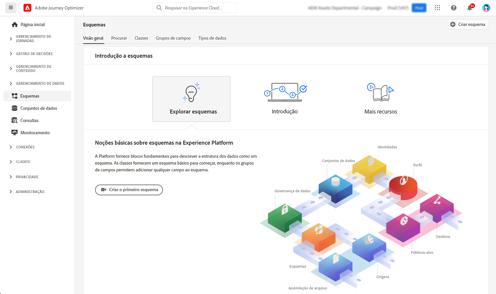

# Introdução à Esquemas {#schemas-gs}

Os Esquemas são a maneira padrão de descrever dados na Experience Platform, permitindo que todos os dados que estão em conformidade com os esquemas sejam reutilizados em uma organização sem conflitos ou até compartilhados entre várias organizações.

➡️ [Saiba como criar e configurar um esquema neste vídeo](#video-schema) (vídeo)

Um esquema é um conjunto de regras que representam e validam a estrutura e o formato dos dados. Em um alto nível, os esquemas fornecem uma definição abstrata de um objeto do mundo real (como uma pessoa) e destacam quais dados devem ser incluídos em cada instância desse objeto (como nome, sobrenome, aniversário e assim por diante).

Saiba como criar esquemas [nesta documentação](https://experienceleague.adobe.com/docs/experience-platform/xdm/schema/composition.html?lang=pt-BR){target="_blank"}

O espaço de trabalho **Esquemas** na interface [!DNL Adobe Journey Optimizer] permite gerenciar os recursos do Experience Data Model (XDM) incluindo esquemas, classes, grupos de campos de esquema e tipos de dados. Você pode visualizar e explorar os recursos principais fornecidos pela Adobe e criar recursos e esquemas personalizados para sua organização.

Saiba como usar a interface de Esquemas [nesta documentação](https://experienceleague.adobe.com/docs/experience-platform/xdm/ui/overview.html?lang=pt-BR){target="_blank"}

A documentação passo a passo para criar um esquema usando o Editor de esquemas está disponível [nesta página](https://experienceleague.adobe.com/docs/experience-platform/xdm/tutorials/create-schema-ui.html?lang=pt-BR){target="_blank"}

Para visualizar a lista completa de campos e atributos para cada esquema, consulte o [Dicionário de esquemas do Journey Optimizer](https://experienceleague.adobe.com/tools/ajo-schemas/schema-dictionary.html?lang=pt-BR){target="_blank"}.

## Vídeo explicativo{#video-schema}

Saiba como criar um esquema, adicionar grupos de campos, criar e configurar grupos de campos personalizados.

>[!VIDEO](https://video.tv.adobe.com/v/334461?quality=12)

**Consulte também**

* [Criar um esquema, um conjunto de dados e assimilar dados para adicionar perfis de teste no Journey Optimizer](../audience/creating-test-profiles.md)
* [Visão geral do sistema XDM](https://experienceleague.adobe.com/docs/experience-platform/xdm/home.html?lang=pt-BR){target="_blank"}
* [Práticas recomendadas para modelagem de dados](https://experienceleague.adobe.com/docs/experience-platform/xdm/schema/best-practices.html?lang=pt-BR){target="_blank"}
* [Criar um esquema usando a API de Registro de Esquema](https://experienceleague.adobe.com/docs/experience-platform/xdm/tutorials/create-schema-api.html?lang=pt-BR){target="_blank"}
* [Definir uma relação entre dois esquemas usando o Editor de esquemas](https://experienceleague.adobe.com/docs/experience-platform/xdm/tutorials/relationship-ui.html?lang=pt-BR){target="_blank"}
