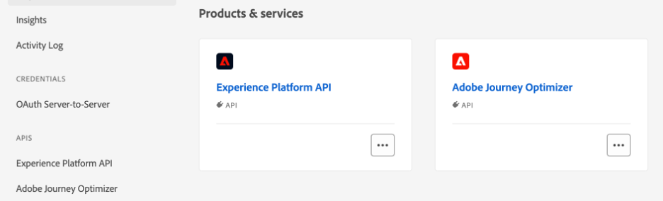

# Usar dados do Adobe Experience Platform {#aep-data}

>[!AVAILABILITY]
>
>No momento, esse recurso está disponível para todos os clientes como um beta público.
>
>Para usar esse recurso, primeiro você deve aceitar os termos beta da sua organização.

O Journey Optimizer permite aproveitar os dados do Adobe Experience Platform em [!DNL Journey Optimizer]. Para fazer isso, os conjuntos de dados necessários para a personalização da pesquisa devem ser habilitados primeiro por meio de uma chamada de API, conforme descrito abaixo. Depois de concluído, você poderá usar os dados com os recursos de personalização e Decisão do [!DNL Journey Optimizer].

## Restrições e diretrizes do Beta {#guidelines}

Antes de começar, reveja as seguintes restrições e diretrizes:

* O **tamanho do conjunto de dados** é limitado a 5 GB para conjuntos de dados de produção e 1 GB para conjuntos de dados de sandbox dev
* **No máximo 50 conjuntos de dados podem ser habilitados** para pesquisa por organização a qualquer momento.
* **O número de registros** está restrito a 5 milhões em conjuntos de dados de produção e 1 milhão em conjuntos de dados de sandbox de desenvolvimento.
* **Rotulagem e Imposição de Uso de Dados** não é imposta no momento para conjuntos de dados habilitados para pesquisa.
* **Os conjuntos de dados habilitados para pesquisa e usados na personalização não estão protegidos contra exclusão**. Cabe a você acompanhar quais conjuntos de dados estão sendo usados para personalização para garantir que eles não sejam excluídos ou removidos.
* **Rotulagem e Imposição de Uso de Dados** não é imposta no momento para conjuntos de dados habilitados para pesquisa.

## Ativar um conjunto de dados para pesquisa de dados {#enable}

Para aproveitar os dados do conjunto de dados para personalização, é necessário usar uma chamada de API para recuperar o status e habilitar o serviço de pesquisa.

### Pré-requisitos {#prerequisites-enable}

* Siga as instruções detalhadas em [esta documentação](https://developer.adobe.com/journey-optimizer-apis/references/authentication/) para configurar seu ambiente para enviar comandos de API.
* O projeto do desenvolvedor deve ter as APIs do Adobe Journey Optimizer e do Adobe Experience Platform adicionadas ao projeto.

  

* Você deve ter permissão de gerenciamento de conjuntos de dados como parte de sua função.
* O esquema no qual o conjunto de dados se baseia deve conter uma **identidade primária** que possa atuar como a chave de pesquisa.

### Estrutura de chamada da API {#call}

```
curl -s -XPATCH "https://platform.adobe.io/data/core/entity/lookup/dataSets/${DATASET_ID}/${ACTION}" \ -H "Authorization: Bearer ${ACCESS_TOKEN}" \ -H "x-api-key: ${API_KEY}" \ -H "x-gw-ims-org-id: ${IMS_ORG}" \ -H "x-sandbox-name: ${SANDBOX_NAME}"
```

Em que:

* **A URL** é `https://platform.adobe.io/data/core/entity/lookup/dataSets/${DATASET_ID}/${ACTION}`
* **ID do Conjunto de Dados** é o conjunto de dados para o qual você deseja habilitar.
* **A ação** está habilitada OU desabilitada.
* O **token de acesso** pode ser recuperado do console do desenvolvedor.
* A **chave de API** pode ser recuperada do console do desenvolvedor.
* **ID da Organização IMS** é sua organização da Adobe.
* **Nome da sandbox** é o nome da sandbox em que o conjunto de dados está (ou seja, prod, dev etc.).

>[!NOTE]
>
>Se você encontrar o erro abaixo ao tentar fazer uma chamada de API para habilitar conjuntos de dados, tente remover as APIs do Adobe Journey Optimizer do projeto do console do desenvolvedor e adicioná-las novamente.
>
>```
>
>"error_code": "403003", 
>"message": "Api Key is invalid"
>
>```

Depois que um conjunto de dados for habilitado para pesquisa usando uma chamada de API, você poderá usar seus dados com os recursos de personalização e Decisão do [!DNL Journey Optimizer].

* [Usar dados da Adobe Experience Platform para personalização](../personalization/aep-data-perso.md)
* [Usar dados do Adobe Experience Platform para a tomada de decisão](../experience-decisioning/aep-data-exd.md)
