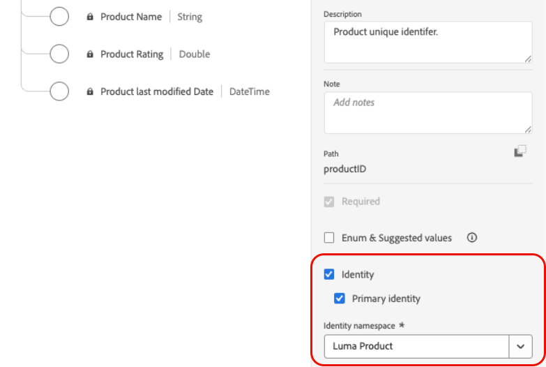
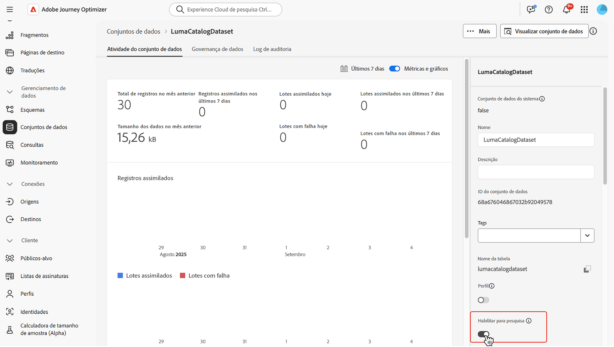
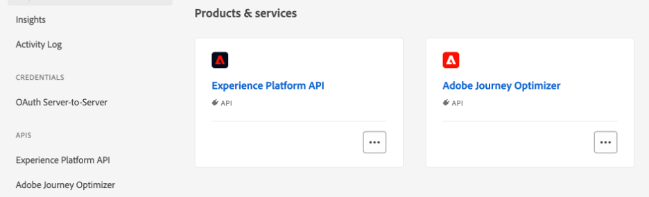
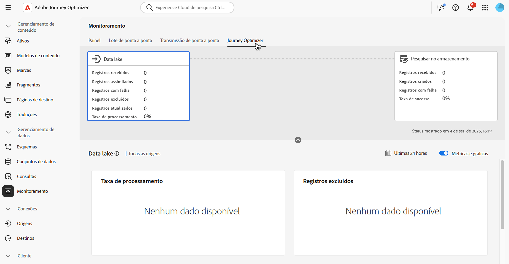

# Usar dados da Adobe Experience Platform {#aep-data}

>[!CONTEXTUALHELP]
>id="lookup-aep-data"
>title="Habilitar para pesquisa"
>abstract="Habilitar um conjunto de dados para pesquisa permite usar seus dados com recursos de personalização, tomada de decisão e orquestração de jornada do Journey Optimizer."

O [!DNL Journey Optimizer] permite aproveitar os dados do [!DNL Adobe Experience Platform] com recursos de personalização, Decisão e orquestração de jornadas. Para fazer isso, os conjuntos de dados baseados em registros necessários para a personalização da pesquisa devem primeiro ser habilitados para o serviço de pesquisa, conforme descrito abaixo.

>[!NOTE]
>
>O recurso de pesquisa de dados só está disponível para um conjunto de organizações (disponibilidade limitada). Para obter acesso, entre em contato com um representante da Adobe. Para obter detalhes completos sobre o ciclo de lançamento e as fases de disponibilidade, consulte o [ciclo de lançamento do Journey Optimizer](../rn/releases.md).

Saiba mais sobre como acessar e trabalhar com conjuntos de dados nesta seção: [Introdução aos conjuntos de dados](../data/get-started-datasets.md)

## Leitura obrigatória

### Medidas de proteção e diretrizes {#guidelines}

Antes de começar, reveja as seguintes restrições e diretrizes:

* **Nenhuma PII nos conjuntos de dados** - Os conjuntos de dados habilitados para pesquisa não devem conter informações pessoais identificáveis (PII).

* **Risco de exclusão** - Os conjuntos de dados usados na personalização não estão protegidos contra exclusão. Você deve rastrear quais conjuntos de dados estão sendo usados para garantir que eles não sejam removidos.

* **Tipo de esquema** - Os conjuntos de dados devem ser associados a um esquema que seja **NOT** do tipo Perfil ou Evento.

* **Manter a opção de pesquisa ativada** - Evitar ativar e desativar repetidamente os conjuntos de dados. Isso pode levar a um comportamento inesperado de indexação. A prática recomendada é deixar o conjunto de dados ativado enquanto você planejar usá-lo para pesquisas.

* **Região de ativação do Edge** - Os conjuntos de dados habilitados para pesquisa estão disponíveis para ativação baseada na borda de entrada somente na região em que a sandbox do conjunto de dados reside (por exemplo, NLD2 ou VA7). Você pode ver a região da sandbox na interface do usuário ao lado do nome da sandbox.

* **Exclusão de dados em lote** - A remoção de um lote de dados do conjunto de dados remove completamente todas as chaves correspondentes do serviço de pesquisa. Por exemplo:

  **Lote 1**: Sku1, Sku2, Sku3\
  **Lote 2**: Sku1, Sku2, Sku3, Sku4, Sku5, Sku6\
  **Lote 3**: Sku7, Sku8, Sku9, Sku10

  Se você excluir o **Lote 1**, Sku1, Sku2 e Sku3 serão removidos do repositório de pesquisa. Os dados de pesquisa resultantes conterão: Sku4, Sku5, Sku6, Sku7, Sku8, Sku9, Sku10.

### Direito ao serviço de pesquisa

| Componente de recurso | Limites | Notas |
| ------- | ------- | ------- |
| Conjuntos de dados de pesquisa habilitados | Máximo de 10 por organização | Número máximo de conjuntos de dados que podem ser configurados para pesquisa em um determinado momento. Esse limite se aplica ao número total combinado de conjuntos de dados de pesquisa em sandboxes de produção e desenvolvimento na instância do cliente. |
| Contagem de registros do conjunto de dados | Até 2 milhões de registros por conjunto de dados | Número máximo de registros permitidos em um único conjunto de dados, calculado como a contagem total em todos os lotes nesse conjunto de dados. |
| Tamanho do registro | Até 2 KB por registro | Tamanho máximo de registro padrão aceito. |
| Tamanho do conjunto de dados | Até 4 GB | Tamanho máximo de um conjunto de dados individual, não o tamanho combinado em todos os conjuntos de dados em uma sandbox. A contagem de registros e os limites de tamanho do conjunto de dados são medidas de proteção independentes — ambas devem ser atendidas. |
| Atualizações de frequência do conjunto de dados | Até 5 atualizações por dia por conjunto de dados | Frequência máxima de operações de atualização permitida para um único conjunto de dados por dia. |

>[!NOTE]
>
>Se forem necessários volumes adicionais além das medidas de proteção listadas acima, entre em contato com o representante da Adobe.

## Ativar um conjunto de dados para pesquisa de dados {#enable}

Para aproveitar os dados do seu conjunto de dados para personalização, é necessário habilitar o conjunto de dados para pesquisa.

### Pré-requisitos {#prerequisites-enable}

O esquema associado ao conjunto de dados que você deseja habilitar para pesquisa deve ser do tipo registro. O esquema NÃO deve ser de perfil ou classe de evento.

+++Exemplo


+++

O esquema deve ter uma identidade primária definida.

+++Exemplo



+++

Se um namespace personalizado ainda não tiver sido definido, verifique se a identidade é um identificador que não seja de pessoa.

+++Exemplo


+++

### Enable the dataset for lookup in the dataset management interface

In the dataset management user interface, use the toggle to enable the dataset for lookup.



### API Method

Follow the directions detailed in [this documentation](https://developer.adobe.com/journey-optimizer-apis/references/authentication) to configure your environment to send API commands.

#### Pré-requisitos

* The developer project must have the Adobe Journey Optimizer and Adobe Experience Platform APIs added to their project.

  

* You must have manage datasets permission as part of your role.

* The schema for which the dataset is based on must contain a primary identity that can act as the lookup key.

#### API call structure

```shell
curl -s -XPATCH "https://platform.adobe.io/data/core/entity/lookup/dataSets/${DATASET_ID}/${ACTION}" \ -H "Authorization: Bearer ${ACCESS_TOKEN}" \ -H "x-api-key: ${API_KEY}" \ -H "x-gw-ims-org-id: ${IMS_ORG}" \ -H "x-sandbox-name: ${SANDBOX_NAME}" 
```

Em que:

* URL is `https://platform.adobe.io/data/core/entity/lookup/dataSets/${DATASET_ID}/${ACTION}`
* Dataset ID is the dataset for which you wish to enable.
* Action is enable OR disable.
* Access token can be retrieved from the developer console.
* API key can be retrieved from the developer console.
* IMS Org ID is your Adobe organization.
* Sandbox Name is the sandbox name the dataset is in (i.e. prod, dev etc.).

>[!NOTE]
>
>If you encounter the error below when attempting an API call to enable datasets, try removing the Adobe Journey Optimizer APIs from your developer console project and then re-adding them:
>
>`"error_code": "403003",`
>`"message": "Api Key is invalid"`

## Dataset monitoring

Once a dataset has been enabled for lookup, you can review the status of ingestion into the lookup service by going to the **[!UICONTROL Monitoring]** menu and selecting the **[!UICONTROL Journey Optimizer]** tab.

This process indicator helps in understanding when new batches of data are available in the lookup service.



## Próximas etapas

After a dataset has been enabled for lookup using an API call, you can use the data with [!DNL Journey Optimizer] personalization and Decisioning capabilities. Para obter mais informações, consulte estas seções:

* [Usar dados da Adobe Experience Platform para personalização](../personalization/aep-data-perso.md)
* [Usar dados da Adobe Experience Platform para decisão](../experience-decisioning/aep-data-exd.md)
* [Use Adobe Experience Platform data for journey orchestration](../building-journeys/dataset-lookup.md)
