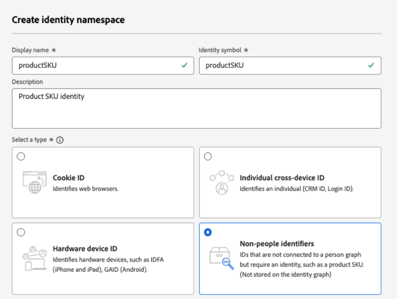

# Usar dados da Adobe Experience Platform {#aep-data}

>[!CONTEXTUALHELP]
>id="lookup-aep-data"
>title="Habilitar para pesquisa"
>abstract="Habilitar um conjunto de dados para pesquisa permite aproveitar seus dados nos recursos de personalização, Decisão e Orquestração de jornadas do Journey Optimizer."

O Journey Optimizer permite aproveitar os dados do Adobe Experience Platform com recursos de personalização, Decisão e Orquestração de jornadas. Para fazer isso, os conjuntos de dados baseados em registros necessários para a personalização da pesquisa devem primeiro ser habilitados para o serviço de pesquisa, conforme descrito abaixo.

## Leitura obrigatória

### Medidas de proteção e diretrizes {#guidelines}

Antes de começar, reveja as seguintes restrições e diretrizes:

* **Nenhuma PII nos conjuntos de dados** - Os conjuntos de dados habilitados para pesquisa não devem conter informações pessoais identificáveis (PII).

* 
   * **Risco de exclusão** - Os conjuntos de dados usados na personalização não estão protegidos contra exclusão. Você deve rastrear quais conjuntos de dados estão sendo usados para garantir que eles não sejam removidos.

* **Tipo de esquema** - Os conjuntos de dados devem ser associados a um esquema que seja **NOT** do tipo Perfil ou Evento.

* **Manter a opção de pesquisa ativada** - Evitar ativar e desativar repetidamente os conjuntos de dados. Isso pode levar a um comportamento inesperado de indexação. A prática recomendada é deixar o conjunto de dados ativado enquanto você planejar usá-lo para pesquisas.

* **Exclusão de lote de dados** - A remoção de um lote de dados do conjunto de dados remove completamente todas as chaves correspondentes do serviço de pesquisa. Por exemplo:

  **Lote 1**: Sku1, Sku2, Sku3\
  **Lote 2**: Sku1, Sku2, Sku3, Sku4, Sku5, Sku6\
  **Lote 3**: Sku7, Sku8, Sku9, Sku10

  Se você excluir o **Lote 1**, Sku1, Sku2 e Sku3 serão removidos do repositório de pesquisa. Os dados de pesquisa resultantes conterão: Sku4, Sku5, Sku6, Sku7, Sku8, Sku9, Sku10.

### Direito ao serviço de pesquisa

| Componente de recurso | Limites | Notas |
| ------- | ------- | ------- |
| Conjuntos de dados de pesquisa habilitados | Máximo de 10 por organização | Número máximo de conjuntos de dados que podem ser configurados para pesquisa em um determinado momento. Esse limite se aplica ao número total combinado de conjuntos de dados de pesquisa em sandboxes de produção e desenvolvimento na instância do cliente. |
| Contagem de registros do conjunto de dados | Até 2 milhões de registros por conjunto de dados | Número máximo de registros permitidos em um único conjunto de dados, calculado como a contagem total em todos os lotes nesse conjunto de dados. |
| Tamanho do registro | Até 2 KB por registro | Tamanho máximo de registro padrão aceito. |
| Tamanho do conjunto de dados | Até 4 GB | Tamanho máximo de um conjunto de dados individual, não o tamanho combinado em todos os conjuntos de dados em uma sandbox. A contagem de registros e os limites de tamanho do conjunto de dados são medidas de proteção independentes — ambas devem ser atendidas. |
| Atualizações de frequência do conjunto de dados | Até 5 atualizações por dia por conjunto de dados | Frequência máxima de operações de atualização permitida para um único conjunto de dados por dia. |

>[!NOTE]
>
>Se forem necessários volumes adicionais além das medidas de proteção listadas acima, entre em contato com o representante da Adobe.

## Ativar um conjunto de dados para pesquisa de dados {#enable}

Para aproveitar os dados do seu conjunto de dados para personalização, é necessário habilitar o conjunto de dados para pesquisa.

### Pré-requisitos {#prerequisites-enable}

O esquema associado ao conjunto de dados que você deseja habilitar para pesquisa deve ser do tipo registro. O esquema NÃO deve ser de perfil ou classe de evento.

+++Exemplo


+++

O esquema deve ter uma identidade primária definida.

+++Exemplo


+++

Se um namespace personalizado ainda não tiver sido definido, verifique se a identidade é um identificador que não seja de pessoa.

+++Exemplo



+++

### Habilitar o conjunto de dados para pesquisa na interface de gerenciamento do conjunto de dados

Na interface do usuário de gerenciamento de conjunto de dados, use o botão para ativar o conjunto de dados para pesquisa.


>[!NOTE]
>
>Recomenda-se que o conjunto de dados TAMBÉM NÃO esteja habilitado para o perfil, pois isso pode levar a um aumento na riqueza do perfil e não é necessário para executar as pesquisas.

### Método da API

Siga as instruções detalhadas em [esta documentação](https://developer.adobe.com/journey-optimizer-apis/references/authentication/) para configurar seu ambiente para enviar comandos de API.

#### Pré-requisitos

* O projeto do desenvolvedor deve ter as APIs do Adobe Journey Optimizer e do Adobe Experience Platform adicionadas ao projeto.

  

* Você deve ter permissão de gerenciamento de conjuntos de dados como parte de sua função.

* O esquema no qual o conjunto de dados se baseia deve conter uma identidade primária que possa atuar como a chave de pesquisa.

#### Estrutura de chamada da API

```shell
curl -s -XPATCH "https://platform.adobe.io/data/core/entity/lookup/dataSets/${DATASET_ID}/${ACTION}" \ -H "Authorization: Bearer ${ACCESS_TOKEN}" \ -H "x-api-key: ${API_KEY}" \ -H "x-gw-ims-org-id: ${IMS_ORG}" \ -H "x-sandbox-name: ${SANDBOX_NAME}" 
```

Em que:

* A URL é `https://platform.adobe.io/data/core/entity/lookup/dataSets/${DATASET_ID}/${ACTION}`
* A ID do conjunto de dados é o conjunto de dados para o qual você deseja habilitar.
* A ação é ativar OU desativar.
* O token de acesso pode ser recuperado do console do desenvolvedor.
* A chave de API pode ser recuperada do console do desenvolvedor.
* A ID da organização IMS é sua organização da Adobe.
* Nome da sandbox é o nome da sandbox do conjunto de dados (ou seja, prod, dev etc.).

>[!NOTE]
>
>Se você encontrar o erro abaixo ao tentar fazer uma chamada de API para habilitar conjuntos de dados, tente remover as APIs do Adobe Journey Optimizer do projeto do console do desenvolvedor e adicioná-las novamente:
>
>`"error_code": "403003",`
>`"message": "Api Key is invalid"`

## Monitoramento do conjunto de dados

Depois que um conjunto de dados for habilitado para pesquisa, você poderá revisar o status de assimilação no serviço de pesquisa acessando o menu **[!UICONTROL Monitoramento]** e selecionando a guia **[!UICONTROL Journey Optimizer]**.

Esse indicador de processo ajuda a entender quando novos lotes de dados estão disponíveis no serviço de pesquisa.


## Próximas etapas

Depois que um conjunto de dados for habilitado para pesquisa usando uma chamada de API, você poderá usar os dados com os recursos de personalização e Decisão do [!DNL Journey Optimizer]. Para obter mais informações, consulte estas seções:

* [Usar dados da Adobe Experience Platform para personalização](../personalization/aep-data-perso.md)
* [Usar dados da Adobe Experience Platform para decisão](../experience-decisioning/aep-data-exd.md)
* [Usar dados do Adobe Experience Platform para orquestração de jornadas](../building-journeys/dataset-lookup.md)
