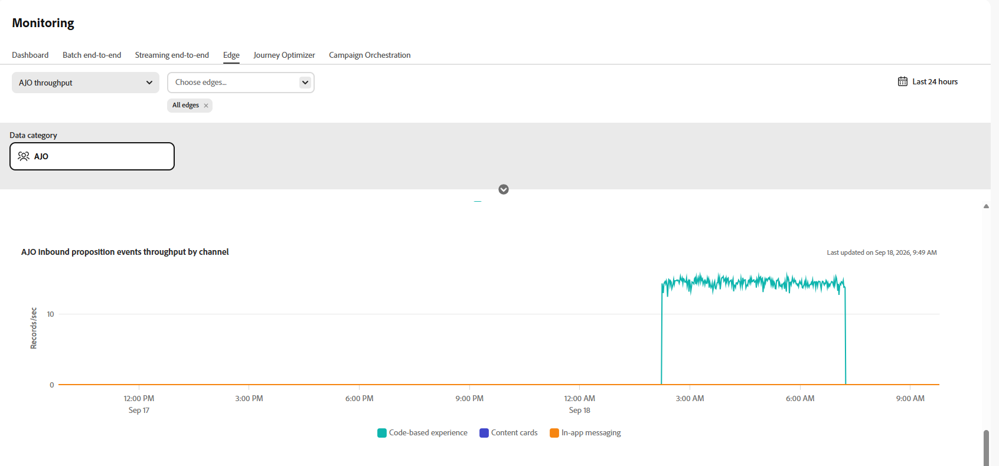

# Monitorar dados de entrada{#monitoring-edge}

>[!BEGINSHADEBOX]

**Nesta página:** Monitore a integridade dos dados de entrada em [!DNL Adobe Journey Optimizer] com os gráficos disponíveis em **[!UICONTROL Gerenciamento de Dados]** > **[!UICONTROL Monitoramento]** > **[!UICONTROL Edge]**.

>[!ENDSHADEBOX]

O espaço de trabalho **[!UICONTROL Monitoramento]** inclui as seguintes guias:

| Tabulação | Descrição | Documentação |
|---|---|---|
| **[!UICONTROL Painel]** | Revise a atividade e o status do fluxo de dados em seus fluxos de dados. | [Painel de monitoramento do fluxo de dados](https://experienceleague.adobe.com/pt-br/docs/experience-platform/dataflows/ui/monitor){target="_blank"} |
| **[!UICONTROL Lote de ponta a ponta]** | Monitore o fluxo de ponta a ponta e a qualidade dos dados assimilados em lote. | [Assimilação de dados de ponta a ponta em lote](https://experienceleague.adobe.com/pt-br/docs/experience-platform/ingestion/quality/monitor-data-ingestion#monitor-batch-end-to-end-data-ingestion){target="_blank"} |
| **[!UICONTROL Transmissão de ponta a ponta]** | Monitore o fluxo de ponta a ponta e a qualidade dos dados assimilados por transmissão. | [Assimilação completa de dados por transmissão](https://experienceleague.adobe.com/pt-br/docs/experience-platform/ingestion/quality/monitor-data-ingestion#monitor-streaming-end-to-end-data-ingestion){target="_blank"} |
| **[!UICONTROL Edge]** | Monitore dados enviados para a Edge Network. Esta página documenta os gráficos específicos do Journey Optimizer disponíveis nesta guia. | [Monitorar fluxos de dados do Edge](https://experienceleague.adobe.com/pt-br/docs/experience-platform/dataflows/ui/monitor-edge){target="_blank"} |

## Monitorar dados do Journey Optimizer no Edge

Os gráficos a seguir estão disponíveis em **[!UICONTROL Gerenciamento de Dados]** > **[!UICONTROL Monitoramento]** > **[!UICONTROL Edge]**.

No menu suspenso, selecione **[!UICONTROL AJO throughput]**.

### Taxa de transferência do gateway AJO {#gateway-throughput}

O gráfico **[!UICONTROL Taxa de Transferência do Gateway AJO]** mostra o número total de registros processados pelo gateway Journey Optimizer por segundo ao longo do tempo. Use essa métrica para monitorar o volume geral de solicitações de entrada tratadas pelo gateway.

### Taxa de transferência de entrada do AJO {#inbound-throughput}

O gráfico **[!UICONTROL Taxa de Transferência de Entrada do AJO]** mostra o número geral de registros de entrada recebidos por segundo ao longo do tempo. Essa métrica mede a taxa em que os registros de entrada atingem o serviço do Edge. Use este gráfico para revisar o volume de dados de entrada e identificar as alterações nos níveis de tráfego.

### Detalhamento da taxa de transferência de entrada do AJO {#inbound-throughput-breakdown}

O gráfico **[!UICONTROL Detalhamento da Taxa de Transferência de Entrada do AJO]** mostra registros de entrada recebidos por segundo ao longo do tempo, detalhados por localização. Essa métrica mede a taxa de registro de entrada para cada local. Use este gráfico para comparar o tráfego de entrada entre locais e identificar um local com um aumento ou diminuição incomum no volume.

### Latência de entrada do AJO {#inbound-latency}

O gráfico **[!UICONTROL Latência de Entrada do AJO]** mostra o tempo necessário para processar solicitações de entrada, medido em milissegundos. Essa métrica é apresentada como uma distribuição de valores de latência, incluindo percentis como P50 e P90. Use esses valores para entender a latência de solicitação típica e identificar solicitações de latência mais alta.

### Taxa de transferência de eventos de apresentação de entrada do AJO {#inbound-proposition-events-throughput}

O gráfico **[!UICONTROL Taxa de Transferência de Eventos de Apresentação de Entrada do AJO]** mostra a taxa de transferência dos eventos de apresentação ao longo do tempo. Essa métrica mede os sinais de rastreamento gerados quando um usuário interage com, visualiza ou aciona uma oferta personalizada.

### Taxa de transferência de eventos de apresentação de entrada do AJO por canal {#inbound-proposition-events-throughput-channel}

O gráfico **[!UICONTROL Taxa de Transferência de Eventos de Apresentação de Entrada do AJO por Canal]** mostra a taxa de transferência de eventos de apresentação por canal de entrada. Essa métrica mede a atividade do evento de apresentação agrupada por canal. Os canais disponíveis incluem CBE, no aplicativo e cartões de conteúdo. Use este gráfico para comparar a atividade nos canais de entrada.

### Taxa de transferência de eventos de apresentação de entrada do AJO por tipo de evento {#inbound-proposition-events-throughput-event-type}

O gráfico **[!UICONTROL Taxa de Transferência de Eventos de Apresentação de Entrada do AJO por Tipo de Evento]** mostra a taxa de transferência de eventos de apresentação por tipo de evento. Essa métrica mede a atividade do evento de apresentação agrupada por resultado. Os tipos de evento disponíveis incluem descartado, suprimido, exibido, acionado, interagido e enviado. Use este gráfico para identificar quais resultados de apresentação-evento contribuem para a atividade geral.

{{$include /help/_includes/do-not-localize/data/ai-augmented-monitoring.md}}