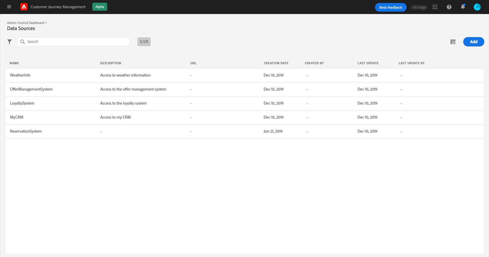

# Configurar uma fonte de dados {#configure-data-source}

Estas são as etapas principais de configuração da fonte de dados:

>[!NOTE]
>
>A configuração da fonte de dados é sempre executada por um **usuário técnico**.

1. Na seção do menu ADMINISTRATION , selecione **[!UICONTROL Configurations]**. Na seção **[!UICONTROL Data Sources]**, clique em **[!UICONTROL Manage]**. A lista das fontes de dados é exibida. Consulte [esta página](../user-interface.md) para obter mais informações sobre a interface.

   

1. Em seguida, é possível adicionar grupos de campos à fonte de dados integrada (consulte [esta página](../datasource/adobe-experience-platform-data-source.md)) ou criar uma nova fonte de dados externa (consulte [esta página](../datasource/external-data-sources.md)) e grupos de campos associados (consulte [esta página](../datasource/configure-data-sources.md#define-field-groups)).

   

1. Clique em **[!UICONTROL Save]**.

   A fonte de dados agora está configurada e pronta para ser usada em suas jornadas.

## Definir grupos de campos {#define-field-groups}

Grupos de campos são conjuntos de campos que podem ser recuperados de uma fonte de dados e usados em uma jornada.

Para cada fonte de dados, você pode definir vários grupos de campos, cada um com uma duração específica do cache.

Por exemplo, você pode criar um grupo de campos com o número de telefone, o email, o nome e o endereço do perfil. Você poderá usar esses dados na jornada para criar condições. Por exemplo, você pode decidir enviar um SMS somente se o número de telefone do perfil não estiver vazio. Se estiver vazio, você pode enviar um email.

Mesmo que um nome padrão seja adicionado automaticamente, recomendamos que você dê um nome ao seu grupo de campos. Na verdade, o nome do grupo de campos estará visível para outros usuários em [!DNL Journey Optimizer]. Fornecer um nome relevante para grupos de campos é uma prática recomendada.

Quando um campo de fonte de dados é usado em uma jornada, o sistema recuperará todos os campos definidos para esse grupo de campos. Portanto, selecionar apenas os campos necessários para suas jornadas é uma prática recomendada. Isso reduzirá a latência de solicitação em suas jornadas, aumentando assim o desempenho. Observe que é possível adicionar mais campos facilmente posteriormente em grupos de campos.

**[!UICONTROL Cache duration]** O também é importante, pois ajudará você a otimizar o desempenho. Duração do cache significa que, em uma jornada, se os dados de um grupo de campos forem recuperados uma vez, o sistema o armazenará em cache temporariamente. Se os mesmos dados forem necessários posteriormente na mesma jornada, o sistema não fará outra solicitação para a fonte de dados. A configuração da duração do cache deve ser adaptada para cada caso de uso. Se você precisar recuperar dados em tempo real, como status da reserva do hotel, informações meteorológicas ou o número de pontos de fidelidade, associará o grupo de campos que contém esses campos a uma curta duração do cache (1 segundo, por exemplo). Para campos que são atualizados com menos frequência (nome, gênero), você criará um segundo grupo de campos com uma duração de cache mais longa (5 dias, por exemplo).

O número de jornadas que usam um grupo de campos é exibido no campo **[!UICONTROL Used in]**. Você pode clicar no botão **[!UICONTROL View journeys]** para exibir a lista de jornadas usando esse grupo de campos.

>[!NOTE]
>
>Observe que, se um grupo de campos não tiver um campo, ele não será exibido no editor de expressão.

## Ciclo de vida do grupo de campos {#field-group-lifecycle}

Você pode adicionar ou remover campos de um grupo de campos que não é usado em nenhum rascunho ou jornada ativa.

É possível adicionar, mas não é possível remover um campo de um grupo de campos usado em uma ou mais jornadas de rascunho ou ativas. Isso evitará quebrar jornadas.

Para excluir um campo de um grupo de campos usado em uma ou mais jornadas, siga estas etapas. Vamos usar um exemplo de um grupo de campos chamado &quot;Grupo de campos A&quot;.

1. Na lista de grupos de campos, coloque o cursor em &quot;Grupo de campos A&quot; e clique no ícone **[!UICONTROL Duplicate]** localizado à direita. Nomeie o grupo de campos duplicados como &quot;Grupo de campos B&quot;, por exemplo.
1. Em &quot;Grupo de campos B&quot;, remova os campos que não deseja mais.
1. Em &quot;Grupo de campos A&quot;, verifique onde esse grupo de campos é usado. Essas informações são exibidas no campo **[!UICONTROL Used in]**.
1. Abra todas as jornadas que usam &quot;Grupo de campos A&quot;.
1. Crie novas versões de cada uma dessas jornadas. Edite todas as atividades usando &quot;Grupo de campos A&quot; e selecione &quot;Grupo de campos B&quot;.
1. Pare as versões antigas de jornadas que usam o &quot;Grupo de campos A&quot;. Você não deve ter jornada usando &quot;Grupo de campos A&quot;.
1. Remova &quot;Grupo de campos A&quot; como ele não é mais usado.
