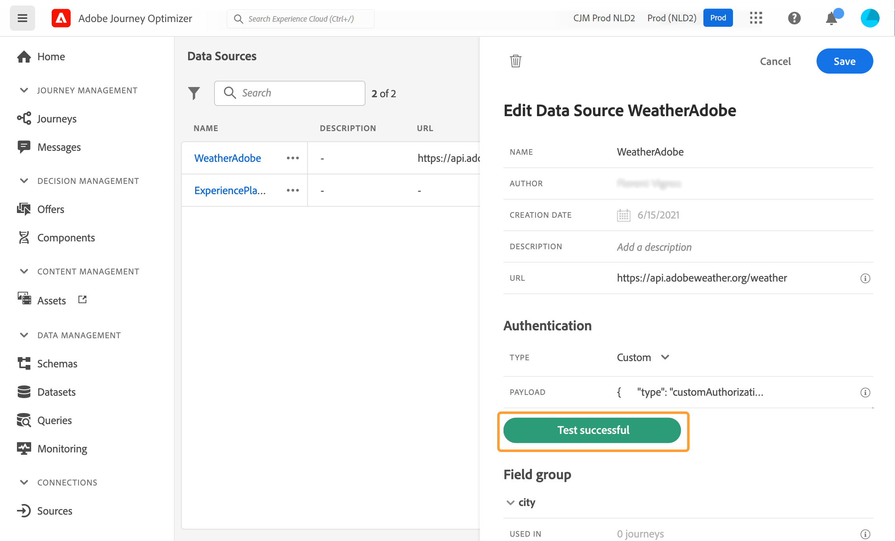

# Fontes de dados externas {#external-data-sources}

>[!CONTEXTUALHELP]
>id="ajo_journey_data_source_custom"
>title="Fontes de dados externas"
>abstract="Fontes de dados externas permitem definir uma conexão com sistemas de terceiros, por exemplo, se você estiver usando um sistema de reserva de hotel para verificar se a pessoa reservou um quarto. Ao contrário da fonte de dados integrada da Adobe Experience Platform, você pode criar quantas fontes de dados externas forem necessárias."

## Trabalhar com fontes de dados externas {#gs-ext-data-sources}

Fontes de dados externas permitem definir uma conexão com sistemas de terceiros, por exemplo, se você estiver usando um sistema de reserva de hotel para verificar se a pessoa reservou um quarto. Ao contrário da fonte de dados integrada da Adobe Experience Platform, você pode criar quantas fontes de dados externas forem necessárias.

>[!NOTE]
>
>* As garantias ao trabalhar com sistemas externos estão listadas em [esta página](../configuration/external-systems.md).
>
>* Como as respostas agora são compatíveis, você deve usar ações personalizadas em vez de fontes de dados para casos de uso de fontes de dados externas. Para obter mais informações sobre respostas, consulte esta [seção](../action/action-response.md)

As APIs REST que usam POST ou GET e devolvem JSON são compatíveis. A chave de API, os modos de autenticação básicos e personalizados são compatíveis.

Vamos ver o exemplo de um serviço de API meteorológica usada para personalizar os comportamentos da jornada de acordo com os dados climáticos em tempo real.

Dois exemplos da chamada de API:

* _https://api.adobeweather.org/weather?city=London,uk&amp;appid=1234_
* _https://api.adobeweather.org/weather?lat=35&amp;lon=139&amp;appid=1234_

A chamada é composta de um URL principal (_https://api.adobeweather.org/weather_), dois conjuntos de parâmetros (&quot;city&quot; para a cidade e &quot;lat/long&quot; para a latitude e a longitude) e a chave da API (appid).

>[!TIP]
>
>Recomendamos deixar pelo menos um buffer de um minuto entre o período de expiração do token da API externa e a configuração [`cacheDuration` do Journey Optimizer ](#custom-authentication-access-token), especialmente em cargas de trabalho pesadas, para evitar incompatibilidades de expiração e erros 401.

## Criar e configurar uma fonte de dados externa {#create-ext-data-sources}

Abaixo estão as principais etapas para criar e configurar uma nova fonte de dados externa:

1. Na lista de fontes de dados, clique em **[!UICONTROL Criar Source de Dados]** para criar uma nova fonte de dados externa.

   

   Essa ação abre o painel de configuração da fonte de dados no lado direito da tela.

   

1. Insira um nome para a sua fonte de dados.

Somente caracteres alfanuméricos e sublinhados são permitidos. O comprimento máximo é de 30 caracteres.

1. Adicione uma descrição à fonte de dados. Esta etapa é opcional.
1. Adicione o URL do serviço externo. Em nosso exemplo: _https://api.adobeweather.org/weather_.

   >[!CAUTION]
   >
   >Recomendamos o uso de HTTPS por motivos de segurança. Observe também que não permitimos o uso de endereços Adobe que não estejam disponíveis publicamente, bem como o uso de endereços IP.

   

1. Configure a autenticação dependendo da configuração do serviço externo: **[!UICONTROL Sem autenticação]**, **[!UICONTROL Básica]**, **[!UICONTROL Personalizada]** ou **[!UICONTROL Chave de API]**.

   Para o modo de autenticação básico, é necessário preencher um nome de usuário e uma senha.

   >[!NOTE]
   >
   >* Quando a chamada de autenticação é executada, a cadeia de caracteres `<username>:<password>`, codificada em base64, é adicionada ao cabeçalho Authentication.
   >
   >* O Adobe Journey Optimizer criptografa automaticamente segredos definidos em ações personalizadas. As chaves de criptografia de cada organização são gerenciadas com segurança em um cofre dedicado vinculado à organização. Quando as credenciais são exibidas na interface, elas são mascaradas por padrão para evitar exposição acidental.


   Para obter mais informações sobre o modo de autenticação personalizado, consulte [esta seção](../datasource/external-data-sources.md#custom-authentication-mode). No nosso exemplo, escolhemos o modo de autenticação da chave de API, conforme abaixo:

   * **[!UICONTROL Tipo]**: &quot;Chave de API&quot;
   * **[!UICONTROL Nome]**: &quot;appid&quot; (este é o nome do parâmetro da chave de API)
   * **[!UICONTROL Valor]**: &quot;1234&quot; (este é o valor da nossa chave de API)
   * **[!UICONTROL Local]**: &quot;Parâmetro de consulta&quot; (a chave de API está localizada na URL)

     

1. Adicione um novo grupo de campos para cada conjunto de parâmetros da API clicando em **[!UICONTROL Adicionar Novo Grupo de Campos]**. Somente caracteres alfanuméricos e sublinhados são permitidos no nome do grupo de campos. O comprimento máximo é de 30 caracteres. Em nosso exemplo, precisamos criar dois grupos de campo, um para cada conjunto de parâmetros (city e long/lat).

Para o conjunto de parâmetros &quot;long/lat&quot;, criamos um grupo de campos com as seguintes informações:

* **[!UICONTROL Usado em]**: exibe o número de jornadas que usam um grupo de campos. Você pode clicar no ícone **[!UICONTROL Exibir jornadas]** para exibir a lista de jornadas usando este grupo de campos.
* **[!UICONTROL Método]**: selecione o método POST ou GET. No nosso caso, selecionamos o método GET.
* **[!UICONTROL Valores Dinâmicos]**: insira os diferentes parâmetros separados por vírgula, &quot;long,lat&quot; no nosso exemplo. Como os valores dos parâmetros dependem do contexto de execução, eles serão definidos nas jornadas. [Saiba mais](../building-journeys/expression/expressionadvanced.md)
* **[!UICONTROL Carga de resposta]**: clique dentro do campo **[!UICONTROL Carga]** e cole um exemplo da carga útil retornada pela chamada. Para nosso exemplo, usamos uma carga encontrada em um site da API de meteorologia. Verifique se os tipos de campo estão corretos. Cada vez que a API é chamada, o sistema recuperará todos os campos incluídos no exemplo de carga útil. Observe que você pode clicar em **[!UICONTROL Colar uma nova carga]** se desejar alterar a carga transmitida no momento.
* **[!UICONTROL Carga Enviada]**: este campo não aparece no nosso exemplo. Ele só estará disponível se você selecionar o método POST. Cole a carga útil que será enviada para o sistema de terceiros.

No caso de uma chamada GET que exige parâmetros, você insere os parâmetros no campo **[!UICONTROL Valores dinâmicos]** e eles são adicionados automaticamente no final da chamada. No caso de uma chamada POST, é necessário:

* listar os parâmetros a serem transmitidos no momento da chamada no campo **[!UICONTROL Valores Dinâmicos]** (no exemplo abaixo: &quot;identificador&quot;).
* especificá-los também com a mesma sintaxe no corpo da carga útil enviada. Para fazer isso, é necessário adicionar: &quot;param&quot;: &quot;nome do parâmetro&quot; (no exemplo abaixo: &quot;identificador&quot;). Siga a sintaxe abaixo:

```json
{"id":{"param":"identifier"}}
```


Depois que as alterações forem salvas, a fonte de dados será configurada e estará pronta para ser usada nas jornadas, por exemplo, nas condições ou para personalizar um email. Se a temperatura estiver acima de 30°C, você pode decidir enviar uma comunicação específica.

## Modo de autenticação personalizado {#custom-authentication-mode}

>[!CONTEXTUALHELP]
>id="jo_authentication_payload"
>title="Sobre a autenticação personalizada"
>abstract="O modo de autenticação personalizado é usado para autenticação complexa para chamar protocolos de empacotamento automático de API, como OAuth2. A execução da ação é um processo em duas etapas. Primeiro, uma chamada para o ponto de acesso é executada para gerar o token de acesso. Em seguida, o token de acesso é inserido na solicitação HTTP da ação."

O modo de autenticação personalizado é usado para autenticação complexa, frequentemente usada para chamar protocolos de empacotamento automático de API, como OAuth2, para recuperar um token de acesso que será inserido na solicitação real HTTP para a ação.

Ao configurar a autenticação personalizada, use o botão **[!UICONTROL Clique para verificar a autenticação]** para controlar se a carga útil de autenticação personalizada está configurada corretamente.


Quando o teste for bem-sucedido, o botão ficará verde.



Com esse modo de autenticação, a execução da ação é um processo de duas etapas:

1. Chame o endpoint para gerar o token de acesso.
1. Chame a REST API inserindo de maneira correta o token de acesso.


>[!NOTE]
>
>**Esta autenticação tem duas partes.**

### Definição do endpoint que será chamado para gerar o token de acesso{#custom-authentication-endpoint}

* `endpoint`: URL a ser usada para gerar o ponto de extremidade
* método da solicitação HTTP no ponto de extremidade (`GET` ou `POST`)
* `headers`: pares de chave-valor a serem inseridos como cabeçalhos nesta chamada, se necessário
* `body`: descreve o corpo da chamada se o método for POST. Oferecemos suporte a uma estrutura de corpo limitada, definida em bodyParams (pares de valores chave). O bodyType descreve o formato e a codificação do corpo na chamada:
   * `form`: significa que o tipo de conteúdo será application/x-www-form-urlencoded (charset UTF-8) e que os pares de valor-chave serão serializados como estão: key1=value1&amp;key2=value2&amp;...
   * `json`: significa que o tipo de conteúdo será application/json (charset UTF-8) e que os pares de valores chave serão serializados como um objeto json como a seguir: _{ &quot;key1&quot;: &quot;value1&quot;, &quot;key2&quot;: &quot;value2&quot;, ...}_

### Definição da forma como o token de acesso deve ser inserido na solicitação HTTP da ação{#custom-authentication-access-token}

* **authorizationType**: define como o token de acesso gerado deve ser inserido na chamada HTTP para a ação. Os valores possíveis são:

   * `bearer`: indica que o token de acesso deve ser inserido no cabeçalho de Autorização, como: _Autorização: Portador &lt;token de acesso>_
   * `header`: indica que o token de acesso deve ser inserido como um cabeçalho, o nome do cabeçalho definido pela propriedade `tokenTarget`. Por exemplo, se o `tokenTarget` for `myHeader`, o token de acesso será inserido como um cabeçalho como: _myHeader: &lt;access token>_
   * `queryParam`: indica que o token de acesso deve ser inserido como um queryParam, o nome do parâmetro de consulta definido pela propriedade tokenTarget. Por exemplo, se o tokenTarget for myQueryParam, o URL da chamada de ação será: _&lt;url>?myQueryParam=&lt;access token>_

* **tokenInResponse**: indica como extrair o token de acesso da chamada de autenticação. Essa propriedade pode ser:
   * `response`: indica que a resposta HTTP é o token de acesso
   * um seletor em um json (supondo que a resposta seja um json, não oferecemos suporte a outros formatos, como XML). O formato desse seletor é _json://&lt;path to the access token property>_. Por exemplo, se a resposta da chamada for: _{ &quot;access_token&quot;: &quot;theToken&quot;, &quot;timestamp&quot;: 12323445656 }_, o tokenInResponse será: _json: //access_token_

O formato dessa autenticação é:

```json
{
    "type": "customAuthorization",
    "endpoint": "<URL of the authentication endpoint>",
    "method": "<HTTP method to call the authentication endpoint, in 'GET' or 'POST'>",
    (optional) "headers": {
        "<header name>": "<header value>",
        ...
    },
    (optional, mandatory if method is 'POST') "body": {
        "bodyType": "<'form'or 'json'>,
        "bodyParams": {
            "param1": value1,
            ...
        }
    },
    "tokenInResponse": "<'response' or json selector in format 'json://<field path to access token>'",
    "cacheDuration": {
        (optional, mutually exclusive with 'duration') "expiryInResponse": "<json selector in format 'json://<field path to expiry>'",
        (optional, mutually exclusive with 'expiryInResponse') "duration": <integer value>,
        "timeUnit": "<unit in 'milliseconds', 'seconds', 'minutes', 'hours', 'days', 'months', 'years'>"
    },
    "authorizationType": "<value in 'bearer', 'header' or 'queryParam'>",
    (optional, mandatory if authorizationType is 'header' or 'queryParam') "tokenTarget": "<name of the header or queryParam if the authorizationType is 'header' or 'queryParam'>",
}
```

>[!NOTE]
>
>Encode64 é a única função disponível na carga de autenticação.

É possível alterar a duração do cache do token para uma fonte de dados de autenticação personalizada. Encontre abaixo um exemplo de payload de autenticação personalizada. A duração do cache é definida no parâmetro `cacheDuration`. Especifica a duração de retenção do token gerado no cache. A unidade pode ser milissegundos, segundos, minutos, horas, dias, meses, anos.

Veja um exemplo do tipo de autenticação de portador:

```json
{
    "type": "customAuthorization",
    "endpoint": "https://<your_auth_endpoint>/epsilon/oauth2/access_token",
    "method": "POST",
    "headers": {
      "Authorization": "Basic EncodeBase64(<epsilon Client Id>:<epsilon Client Secret>)"
    },
    "body": {
      "bodyType": "form",
      "bodyParams": {
        "scope": "cn mail givenname uid employeeNumber",
        "grant_type": "password",
        "username": "<epsilon User Name>",
        "password": "<epsilon User Password>"
      }
    },
    "tokenInResponse": "json://access_token",
    "cacheDuration": {
      "duration": 5,
      "timeUnit": "minutes"
    },
  },
```

>[!NOTE]
>
>* O token de autenticação é armazenado em cache por jornada: se duas jornadas estiverem usando a mesma ação personalizada, cada jornada terá seu próprio token em cache. Esse token não é compartilhado entre essas jornadas.
>
>* A duração do cache ajuda a evitar muitas chamadas para os pontos de extremidade de autenticação. A retenção do token de autenticação é armazenada em cache nos serviços; não há persistência. Se um serviço for reiniciado, ele será iniciado com um cache limpo. A duração padrão do cache é de 1 hora. Na carga de autenticação personalizada, ela pode ser adaptada especificando outra duração de retenção.
>

Veja um exemplo do tipo de autenticação de cabeçalho:

```json
{
  "type": "customAuthorization",
  "endpoint": "https://myapidomain.com/v2/user/login",
  "method": "POST",
  "headers": {
    "x-retailer": "any value"
  },
  "body": {
    "bodyType": "form",
    "bodyParams": {
      "secret": "any value",
      "username": "any value"
    }
  },
  "tokenInResponse": "json://token",
  "cacheDuration": {
    "expiryInResponse": "json://expiryDuration",
    "timeUnit": "minutes"
  },
  "authorizationType": "header",
  "tokenTarget": "x-auth-token"
} 
```

Este é um exemplo da resposta da chamada de API de logon:

```json
{
  "token": "xDIUssuYE9beucIE_TFOmpdheTqwzzISNKeysjeODSHUibdzN87S",
  "expiryDuration" : 5
}
```

>[!CAUTION]
>
>Ao configurar a autenticação personalizada para uma ação personalizada, observe que objetos JSON aninhados (por exemplo, sub-objetos dentro de `bodyParams`) atualmente **não são suportados**. Somente pares de valores chave simples serão incluídos na carga da solicitação final. Se o endpoint de autenticação exigir objetos aninhados, isso poderá resultar em campos ausentes e falhas de autenticação.
