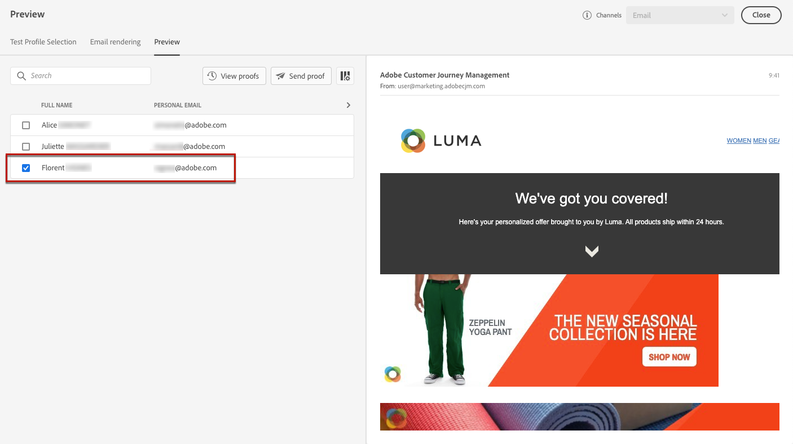

# Adicionar ofertas personalizadas {#deliver-personalized-offers}

Em [!DNL Journey Optimizer] mensagens de email, você pode inserir decisões (anteriormente conhecidas como &quot;atividades de oferta&quot;) que aproveitarão o mecanismo de decisão da oferta para escolher a melhor oferta a ser entregue aos clientes.

Por exemplo, você pode adicionar uma decisão que exibirá em seu email uma oferta de desconto especial que varia de acordo com o nível de fidelidade do recipient.

Para obter mais informações sobre como criar e gerenciar ofertas, consulte [esta seção](offers/get-started/starting-offer-decisioning.md).

Para um **exemplo completo** mostrando como configurar ofertas, use-as em uma decisão e aproveite essa decisão em um email, confira [esta seção](offers/offers-e2e.md#insert-decision-in-email).

➡️ [Saiba como adicionar ofertas como personalização](#video-offers) (vídeo)

## Inserir uma decisão em um email {#insert-offers}

>[!CAUTION]
>
>Antes de começar, você deve [definir uma decisão de oferta](offers/offer-activities/create-offer-activities.md).

Para inserir uma decisão em uma mensagem de email, siga as etapas abaixo:

1. Crie seu email e abra o Designer de email para configurar seu conteúdo.

1. Adicione um componente de conteúdo **[!UICONTROL Offer decision]**.

   

   Saiba como usar componentes de conteúdo em [esta seção](content-components.md).

1. A guia **[!UICONTROL Offer decision]** é exibida na paleta direita. Clique em **[!UICONTROL Select Offer decision]**.

   

1. Na janela exibida, selecione a disposição correspondente às ofertas que deseja exibir.

    Os posicionamentos são contêineres usados para mostrar suas ofertas. Neste exemplo, usaremos a disposição &quot;imagem superior do email&quot;. Essa disposição foi criada na Biblioteca de ofertas para exibir ofertas do tipo imagem situadas na parte superior das mensagens.

1. Selecione a atividade de oferta a ser usada no componente de conteúdo e clique em **[!UICONTROL Add]**.

   >[!NOTE]
   >
   >Somente as decisões compatíveis com a disposição selecionada são exibidas na lista. Neste exemplo, apenas uma atividade de oferta corresponde à disposição &quot;imagem superior do email&quot;.

   

A atividade de oferta agora é adicionada ao componente .

## Visualizar ofertas em um email {#preview-offers-in-email}

Você pode visualizar as diferentes ofertas que fazem parte da decisão adicionada ao email usando a seção **[!UICONTROL Offers]** ou as setas dos componentes de conteúdo.

Para exibir as diferentes ofertas que fazem parte da decisão com um perfil de cliente, siga as etapas abaixo.

1. Clique em **[!UICONTROL Preview]**.

   

   >[!NOTE]
   >
   >Você precisa ter perfis de teste disponíveis para poder visualizar suas mensagens. Saiba como [criar perfis de teste](building-journeys/creating-test-profiles.md).

1. Para escolher o namespace a ser usado para identificar perfis de teste, selecione **[!UICONTROL Email]** no campo **[!UICONTROL Identity namespace]**.

   >[!NOTE]
   >
   >Neste exemplo, usaremos o namespace **Email**. Saiba mais sobre os namespaces de identidade do Adobe Experience Platform [nesta seção](get-started-identity.md).

1. Na lista de namespaces de identidade, selecione **[!UICONTROL Email]** e clique em **[!UICONTROL Select]**.

1. No campo **[!UICONTROL Identity value]**, insira o valor para identificar o perfil de teste. Neste exemplo, insira o endereço de email de um perfil de teste.

   <!--For example enter smith@adobe.com and click the **[!UICONTROL Add profile]** button.-->

1. Adicione outros perfis para testar diferentes variantes da mensagem, dependendo dos dados do perfil.

   

1. Clique na guia **[!UICONTROL Preview]** para testar a mensagem.

1. Selecione um perfil de teste. A oferta correspondente ao perfil selecionado (uma mulher) é exibida.

   

1. Selecione outros perfis de teste para visualizar o conteúdo de email de cada variante de sua mensagem. No conteúdo da mensagem, a oferta correspondente ao perfil de teste selecionado (agora um homem) agora é exibida.

   

Saiba mais sobre as etapas detalhadas para verificar a pré-visualização da mensagem em [this section](#preview-your-messages).

## Vídeo tutorial{#video-offers}

Saiba como adicionar um componente offer decisioning a mensagens em [!DNL Journey Optimizer].

>[!VIDEO](https://video.tv.adobe.com/v/334088?quality=12)
