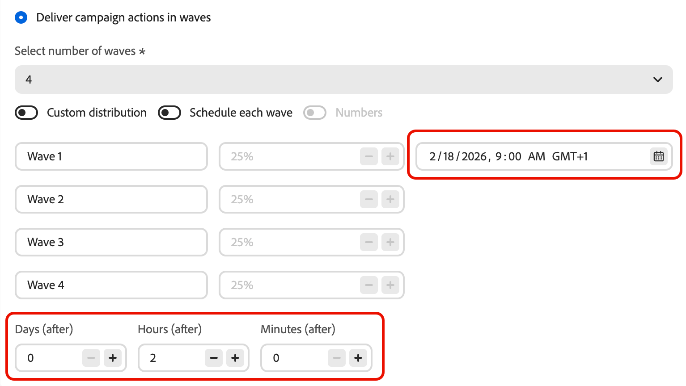

# Envio usando ondas {#send-using-waves}

>[!BEGINSHADEBOX]

**Nesta página:** saiba como dividir a entrega de mensagens de saída em lotes agendados (ondas) para equilibrar a carga, proteger a reputação do remetente e melhorar a capacidade de entrega, disponível em jornadas de leitura de público, campanhas de ação e campanhas orquestradas.

>[!ENDSHADEBOX]

Em vez de enviar todas as mensagens de uma só vez, você pode agendar a entrega em lotes controlados chamados **ondas**. O envio de onda ajuda a:

* Equilibre a carga e proteja os sistemas downstream (como centrais de atendimento ou páginas de aterrissagem) contra sobrecarga
* Oferecer suporte à capacidade de entrega e à reputação do remetente, especialmente para envios de alto volume
* Aumentar progressivamente o volume de entrega ao aquecer um novo IP ou plataforma

Você define o número de ondas, seu tamanho (como uma porcentagem do público ou como números absolutos) e quando cada onda é executada.

## Limitações e medidas de proteção {#limitations-guardrails}

As seguintes limitações se aplicam em todos os contextos:

* Você deve definir pelo menos **2 ondas** e pode adicionar até **10 ondas**.
* O intervalo mínimo entre o início de duas ondas é de **30 minutos**.
* Um início de onda não pode ser definido no passado.

Restrições adicionais específicas do contexto se aplicam:

>[!BEGINTABS]

>[!TAB Ler jornadas de público-alvo]

* O envio de onda só está disponível para jornadas de público-alvo de leitura com os tipos de agendador **[!DNL As soon as possible]** e **[!UICONTROL Once]**. [Saiba mais sobre o agendamento de jornadas](../building-journeys/read-audience.md#schedule).
* O envio de onda não está disponível para jornadas recorrentes, acionadas por eventos, de negócios, de testes ou de simulação.
* Um início de onda não pode ser anterior ao início da jornada.
* A divisão do público em ondas pode levar até 1 hora. Os perfis não podem entrar na jornada até que a divisão seja concluída.
* Em uma única versão do jornada, duas ondas nunca são executadas ao mesmo tempo. A próxima onda começa somente após a conclusão da onda anterior. Por exemplo, se as ondas forem agendadas com 1 hora de diferença, mas a primeira onda ocorrer por 2 horas, a segunda onda começará quando a primeira terminar, não no horário agendado originalmente.
* Os inícios de onda podem ser atrasados quando a plataforma aplicar limites de cota ou quando a capacidade do sistema estiver sob carga pesada.

>[!TAB Campanhas de ação]

* O envio de onda se aplica somente a **ações de saída** (email, SMS, push, correspondência direta).
* Um início de onda não pode ser anterior ao início da campanha.

<!--
>[!TAB Orchestrated campaigns]

* Wave sending applies to **outbound** channel activities only (Email, SMS, Push, Direct mail).
* Wave sending is configured at the **channel activity level**, independently for each channel activity in the campaign.
-->

>[!ENDTABS]

## Configurar envio de onda {#configure-wave-sending}

>[!CONTEXTUALHELP]
>id="ajo_wave_sending"
>title="Envio usando ondas"
>abstract="Divida a entrega de mensagens em lotes agendados (ondas) para controlar o volume ao longo do tempo. Você pode definir até 10 ondas com tamanhos e tempo iguais ou personalizados."

>[!CONTEXTUALHELP]
>id="ajo_orchestration_wave_sending"
>title="Envio usando ondas"
>abstract="Divida a entrega de mensagens em lotes agendados (ondas) para controlar o volume ao longo do tempo. Você pode definir até 10 ondas com tamanhos e tempo iguais ou personalizados."

As etapas para habilitar o envio de onda dependem do seu contexto: jornada de público-alvo de leitura ou campanha de ação. Selecione a guia relevante abaixo e consulte a seção [Tamanho e tempo da onda](#wave-options) para concluir a configuração.

>[!BEGINTABS]

>[!TAB Ler jornadas de público-alvo]

1. Inicie sua jornada com uma atividade [Ler público-alvo](../building-journeys/read-audience.md).

1. Clique duas vezes na atividade **[!UICONTROL Ler público-alvo]** para abrir suas propriedades e selecione a opção **[!UICONTROL Fornecer ação de jornada em ondas]**.

   {width="100%"}

1. Defina o **número de ondas** (por exemplo, 4).

   {width="80%"}

   >[!NOTE]
   >
   >Você deve definir pelo menos 2 ondas e pode adicionar até 10 ondas.

1. Escolha como definir o tamanho e o tempo da onda conforme detalhado na seção [Tamanho e tempo da onda](#wave-options) abaixo.

>[!TAB Campanhas de ação]

1. Crie ou abra uma [Campanha de ação](../campaigns/create-campaign.md) que contenha uma ação de saída (Email, SMS, Push ou Correspondência direta).

1. Na guia **[!UICONTROL Agendar]** da campanha, selecione **[!UICONTROL Entregar ações de campanha em ondas]**.

   {width="100%"}

   >[!NOTE]
   >
   >A opção **[!UICONTROL Deliver campaign actions in waves]** só é exibida quando uma ação de saída é selecionada na guia **[!UICONTROL Actions]** da campanha. [Saiba mais](../campaigns/campaign-action.md)

1. Defina o número de ondas (por exemplo, 4).

   >[!NOTE]
   >
   >Você deve definir pelo menos 2 ondas e pode adicionar até 10 ondas.

1. Escolha como definir o tamanho e o tempo da onda conforme detalhado na seção [Tamanho e tempo da onda](#wave-options) abaixo.

>[!ENDTABS]

<!--
>[!TAB Orchestrated campaigns]

1. Open a channel activity (Email, SMS, Push, or Direct mail) in your orchestrated campaign canvas.

1. Go to the **[!UICONTROL Schedule]** tab of the channel activity.

1. Under **[!UICONTROL Wave schedule]**, enable the **[!UICONTROL Deliver in waves]** toggle.

    {width="90%"}

1. Set the number of waves using the **[!UICONTROL Select number of waves]** dropdown.

   >[!NOTE]
   >
   >You must define at least 2 waves and can add up to 10 waves.

1. Choose how to define wave size and timing as detailed in the [Wave size and timing](#wave-options) section below.
-->

## Tamanho e sincronização da onda {#wave-options}

Depois de definir o número de ondas, defina como o público-alvo é distribuído entre elas e quando cada onda é executada. Três opções estão disponíveis:

* [Ondas iguais](#equal-waves) — Divida o público em partes de tamanho igual com um intervalo fixo entre os inícios de onda. Melhor para envios diretos e cronometrados uniformemente.
* [Distribuição personalizada](#custom-distribution) — Defina manualmente o tamanho de cada onda como uma porcentagem ou um número absoluto de perfis. Melhor para aumentos progressivos ou divisões irregulares de público.
* [Agendamento personalizado](#custom-schedule) — Atribua uma data e hora de início específicas a cada onda. Melhor quando você precisa de um tempo preciso que não segue um intervalo regular.

### Ondas iguais {#equal-waves}

Por padrão, o público-alvo é dividido em ondas de tamanho igual. Defina um intervalo fixo entre o início de cada onda (por exemplo, 2 horas). Em seguida, o sistema programa ondas subsequentes automaticamente — por exemplo, primeira onda às 9h, segunda às 11h, terceira às 13h, quarta às 15h.

{width="80%"}

>[!NOTE]
>
>O intervalo mínimo entre o início de duas ondas é de **30 minutos**.

### Distribuição personalizada {#custom-distribution}

Selecione a opção **[!UICONTROL Custom distribution]** para definir o tamanho de cada onda como uma porcentagem do público total (por exemplo, 15%, 20%, 25%, 40%).

{width="80%"}

Selecione **[!UICONTROL Números]** para definir o tamanho de cada onda como um número absoluto de perfis (por exemplo, 10.000; 50.000).

{width="80%"}

>[!NOTE]
>
>* Ao usar porcentagens, o total de todas as ondas deve ser 100%. Um aviso será exibido se esse não for o caso.
>
>* Ao usar números, o sistema não valida a cobertura total. Verifique se os tamanhos de onda cobrem o público-alvo pretendido. [Saiba mais](#faq)

### Agendamento personalizado {#custom-schedule}

Selecione **[!UICONTROL Agendar cada onda]** para definir uma data e hora de início específicas para cada onda. As ondas não precisam ser espaçadas uniformemente (por exemplo, 9h, 11h, 17h, 17h, 20h, 20h30min).

{width="80%"}

>[!NOTE]
>
>O intervalo mínimo entre o início de duas ondas é de **30 minutos**.

## Casos de uso {#use-cases}

O envio de onda ajuda você a controlar quando e quantas mensagens são enviadas, o que melhora a capacidade de entrega, protege a reputação do remetente e alinha os envios à sua capacidade operacional. Considere usar ondas nestes cenários:

* **Call center ou gestor de resposta:** limite quantas mensagens saem por dia ou por hora para que as equipes downstream (por exemplo, atendimento ao cliente) possam lidar com respostas a uma taxa gerenciável.

  {width="50%"}

* **Alto volume e capacidade de entrega:** Evite enviar um público muito grande de uma só vez. A disseminação do delivery ao longo do tempo ajuda a manter a reputação do remetente e reduz o risco de ser sinalizado como spam.

  {width="50%"}

* **Aquecimento de IP:** ao usar uma nova plataforma ou endereço IP, aumente progressivamente o volume (por exemplo, 10% na primeira onda, depois 15%, 20% e assim por diante) para criar gradualmente a reputação de envio.

  {width="50%"}

## Perguntas frequentes {#faq}

+++ O que acontece se a soma dos tamanhos das minhas ondas não for igual ao público total?

* Se a soma **exceder** o público-alvo (por exemplo, você agendar 100.000 na primeira onda para um público-alvo de 80.000), a primeira onda enviará para o público-alvo completo e as ondas restantes não terão mais perfis—elas não serão executadas.
* Se a soma **for menor** do que o público-alvo (por exemplo, você define quatro ondas totalizando 40.000 perfis para um público-alvo de 100.000), somente os perfis incluídos nessas ondas receberão a mensagem. Os perfis restantes não recebem a comunicação e não são repetidos em ondas posteriores.

+++

+++ Posso atribuir diferentes segmentos de conteúdo ou público-alvo a ondas individuais?

Não. Você só pode definir o tamanho e o tempo de cada onda. O mesmo público-alvo e conteúdo de mensagem se aplica a todas as ondas: não é possível direcionar segmentos diferentes ou usar conteúdo diferente por onda.

+++

+++ O público-alvo é reavaliado antes de cada onda ou é corrigido na ativação?

O público é **avaliado uma vez** na ativação (quando a jornada é acionada ou a campanha/atividade é iniciada). Um instantâneo dos perfis qualificados é tirado nesse ponto e usado em todas as ondas: a associação ao público-alvo não é reavaliada antes de cada onda subsequente.

No entanto, **os atributos de perfil são lidos no momento em que cada onda processa**, não na ativação. Isso significa que, para ondas espalhadas por vários dias:

* Os atributos do Personalization (por exemplo, o nome ou o nível de fidelidade de um perfil) refletem o estado do perfil no momento em que a onda é executada.
* **As verificações de consentimento e supressão são reaplicadas no horário de envio para cada onda.** Se um perfil optar por não participar entre duas ondas, ele não receberá mensagens nas ondas subsequentes.

Em resumo: *quem* está incluído foi corrigido antecipadamente, mas *os dados usados para personalizar e enviar para esses perfis* refletem seu estado atual quando sua onda é processada.

+++

+++ O envio de onda funciona com canais de entrada?

Não. O envio de onda se aplica somente a **ações de canal de saída**: email, SMS, notificações por push e correspondência direta. Os canais de entrada (como experiências na Web, no aplicativo ou baseadas em código) não são afetados pela configuração de envio de onda.

+++

## Consulte também {#see-also}

* [Usar um público-alvo em uma jornada](../building-journeys/read-audience.md) — configure a atividade Ler Público
* [Agendar uma Campanha de ação](../campaigns/campaign-schedule.md) — definir data de início, data de término e frequência
<!-- * [Channel activities in Orchestrated campaigns](../orchestrated/activities/channels.md) — configure channel activities in the orchestrated canvas -->

+++ Referência de conhecimento de IA

Esta seção contém conhecimento estruturado destinado a oferecer suporte à interpretação, recuperação e resposta a perguntas relacionadas a este tópico.

Para uma compreensão completa, essas informações devem ser combinadas com a documentação desta página. Nenhuma das origens deve ser independente; a página descreve o recurso, enquanto esta seção fornece um contexto adicional que ajuda a desfazer a ambiguidade da terminologia, intenção, aplicabilidade e restrições.

* **TL;DR:** esta página explica como configurar o envio de som wave no Adobe Journey Optimizer para entregar mensagens de saída em lotes controlados ao longo do tempo, melhorando a capacidade de entrega e protegendo a reputação do remetente. O envio de onda está disponível em jornadas de leitura de público-alvo, campanhas de ação e campanhas orquestradas.

**Intenções:**

* Ativar o envio de ondas em uma jornada de Leitura de público, uma campanha de Ação ou uma atividade de canal de campanha Orquestrada
* Configurar ondas iguais com um intervalo fixo entre cada onda
* Definir tamanhos de onda personalizados como porcentagens ou contagens absolutas de perfil
* Agendar cada onda com uma data e hora de início específicas
* Controlar o volume de delivery para proteger a reputação do remetente ou alinhar-se à capacidade operacional

**Glossário:**

* **Envio de onda**: um modo de entrega que divide o público em lotes (ondas) e envia mensagens para cada lote em intervalos agendados, em vez de todas de uma vez *(específico do produto)*
* **Ondas iguais**: uma configuração em que o público é dividido em partes de tamanho igual com um intervalo fixo entre os inícios de onda *(específico do produto)*
* **Distribuição personalizada**: uma configuração em que o tamanho de cada onda é definido manualmente como uma porcentagem ou número absoluto de perfis *(específico do produto)*
* **Agenda personalizada**: uma configuração em que cada onda tem uma data e hora de início específicas, permitindo um espaçamento não uniforme *(específico do produto)*

**Contextos em que o envio de onda está disponível:**

* Ler jornadas do público-alvo (&quot;O mais rápido possível&quot; ou &quot;Uma vez&quot; somente para scheduler — não para jornadas recorrentes, acionadas por eventos, de negócios, de teste ou de simulação)
* Campanhas de ação (somente ações de canal de saída)
<!-- * Orchestrated campaigns (outbound channel activities only, configured per channel activity) -->

**Medidas de proteção comuns (todos os contextos):**

* Mínimo de 2 ondas, máximo de 10 ondas
* Mínimo de 30 minutos entre o início de duas ondas consecutivas
* O início da onda não pode estar no passado
* A distribuição personalizada com base em porcentagem deve totalizar 100%
* A distribuição personalizada baseada em números não valida automaticamente a cobertura total

**medidas de proteção específicas da Jornada:**

* O início da onda não pode ser anterior ao início da jornada
* A divisão de público pode levar até 1 hora; os perfis podem ser atrasados
* Duas ondas nunca são executadas simultaneamente na mesma versão do jornada
* Os inícios de onda podem ser atrasados pelos limites de cota da plataforma ou pela carga pesada do sistema

**Perguntas frequentes:**

* **P: O envio por onda se aplica aos canais de entrada?** — Não; somente saída (email, SMS, push, correspondência direta).
* **P: Posso atribuir conteúdo diferente a ondas individuais?** — Não; o mesmo público-alvo e conteúdo para todas as ondas. Somente o tamanho e o tempo podem diferir.
* **P: Qual é o tempo mínimo entre duas ondas?** — 30 minutos entre o início de duas ondas consecutivas.
* **P: O que acontece se os tamanhos das ondas excederem ou ficarem aquém do público-alvo?** — Excesso: a primeira onda envia para o público-alvo completo, as ondas restantes não são executadas. Queda: somente as ondas definidas com perfil recebem a mensagem; o restante não é repetido.
* **P: O público-alvo foi reavaliado por onda?** — Não; o público-alvo é capturado na ativação. Os atributos do perfil (personalização, consentimento) são lidos no tempo de processamento da onda.

+++
