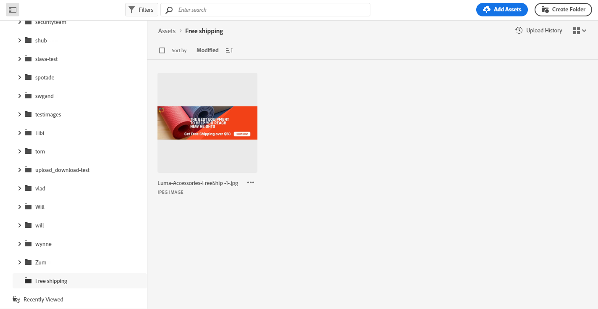

# Criar e gerenciar ativos {#experience-manager-assets}

## Introdução ao [!DNL Assets Essentials] {#get-started-assets-essentials}

Reúna fluxos de trabalho de marketing e criação usando [!DNL Adobe Experience Manager Assets Essentials]. Integrado nativamente com [!DNL Adobe Journey Optimizer], acesso [!DNL Assets Essentials] para armazenar, gerenciar, descobrir e distribuir ativos digitais. Ele fornece um repositório único e centralizado de ativos que você pode usar para preencher suas mensagens.

[!DNL Adobe Experience Manager Assets Essentials] O é um espaço de trabalho colaborativo e centralizado de ativos que estende seu sistema criativo e visita ativos digitais para entrega de experiência. É possível organizar, marcar e encontrar facilmente ativos de produção aprovados para garantir a consistência da marca em todas as equipes. Com a experiência intuitiva do usuário, acesse instantaneamente ativos compartilhados em seus aplicativos Adobe Creative e Experience Cloud.

Saiba mais em [Documentação do Adobe Experience Manager Assets Essentials](https://experienceleague.adobe.com/docs/experience-manager-assets-essentials/help/introduction.html){target=&quot;_blank&quot;}.

[!DNL Adobe Experience Manager Assets Essentials] pode ser acessada diretamente de [!DNL Adobe Journey Optimizer] através da **[!UICONTROL Assets]** seção. Também é possível acessar ativos e pastas ao [design de conteúdo de email](design-emails.md).

## Pré-requisitos{#assets-prerequisites}

Antes de usar [!DNL Adobe Experience Manager Assets Essentials], você deve adicionar usuários ao **Usuários do cliente do Assets Essentials** ou/e **Usuários do Assets Essentials** Perfis de produto. Leia mais em [Documentação do Assets Essentials](https://experienceleague.adobe.com/docs/experience-manager-assets-essentials/help/deploy-administer.html){target=&quot;_blank&quot;}.

>[!NOTE]
>Para produtos da Journey Optimizer obtidos antes de 6 de janeiro de 2022, é necessário implantar [!DNL Adobe Experience Manager Assets Essentials] para sua organização. Saiba mais na [Implantar o Assets Essentials](https://experienceleague.adobe.com/docs/experience-manager-assets-essentials/help/deploy-administer.html)seção {target=&quot;_blank&quot;}.

## Fazer upload e inserir ativos{#add-asset}

Para importar arquivos para [!DNL Assets Essentials], primeiro é necessário procurar ou criar a pasta na qual ele será armazenado. Você poderá inseri-los no seu conteúdo de email.

Para obter mais informações sobre como fazer upload de ativos, consulte [Documentação do Adobe Experience Manager Assets Essentials](https://experienceleague.adobe.com/docs/experience-manager-assets-essentials/help/add-delete.html){target=&quot;_blank&quot;}.

1. De [!DNL Adobe Journey Optimizer] página inicial, selecione o **[!UICONTROL Assets]** na guia **[!UICONTROL Content management]** para acessar o menu [!DNL Assets Essentials].

   

1. Clique duas vezes em uma pasta na seção central ou na visualização em árvore para abri-la.

   Você também pode clicar em **[!UICONTROL Create folder]** para criar uma nova pasta.

   

1. Uma vez na pasta selecionada ou criada, clique em **[!UICONTROL Add Assets]** para fazer upload do novo ativo para a sua pasta.

   

1. No **[!UICONTROL Upload files]**, clique em **[!UICONTROL Browse]** e escolha se deseja **[!UICONTROL Browse files]** ou **[!UICONTROL Browse folders]**.

   

1. Selecione o arquivo que deseja fazer upload. Quando terminar, clique em **[!UICONTROL Upload]**.

   Para saber mais sobre como gerenciar os ativos, consulte esta seção [página](https://experienceleague.adobe.com/docs/experience-manager-assets-essentials/help/manage-organize.html).

1. Depois que o ativo é carregado, agora é possível inserir os ativos em uma das mensagens por meio do Designer de email.

   Seu ativo também pode ser editado posteriormente com a variável **Editar** modo de [!DNL Assets Essentials]. [Saiba mais](https://experienceleague.adobe.com/docs/experience-manager-assets-essentials/help/edit-images.html){target=&quot;_blank&quot;}.

   

1. De [!DNL Adobe Journey Optimizer], selecione **[!UICONTROL Asset picker]** no painel esquerdo do designer de email.

   

1. Selecione a pasta Ativos. Você também pode pesquisar seu ativo ou sua pasta na barra de pesquisa.

1. Arraste e solte o ativo no seu conteúdo de email.

   
<!--
1. After adding your asset to your email, use the **[!UICONTROL Find similar Stock photos]** option to locate Stock photos that match the content, color, and composition of your image. [Learn more about Adobe Stock](stock.md).

    Note that this option is available for licensed/unlicensed Stock images and images from your Assets folder. 

    
-->

1. Você pode personalizar ainda mais seus ativos, como adicionar um link externo ou um texto com a variável **[!UICONTROL Components settings]**. [Saiba mais sobre configurações de componentes](content-components.md)

   

Depois que a mensagem é criada e personalizada, você pode publicá-la para disponibilizá-la para execução. [Saiba mais](../messages/publish-manage-message.md)
