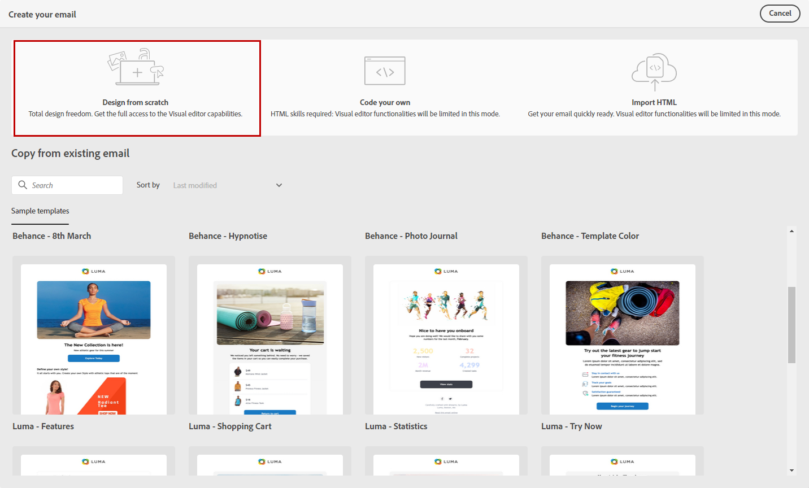
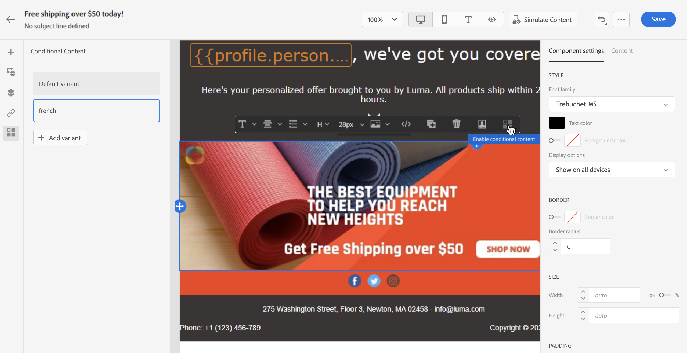

# Iniciar do zero {#create-email-content}

>[!CONTEXTUALHELP]
>id="ac_structure_components_email"
>title="Sobre componentes da estrutura"
>abstract="Os componentes da estrutura definem o layout do email."

>[!CONTEXTUALHELP]
>id="ac_structure_components_landing_page"
>title="Sobre componentes da estrutura"
>abstract="Componentes da estrutura definem o layout da landing page."

>[!CONTEXTUALHELP]
>id="ac_structure_components_fragment"
>title="Sobre componentes da estrutura"
>abstract="Componentes da estrutura definem o layout do fragmento."

>[!CONTEXTUALHELP]
>id="ac_structure_components_template"
>title="Sobre componentes da estrutura"
>abstract="Componentes da estrutura definem o layout do modelo."

>[!CONTEXTUALHELP]
>id="ac_edition_columns_email"
>title="Definição de colunas de email"
>abstract="O Designer de email permite definir facilmente o layout do email definindo a estrutura da coluna."

>[!CONTEXTUALHELP]
>id="ac_edition_columns_landing_page"
>title="Definição de colunas de página de aterrissagem"
>abstract="O Designer de email permite definir facilmente o layout da página de aterrissagem definindo a estrutura da coluna."

>[!CONTEXTUALHELP]
>id="ac_edition_columns_fragment"
>title="Definição das colunas do fragmento"
>abstract="O Designer de email permite definir facilmente o layout do fragmento definindo a estrutura da coluna."

>[!CONTEXTUALHELP]
>id="ac_edition_columns_template"
>title="Definição de colunas de modelo"
>abstract="O Designer de email permite definir facilmente o layout do modelo definindo a estrutura da coluna."

O Designer de email permite que você defina facilmente a estrutura do seu email. Ao adicionar e mover elementos estruturais com ações simples de arrastar e soltar, você pode projetar a forma do seu email em segundos.

Para começar a criar seu conteúdo de email com o designer de email, siga as etapas abaixo:

1. Na página inicial do Designer de email, selecione o **[!UICONTROL Design do zero]** opção.

   

1. Comece a criar o conteúdo de email arrastando e soltando **[!UICONTROL Componentes da estrutura]** para definir o layout do email.

   >[!NOTE]
   >
   >Observe que a pilha de colunas não é compatível com todos os programas de email. Quando não houver suporte, as colunas não serão empilhadas.
   >
   >Depois de colocado no email, não é possível mover nem remover seus componentes, a menos que já exista um componente de conteúdo ou um fragmento inserido dentro dele.

   

1. Adicionar quantos **[!UICONTROL Componentes da estrutura]** conforme necessário.

   Selecione o **[!UICONTROL coluna n:n]** para definir o número de colunas de sua escolha (entre 3 e 10). Você também pode definir a largura de cada coluna, movendo as setas na parte inferior de cada coluna.

   >[!NOTE]
   >
   >Cada tamanho de coluna não pode estar abaixo de 10% da largura total do componente de estrutura. Não é possível remover uma coluna que não esteja vazia.

1. No **[!UICONTROL Componentes de conteúdo]** , é possível adicionar quantos **[!UICONTROL Componentes de conteúdo]** conforme necessário no componente de estrutura. [Saiba mais sobre componentes de conteúdo](content-components.md).

   

1. Cada componente pode ser personalizado ainda mais com a variável **[!UICONTROL Configurações do componente]** seção. Por exemplo, você pode alterar o estilo do texto, o preenchimento ou a margem do componente. [Saiba mais sobre alinhamento e preenchimento](adjusting-vertical-alignment-and-padding.md).

   

1. No **[!UICONTROL Seletor de ativos]**, é possível adicionar diretamente ativos armazenados no **[!UICONTROL Biblioteca de ativos]** ao seu email. [Saiba mais sobre o gerenciamento de ativos](assets-essentials.md).

   Clique duas vezes na pasta que continha seus ativos e arraste e solte o ativo que deseja adicionar ao seu email.

   

1. Adicione campos de personalização para personalizar o conteúdo dos dados de perfis. [Saiba mais sobre a personalização de conteúdo](../personalization/personalize.md).

   

1. Adicione conteúdo dinâmico para adaptar o conteúdo aos perfis segmentados com base em regras condicionais. [Introdução ao conteúdo dinâmico](../personalization/get-started-dynamic-content.md).

   

1. No **[!UICONTROL Links]** no painel esquerdo, verifique a lista de todos os URLs do seu conteúdo que serão rastreados. Você pode modificar as **[!UICONTROL Tipo de rastreamento]**, **[!UICONTROL Rótulo]** e **[!UICONTROL Tags]** se necessário.

   

   >[!NOTE]
   >
   >Saiba mais sobre links e rastreamento de mensagens em [esta página](message-tracking.md).

1. Se necessário, você pode alternar para o editor de código para personalizar ainda mais seu email clicando em **[!UICONTROL Alternar para editor de código]** no menu avançado. Para obter mais informações sobre o editor de códigos, consulte [esta página](code-content.md#).

   >[!NOTE]
   >
   >Não será possível usar o designer visual para esse email após alternar para o editor de código.

   

1. Clique em **[!UICONTROL Mostrar visualização]** para verificar a renderização de email. Você pode escolher a área de trabalho ou exibição móvel.

   Para obter mais informações sobre como visualizar seu email, consulte [esta página](preview.md).

   

1. Quando o email estiver pronto, clique em **[!UICONTROL Salvar e fechar]**.

