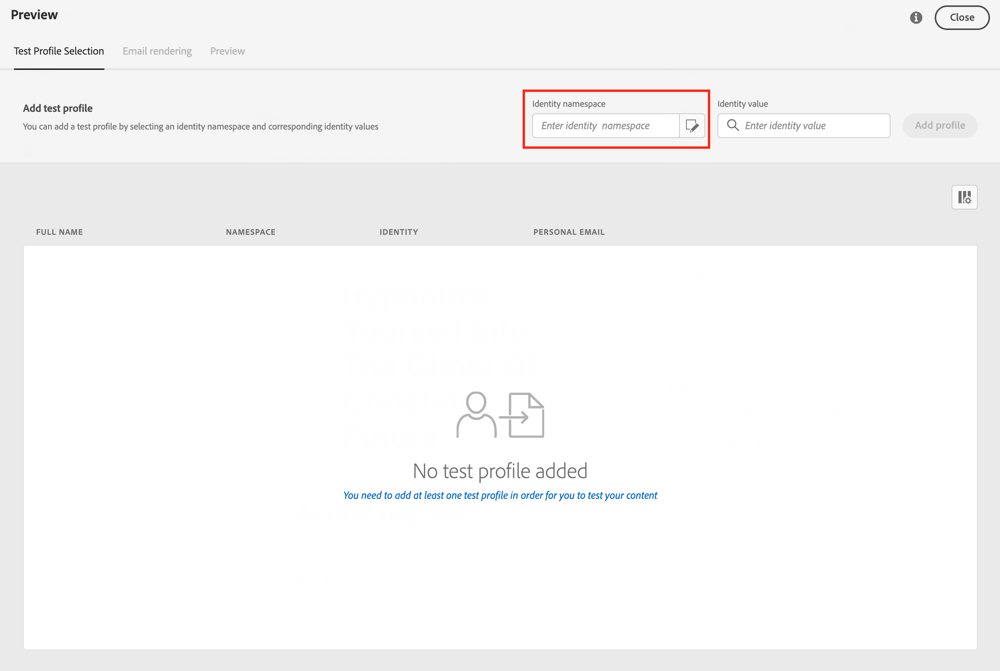
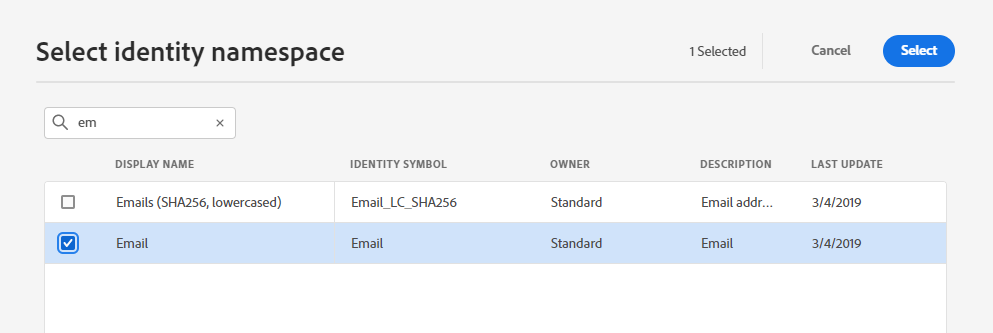
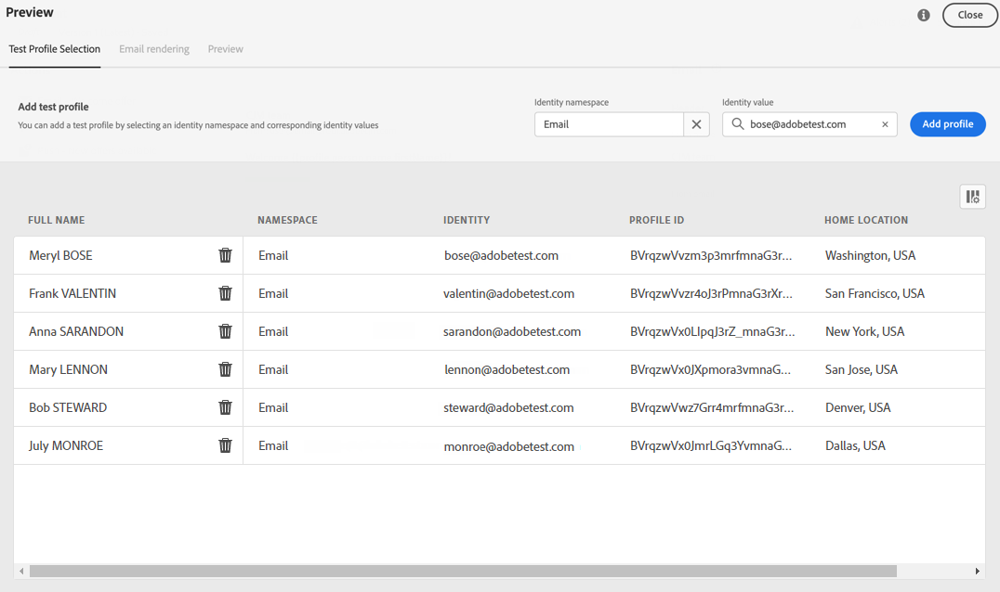
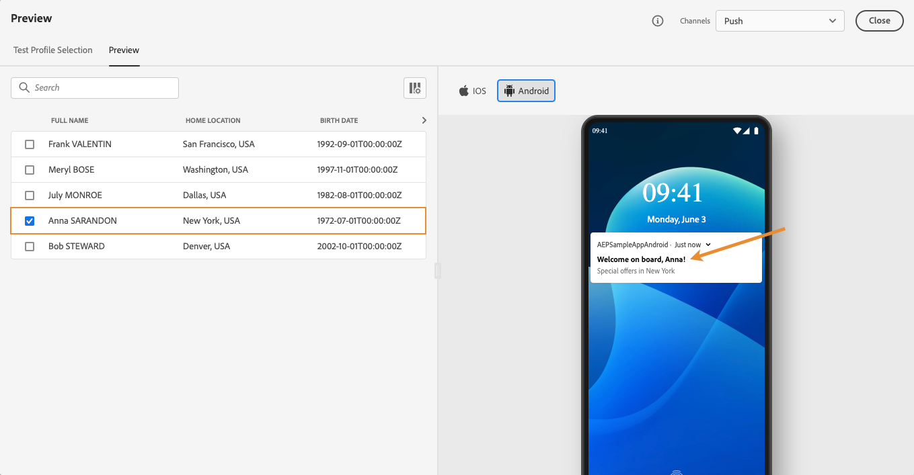

# Visualizar e testar suas mensagens{#preview-and-proof}

Após definir o conteúdo da mensagem, é possível usar perfis de teste para pré-visualizá-lo e testá-lo. Se você inseriu [conteúdo personalizado](../personalization/personalize.md), é possível verificar como esse conteúdo é exibido na mensagem, aproveitando os dados do perfil de teste.

Para detectar possíveis erros no conteúdo do email ou nas configurações de personalização, envie provas para testar perfis. Uma prova deve ser enviada sempre que uma alteração for feita, para validar o conteúdo mais recente.

>[!CAUTION]
>
>Você precisa ter perfis de teste disponíveis para pré-visualizar suas mensagens e enviar provas.
>
>Saiba como criar perfis de teste [nesta página](../segment/creating-test-profiles.md).

Para testar o conteúdo da mensagem, é necessário:

* [selecionar perfis de teste](#select-test-profiles)
* [verificar a pré-visualização da mensagem](#preview-your-messages)

Você poderá [enviar provas](#send-proofs) aos seus perfis de teste.

Além disso, aproveite **Litmus** conta em [!DNL Journey Optimizer] para visualizar instantaneamente sua **renderização de email** em clientes de email populares. Em seguida, você pode garantir que seu conteúdo de email fique ótimo e funcione corretamente em cada caixa de entrada. Saiba como desbloquear visualizações de email do Litmus em [esta seção](#email-rendering)

>[!CAUTION]
>
>Ao visualizar uma mensagem ou enviar provas, somente os dados de personalização de perfil são exibidos. A personalização com base em dados de contexto, como informações de evento, só pode ser testada no contexto de uma jornada. Saiba como testar a personalização no [este caso de uso](../personalization/personalization-use-case.md).

➡️ [Saiba como visualizar e provar seu email neste vídeo](#video-preview)

## Selecionar perfis de teste{#select-test-profiles}

>[!CONTEXTUALHELP]
>id="ac_preview_testprofiles"
>title="Visualizar e testar suas mensagens"
>abstract="Após definir o conteúdo da mensagem, é possível usar perfis de teste para pré-visualizá-lo e testá-lo."
>additional-url="https://experienceleague.adobe.com/docs/journey-optimizer/using/messages/validate/preview.html?lang=en#email-rendering" text="Renderização de email"
>additional-url="https://experienceleague.adobe.com/docs/journey-optimizer/using/messages/validate/preview.html?lang=en#preview-your-messages" text="Visualização"

Use [Testar perfis](../segment/creating-test-profiles.md) para direcionar recipients adicionais que não correspondem aos critérios de direcionamento definidos.

Para selecionar perfis de teste, siga as etapas abaixo:

1. Na interface da mensagem ou no designer de email, clique no link **[!UICONTROL Simulate Content]** para acessar a seleção de perfil de teste.

   

1. Selecione o namespace a ser usado para identificar perfis de teste clicando no botão **[!UICONTROL Identity namespace]** ícone de seleção.

   

   Saiba mais sobre os namespaces de identidade da Adobe Experience Platform [nesta seção](../segment/get-started-identity.md).

   No exemplo abaixo, usaremos a variável **Email** namespace.

1. Use o campo de pesquisa para localizar o namespace, selecione-o e clique em **[!UICONTROL Select]**

   

1. Insira o valor para identificar o perfil de teste e clique em **[!UICONTROL Add profile]**.

   

1. Se você tiver adicionado personalização à mensagem, adicione outros perfis para poder testar diferentes variantes da mensagem, dependendo dos dados do perfil. Depois de adicionados, os perfis são listados nos campos de seleção.

   

   Com base nos elementos de personalização da mensagem, essa lista exibe os dados para cada perfil de teste nas colunas relacionadas.

## Visualizar mensagens{#preview-your-messages}

Uma vez [perfis de teste](#select-test-profiles) forem selecionadas, você poderá visualizar suas mensagens e verificar o conteúdo.

### Visualização de email{#preview-email}

Para visualizar um conteúdo de email, siga as etapas abaixo:

1. Clique no botão **[!UICONTROL Simulate content]** acima do conteúdo do email.

1. Selecione um perfil de teste. Você pode verificar os valores disponíveis nas colunas. Use as setas para a direita/esquerda para navegar pelos dados.

   

1. Clique no botão **[!UICONTROL Select data]** ícone acima da lista para adicionar ou remover colunas.

   

   Você pode ver campos de personalização específicos da mensagem atual no final da lista. Neste exemplo, a cidade do perfil, o nome e o sobrenome. Selecione esses campos e verifique se esses valores estão preenchidos nos perfis de teste.

1. Na visualização da mensagem, os elementos personalizados são substituídos pelos dados de perfil de teste selecionados.

   Por exemplo, para essa mensagem, o conteúdo do email e o assunto do email são personalizados:

   

1. Selecione outros perfis de teste para visualizar a renderização de email para cada variante da mensagem.

### Visualização por push{#preview-push}

Para visualizar um conteúdo de notificação por push, siga as etapas abaixo:

1. Clique no botão **[!UICONTROL Simulate content]** acima do conteúdo de push.

1. Selecione um perfil de teste. Você pode verificar os valores disponíveis nas colunas. Use as setas para a direita/esquerda para navegar pelos dados.

1. Alterne para **[!UICONTROL Push]** mensagem.

1. Siga as mesmas etapas descritas acima para selecionar um perfil de teste e selecione o tipo de dispositivo para visualizar o conteúdo: **[!UICONTROL iOS]** ou **[!UICONTROL Android]**.

   

1. Na visualização por push, os dados do perfil de teste são aproveitados no conteúdo da mensagem.

   Por exemplo, para esta notificação por push, o título e o corpo são personalizados:

   

## Enviar provas{#send-proofs}

Uma prova é uma mensagem específica que permite testar uma mensagem antes de enviá-la para o público principal. Os recipients da prova são responsáveis pela aprovação da mensagem: renderização, conteúdo, configurações de personalização, configuração.

Uma vez [perfis de teste](#select-test-profiles) forem selecionadas, você poderá enviar provas.

1. No **[!UICONTROL Preview]** clique no botão **[!UICONTROL Send proof]** botão.

   

1. No **[!UICONTROL Send proof]** , digite o email do destinatário e clique em **[!UICONTROL Add]** para enviar a prova para você mesmo ou para membros de sua organização.

   Observe que você pode adicionar até dez recipients para o delivery de prova.

   

1. Em seguida, selecione a **Testar perfis** que será usada para personalizar o conteúdo da mensagem.

   Cada recipient da prova receberá quantas mensagens for o número de perfis de teste selecionados. Por exemplo, se você adicionou cinco emails de recipient e selecionou dez perfis de teste, você enviará cinquenta mensagens de prova e cada recipient receberá dez deles.

1. Você pode adicionar um prefixo à linha de assunto da prova, se necessário. Apenas caracteres alfanuméricos e caracteres especiais, por exemplo, . - _ ( ) [ ], são permitidos como prefixo na linha de assunto.

1. Clique em **[!UICONTROL Send proof]**.

   

1. De volta ao  **[!UICONTROL Preview]** clique no botão  **[!UICONTROL View proofs]** para verificar o status.

   

É recomendável enviar provas após cada modificação ao conteúdo da mensagem.

>[!NOTE]
>
>Na prova enviada aos perfis de teste, o link para a mirror page não está ativo. Ela só é ativada nas mensagens finais.

## Renderização de email{#email-rendering}

Você pode aproveitar seu **Litmus** conta em [!DNL Journey Optimizer] para visualizar instantaneamente sua **renderização de email** em clientes de email populares.

Para acessar os recursos de renderização de email, é necessário:

* Ter uma conta Litmus
* [Selecionar perfis de teste](#select-test-profiles)

Em seguida, siga as etapas abaixo:

1. No Designer de email, clique no botão **[!UICONTROL Preview]** e selecione o **[!UICONTROL Email rendering]** guia .

1. Clique em **Conecte sua conta Litmus** na seção superior direita.

   

1. Insira suas credenciais e faça logon.

   

1. Clique no botão **Executar teste** para gerar visualizações de email.

1. Verifique seu conteúdo de email em clientes populares de desktop, dispositivos móveis e baseados na Web.

   

>[!CAUTION]
>
>Ao conectar seu **Litmus** conta com [!DNL Journey Optimizer], você concorda que as mensagens de teste são enviadas ao Litmus: depois de enviados, esses emails não são mais gerenciados pelo Adobe. Como consequência, a política de email de retenção de dados Litmus se aplica a esses emails, incluindo dados de personalização que podem ser incluídos nessas mensagens de teste.

## Vídeo tutorial{#video-preview}

Saiba como testar a renderização de email nas caixas de entrada, como visualizar seus emails personalizados em relação a perfis de teste e enviar provas.

>[!VIDEO](https://video.tv.adobe.com/v/334239?quality=12)
