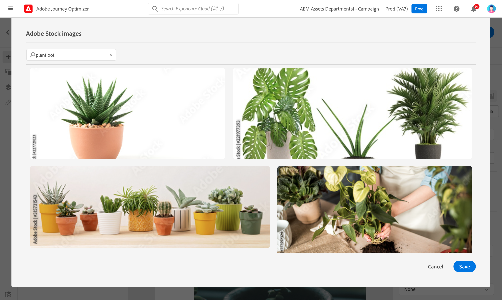

# Trabalhar com [!DNL Adobe Stock] imagens {#stock}

## Introdução ao [!DNL Adobe Stock] {#get-started-stock}

O [!DNL Adobe Stock] e [!DNL Adobe Journey Optimizer] O plug-in de integração do Designer de email fornece aos clientes uma maneira fácil de navegar, licenciar e salvar imagens para uso na criação de mensagens.

[Adobe Stock](https://helpx.adobe.com/stock/get-started.html){target=&quot;_blank&quot;} fornece acesso a milhões de fotos, vídeos, ilustrações e gráficos vetoriais de alta qualidade e com curadoria e isenta de royalties. Você pode optar por comprar um pacote de crédito para licenciar ativos ou comprar apenas uma licença Standard ou Extended para o ativo necessário. O Adobe Stock também fornece uma coleção gratuita de ativos.

Com [!DNL Adobe Journey Optimizer], você pode carregar imagens em seus emails diretamente de [!DNL Adobe Stock] e adicione-o à pasta Assets. O **[!UICONTROL Find Similar Image]** ajuda a encontrar imagens que correspondam ao conteúdo, à cor e à composição do ativo usado no delivery.

## Permissões{#stock-permissions}

O **[!UICONTROL Find Adobe Stock photos]** está disponível para usuários com acesso a um Perfil de produto do AEM Assets Essentials.

Para obter mais informações, consulte [Documentação essencial dos ativos](https://experienceleague.adobe.com/docs/experience-manager-assets-essentials/help/get-started-admins/deploy-administer.html#add-users-to-essentials){target=&quot;_blank&quot;}.

## Inserir uma imagem de [!DNL Adobe Stock] {#add-stock-image}

Para adicionar imagens de [!DNL Adobe Stock] para seu conteúdo, siga as etapas abaixo:

1. No **[!UICONTROL Content components]** seção do Designer de email, arraste e solte uma **Imagem**.

1. Clique no botão **[!UICONTROL Find Adobe Stock photos]** no lado esquerdo do Designer de email.

   

1. Navegue pela biblioteca ou insira um termo no campo de pesquisa.

   

1. Selecione a imagem escolhida e clique em **[!UICONTROL Save]**.

   Se a imagem selecionada não estiver licenciada, você deve [obter a licença](#license-stock-image).

## Obtenha a licença de [!DNL Adobe Stock] {#license-stock-image}

Se a imagem já estiver licenciada, ela será representada pela variável  ícone . Caso contrário, você deve licenciá-lo.

Para licenciar e baixar a imagem, siga as etapas abaixo:

1. Selecione-o e clique no botão **[!UICONTROL License Adobe Stock image]** ícone .

   

   Em seguida, você é redirecionado para a função [!DNL Adobe Stock] site, mas a licença.

   

1. No [!DNL Adobe Stock] no site, é necessário comprar o ativo para baixar a imagem e remover a marca d&#39;água.

   Essa compra depende do plano ou da assinatura da Adobe Stock. Observe que, se você tiver várias contas Adobe Stock, será redirecionado para a última ID de estoque usada. Nesse caso, verifique se você está conectado à conta correta antes de licenciar seu ativo.

   Para obter mais informações sobre os planos e preços da Adobe Stock em [Documentação do Adobe Stock](https://stock.adobe.com/plans){target=&quot;_blank&quot;}.

   >[!WARNING]
   > Se um email incluindo uma imagem não licenciada for enviado, a imagem manterá seu formulário não licenciado com a marca d&#39;água.

1. Assim que sua compra for concluída, você poderá retornar ao seu email em [!DNL Adobe Journey Optimizer] e selecione **[!UICONTROL Import stock image]** para importar a imagem licenciada para os ativos.

   

1. Selecione em qual pasta armazenar o ativo. Para obter mais informações sobre [!DNL Assets Essentials]consulte esta seção [página](assets-essentials.md#get-started-assets-essentials).

## Localizar fotos semelhantes {#similar-stock-image}

Você pode substituir qualquer imagem existente no seu conteúdo de email por uma foto de [!DNL Adobe Stock]. Observe que essa opção está disponível para todas as imagens: imagens licenciadas/não licenciadas do Stock e imagens da sua pasta Assets.

Para procurar fotos semelhantes, siga as etapas abaixo:

1. Selecione a imagem a ser substituída.
1. Clique no botão **[!UICONTROL Find similar Stock photos]** botão para exibir ativos em [!DNL Adobe Stock] que correspondem ao conteúdo, à cor e à composição da imagem.

   

1. Selecione a imagem escolhida e clique em **[!UICONTROL Save]**.

   

   Se a imagem selecionada não estiver licenciada, você deve [obter a licença](#license-stock-image).

1. Personalize sua imagem, se necessário, com a variável **[!UICONTROL Components settings]** menu. [Saiba mais sobre configurações de componentes](content-components.md)

Depois que a mensagem é criada e personalizada, você pode publicá-la para disponibilizá-la para execução. [Saiba mais](../messages/publish-manage-message.md)

### Tópicos relacionados{#stock-related-topics}

* [Design de email no Journey Optimizer](design-emails.md)
* [Configurações de componentes para design de email](content-components.md)
* [Adobe Stock Introdução](https://helpx.adobe.com/stock/get-started.html){target=&quot;_blank&quot;}.

