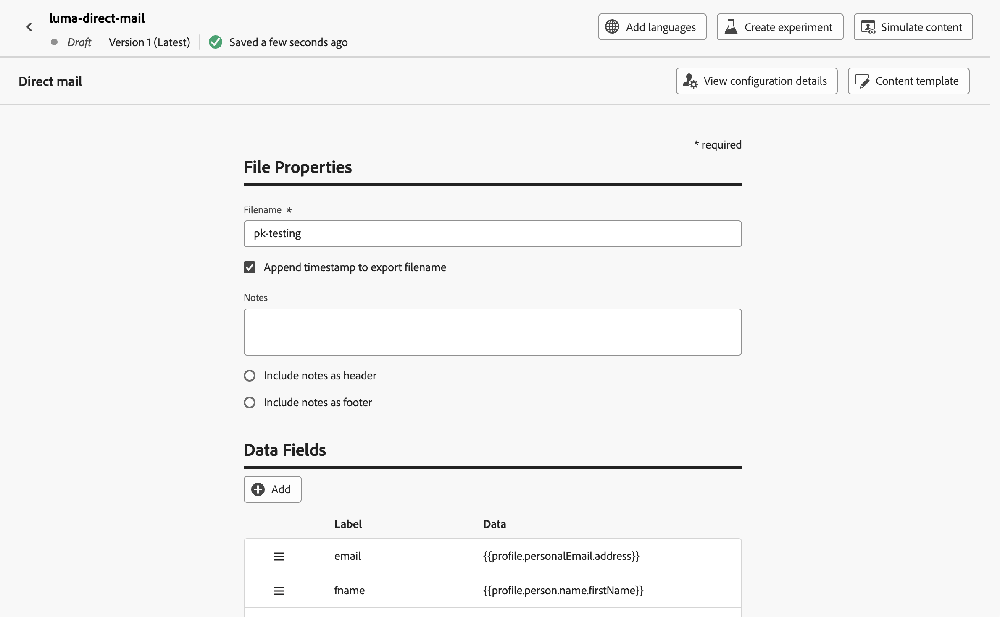

# Criar uma mensagem de correspondência direta {#create-direct}

>[!CONTEXTUALHELP]
>id="ajo_direct_mail"
>title="Criação de correspondência direta"
>abstract="Crie mensagens de correspondência direta em campanhas e jornadas programadas e projete os arquivos de extração exigidos pelos provedores de correspondência direta para enviar emails para os clientes."

>[!CONTEXTUALHELP]
>id="ajo_journey_direct_mail"
>title="Atividade de término"
>abstract="Correspondência direta é um canal offline que permite personalizar e gerar os arquivos de extração exigidos por provedores de correspondência direta de terceiros para o envio a clientes."

Para criar mensagens de correspondência direta, crie uma campanha agendada ou uma jornada e configure o arquivo de extração. Esse arquivo é exigido por provedores de correspondência direta para enviar emails aos clientes.

>[!IMPORTANT]
>
>Antes de criar uma mensagem de correspondência direta, verifique se você configurou:
>
>1. Uma [configuração de roteamento de arquivo](../direct-mail/direct-mail-configuration.md#file-routing-configuration) que especifica o servidor no qual o arquivo de extração deve ser carregado e armazenado,
>1. Uma [configuração de mensagem de correspondência direta](../direct-mail/direct-mail-configuration.md#direct-mail-surface) que referenciará a configuração de roteamento de arquivos.

## Adicionar uma mensagem de correspondência direta {#create-dm-campaign}

Navegue pelas guias abaixo para saber como adicionar uma mensagem de correspondência direta em uma campanha ou jornada.

>[!BEGINTABS]

>[!TAB Adicionar uma mensagem de correspondência direta a uma Jornada]

1. Abra a jornada e arraste e solte uma atividade de **[!UICONTROL Correspondência direta]** da seção **Ações** da paleta.

1. Forneça informações básicas sobre a mensagem (rótulo, descrição, categoria) e escolha a configuração de mensagem a ser usada. O campo **[!UICONTROL configuração]** é preenchido previamente, por padrão, com a última configuração usada para esse canal pelo usuário. Para obter mais informações sobre como configurar uma jornada, consulte [esta página](../building-journeys/journey-gs.md).

1. Configure o arquivo de extração para enviar ao seu provedor de correspondência direta. Para fazer isso, clique no botão **[!UICONTROL Editar conteúdo]**.

   

1. Ajuste as propriedades do arquivo de extração, como o nome do arquivo, ou as colunas a serem exibidas. Para obter mais informações sobre como configurar as propriedades do arquivo de extração, consulte esta seção: [Criar uma mensagem de correspondência direta](../direct-mail/create-direct-mail.md#extraction-file).

   

1. Depois que o conteúdo do arquivo de extração for definido, você poderá usar perfis de teste para visualizá-lo. Se você inseriu conteúdo personalizado, é possível verificar como esse conteúdo é exibido na mensagem, usando os dados do perfil de teste.

   Para fazer isso, clique em **[!UICONTROL Simular conteúdo]** e adicione um perfil de teste para verificar como é a renderização do arquivo de extração usando os dados do perfil de teste. Informações detalhadas sobre como selecionar perfis de teste e pré-visualizar seu conteúdo estão disponíveis na seção [Gerenciamento de conteúdo](../content-management/preview-test.md).

   {width="800" align="center"}

Quando o arquivo de extração estiver pronto, conclua a configuração da [jornada](../building-journeys/journey-gs.md) para enviá-lo.

>[!TAB Adicionar uma mensagem de correspondência direta a uma campanha]

1. Acesse o menu **[!UICONTROL Campanhas]** e clique em **[!UICONTROL Criar campanha]**.

1. Selecione o tipo de campanha **Agendado - Marketing**.

1. Na seção **[!UICONTROL Propriedades]**, edite o **[!UICONTROL Título]** e a **[!UICONTROL Descrição]** da campanha.

1. Para definir seu público-alvo, clique no botão **[!UICONTROL Selecionar público-alvo]** e escolha entre os públicos-alvo disponíveis da Adobe Experience Platform. [Saiba mais](../audience/about-audiences.md).

   >[!IMPORTANT]
   >
   >Por enquanto, a seleção de público está restrita a 3 milhões de perfis. Essa limitação pode ser removida mediante solicitação ao representante da Adobe.

1. No campo **[!UICONTROL Namespace de identidade]**, selecione o namespace apropriado para identificar indivíduos dentro do público escolhido. [Saiba mais](../event/about-creating.md#select-the-namespace).

1. Na seção **[!UICONTROL Ações]**, escolha a **[!UICONTROL correspondência direta]**.

1. Selecione ou crie uma **[!UICONTROL Configuração de correspondência direta]** para usar. [Saiba como criar uma configuração de correspondência direta](direct-mail-configuration.md#direct-mail-surface).

   {width="800" align="center"}

   >[!AVAILABILITY]
   >
   >A Correspondência Direta oferece suporte à funcionalidade **Holdout**, mas atualmente não oferece suporte a **Tratamentos**. [Saiba como trabalhar com experimentos](../content-management/get-started-experiment.md)

1. As campanhas podem ser agendadas para uma data específica ou definidas para recorrentes em intervalos regulares. Saiba como configurar o **[!UICONTROL Cronograma]** da sua campanha no [nesta seção](../campaigns/campaign-schedule.md).

Agora você pode começar a configurar o arquivo de extração para enviar ao seu provedor de correspondência direta.

>[!ENDTABS]

## Configurar o arquivo de extração {#extraction-file}

>[!CONTEXTUALHELP]
>id="ajo_direct_mail_data_fields"
>title="Campos de dados"
>abstract="Adicione e configure as colunas e as informações a serem exibidas no arquivo de extração exigido por provedores de correspondência direta para enviar correspondências a clientes. É possível adicionar até 50 colunas."

>[!CONTEXTUALHELP]
>id="ajo_direct_mail_formatting"
>title="Formatação do arquivo de extração"
>abstract="Para cada campo, especifique um rótulo e as informações a serem exibidas usando o editor de personalização.    A opção <b>Classificar por</b> permite usar o campo selecionado para classificar as colunas do arquivo de extração."

O arquivo de extração é exigido por provedores de correspondência direta para enviar emails aos clientes. Para definir a configuração do arquivo de extração, siga estas etapas:

1. Na tela de configuração da campanha ou da jornada, clique no botão **[!UICONTROL Editar conteúdo]** para configurar o conteúdo do arquivo de extração.

1. Para adicionar políticas de decisão à sua mensagem de correspondência direta, selecione uma coluna na seção **[!UICONTROL Campos de Dados]** e abra o editor de personalização usando o ícone . Navegue até o menu **[!UICONTROL Políticas de decisão]** para criar e inserir uma política de decisão. Em seguida, você pode usar atributos de item de decisão como dados de coluna no arquivo de extração.

   >[!AVAILABILITY]
   >
   >O Experience Decisioning na correspondência direta é um novo recurso. Anteriormente, os arquivos de extração de correspondência direta não podiam usar o mecanismo do Decisioning; agora é possível adicionar políticas de decisão e incluir atributos de item de decisão como dados de coluna na exportação.

   [Saiba como adicionar uma política de decisão à correspondência direta](../experience-decisioning/create-decision-policy.md#add). Para obter exemplos e fluxos de trabalho de decisão em lote (correspondência direta personalizada ou exportação para sistemas downstream), consulte [Decisão em lote na correspondência direta](../experience-decisioning/batch-decisioning-direct-mail.md).

1. Ajuste as propriedades do arquivo de extração:

   1. No campo **[!UICONTROL Nome do arquivo]**, especifique um nome para o arquivo de extração.

      >[!NOTE]
      >
      >Por padrão, o arquivo é gravado no diretório raiz no servidor. O campo **[!UICONTROL Filename]** também aceita o formato &quot;/your/path/here/Filename.csv&quot;, em que o caminho especificado é o diretório de destino no servidor selecionado. <!--TBC if for SFTP and Azure only, or for all servers including S3-->

   1. Opcionalmente, habilite a opção **[!UICONTROL Anexar carimbo de data/hora ao nome de arquivo de exportação]** se desejar adicionar um carimbo de data/hora automático ao nome de arquivo especificado.

   1. Às vezes, pode ser necessário adicionar informações ao início ou final do arquivo de extração. Para fazer isso, use o campo **[!UICONTROL Notas]** e especifique se deseja incluir a nota como cabeçalho ou rodapé.

      {width="800" align="center"}

1. Configure as colunas e as informações a serem exibidas no arquivo de extração:

   1. Clique no botão **[!UICONTROL Adicionar]** para criar uma nova coluna.

   1. O painel **[!UICONTROL Formatação]** é exibido no lado direito, permitindo que você configure a coluna selecionada. Especifique um **[!UICONTROL Rótulo]** para a coluna.

   1. No campo **[!UICONTROL Dados]**, selecione os atributos de perfil a serem exibidos usando o [editor de personalização](../personalization/personalization-build-expressions.md).

   1. Para classificar o arquivo de extração usando uma coluna, selecione a coluna e alterne na opção **[!UICONTROL Classificar por]**. O ícone **[!UICONTROL Classificar por]** é exibido ao lado do rótulo da coluna na seção **[!UICONTROL Campos de Dados]**.

      {width="800" align="center"}

   1. Repita essas etapas para adicionar quantas colunas forem necessárias para o arquivo de extração. Observe que você pode adicionar até 50 colunas.

      Para alterar a posição de uma coluna, arraste-a e solte-a no local desejado na seção **[!UICONTROL Campo de dados]**. Para excluir uma coluna, selecione-a e clique no botão **[!UICONTROL Remover]** no painel **[!UICONTROL Formatação]**.

Agora você pode testar sua mensagem de correspondência direta e enviá-la ao seu público-alvo. [Saiba como testar e enviar mensagens de correspondência direta](test-send-direct-mail.md)

## Tópicos relacionados {#related-topics}

* [Introdução à correspondência direta](get-started-direct-mail.md)
* [Configurar canal de correspondência direta](direct-mail-configuration.md)
* [Testar e enviar correspondência direta](test-send-direct-mail.md)
* [Pré-visualizar e testar conteúdo](../content-management/preview-test.md)

Para perguntas comuns sobre correspondência direta, consulte [Introdução à correspondência direta](get-started-direct-mail.md).
