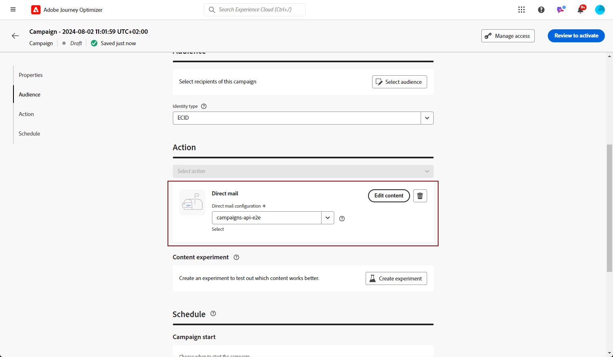

# Criar uma mensagem de correspondência direta {#create-direct}

>[!CONTEXTUALHELP]
>id="ajo_direct_mail"
>title="Criação de correspondência direta"
>abstract="Crie mensagens de correspondência direta em campanhas programadas e crie os arquivos de extração exigidos pelos provedores de correspondência direta para enviar para seus clientes."

Para criar mensagens de correspondência direta, crie uma campanha agendada e configure o arquivo de extração. Esse arquivo é exigido por provedores de correspondência direta para enviar emails aos clientes.

>[!IMPORTANT]
>
>Antes de criar uma mensagem de correspondência direta, verifique se você configurou:
>
>1. Uma [configuração de roteamento de arquivo](../direct-mail/direct-mail-configuration.md#file-routing-configuration) que especifica o servidor no qual o arquivo de extração deve ser carregado e armazenado,
>1. Uma [configuração de mensagem de correspondência direta](../direct-mail/direct-mail-configuration.md#direct-mail-surface) que referenciará a configuração de roteamento de arquivos.

## Criar uma campanha de correspondência direta{#create-dm-campaign}

Para criar uma campanha de correspondência direta, siga estas etapas:

1. Acesse o menu **[!UICONTROL Campanhas]** e clique em **[!UICONTROL Criar campanha]**.

1. Selecione o tipo de campanha que deseja executar

   * **Agendado - Marketing**: execute a campanha imediatamente ou em uma data especificada. As campanhas programadas são destinadas ao envio de mensagens de marketing. Eles são configurados e executados na interface do usuário do.

   * **Acionado por API - Marketing/Transacional**: execute a campanha usando uma chamada de API. As campanhas acionadas por API destinam-se ao envio de mensagens de marketing ou transacionais, ou seja, mensagens enviadas após uma ação executada por um indivíduo: redefinição de senha, compra de carrinho etc.

1. Na seção **[!UICONTROL Propriedades]**, edite o **[!UICONTROL Título]** e a **[!UICONTROL Descrição]** da campanha.

1. Para definir seu público-alvo, clique no botão **[!UICONTROL Selecionar público-alvo]** e escolha entre os públicos-alvo disponíveis da Adobe Experience Platform. [Saiba mais](../audience/about-audiences.md).

   >[!IMPORTANT]
   >
   >Por enquanto, a seleção de público está restrita a 3 milhões de perfis. Essa limitação pode ser removida mediante solicitação ao representante da Adobe.

1. No campo **[!UICONTROL Namespace de identidade]**, selecione o namespace apropriado para identificar indivíduos dentro do público escolhido. [Saiba mais](../event/about-creating.md#select-the-namespace).

1. Na seção **[!UICONTROL Ações]**, escolha a **[!UICONTROL correspondência direta]**.

1. Selecione ou crie uma nova configuração a ser usada por uma **[!UICONTROL Configuração de correspondência direta]**. [Saiba como criar uma configuração de correspondência direta](direct-mail-configuration.md#direct-mail-surface).

   {width="800" align="center"}

1. As campanhas podem ser agendadas para uma data específica ou definidas para recorrentes em intervalos regulares. Saiba como configurar o **[!UICONTROL Cronograma]** da sua campanha no [nesta seção](../campaigns/create-campaign.md#schedule).

Agora você pode começar a configurar o arquivo de extração para enviar ao seu provedor de correspondência direta.

## Configurar o arquivo de extração {#extraction-file}

>[!CONTEXTUALHELP]
>id="ajo_direct_mail_data_fields"
>title="Campos de dados"
>abstract="Adicione e configure as colunas e as informações a serem exibidas no arquivo de extração exigido por provedores de correspondência direta para enviar correspondências a clientes. É possível adicionar até 50 colunas."

>[!CONTEXTUALHELP]
>id="ajo_direct_mail_formatting"
>title="Formatação do arquivo de extração"
>abstract="Para cada campo, especifique um rótulo e as informações a serem exibidas usando o editor de personalização.    A opção <b>Classificar por</b> permite usar o campo selecionado para classificar as colunas do arquivo de extração."

O arquivo de extração é exigido por provedores de correspondência direta para enviar emails aos clientes. Para definir a configuração do arquivo de extração, siga estas etapas:

1. Na tela de configuração da campanha, clique no botão **[!UICONTROL Editar conteúdo]** para configurar o conteúdo do arquivo de extração.

1. Ajuste as propriedades do arquivo de extração:

   1. No campo **[!UICONTROL Nome do arquivo]**, especifique um nome para o arquivo de extração.

      >[!NOTE]
      >
      >Por padrão, o arquivo é gravado no diretório raiz. O campo **[!UICONTROL Filename]** aceita o formato &quot;/your/path/here/Filename.csv&quot;, em que o caminho especificado é o diretório de destino no servidor selecionado. <!--TBC if for SFTP and Azure only, or for all servers including S3-->

   1. Opcionalmente, habilite a opção **[!UICONTROL Anexar carimbo de data/hora ao nome de arquivo de exportação]** se desejar adicionar um carimbo de data/hora automático ao nome de arquivo especificado.

   1. Às vezes, pode ser necessário adicionar informações ao início ou final do arquivo de extração. Para fazer isso, use o campo **[!UICONTROL Notas]** e especifique se deseja incluir a nota como cabeçalho ou rodapé.

      {width="800" align="center"}

1. Configure as colunas e as informações a serem exibidas no arquivo de extração:

   1. Clique no botão **[!UICONTROL Adicionar]** para criar uma nova coluna.

   1. O painel **[!UICONTROL Formatação]** é exibido no lado direito, permitindo que você configure a coluna selecionada. Especifique um **[!UICONTROL Rótulo]** para a coluna.

   1. No campo **[!UICONTROL Dados]**, selecione os atributos de perfil a serem exibidos usando o [editor de personalização](../personalization/personalization-build-expressions.md).

   1. Para classificar o arquivo de extração usando uma coluna, selecione a coluna e alterne na opção **[!UICONTROL Classificar por]**. O ícone **[!UICONTROL Classificar por]** é exibido ao lado do rótulo da coluna na seção **[!UICONTROL Campos de Dados]**.

      {width="800" align="center"}

   1. Repita essas etapas para adicionar quantas colunas forem necessárias para o arquivo de extração. Observe que você pode adicionar até 50 colunas.

      Para alterar a posição de uma coluna, arraste-a e solte-a no local desejado na seção **[!UICONTROL Campo de dados]**. Para excluir uma coluna, selecione-a e clique no botão **[!UICONTROL Remover]** no painel **[!UICONTROL Formatação]**.

Agora você pode testar sua mensagem de correspondência direta e enviá-la ao seu público-alvo. [Saiba como testar e enviar mensagens de correspondência direta](test-send-direct-mail.md)

