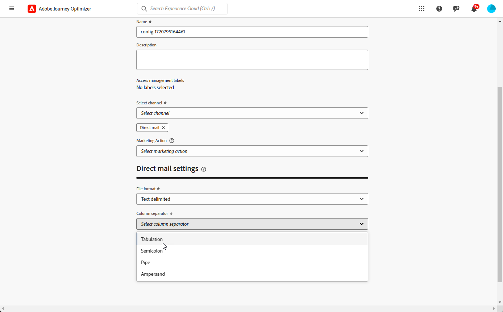

# Configuração da correspondência direta {#direct-mail-configuration}

O [!DNL Journey Optimizer] permite que você personalize e gere os arquivos necessários aos provedores de correspondência direta para enviar emails aos seus clientes.

Ao [criar uma mensagem de correspondência direta](../direct-mail/create-direct-mail.md), você define os dados do público alvo, incluindo as informações de contato escolhidas (endereço postal por exemplo). Um arquivo contendo esses dados será gerado e exportado automaticamente para um servidor, onde seu provedor de correspondência direta poderá recuperá-lo e cuidar do envio real.

Antes de poder gerar esse arquivo, é necessário criar:

1. Uma [configuração de roteamento de arquivo](#file-routing-configuration) para especificar o servidor para o qual o arquivo será exportado e criptografá-lo, se necessário.

   >[!CAUTION]
   >
   >Para criar uma configuração de roteamento de arquivo, você precisa ter a permissão interna **[!DNL Manage file routing]**. [Saiba mais](../administration/ootb-product-profiles.md#content-library-manager).

1. Uma [configuração de correspondência direta](#direct-mail-configuration) que referenciará a configuração de roteamento de arquivos. Se você não tiver configurado nenhuma opção de roteamento de arquivo, não será possível criar uma configuração de correspondência direta.

## Configurar o roteamento de arquivos {#file-routing-configuration}

>[!CONTEXTUALHELP]
>id="ajo_dm_file_routing_details"
>title="Definir a configuração de roteamento de arquivos"
>abstract="Após criar uma mensagem de correspondência direta, o arquivo contendo os dados do público-alvo direcionado será gerado e exportado para um servidor. Você precisa especificar os detalhes do servidor para que seu provedor de correspondência direta possa acessar e usar esse arquivo para a entrega da correspondência direta."
>additional-url="https://experienceleague.adobe.com/pt-br/docs/journey-optimizer/using/channels/direct-mail/create-direct-mail" text="Criar uma mensagem de correspondência direta"

>[!CONTEXTUALHELP]
>id="ajo_dm_file_routing_details_header"
>title="Definir a configuração de roteamento de arquivos"
>abstract="Você precisa definir para onde o arquivo será exportado para que seu provedor de correspondência direta o use."

>[!CONTEXTUALHELP]
>id="ajo_dm_select_file_routing"
>title="Configuração do roteamento de arquivos"
>abstract="Selecione a configuração de roteamento de arquivos de sua escolha, que define para onde o arquivo será exportado para que seu provedor de correspondência direta o use."

>[!CONTEXTUALHELP]
>id="ajo_dm_file_routing_type"
>title="Selecionar o tipo de servidor para o arquivo"
>abstract="Escolha o tipo de servidor que deseja usar para exportar seus arquivos de correspondência direta: Amazon S3, SFTP ou Azure."

>[!CONTEXTUALHELP]
>id="ajo_dm_file_routing_aws_region"
>title="Escolha a região do AWS"
>abstract="Selecione a região geográfica do servidor do AWS para onde deseja exportar os arquivos de correspondência direta. Como prática geral, é preferível escolher a região mais próxima da localização do provedor de correspondência direta."

>[!NOTE]
>
>Atualmente, o Amazon S3, SFTP e Azure têm suporte no [!DNL Journey Optimizer].

Para entregar uma mensagem de correspondência direta, o [!DNL Journey Optimizer] gera e exporta o arquivo contendo os dados do público-alvo direcionado para um servidor.

Você precisa especificar esses detalhes do servidor para que o provedor de correspondência direta possa acessar e usar esse arquivo para entregar email.

Para configurar o roteamento de arquivos, siga as etapas abaixo.

>[!BEGINTABS]

>[!TAB Amazon S3]

1. Acesse o menu **[!UICONTROL Administração]** > **[!UICONTROL Canais]** > **[!UICONTROL Configurações de correspondência direta]** > **[!UICONTROL Roteamento de arquivos]** e clique em **[!UICONTROL Criar configuração de roteamento]**.

   {width="800" align="center"}

1. Defina um nome para a sua configuração.

1. Selecione **Amazon S3** como o **[!UICONTROL Tipo de servidor]** a ser usado para exportar os arquivos de correspondência direta.

   {width="800" align="center"}

1. Preencha os detalhes e as credenciais do seu servidor

   * **Nome do bucket do AWS**:Para saber onde encontrar o nome do seu bucket do AWS, consulte [esta página](https://docs.aws.amazon.com/AmazonS3/latest/userguide/UsingBucket.html).

   * **Chave de acesso do AWS**: para saber onde encontrar sua ID de chave de acesso do AWS, consulte [esta página](https://docs.aws.amazon.com/IAM/latest/UserGuide/security-creds.html#access-keys-and-secret-access-keys).

   * **Chave secreta do AWS**: para saber onde encontrar sua chave secreta do AWS, consulte [esta página](https://aws.amazon.com/fr/blogs/security/wheres-my-secret-access-key/).

   * **região do AWS**: escolha a **[!UICONTROL região do AWS]** onde a infraestrutura do servidor estará localizada. As regiões do AWS são áreas geográficas que o AWS usa para hospedar sua infraestrutura em nuvem. Como prática geral, é preferível escolher a região mais próxima da localização do provedor de correspondência direta.

   {width="800" align="center"}

1. Para criptografar o arquivo, copie e cole sua chave de criptografia no campo **[!UICONTROL Chave de criptografia PGP/GPG]**.

1. Selecione **[!UICONTROL Enviar]**. A configuração de roteamento de arquivos foi criada com o status **[!UICONTROL Ativo]**. Agora ele está pronto para ser usado em uma [configuração de correspondência direta](#direct-mail-surface).

   Você também pode selecionar **[!UICONTROL Salvar como rascunho]** para criar a configuração de roteamento de arquivo, mas não poderá selecioná-la em uma configuração até que ela esteja **[!UICONTROL Ativa]**.

>[!TAB SFTP]

1. Acesse o menu **[!UICONTROL Administração]** > **[!UICONTROL Canais]** > **[!UICONTROL Configurações de correspondência direta]** > **[!UICONTROL Roteamento de arquivos]** e clique em **[!UICONTROL Criar configuração de roteamento]**.

   {width="800" align="center"}

1. Defina um nome para a sua configuração.

1. Selecione SFTP como **[!UICONTROL Tipo de servidor]** a ser usado para exportar os arquivos de correspondência direta.

   {width="800" align="center"}

1. Preencha os detalhes e as credenciais do servidor:

   * **Conta**: nome da conta usado para conexão com o servidor SFTP.

   * **Endereço do servidor**: URL &#x200B; servidor SFTP.

   * **Porta**: número da porta de conexão FTP.

   * **Senha**:&#x200B; senha usada para conectar ao servidor SFTP.

   

   >[!NOTE]
   >
   >Para especificar um caminho no servidor para salvar o arquivo, atualize o campo **[!UICONTROL Filename]** da campanha de correspondência direta para incluir o caminho desejado. [Saiba mais](create-direct-mail.md#extraction-file)

1. Para criptografar o arquivo, copie e cole sua chave de criptografia no campo **[!UICONTROL Chave de criptografia PGP/GPG]**.

1. Selecione **[!UICONTROL Enviar]**. A configuração de roteamento de arquivos foi criada com o status **[!UICONTROL Ativo]**. Agora ele está pronto para ser usado em uma [configuração de correspondência direta](#direct-mail-surface).

   Você também pode selecionar **[!UICONTROL Salvar como rascunho]** para criar a configuração de roteamento de arquivo, mas não poderá selecioná-la em uma configuração até que ela esteja **[!UICONTROL Ativa]**.

>[!TAB Azure]

1. Acesse o menu **[!UICONTROL Administração]** > **[!UICONTROL Canais]** > **[!UICONTROL Configurações de correspondência direta]** > **[!UICONTROL Roteamento de arquivos]** e clique em **[!UICONTROL Criar configuração de roteamento]**.

   {width="800" align="center"}

1. Defina um nome para a sua configuração.

1. Selecione o **[!UICONTROL Tipo de servidor]** do Azure a ser usado para exportar os arquivos de correspondência direta.

   {width="800" align="center"}

1. Preencha os detalhes e as credenciais do servidor:

   * **Cadeia de Conexão do Azure**: para encontrar sua **Cadeia de Conexão do Azure**, consulte [esta página](https://learn.microsoft.com/en-us/azure/storage/common/storage-configure-connection-string#configure-a-connection-string-for-an-azure-storage-account).

     A **Cadeia de Conexão do Azure** deve seguir o formato abaixo:

     `DefaultEndpointsProtocol=[http|https];AccountName=myAccountName;AccountKey=myAccountKey`

   * **Nome do Contêiner**: para localizar seu **Nome do Contêiner**, consulte [esta página](https://learn.microsoft.com/en-us/azure/storage/blobs/blob-containers-portal).

     O **Nome do Contêiner** deve conter somente o nome do contêiner sem barras. Para especificar um caminho no contêiner para salvar o arquivo, atualize o campo **[!UICONTROL Filename]** da campanha de correspondência direta para incluir o caminho desejado. [Saiba mais](create-direct-mail.md#extraction-file)

1. Para criptografar o arquivo, copie e cole sua chave de criptografia no campo **[!UICONTROL Chave de criptografia PGP/GPG]**.

1. Selecione **[!UICONTROL Enviar]**. A configuração de roteamento de arquivos foi criada com o status **[!UICONTROL Ativo]**. Agora ele está pronto para ser usado em uma [configuração de correspondência direta](#direct-mail-surface).

   Você também pode selecionar **[!UICONTROL Salvar como rascunho]** para criar a configuração de roteamento de arquivo, mas não poderá selecioná-la em uma configuração até que ela esteja **[!UICONTROL Ativa]**.

>[!ENDTABS]

## Criar uma configuração de correspondência direta {#direct-mail-surface}

>[!CONTEXTUALHELP]
>id="ajo_dm_surface_settings"
>title="Definir as configurações da correspondência direta"
>abstract="Uma configuração de correspondência direta contém as configurações para a formatação do arquivo que contém os dados do público-alvo e será usada pelo provedor de email. Você também pode definir para onde o arquivo será exportado selecionando a configuração de roteamento do arquivo."
>additional-url="https://experienceleague.adobe.com/pt-br/docs/journey-optimizer/using/channels/direct-mail/direct-mail-configuration#file-routing-configuration" text="Configurar o roteamento de arquivos"

<!--
>[!CONTEXTUALHELP]
>id="ajo_dm_surface_sort"
>title="Define the sort order"
>abstract="If you select this option, the sort will be by profile ID, ascending or descending. If you unselect it, the sorting configuration defined when creating the direct mail message within a journey or a campaign."-->

>[!CONTEXTUALHELP]
>id="ajo_dm_surface_split"
>title="Definir o limite de divisão de arquivo"
>abstract="É necessário definir o número máximo de registros para cada arquivo contendo dados de público. Você pode selecionar qualquer número entre 1 e 200.000 registros. Depois que o limite especificado for atingido, outro arquivo será criado para os registros restantes."

Para entregar correspondência direta com [!DNL Journey Optimizer], é necessário criar uma configuração de canal para definir as configurações de formatação do arquivo que será usado pelo provedor de email.

Uma configuração de correspondência direta também deve incluir a configuração de roteamento de arquivos, que define o servidor para o qual o arquivo de correspondência direta será exportado.

1. No painel à esquerda, vá para **[!UICONTROL Administração]** > **[!UICONTROL Canais]** e selecione **[!UICONTROL Configurações gerais]** > **[!UICONTROL Configurações de canal]**. Clique no botão **[!UICONTROL Criar configuração de canal]**. [Saiba mais](../configuration/channel-surfaces.md)

   

1. Insira um nome e uma descrição (opcional) para a configuração e selecione o canal a ser configurado.

   >[!NOTE]
   >
   > Os nomes devem começar com uma letra (A-Z). Ele só pode conter caracteres alfanuméricos. Também é possível usar sublinhado `_`, ponto`.` e hífen `-` caracteres.

1. Para atribuir rótulos de uso de dados personalizados ou de núcleo à configuração, você pode selecionar **[!UICONTROL Gerenciar acesso]**. [Saiba mais sobre OLAC (Controle de Acesso em Nível de Objeto)](../administration/object-based-access.md).

1. Selecione o canal **[!UICONTROL Correspondência direta]**.

   

1. Selecione **[!UICONTROL Ação de marketing]**(s) para associar políticas de consentimento às mensagens que usam essa configuração. Todas as políticas de consentimento associadas à ação de marketing são utilizadas para respeitar as preferências dos clientes. [Saiba mais](../action/consent.md#surface-marketing-actions)

1. Defina as configurações de correspondência direta na seção dedicada da configuração do canal.

   {width="800" align="center"}

   <!---->

1. Selecione o formato de arquivo: **[!UICONTROL CSV]** ou **[!UICONTROL Delimitado por texto]**.

1. Se você selecionar **[!UICONTROL Texto delimitado]**, defina o separador de coluna de sua escolha: tabulação, ponto e vírgula, barra vertical ou E comercial.

   

1. Selecione a **[!UICONTROL Configuração de roteamento de arquivos]** entre as que você criou. Isso define para onde o arquivo será exportado para ser usado pelo provedor de correspondência direta.

   >[!CAUTION]
   >
   >Se você não tiver configurado nenhuma opção de roteamento de arquivo, não será possível criar uma configuração de correspondência direta. [Saiba mais](#file-routing-configuration)

   {width="800" align="center"}

   <!---->

1. Envie a configuração de correspondência direta.

Agora você pode [criar uma mensagem de correspondência direta](../direct-mail/create-direct-mail.md) dentro de uma campanha. Depois que a campanha for iniciada, o arquivo que contém os dados do público-alvo serão exportados automaticamente para o servidor definido. O provedor de correspondência direta poderá recuperar esse arquivo e prosseguir com o delivery de correspondência direta.

>[!NOTE]
>
>Linhas duplicadas em que todos os valores na linha são iguais são removidas automaticamente do arquivo.

<!--
    In the **[!UICONTROL Insertion]** section, you can choose to automatically remove duplicate rows.

    Define the maximum number of records (i.e. rows) for each file containing profile data. After the specified threshold is reached, another file will be created for the remaining records.

    

    For example, if there are 100,000 records in the file and the threshold limit is set to 60,000, the records will be split into two files. The first file will contain 60,000 rows, and the second file will contain the remaining 40,000 rows.

    >[!NOTE]
    >
    >NOTE You can set any number between 1 and 200,000 records, meaning each file must contain at least 1 row and no more than 200,000 rows.

-->