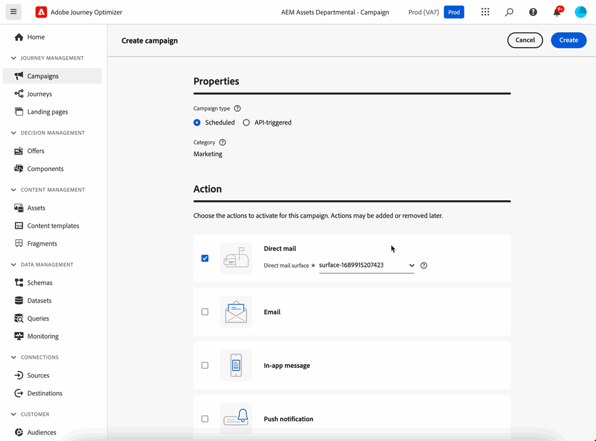

# Introdução à correspondência direta {#create-direct}

Correspondência direta é um canal offline que permite personalizar e gerar os arquivos de extração exigidos por provedores de correspondência direta de terceiros para o envio a clientes.

Ao criar uma campanha de correspondência direta, o Journey Optimizer gera automaticamente um arquivo que contém todos os perfis direcionados e dados selecionados, como endereços postais e atributos de perfil. Esse arquivo é enviado ao servidor de sua escolha para que possa ser acessado pelo provedor de correspondência direta de terceiros escolhido, o qual realizará o processo de envio para você.

Você precisará trabalhar com o provedor de correspondência direta de terceiros de sua escolha para obter todos os consentimentos necessários de seus clientes, se aplicável, para que seus clientes possam receber suas correspondências.

O uso dos serviços de mala direta está sujeito a termos e condições adicionais do provedor de correspondência direta de terceiros aplicáveis.  A Adobe não controla e não se responsabiliza pelo uso de produtos de terceiros. Para qualquer problema ou solicitação de assistência relacionada ao envio da campanha de correspondência direta, entre em contato com o provedor de correspondência direta de terceiros escolhido.

## Antes de começar {#before-you-start}

Antes de criar mensagens de correspondência direta, configure o [roteamento de arquivos e uma configuração de canal de correspondência direta](direct-mail-configuration.md). Você também precisa de públicos-alvo e dados de perfil (como endereços postais) no Adobe Experience Platform.

As principais etapas para enviar mensagens de correspondência direta são as seguintes:

>[!AVAILABILITY]
>
>As mensagens de correspondência direta podem ser criadas no contexto de jornadas e campanhas. Eles não estão disponíveis para uso em campanhas acionadas por API.

## Recursos adicionais {#additional-resources}

* **[Criar correspondência direta](create-direct-mail.md)**: saiba como criar entregas de correspondência direta e configurar arquivos de extração para canais offline.
* **[Configurar canal de correspondência direta](direct-mail-configuration.md)**: defina superfícies de correspondência direta e configurações de roteamento de arquivos.
* **[Testar e enviar correspondência direta](test-send-direct-mail.md)**: saiba como testar, validar e publicar entregas de correspondência direta.
* **[Tutoriais de correspondência direta](https://experienceleague.adobe.com/pt-br/docs/journey-optimizer-learn/tutorials/channels/direct-mail-channel/direct-mail){target="_blank"}**: explore tutoriais em vídeo passo a passo sobre recursos de correspondência direta e práticas recomendadas.

## Vídeo tutorial {#how-to-video}

Saiba como aproveitar o canal de correspondência direta no Adobe Journey Optimizer para automatizar e agendar entregas de correspondência direta em suas jornadas.

+++ Ver vídeo

>[!VIDEO](https://video.tv.adobe.com/v/3479162?quality=12)

+++

Para obter uma apresentação escrita das mesmas etapas, consulte os [tutoriais do canal de correspondência direta](https://experienceleague.adobe.com/pt-br/docs/journey-optimizer-learn/tutorials/channels/direct-mail-channel/direct-mail){target="_blank"}.

Para perguntas comuns sobre correspondência direta, consulte a seção [Recursos adicionais](#additional-resources) acima.
