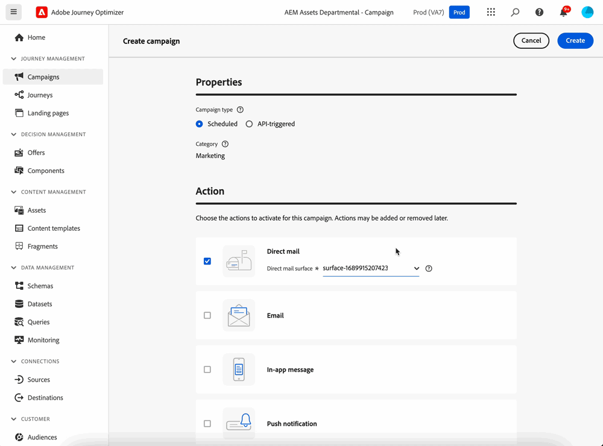

# Introdução à correspondência direta {#create-direct}

Correspondência direta é um canal offline que permite personalizar e gerar os arquivos de extração exigidos por provedores de correspondência direta de terceiros para o envio a clientes.

Ao criar uma campanha de correspondência direta, o Journey Optimizer gera automaticamente um arquivo que contém todos os perfis direcionados e dados selecionados, como endereços postais e atributos de perfil. Esse arquivo é enviado ao servidor de sua escolha para que possa ser acessado pelo provedor de correspondência direta de terceiros escolhido, o qual realizará o processo de envio para você.

Você precisará trabalhar com o provedor de correspondência direta de terceiros de sua escolha para obter todos os consentimentos necessários de seus clientes, se aplicável, para que seus clientes possam receber suas correspondências.

O uso dos serviços de mala direta está sujeito a termos e condições adicionais do provedor de correspondência direta de terceiros aplicáveis.  A Adobe não controla e não se responsabiliza pelo uso de produtos de terceiros. Para qualquer problema ou solicitação de assistência relacionada ao envio da campanha de correspondência direta, entre em contato com o provedor de correspondência direta de terceiros escolhido.

As principais etapas para enviar mensagens de correspondência direta são as seguintes:

>[!AVAILABILITY]
>
>Mensagens de correspondência direta só podem ser criadas no contexto de campanhas programadas. Elas não estão disponíveis para uso em campanhas acionadas por API ou em jornadas.

